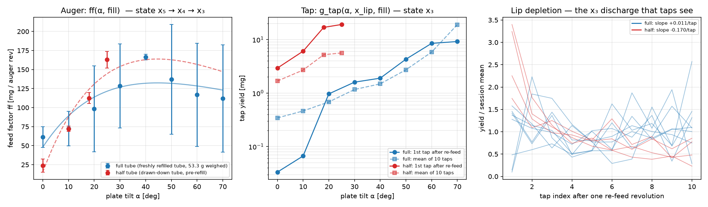
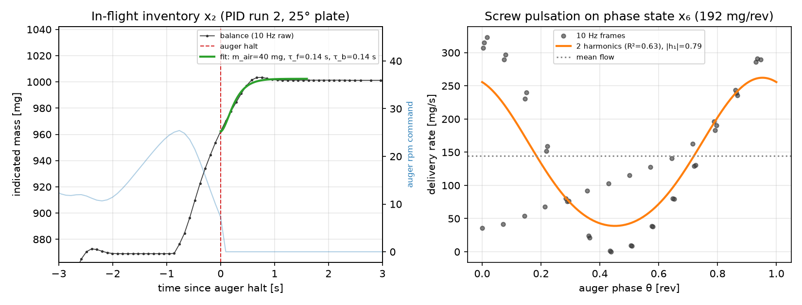
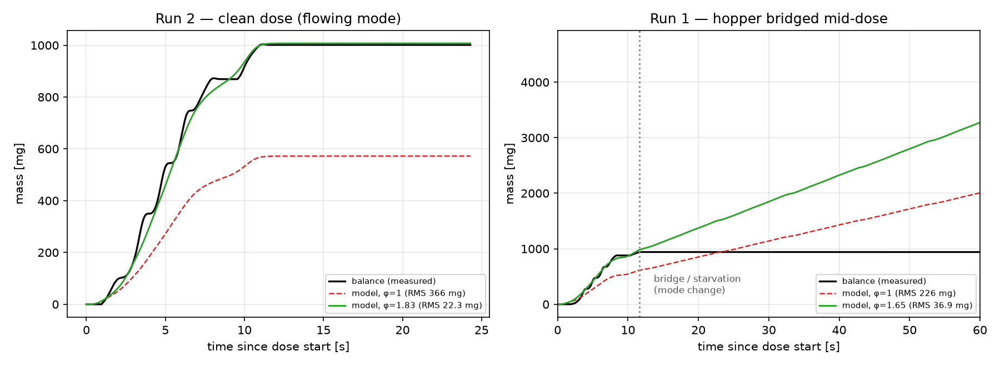

# State-space representation of the powder-doser flow

**Status:** first complete formulation, parameterized for **salt only**
(issue [#140](https://github.com/vertical-cloud-lab/powder-doser/issues/140)).
Every numeric value below was identified from the hardware runs in
[#131](https://github.com/vertical-cloud-lab/powder-doser/pull/131), using the
model structure argued for in the Edison MPC answer and the digital twin in
[#124](https://github.com/vertical-cloud-lab/powder-doser/pull/124).

> **Read this first.** All of the gains, time constants and even the *shapes* of
> the maps below are properties of **salt in this rig on 2026-07-29…31**. Salt is
> a coarse (~400 µm), nearly free-flowing crystalline powder. Nothing here should
> be assumed to hold for xanthan gum, flour, or a gas-atomized AM feedstock — see
> [§11](#11-what-is-salt-specific-and-what-might-transfer). What we claim to be
> *structural* (i.e. likely to survive a powder change, with different numbers) is
> flagged explicitly.

| | |
|---|---|
| Executable model | [`optimization/state_space/state_space.py`](../optimization/state_space/state_space.py) |
| Parameter identification | [`optimization/state_space/fit_salt_parameters.py`](../optimization/state_space/fit_salt_parameters.py) → [`salt_params.json`](../optimization/state_space/salt_params.json) |
| Validation against real doses | [`optimization/state_space/validate.py`](../optimization/state_space/validate.py) → [`validation.json`](../optimization/state_space/validation.json) |
| Tests | `python -m unittest discover optimization/state_space/tests` (15 tests) |

---

## 1. The physical picture

Powder moves through a **chain of compartments**, and *every* compartment holds
mass that is invisible to the balance until it lands. That is the whole reason a
state-space model is needed rather than a static "rpm → g/s" gain:

```
   hopper /        screw flights          tube lip           free
   tube fill   →   (transport hold-up) →  ("shelf")     →    fall   →  cup on balance
     m_hop           m_scr1..3              x_lip           m_air        m_cup → y
       │                  │                   │               │            │
   ┌───┴───┐        ┌─────┴─────┐       ┌─────┴─────┐   ┌─────┴────┐  ┌────┴────┐
   bridging      auger rotation      tilt sets how     ~0.3 s       balance lag
   / rathole     ω, phase θ          much sits here    transit      + 0.1 mg quantum
                 (pulsation)         taps shear it off
```

Three observations from the salt data force this structure:

1. **Halting the auger does not halt delivery.** In PID run 2, +38.9 mg landed
   after the auger stopped (§6.3). There is a real in-flight inventory state.
2. **A single revolution's mass arrives as a slug, not a stream.** The 45 rpm
   bulk phase delivers 179–197 mg per revolution in bursts synchronous with the
   auger (§6.4). Delivery is periodic in *auger angle*, so the phase is a state.
3. **Taps deplete something and rotations refill it.** Ten successive single
   taps at 25° gave 19.2 → 10.0 → … → 1.3 mg; one revolution restored the first
   value (§6.2). That "something" is `x_lip`, and it is a state, not a gain.

---

## 2. State vector

14 continuous states, one discrete mode, plus uncontrolled context. Indices match
`IDX` in `state_space.py`.

| # | symbol | unit | meaning | how it is known |
|---|--------|------|---------|-----------------|
| 1 | `m_cup` | g | powder actually in the cup | ≈ measured (through the balance lag) |
| 2 | `m_air` | g | **in-flight inventory** — left the lip, not yet landed | estimated; 39 mg at 0.12 g/s |
| 3 | `x_lip` | g | **tap-accessible lip shelf** | estimated; 0.6–33 mg depending on tilt/packing |
| 4–6 | `m_scr1..3` | g | **screw hold-up**, 3-cell chain over ~1 auger rev | estimated; not directly observable |
| 7 | `m_hop` | g | powder left in the tube | weighable offline: gross − **56.716 g** tare |
| 8 | `θ` | rev | **auger phase** (mod 1) — drives the per-rev pulsation | known from stepper counts (deterministic) |
| 9 | `ω` | rpm | auger speed (actuator state, τ ≈ 0.05 s) | commanded, effectively known |
| 10 | `α` | plate deg | plate tilt (servo state, ≈ 90 °/s slew) | commanded, effectively known |
| 11 | `φ` | – | **feed-factor scale** — slow random walk capturing day-to-day / fill / packing drift | estimated online; **1.5–1.8× swings observed** |
| 12 | `κ` | – | **lip consolidation** (0 loose … 1 packed) — collapses the tappable shelf | weakly identified: 2 data points |
| 13 | `y_bal` | g | balance indication (its own first-order lag) | the sensor output |
| 14 | `b_bal` | g | balance bias / drift | ≈ 0 in these runs (< 0.07 mg over minutes) |
| — | `q` | mode | **flow regime** ∈ {`flowing`, `starved`, `bridged`} | inferred; one bridging event captured |

**Context** (observed but uncontrolled, not yet in the state because it is not
instrumented): powder identity, temperature, relative humidity, and the powder's
exposure history. The rig has no RH/T sensor today — adding one is the cheapest
way to stop these masquerading as `φ` drift.

### Why each state earns its place

* `m_air` — without it, any stop rule is 30–170 mg late (§6.3).
* `x_lip` — without it, a tap is modelled as a fixed impulse, and the same tap
  command is wrong by 10–20× depending on how many revolutions ago the lip was
  fed (§6.2).
* `m_scr1..3` — a **transport lag, not a dead time**: powder stops moving the
  instant the screw stops. This is why the firmware's fixed 30° fine increments
  stall (also found independently in the #124 benchmark).
* `θ` — the delivery quantum. A 10 Hz continuous controller cannot resolve ±2 mg
  when the plant's quantum is ~110–200 mg/rev; the phase state is what lets a
  controller stop *just after* a flight discharges.
* `φ` — the honest admission that `ff` is not a calibration constant. Between
  07-29 and 07-31, the same rig/powder/tilt moved by ~1.8× (§7).
* `κ` — the only variable that explains taps getting **10–20× weaker** on a
  *fuller* tube while the auger got stronger (§6.2). One scalar "fill factor"
  cannot do both.

---

## 3. Inputs

| symbol | unit | range | notes |
|---|---|---|---|
| `ω_cmd` | rpm | 0 … 109 (auger), 2.2:1 from the stepper | continuous, or discrete angle increments |
| `α_cmd` | plate deg | 0 … 90 (2:1 from the servo) | slews at ~90 °/s; schedules *both* actuator gains |
| `n_tap` | count | integer, impulsive (60 ms pulse) | genuinely discrete — this is what makes the system **hybrid** |
| `d_vib` | duty | 0 … 1 | present in hardware, **not exercised in any salt run** |

The tap is an integer input, so the exact plant is hybrid. `state_space.py`
provides both forms: `tap()` applies the exact impulsive reset map, while `f()`
accepts a continuous "taps/s" rate so that a linearized LQG/MPC design has a
differentiable handle (relax integer → rate, round afterwards).

---

## 4. Output equation

The balance is the **only** process sensor:

```
ẏ_bal = ( m_cup + b_bal − y_bal ) / τ_b          τ_b ≈ 0.14 s
y[k]  = quantize( y_bal(t_k) + v_k , 1e-4 g )    v_k ~ N(0, σ²),  σ ≈ 0.066 mg
```

with a device "stable/unstable" flag that asserts once the indication has caught
up with the pan (~0.8 s after a disturbance). Measured properties (§6.5):

* resolution **0.1 mg**; stable-frame scatter is *below* the quantum (identical
  readings over a 10 s pre-roll)
* with nothing actuating, drift is **+0.018 ± 0.066 mg per weigh interval**
  (n = 72 control intervals) — so every milligram in the tap experiments is
  actuator-attributable
* the raw 10 Hz stream includes unstable frames; they carry real information and
  the estimator should use them with an inflated `R`, not discard them.

An offline second measurement exists and is worth using: **weighing the tube**
(gross − 56.716 g) is the only direct observation of `m_hop`.

---

## 5. Dynamics

Flowing mode; grams and seconds throughout.

**Conveying (hopper → screw)**

```
q_conv = φ · ff(α, m_hop) · (ω/60) · P(θ)                      [g/s]
ṁ_hop  = −q_conv
```

**Screw hold-up** — a 3-cell chain in the *revolution* domain, so transport stops
with the screw:

```
k(ω) = 3/N_TR · (ω/60)        N_TR ≈ 1 auger rev of transport
ṁ_scr1 = q_conv − k·m_scr1
ṁ_scr2 = k·(m_scr1 − m_scr2)
ṁ_scr3 = k·(m_scr2 − m_scr3)
q_lip  = k·m_scr3
```

**Lip** — fills to a tilt- and packing-dependent capacity, then spills:

```
ẋ_lip  = q_lip − q_spill − (taps)
q_spill = max(0, x_lip − x_cap(α, κ)) / τ_spill                τ_spill ≈ 0.1 s
```

This one relation reproduces three separate observations: a parked tube does not
pour even at 70° (`x_lip ≤ x_cap`), one revolution refills the shelf to capacity
(the tap battery's reset protocol), and the bulk of a revolution's mass passes
*over* the shelf rather than accumulating in it.

**Free fall and the cup**

```
ṁ_air = q_spill + Σ_k Δm_tap δ(t − t_k) − m_air/τ_f            τ_f ≈ 0.31 s
ṁ_cup = m_air / τ_f
```

**Tap (discrete reset map)** — fires at event times:

```
Δm_tap = (1−r)·x_lip + y∞(α)          x_lip⁺ = r·x_lip
```

i.e. a fraction of the shelf plus a **non-depleting floor**: a trickle shaken off
the column behind the lip that does not care how drained the shelf is. Both terms
are needed — the pure-depletion model of the Edison answer under-predicts late
taps, and a pure-floor model cannot produce the observed 19 → 1.3 mg decay.

**Actuators / parameters**

```
θ̇ = ω/60                    ω̇ = (ω_cmd − ω)/τ_ω          τ_ω ≈ 0.05 s
α̇ = rate-limited(α_cmd − α)  |α̇| ≤ 90 °/s
φ̇ = w_φ  (random walk)       κ̇ ≈ 0 within a dose         ḃ_bal = w_b
```

**Mode transitions** (`flowing` ⇄ `starved` ⇄ `bridged`): the hazards are **not
identified** — we have exactly one captured event (§7). In `starved`/`bridged`,
`q_conv` is scaled to ~0 while the screw's residual hold-up still drains, which
is precisely what run 1 showed: delivery continued a few seconds after the bridge
formed, then flat-lined for 400 s while 80 taps yielded nothing.

---

## 6. Identified salt parameters

Regenerate everything with:

```bash
git worktree add /tmp/pr131 origin/claude/issue-130-20260721-1807   # until #131 merges
python optimization/state_space/fit_salt_parameters.py --data-root /tmp/pr131/data
python optimization/state_space/validate.py            --data-root /tmp/pr131/data
```



### 6.1 Auger feed factor `ff(α)`

`ff(α) = ff₀ + g·(α/α_peak)·exp(1 − α/α_peak)` [g/rev]

| session | ff₀ (mg/rev) | g (mg/rev) | α_peak | ff at peak | rms resid | rep-to-rep CV |
|---|---|---|---|---|---|---|
| drawn-down tube (07-31 AM) | 15.3 | 148.5 | 44.6° * | 163.8 | 14.0 | **0.065** |
| refilled tube, 53.3 g (07-31 PM) | 48.0 | 84.4 | **44.6°** | 132.5 | 16.4 | **0.478** |

\* borrowed from the wide-angle session; the 0–25° battery cannot see the roll-off.

Measured means (mg/rev, 3 reps each):

| α (plate deg) | 0 | 10 | 18/20 | 25/30 | 40 | 50 | 60 | 70 |
|---|---|---|---|---|---|---|---|---|
| drawn-down | 23.9 ± 8.6 | 72.2 ± 3.4 | 112.6 ± 7.2 | 162.9 ± 10.7 | – | – | – | – |
| refilled | 61.4 ± 13.7 | 72.5 ± 22.6 | 98.5 ± 56.4 | 128.5 ± 55.2 | **166.4 ± 3.7** | 137.0 ± 72.2 | 116.8 ± 67.6 | 112.0 ± 70.3 |

Two things matter for control more than the mean curve:

* **Delivery peaks near 40–45° and falls beyond it.** Past ~40° the tube is tipped
  far enough that the screw stops being the metering element. Tilt is *not* a
  monotone "faster" knob.
* **40° is the only tilt with tight replicates** (sd 3.7 mg vs 55–72 mg
  elsewhere). If you want a *predictable* bulk phase, 40° — not the 25° the dose
  recipes use — is the operating point the data supports.

### 6.2 Tap gain, lip depletion, and the lip inventory

Fitting `yᵢ = y∞ + A·r^(i−1)` to 10 successive single taps per tilt:

**Drawn-down tube (07-31 AM)** — the lip behaves as a depletable shelf:

| α | 1st tap (mg) | mean tap | CV | Σ10 taps | A | r | y∞ | **M_lip = A/(1−r)** |
|---|---|---|---|---|---|---|---|---|
| 0° | 2.93 ± 0.93 | 1.68 | 0.42 | 16.8 | 1.62 | 0.74 | 1.08 | 6.3 |
| 10° | 6.07 ± 2.25 | 2.69 | 0.55 | 26.9 | 3.99 | 0.38 | 2.05 | 6.5 |
| 18° | 16.90 ± 4.82 | 5.21 | 0.86 | 52.1 | 13.71 | 0.39 | 2.97 | 22.4 |
| 25° | 19.17 ± 3.32 | 5.64 | 0.94 | 56.4 | 16.59 | 0.50 | 2.33 | 33.1 |

**Refilled tube (07-31 PM)** — the shelf is gone; yield is almost pure floor:

| α | 0° | 10° | 20° | 30° | 40° | 50° | 60° | 70° |
|---|---|---|---|---|---|---|---|---|
| mean tap (mg) | 0.34 | 0.46 | 0.68 | 1.17 | 1.49 | 2.72 | 5.84 | 19.04 |
| CV | 0.84 | 0.82 | 0.77 | 0.50 | 0.55 | **0.38** | 0.44 | 1.22 |
| y∞ share | ~90 % | ~100 % | ~95 % | ~94 % | ~95 % | ~92 % | ~95 % | 100 % |

Structural findings:

* **The depletion ratio is `r ≈ 0.4–0.5`** where a shelf exists: one tap takes
  ~half of what is tap-accessible.
* **`M_lip` is only ~20 % of a revolution's delivery** (33 mg vs 163 mg at 25°) —
  taps cannot clear the lip, and the auger's mass mostly bypasses the shelf.
* **Tilt scaling of the tap gain is remarkably fill-invariant**: fitting
  `tap₁(α) = k₀·exp(α/α_s)` gives **α_s = 12.4°** (drawn-down) and **12.3°**
  (refilled) — the *shape* is the same, the *prefactor* differs by ~46×. That is
  exactly the `(1−κ)` structure in `x_cap`: consolidation scales the shelf, tilt
  sets how steeply it grows.
* **The pooled depletion slope flips sign between sessions** (−0.170/tap →
  +0.011/tap), which is the single cleanest evidence that `κ` (or fill) is a
  *state* and not a nuisance.
* **Best trim operating point on salt is 30–50°**, not the 0–25° every dose recipe
  has used: 50° gives 2.7 mg/tap at the lowest CV measured (0.38). At 0–10° a tap
  buys 0.3–0.5 mg at CV > 0.8 — which is why the tap phase looked dead for weeks.
* **70° is an avalanche regime, not an actuator**: CV 1.22, single taps up to
  123 mg. Useful to purge the lip; useless for trim.

### 6.3 In-flight inventory and transport lag



From the PID run-2 halt at 25° plate (10 Hz raw frames):

| quantity | value |
|---|---|
| flow immediately before the halt | 0.117 g/s |
| mass landing **after** the halt | **38.9 mg** |
| first-order fit | `m_air0` = 41.2 mg, τ = **0.31 s** |
| dual-lag fit (flight + balance) | 40.1 mg, τ_f = τ_b = 0.141 s (degenerate) |
| implied τ from `landed / flow` | 0.33 s |
| cross-check: three-phase bulk halt from 55 rpm | **+162 mg** (mean of 2 runs) |

Honest limitation: the flight and balance lags are **not separately identifiable**
from this transient — the fit collapses to a repeated pole at 0.14 s. Separating
them needs an independent balance step test (drop a known mass onto the pan).
Until then, τ_f = 0.31 s should be read as *flight + indication combined*.

The design consequence is blunt: **any controller that stops on measured mass is
already ~40 mg late at 0.12 g/s, and ~160 mg late in the 55 rpm bulk phase.**
That margin is a state estimate, not a tuning constant, because it scales with
the flow at the moment of the stop.

### 6.4 Per-revolution pulsation

Folding the 45 rpm bulk stretch of run 1 onto auger phase (period 1.333 s):

| quantity | value |
|---|---|
| mean flow | 0.144 g/s → **192 mg/rev** |
| per-revolution delivery, 3 consecutive revs | 178.6, 194.9, 196.7 mg (**±5 %**) |
| 1st harmonic amplitude | **0.79** (79 % modulation of the mean) |
| 2nd harmonic | 0.07 |
| R² of the 2-harmonic fit | 0.63 |

So **revolution-to-revolution delivery is repeatable to ~5 %, but within one
revolution the flow swings by ±79 %**. The harmonic amplitudes are a *lower*
bound — the balance's ~0.3 s lag attenuates a 1.33 s cycle.

This is the strongest argument in the whole document for **event-based
(revolution-domain) sampling** in the controller: in the angle domain the plant
is nearly deterministic; in the time domain it looks like violent noise.

### 6.5 Noise model

| source | value | note |
|---|---|---|
| balance quantum | 0.1 mg | HR-100A readability |
| stable-frame scatter | < 0.1 mg | below the quantum over a 10 s pre-roll |
| no-actuation interval | +0.018 ± 0.066 mg | n = 72 control intervals |
| auger, rep-to-rep (drawn-down) | CV 0.065 | per-revolution |
| auger, rep-to-rep (refilled) | CV 0.478 | same rig, same day |
| tap, tap-to-tap | CV 0.38 … 1.22 | best at 50° |

The 7× jump in auger CV between the two sessions is itself a result: **flow noise
is state-dependent**, so a fixed process-noise covariance `Q` will be wrong in one
regime or the other. A regime-switched `Q` (or the `φ` random walk absorbing it)
is the minimum honest treatment.

---

## 7. Validation against real doses

`validate.py` replays the *recorded* rpm/tilt/tap commands from the PID runs
through the model and compares with the recorded balance trace.



| run | φ = 1 (nominal) RMS | fitted φ | RMS with fitted φ | measured at window end | simulated |
|---|---|---|---|---|---|
| run 2 (clean 1 g dose, whole run) | 366 mg | **1.83** | **22.3 mg** | 1.0012 g | 1.0075 g |
| run 1 (start → bridging at 11.7 s) | 226 mg | **1.65** | 36.9 mg | 0.9372 g | 0.9805 g |

Independent-ish check: the model predicts **36.7 mg** landing after the run-2
halt against **38.9 mg** measured (τ_f was fitted from this same transient, so
treat this as a consistency check, not a blind prediction).

Three conclusions, all of them load-bearing:

1. **The structure is right.** One scalar per run — the feed-factor state `φ` —
   takes a 366 mg RMS error to 22 mg, and the simulated trace reproduces the
   revolution-quantized staircase, not just the average slope.
2. **`φ` must be a state, not a calibration.** Fitted φ ≈ 1.65–1.83 against the
   07-31 characterization: the *same* rig and powder moved by ~1.8× in two days.
   A feed factor measured on Monday will not dose correctly on Wednesday. This is
   the empirical case for online estimation (the dual-UKF recommendation in #124)
   over open-loop calibration.
3. **Mode changes are not gain errors.** After the bridge at t ≈ 11.7 s, a
   flowing-mode model over-predicts by **1.47 g within 30 s**. No amount of
   parameter adaptation fixes this; it needs the discrete mode `q` and a detector.

---

## 8. Reduced design models

### 8.1 Bulk-phase LTI (LQG / linear MPC)

`z = [m_cup, m_air, x_lip, φ]ᵀ`, `v = [ω (rpm), tap rate (1/s)]ᵀ`, `y = m_cup`.
Valid while the lip is spilling. At **α = 25°, ω = 45 rpm** (`ff` = 121.5 mg/rev):

```
      ⎡ 0   3.273    0      0    ⎤        ⎡ 0        0       ⎤
A  =  ⎢ 0  −3.273   10      0    ⎥   B =  ⎢ 0        0.00212 ⎥   C = [1 0 0 0]
      ⎢ 0    0     −10      0.091⎥        ⎢ 0.00202 −0.00121 ⎥
      ⎣ 0    0       0      0    ⎦        ⎣ 0        0       ⎦
```

Zero-order hold at `dt` = 0.1 s (the balance frame period):

```
       ⎡1  0.2791  0.1074  0.0004⎤          ⎡0.00001   0.00003⎤
A_d =  ⎢0  0.7209  0.5247  0.0030⎥   B_d =  ⎢0.00007   0.00014⎥
       ⎢0  0       0.3679  0.0058⎥          ⎢0.00013  −0.00008⎥
       ⎣0  0       0       1     ⎦          ⎣0         0      ⎦
```

Structure worth noticing: the output is a **pure integrator** (`A[0,0] = 0`) with
**no direct feedthrough** from rpm — every input reaches the cup through at least
two lags. That is the LQG-friendly core @XZaitzeff described in #124; what falls
*outside* LQG is everything in §8.3.

`reduced_bulk_model(alpha_deg, omega_rpm)` returns these matrices for any
operating point; `PowderDoserModel.linearize()/discretize()` do the same for the
full 14-state model.

### 8.2 Revolution-domain model (fine phase)

Because delivery is quantized by revolution, the fine phase is better written in
the **angle domain**, one step per commanded increment `Δθ` (rev):

```
m_cup[k+1] = m_cup[k] + φ[k]·ff(α)·Δθ·Π(θ[k], Δθ) + ε[k]
φ[k+1]     = φ[k] + w[k]
```

where `Π` integrates the pulsation over the commanded arc — i.e. *where in the
revolution you stop matters*. With `ff` ≈ 121–192 mg/rev on salt, a 30° increment
is ~10–16 mg and a 5° "nudge" ~2 mg, which sets the achievable resolution of the
auger alone. Anything finer must come from taps.

### 8.3 What is deliberately outside the LTI model

* **Integer taps** — a quantized input with a state-dependent gain.
* **Asymmetric hard constraint** — powder cannot be removed; `m_cup ≤ target`
  must hold *including* `m_air`, which is why the constraint has to be written on
  `m_cup + m_air`, not on the measurement.
* **Mode switching** — bridging/starvation is a jump, and it is what actually
  ruins doses (run 1: 420 s, target never reached).
* **State-dependent noise** — CV 0.065 vs 0.478 for the same actuator.

The pragmatic reading, consistent with the #124 benchmark: linear/LQG machinery
for the bulk phase, a constrained short-horizon MPC on the reduced model with a
back-off proportional to the estimated flow variance, and an explicit event-based
tap-trim policy for the endgame.

---

## 9. Observability — what the balance can and cannot see

`observability_report()` on the linearized 14-state model:

| operating point | structural rank | well-conditioned directions (σ > σ₀·10⁻⁶) | no path to the sensor |
|---|---|---|---|
| auger turning (45 rpm, 25°) | 11 / 14 | **4** | `m_hop` |
| auger halted | 7 / 14 | 3 | `m_scr1..3`, `m_hop`, `θ`, `φ` |

The unobservable directions are dominated by mixtures of **`κ`, `φ` and `θ`**,
plus `m_hop` outright. Practical consequences:

* **`φ` is only observable while the screw turns.** A dose that goes straight to
  trickle never excites the feed factor — the persistent-excitation limit flagged
  in the #124 data-assimilation answer, here confirmed structurally. Occasional
  exploratory revolutions are not optional if you want `φ` to stay current.
* **`φ` and `κ` are confounded from mass alone.** A tap probe (which loads `κ`
  but not `φ`) or a tube weighing (which loads `m_hop`) is needed to separate
  them. Cheap and worth building into the dose recipe.
* **Estimate 1–2 parameters per dose, not five.** The observability Gramian's
  singular values span ~11 orders of magnitude; with 0.1 mg quantization only a
  handful of directions rise above the noise floor. This is exactly the
  "1–2 identifiable parameters within a dose" conclusion from #124 — now
  reproduced from the model rather than asserted.

---

## 10. What is **not** identified yet

Ranked by how much they currently limit the controller:

| gap | why it matters | experiment (all ≲ 30 min) |
|---|---|---|
| **Fill-level dependence `G_fill(m_hop)`** — fill and re-packing are confounded in the only two sessions we have | `φ` swings 1.8×, and this is the prime suspect | **Draw-down run**: weigh the tube, dose repeatedly to empty, logging mass-per-rev vs. tube mass. No refill in the middle |
| **Consolidation `κ` dynamics** | taps change by 10–20× with it; it is currently a 2-point state | Repeat the tap battery at 3 known fill levels; also tap→wait→tap to see if `y∞` is a time trickle |
| **Bridging hazards** | the failure mode that actually ruins doses | Log every stall in normal dosing with fill level and tilt; no dedicated run needed |
| **Partial-rotation refill `f_refill(Δθ)`** | we know how the lip drains, not how fast a ¼/½ rev restores it | Tap battery with ¼ / ½ / 1 rev re-feeds |
| **τ_f vs τ_b separation** | sets how aggressively a stop can anticipate | Drop a known mass on the pan; fit the balance step alone |
| **Vibration motor** | an entire input with zero data | Add duty as a factor to the tap battery |
| **Humidity / temperature** | uninstrumented; currently aliases into `φ` | Add an RH/T sensor and log per run |

---

## 11. What is salt-specific, and what might transfer

Salt is coarse (~400 µm), dense, and nearly free-flowing. Most of the numbers
above are properties of *that*, and several are likely to **invert** for a
cohesive powder.

**Likely structural** (expect the same equations, different numbers):

* the compartment chain and the existence of `m_air`, `x_lip`, `m_scr`
* delivery quantized by auger revolution (it is a geometric property of the screw)
* the "no spontaneous flow when parked" behaviour for any powder with an angle of
  repose above the tilt in use
* a tap acting as a depleting shelf term plus a non-depleting floor

**Expected to change, possibly qualitatively:**

* **The tilt of peak delivery.** Salt peaks at ~40–45°. A cohesive powder may
  never reach a peak (flow limited by arching, not gravity) or may need steeper.
* **The sign of the fill-level effect on taps.** For salt, a fuller/freshly packed
  column *killed* tap yield. A cohesive powder may bridge instead, giving the
  opposite pattern.
* **Depletion ratio `r` and the floor `y∞`.** These come from how the shelf holds
  together; cohesion sets that directly.
* **Mode statistics.** Salt bridged once in the logged runs. Xanthan gum, flour or
  fine AM feedstock will spend far more time in `starved`/`bridged`, which shifts
  the design emphasis from precision to fault detection.
* **`τ_f`.** Fine powders fall slower and aerate; the in-flight column may need a
  distributed model rather than a single lag.

**Practical rule:** treat §6 as `salt_params.json` — one entry in a per-powder
library. The identification pipeline (`fit_salt_parameters.py`) is the reusable
part; run the same battery on each new powder and expect only the *structure* to
carry over. This is also the natural place for the Bayesian-optimization idea
raised in #124: BO over the identification battery (which tilts, which fill
levels, how many repeats) to reach a usable per-powder parameter set in the
fewest hardware runs — with the state-space model, not the raw doses, as the
thing being fitted.

---

## 12. Reproducing

```bash
# data currently lives on the #131 branch
git worktree add /tmp/pr131 origin/claude/issue-130-20260721-1807

python optimization/state_space/fit_salt_parameters.py --data-root /tmp/pr131/data
python optimization/state_space/validate.py            --data-root /tmp/pr131/data
python optimization/state_space/state_space.py          # demo: bulk, halt, taps, observability
python -m unittest discover optimization/state_space/tests
```

Requires `numpy`, `scipy`, `matplotlib`. Once #131 merges, drop `--data-root`.
