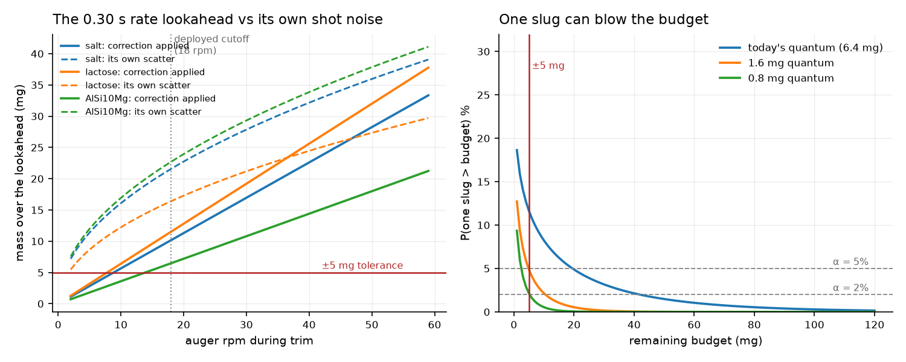
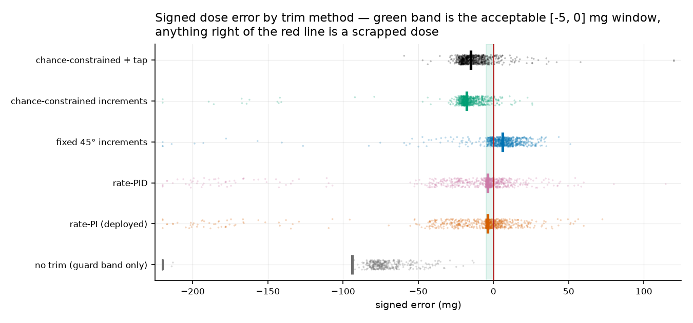
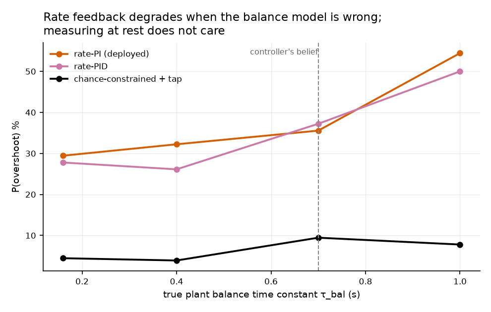
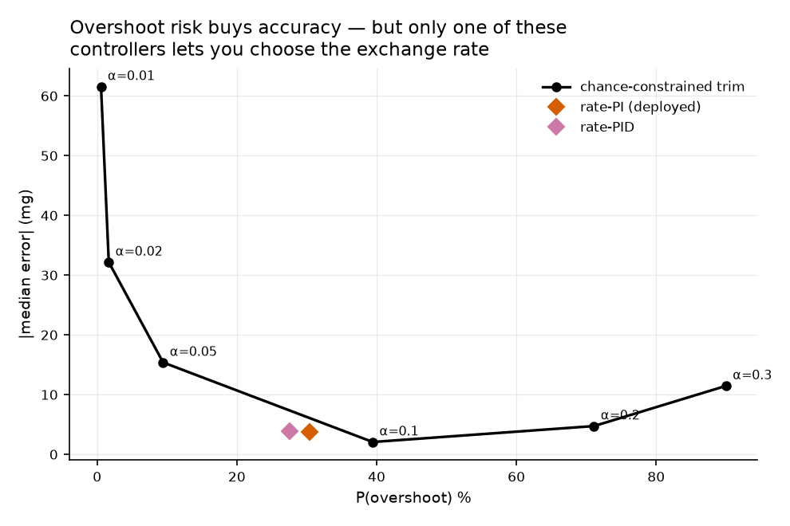

# Trim dispensing: how to close the last few hundred milligrams

*Brainstorm for [issue #153](https://github.com/vertical-cloud-lab/powder-doser/issues/153),
written against the 2026-08-22 Edison check-in on
[PR #124](https://github.com/vertical-cloud-lab/powder-doser/pull/124#issuecomment-5381777265).
Code and results: [`optimization/trim/`](../optimization/trim/).*

---

## The short version

Bang-bang gets us to within a few hundred milligrams and then has to hand over.
The question is what the trim phase should be, and specifically whether PI or
PID is the right shape for it.

The answer this study lands on is that **the trim phase is a constrained
stopping problem, not a regulation problem**, and that is a structural mismatch
with PID rather than a tuning one. Three findings, in descending order of how
much they should change what we build:

1. **Near the target, powder does not flow — it arrives in slugs.** At the
   0.042 g/s the deployed trickle actually cuts off at, the 0.30 s rate
   lookahead contains about 1.6 slug events, has a 20 % chance of containing
   *none*, and carries a compound-Poisson standard deviation of 21.6 mg against
   a ±5 mg tolerance. The correction that lookahead applies is 10.2 mg. It is
   smaller than its own irreducible scatter. No gain schedule fixes that.

2. **The overshoot rate should be a specification, not an emergent property.**
   The deployed rate-PI trickle overshoots 30.4 % of the time, and there is no
   parameter you can turn to ask for less. Sizing every action by an explicit
   one-sided chance constraint gives a dial: set α, get a predictable overshoot
   rate. At matched settings it cuts overshoot from 30.4 % to 8.8 %
   (paired difference −21.7 %, 95 % CI [−25.6, −17.8], McNemar p = 6×10⁻²⁷) for
   about 24 s more per dose.

3. **±5 mg is currently out of reach of *any* control law, and that is a
   hardware finding.** No commanded action can deliver less than one slug. For a
   ±5 mg endpoint at 2 % overshoot risk the terminal actuator needs a mean
   quantum of about **0.8 mg**. A tap on this rig delivers about **6.5 mg**
   (p95 21.7 mg). We are roughly an order of magnitude too coarse, and no
   controller can dispense a fraction of a slug.

The honest summary of (2) is narrower than it first looks and worth stating
plainly: the chance-constrained method is not more *accurate* than the deployed
PI. At matched overshoot risk the two are close on accuracy. What it buys is a
**calibrated risk knob** and **insensitivity to the balance model**, and those
are the two things the current controller most lacks.

---

## 1. Why this is not a regulation problem

PID is the right tool when three things hold: the output is a continuous signal
you can differentiate, the cost is roughly symmetric in the error, and you can
correct in both directions. The trim phase violates all three.

**The output is a jump process.** Powder leaves the tube lip as discrete
avalanches. The Edison review put numbers on it from our own bench data — salt
45° increments yielding 6.4 ± 15.9 mg — and the arithmetic follows directly:

| powder | flow g/s | λ /s | events in 0.30 s | P(no event) | E[M] mg | sd[M] mg | sd / tolerance |
|---|---:|---:|---:|---:|---:|---:|---:|
| salt @18 rpm | 0.034 | 5.30 | 1.59 | 0.20 | 10.2 | 21.6 | 4.3× |
| lactose @18 rpm | 0.038 | 9.60 | 2.88 | 0.06 | 11.5 | 16.4 | 3.3× |
| AlSi10Mg @18 rpm | 0.022 | 2.40 | 0.72 | 0.49 | 6.5 | 22.7 | 4.5× |

Slowing down does not help; it makes it worse. At 6 rpm salt has 0.53 expected
events in the lookahead and a 59 % chance of none at all. The continuum gets
*less* valid as you approach the target, which is exactly backwards from what a
decelerating trickle assumes.

On top of the process noise sits estimator noise of the same size. The PR #124
diagnostic measured the Kalman rate estimate's scatter during the trickle at
**0.0415 g/s against a true rate of 0.0422 g/s** — a signal-to-noise ratio of
about one.

**The cost is one-sided.** Powder cannot be removed. A dose 5 mg under target
costs a few seconds; a dose 5 mg over is scrap. PID minimises a symmetric
functional, so tuning it on error magnitude optimises the wrong thing. The
review's replacement scorecard — P(E>0), P(E>+5 mg), expected positive excess
E[max(E,0)], and yield in the genuinely acceptable [−5, 0] mg band — is what
this study reports throughout.

**The actuator is one-way.** There is no negative control action, so the
integrator can only ever wind toward the constraint.



## 2. So what about PI and PID specifically?

Worth separating two claims, because the Edison corpus supports one and not the
other.

**PI as the approach controller is fine, and is what Edison recommends.** The
MPC follow-up explicitly rejects full MPC here — "the fundamental bottleneck is
the 1 Hz effective measurement rate […] the MPC optimizer has only 3–8 decision
points per batch" — and prescribes a PI loop on estimated dose rate for the
trickle. Over a long enough aggregation window a rate is a perfectly good
regulated variable. Nothing here argues against that.

**PI as the safety mechanism is where it breaks, and the D term adds nothing.**
The deployed cutoff spends a 52.4 mg early-stop budget of which 35 mg is a fixed
constant, 12.7 mg the rate lookahead, and 4.8 mg an uncertainty cushion. Strip
the fixed constant and leave only the filter-derived terms and 94 % of doses
overshoot. The predictive machinery is not what is keeping us safe; a hand-tuned
constant is.

On the derivative term, the measured answer is that it is not worth adding:

| | P(E>0) | E[max(E,0)] | median E | **max positive excess** | median t |
|---|---:|---:|---:|---:|---:|
| `rate_pi` | 30.4 % | 3.4 mg | −3.8 mg | **72.4 mg** | 34.0 s |
| `rate_pid` | 27.5 % | 3.4 mg | −3.8 mg | **114.5 mg** | 35.3 s |

The paired difference in overshoot rate is −2.9 % [−5.6, −0.3] and the
difference in expected positive excess is +0.01 mg [−0.49, +0.58] — statistically
marginal and practically nil. But the **worst case gets 58 % worse**, which is
the number that matters under a one-sided constraint. That is the expected
result: the D term differentiates the rate estimate, which is itself the
derivative of a lagged, quantized, vibration-corrupted balance reading, so it is
effectively a second derivative of the measurement. The useful part of "D" is
already inside the Kalman filter; adding a controller D term on top only
amplifies the tail.

Notably, no document in the Edison corpus recommends a D term anywhere. Every
recommendation is PI, with the derivative channel handled as an estimation
problem rather than a controller term. That is the right instinct and this study
supports it.

## 3. The method ladder

Six methods, all starting from the same handover state, all scored on the same
one-sided metrics. 720 doses each: 120 seeds × 3 powders × 2 handover deficits.

| method | P(E>0) | P(E>+5mg) | E[max(E,0)] | P(−5..0 mg) | median E | max +excess | median t |
|---|---:|---:|---:|---:|---:|---:|---:|
| no trim (guard band only) | 0.0 % | 0.0 % | 0.0 mg | 0.0 % | −153.6 mg | 0.0 mg | 2.6 s |
| `rate_pi` (deployed) | 30.4 % | 17.4 % | 3.4 mg | 32.6 % | −3.8 mg | 72.4 mg | 34.0 s |
| `rate_pid` | 27.5 % | 17.4 % | 3.4 mg | 34.9 % | −3.8 mg | 114.5 mg | 35.3 s |
| fixed 45° increments | 75.8 % | 54.9 % | 8.0 mg | 16.2 % | +5.9 mg | 51.1 mg | 41.6 s |
| chance-constrained increments | 4.4 % | 1.9 % | 0.3 mg | 4.2 % | −17.8 mg | 25.8 mg | 55.0 s |
| chance-constrained + tap | 8.8 % | 5.0 % | 1.6 mg | 5.7 % | −15.3 mg | 252.0 mg | 57.6 s |



Three things to read out of that table.

**Discrete dosing is not automatically safe.** Fixed 45° increments are the
worst method tested, at 75.8 % overshoot — worse than the rate-PI it was meant
to improve on. The step size is the whole game, and 45° was already disqualified
by the bench data: a step whose yield is 6.4 ± 15.9 mg cannot serve a ±5 mg
endpoint. Measuring at rest between steps does not rescue a step that is too
coarse.

**The chance-constrained methods trade accuracy for safety, explicitly.** They
cut overshoot by a factor of 3–7 and land 15–18 mg short. That is the constraint
being honoured: when no remaining action's quantum fits the budget, the correct
move under a one-sided cost is to stop, and they do (58–63 % of doses end that
way, recorded as `stopped short` rather than as a failure).

**The tap is not a safety net.** Adding taps doubles overshoot (4.4 % → 8.8 %)
and produces a 252 mg worst case. That matches the deployed diagnostic, where
taps caused roughly half of all strict overshoots. A tap cannot remove mass; it
is a coarse dosing action with a heavy tail, and it should be modelled and
gated as one.

## 4. The result that most changes my confidence: balance-lag robustness

The Edison review called `BAL_TAU_S` the most serious hardware sensitivity we
have. The twin used 0.7 s in both the plant and the filter — a perfectly
specified sensor — while bench drop tests suggest the real HR-100A may be nearer
0.16 s, a mismatch worth (0.70 − 0.16) × 0.042 = **22.7 mg** at the trim flow
rate. That is larger than the tolerance and larger than the entire rate
lookahead.

So: hold the controller's belief at 0.70 s and sweep the true plant value.

| true τ_bal | `rate_pi` | `rate_pid` | chance-constrained + tap |
|---:|---:|---:|---:|
| 0.16 s | 29.4 % | 27.8 % | **4.4 %** |
| 0.40 s | 32.2 % | 26.1 % | **3.9 %** |
| 0.70 s (belief correct) | 35.6 % | 37.2 % | **9.4 %** |
| 1.00 s | 54.4 % | 50.0 % | **7.8 %** |



The rate methods degrade badly as the balance lag grows — 29 % to 54 % — because
their stop rule is correcting a lag they are modelling wrongly. The
chance-constrained method is flat, and for a structural reason rather than a
lucky one: **it only ever reads the balance at rest.** After the settle there is
no lag left to correct, so `tau_bal` never enters the decision. The same
property buys the 0.5 mg quiet noise floor instead of the 8 mg actuating one, a
16× improvement in the measurement that every decision depends on.

This is the strongest argument in the study, and it does not depend on the slug
statistics being exactly right. Sweeping slug dispersion from CV 1.0 to 3.2
moves the chance-constrained overshoot rate only between 6.7 % and 7.8 %, while
rate-PI stays in the 35–42 % range throughout.

## 5. The proposal

Replace the trim phase with **increment-and-measure, sized by a one-sided chance
constraint**:

```
repeat:
    m      <- settled balance reading (auger stopped, ~2 s settle)
    budget <- target - m
    if budget <= tolerance: done
    n      <- largest command with P(delivered(n) > budget) <= alpha
    if n == 0: stop short          # no action's quantum fits; do not gamble
    command n revolutions, halt
```

Four properties, each of which maps onto something the Edison review asked for:

- **No rate is ever estimated.** The predictive distribution is over the settled
  mass a command delivers — conveying, lip drain, free fall and estimator error
  all folded into one identified quantity. This is the review's "calibrate total
  post-command mass […] then use its upper conditional quantile"; it explicitly
  does not require the mechanistic decomposition into afterflow terms.
- **No handover constant.** When the budget is large the rule returns most of a
  revolution and the auger runs continuously; as the budget shrinks the same
  rule returns a few degrees. The coarse-to-fine handover falls out instead of
  being tuned in, which answers the review's objection that the 0.01/0.02 g/s
  thresholds had no basis.
- **The risk is a parameter.** α is what you specify; the realised overshoot
  rate follows it monotonically.
- **A hard interlock sits outside the control law.** No actuator is commanded
  once the settled reading is within ε of target, independent of what the sizing
  rule says.



| per-decision α | P(E>0) [95 % CI] | E[max(E,0)] | median E | P(−5..0 mg) | median t |
|---:|---|---:|---:|---:|---:|
| 0.30 | 90.0 % [84.7, 93.6] | 17.8 mg | +11.3 mg | 10.0 % | 14.0 s |
| 0.20 | 71.1 % [64.1, 77.2] | 9.1 mg | +4.7 mg | 27.2 % | 16.7 s |
| 0.10 | 39.4 % [32.6, 46.7] | 5.1 mg | −2.1 mg | 31.7 % | 34.7 s |
| 0.05 | 9.4 % [6.0, 14.6] | 1.3 mg | −15.4 mg | 3.9 % | 63.1 s |
| 0.02 | 1.7 % [0.6, 4.8] | 0.2 mg | −32.2 mg | 2.2 % | 83.2 s |
| 0.01 | 0.6 % [0.1, 3.1] | 0.04 mg | −61.6 mg | 0.6 % | 83.3 s |

Read the α = 0.10 row against the deployed rate-PI (30.4 % overshoot, 32.6 %
band yield, 34 s): they are close. That is the fair comparison, and it is why
the claim here is about *control* over the trade rather than about beating it.
The deployed controller sits at one unlabelled point on this curve; the proposal
lets you pick the point.

## 6. Why ±5 mg is a hardware problem

The floor is easy to state. No commanded action delivers less than one slug, so
if a single slug can exceed the remaining budget with probability greater than
α, no action is safe and the controller must stop. Inverting that gives a
specification for the terminal actuator:

| tolerance | α = 5 % | α = 2 % | α = 1 % |
|---|---:|---:|---:|
| ±5 mg | 1.64 mg | **0.77 mg** | 0.52 mg |
| ±2 mg | 0.66 mg | 0.31 mg | 0.21 mg |
| ±1 mg | 0.33 mg | 0.15 mg | 0.10 mg |

Against what the rig delivers today: a 5° salt auger command yields a mean of
2.5 mg with a p95 of 17.7 mg, and a salt tap yields a mean of 6.5 mg with a p95
of 21.7 mg. For AlSi10Mg the tap mean is 20 mg. We need roughly **8× finer** for
±5 mg at 2 % risk, and ~40× finer for the ±1 mg stretch target.

Note what does *not* help: making the auger step smaller. Shrinking the command
from 45° to 5° — a factor of nine — only halves the p95 yield, from 35.6 mg to
17.7 mg, because a small command can still dislodge a charged lip. The quantum
is set by the outlet geometry and the powder, not by the command resolution.

That points the design work at the outlet rather than the controller: a finer
terminal metering element, a geometry that cannot hold a releasable charge, or a
positive cutoff that arrests discharge. The review reached the same place from
the literature — "a physical cutoff/gate or outlet geometry that arrests
discharge, if tilt/auger stop cannot bound the final slug."

## 7. What to do next

**Bench measurements, in priority order.** Every number above is simulated;
these are what would make them real.

1. **Identify `tau_bal` in the configured serial/response mode**, with
   confidence intervals, across load and filter setting, quiet and vibrating.
   The datasheet (~2 s to 95 %, so ~0.7 s) and our drop tests (~0.16 s) disagree
   by 4.4×, and A&D allow the response mode to be configured — which is probably
   the explanation. Everything the rate methods do depends on this.
2. **Measure the terminal quantum distributions**: many small auger increments
   and single taps at candidate tilts, per powder, recording the **zeros** as
   well as the yields, and the dependence on lip load. This is the direct input
   to the sizing rule and the direct test of §6. It is also the measurement that
   would falsify the study's central claim.
3. **Separate post-halt discharge from in-flight mass** with an independent
   collector or a cup swap, per the review's protocol. The +26 mg drain is a
   twin quantity with no hardware confirmation.

**Code changes that are justified now**, independent of new data:

- Delete the dead ff-adaptive margin term (`0.06·max(0, ff−0.30)`); it fires in
  0 of 360 doses. Already omitted from the `rate_pi` reimplementation here.
- Stop describing `k·σ` as adapting to data quality. It follows a Riccati
  recursion that never sees the measurements — verified here as a test that
  asserts bit-identical σ under different noise realisations. It is a
  model-scheduled cushion.
- Log the `r̂ ≥ 0` clamp rate. Clamping the state without correcting the
  covariance leaves the mean/covariance pair inconsistent, so `pred_sigma()` is
  miscalibrated exactly when the clamp is active. `MassRateLagKF` counts the
  hits.
- Split the rate estimate's two consumers (`r_feedback` for the PI, `r_stop` for
  the cutoff) so an unconfounded ablation is possible. Done structurally here.
- Adopt the one-sided scorecard and paired inference. 15 seeds cannot resolve a
  10-point difference in overshoot rate; this study uses 120.

## 8. What this study does not establish

It is a simulation. It supports statements about the *structure* of the trim
problem — that the regime is granular, that a rate lookahead there is smaller
than its own shot noise, that at-rest measurement removes the `tau_bal`
sensitivity, that the achievable tolerance is bounded by the actuator quantum.
It is not evidence about achievable hardware accuracy, and the specific
percentages should not be quoted as such.

The most load-bearing uncertain parameter is `trigger_risk` — the chance that a
command of any size dislodges a charged lip — set to 0.5 by matching the model's
p95 for a tiny command (19.5 mg) to the plant's (17.7 mg). It is the parameter
bench measurement #2 above would pin down, and the α that should be used in
production cannot be chosen without it.

Two things the model may get wrong in a way that matters. The realized slug
dispersion (CV ~1.8 as simulated) sits below the 15.9 mg bench figure because
the model conserves mass; if real discharge is over-dispersed relative to
Poisson — which the twin critique expects — the quantum requirements in §6 are
*understated*. And the tap model's lognormal tail is clearly too light, given
the 252 mg worst case the chance-constrained method still produced through a
tap.

## References

Bench and review material, all on the PR #124 branch at commit `9965710`:

- [`trickle_spotcheck.answer.md`](https://github.com/vertical-cloud-lab/powder-doser/blob/9965710/optimization/edison/query_out/trickle_spotcheck.answer.md) — the 08-22 check-in; the marked-point-process argument, the `k·σ` Riccati finding, the `tau_bal` sensitivity, the one-sided scorecard.
- [`mpc_followup.answer.md`](https://github.com/vertical-cloud-lab/powder-doser/blob/9965710/optimization/edison/query_out/mpc_followup.answer.md) — why full MPC is not worth it yet; the PI-plus-safety-governor architecture.
- [`diag_trickle_stages.txt`](https://github.com/vertical-cloud-lab/powder-doser/blob/9965710/optimization/benchmarks/results/diag_trickle_stages.txt) — the stage-by-stage budget the calibration is drawn from.

Literature the review cites that bears directly on the above:

- Fathollahi et al. (2020), *AAPS PharmSciTech*, [10.1208/s12249-020-01835-5](https://doi.org/10.1208/s12249-020-01835-5) — intermittent granular flow from small screw feeders; rate evaluated over chosen aggregation windows rather than against a universal cutoff.
- Fathollahi et al. (2021), *AAPS PharmSciTech*, [10.1208/s12249-021-02104-9](https://doi.org/10.1208/s12249-021-02104-9) — the LIW reporting conventions (mean relative deviation, RSD) that are insufficient for a one-sided batch endpoint.
- Piskorowski & Barciński (2008), *Mech. Syst. Signal Process.*, [10.1016/j.ymssp.2008.01.001](https://doi.org/10.1016/j.ymssp.2008.01.001) — load-cell lag compensation as an *identified* dynamic model, not an algebraic inverse.
- Tiboni et al. (2020), *Electronics*, [10.3390/electronics9060995](https://doi.org/10.3390/electronics9060995) — automatic weight fillers; actuator/load-cell vibration needs an identified dynamic model, not one static noise number.
- Johnson et al. (2022), *Int. J. Pharm.*, [10.1016/j.ijpharm.2022.121776](https://doi.org/10.1016/j.ijpharm.2022.121776) — ARMA models of screw-feeder flow, i.e. correlated rather than independent fluctuations, which is what integral action ends up chasing.
- Mankoc et al. (2009), *Phys. Rev. E*, [10.1103/PhysRevE.80.011309](https://doi.org/10.1103/PhysRevE.80.011309) — vibration clearing arches and altering the discharge regime.
- Gyürkés et al. (2023), *J. Pharm. Innov.*, [10.1007/s12247-023-09728-3](https://doi.org/10.1007/s12247-023-09728-3) — Smith predictor for dead-time-dominated powder blending; up to 50 % response-time reduction over standard PI.

The review also notes a genuine gap: there is **no peer-reviewed measurement of
post-halt discharge from an inclined auger lip**. Bench measurement #3 above
would be novel.
