# Multi-Doser prototype pitch — annotated walkthrough

**Video:** [Multi-Doser prototype pitch](https://www.youtube.com/watch?v=IkjBxqa06u0) (`IkjBxqa06u0`)
**Channel:** BYU Vertical Cloud Lab · **Published:** 2026-08-18 · **Duration:** 14:18 (857.9 s) · **Source quality:** 1280×720, 30 fps
**Description (verbatim):** "Sam pitching an idea for a multi-doser prototype"
**Speakers:** Sam Charles (presenting; grey shirt, on camera) and Sterling Baird (wearing the chest camera; asks the clarifying questions). Speaker labels are *inferred* — see [Appendix B](#appendix-b--provenance-and-method).
**Context:** [#128 Multi-doser design](https://github.com/vertical-cloud-lab/powder-doser/issues/128)

> **Comments on the video: there are none.** The YouTube API reports `comment_count: 0` and the
> comment-section fetch returned zero items at the time of capture (2026-08-21). The request to
> inlay each comment line at its corresponding point in the video therefore has nothing to inlay.
> If comments are added later, this document should be regenerated.

---

## TL;DR — what is actually being proposed

**Move every actuator off the carousel and put it in one fixed station underneath.**

Each auger cartridge rides on a **completely passive, electronics-free carriage**: a *base plate*
bolted to the roller chain, a *mounting plate* holding the auger, and a **free-pinned hinge**
between them. That hinge is the *only* moving part on the carousel — it is not driven, not
latched, and not powered.

All the actuation lives at a single **dispense station** below the chain: a linear actuator rises
through a cutout in the base plate, mates to the mounting plate via **kinematic couplings**,
and in the same stroke engages the **stepper** (auger rotation) and the **solenoid** (tapping).
The actuator's continued travel *is* the tilt. When the dose is done it retracts, everything
disengages, and the chain indexes to the next module.

The payoff Sam claims at [13:42]: it is the simplest scheme found so far that **separates the
tilt from the electronics**, and — critically — it means **no robot arm and no cartridge
handoff**. The auger never leaves its carriage; the machine only ever moves it *into position*.

---

## The architecture at a glance

| Layer | Part | Moves with chain? | Electronics? | Job |
|---|---|---|---|---|
| Carousel | **Base plate** | Yes | None | Bolts to the roller chain via pins; has a **cutout** for the station to reach through |
| Carousel | **Mounting plate** | Yes | None | Holds the auger (retained by the existing compliant clips); joined to the base plate by a **free pin hinge** |
| Station (fixed) | **Linear actuator** | No | Yes | Rises from below; provides *both* the coupling force and the tilt motion |
| Station (fixed) | **Station carriage** | No | Yes | Carries stepper + solenoid; floats on kinematic couplings on top of the actuator |
| Station (fixed) | **Stepper** | No | Yes | Engages the auger drive on the up-stroke |
| Station (fixed) | **Solenoid** | No | Yes | Reaches the tap collar on the auger side |
| Station (fixed) | **Balance** | No | Yes | Sits behind the station, catching the dose |

**Count of electronics on the carousel: zero.** Count of steppers/solenoids in the whole
machine: one each, plus one chain drive.

---

## Annotated walkthrough

Timestamps are the exact frame times of the screenshots and are burned into each image.
Quotes are the corrected transcript ([Appendix A](#appendix-a--corrected-transcript)); `[…]`
marks a spot where the audio is genuinely unclear.

---

### 1. The core idea: two plates and a free hinge — [00:47]–[01:20]

Sam builds the concept out of two sheets of paper: the large blue-edged flyer is the **base
plate**, the smaller white sheet is the **mounting plate**.

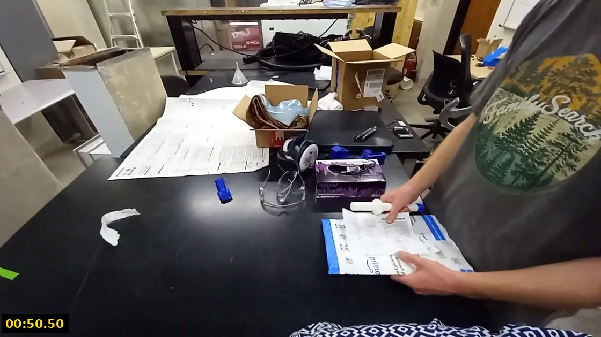

> **Sam [00:50]:** "So the idea hinges around — *this* is the base plate."

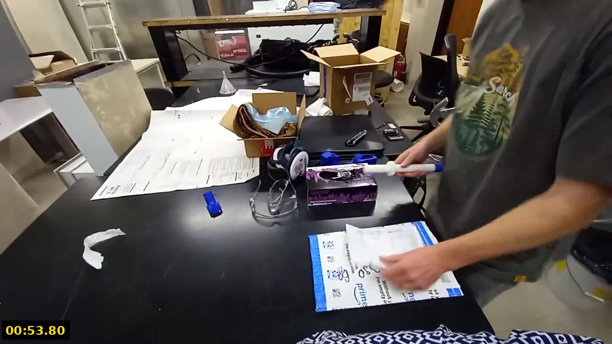

> **Sam [00:53]:** "And this is the mounting plate. And this is the equivalent of this — where this mounts is this piece."

The hinge is shown by rotating the two sheets against each other. Two frames 1.6 s apart, closed
and open:

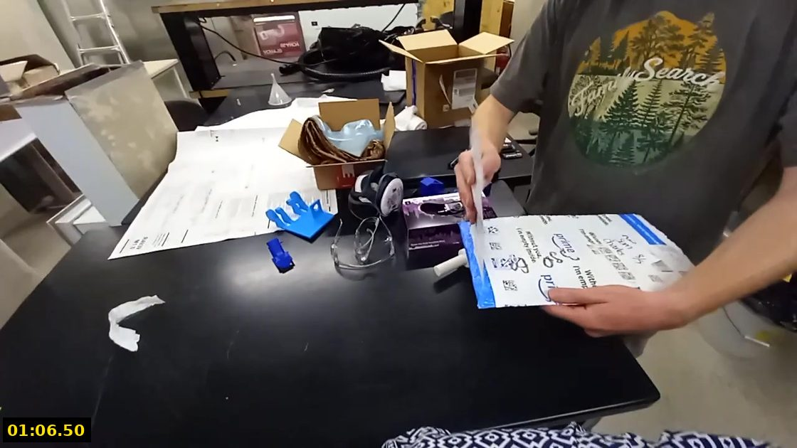
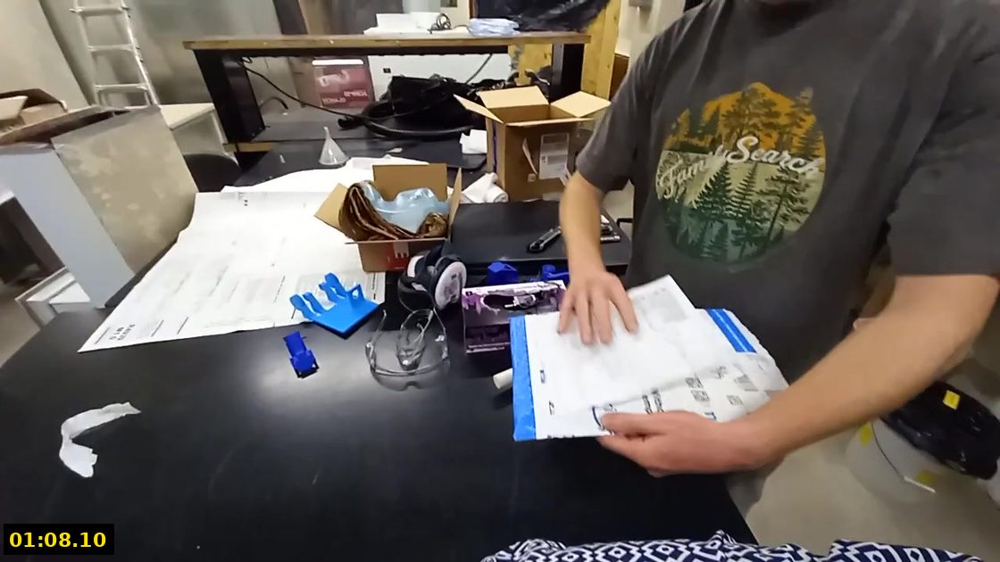

> **Sam [01:04]:** "And these have a hinge — so these can just, like a free pinned hinge, just rotate like that."

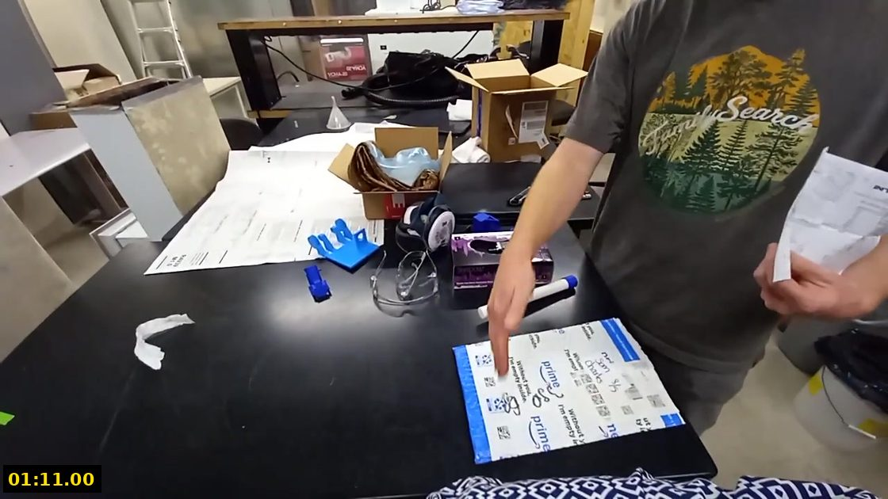

> **Sam [01:10]:** "And then the base plate is connected to the roller chains. So this moves along, and this has a hinge on it, so these move along together. And then if you just push on this, then it can move."

**Actionable:** the hinge axis, pin diameter, and the base-plate→chain attachment are now the
first three things to dimension. Note the hinge is explicitly **free** — no detent, no spring, no
hard stop is mentioned, which is a design decision to make deliberately rather than by omission
(see [Open questions](#open-questions)).

---

### 2. Every carriage is the same passive unit — [01:21]–[01:35]

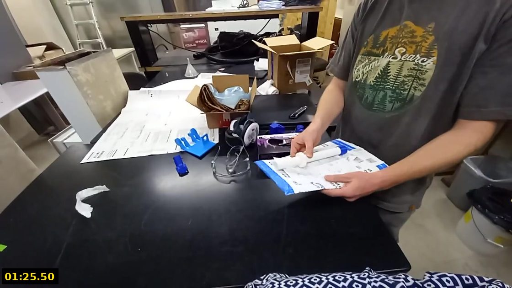

> **Sam [01:24]:** "So all the carriages that go along the roller chain would be this. Does that make sense?"

**Actionable:** this is the part-count claim. One printed assembly × N, no variants, no
per-station specials. It also sets the module pitch problem: N carriages must divide the chain
loop evenly (see the chain/pitch analysis in [#128](https://github.com/vertical-cloud-lab/powder-doser/issues/128)).

---

### 3. Delete the per-module servos — [02:13]–[02:33]

The conversation moves to the live prototype (pink tilt plate, blue printed doser body, on the
balance). Sterling points at the tilt servos currently on the module.

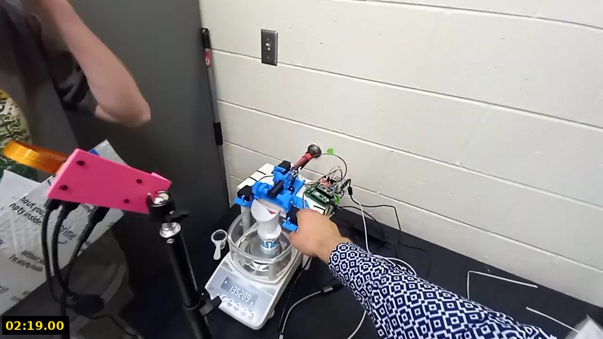

> **Sterling [02:13]:** "So you're saying multiple base plates, but they're not going to have these servos here, because the tilt's going to be handled—"
> **Sam [02:19]:** "—a secret other way."

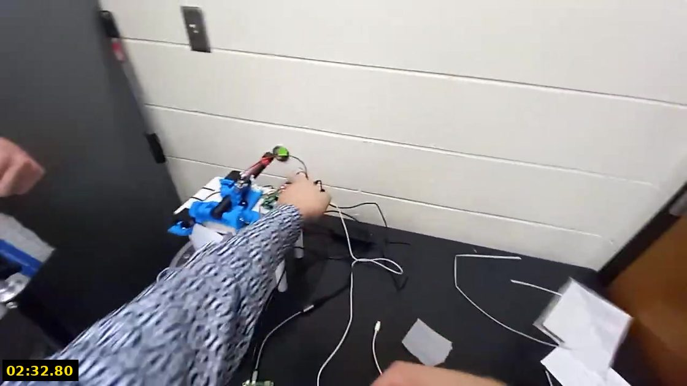

> **Sam [02:25]:** "So, more 3D-printed parts — but not a big deal, because they're just cheap 3D-printed parts. No electronics, all that."

**Actionable:** this directly answers the tilt-servo reliability problem raised earlier in #128
(unscrewed servo horn, hinge screw backing out under vibration, silent failure of a whole
AlSi10Mg battery run). Deleting N servos deletes N copies of that failure mode; it does **not**
delete the tilt, it relocates it.

---

### 4. Open question: what happens to tapping? — [02:36]

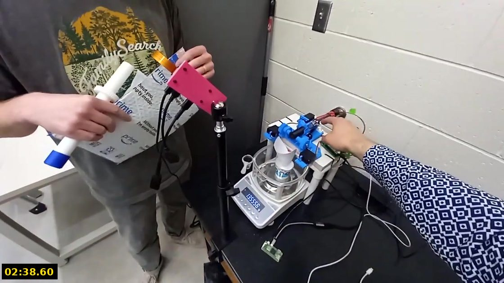

> **Sterling [02:36]:** "And then, what about tapping?"
> **Sam [02:41]:** "So, tapping — I'll let you… yeah. No electronics so far. Just this base plate."

**This is deferred here and only answered at [10:40].** Flagged because tapping is the
sub-milligram trim actuator in the current dosing controller — it is not optional.

---

### 5. The fixed station: balance, stepper, solenoid — [03:13]–[03:52]

The purple box now stands in for the **station module**.

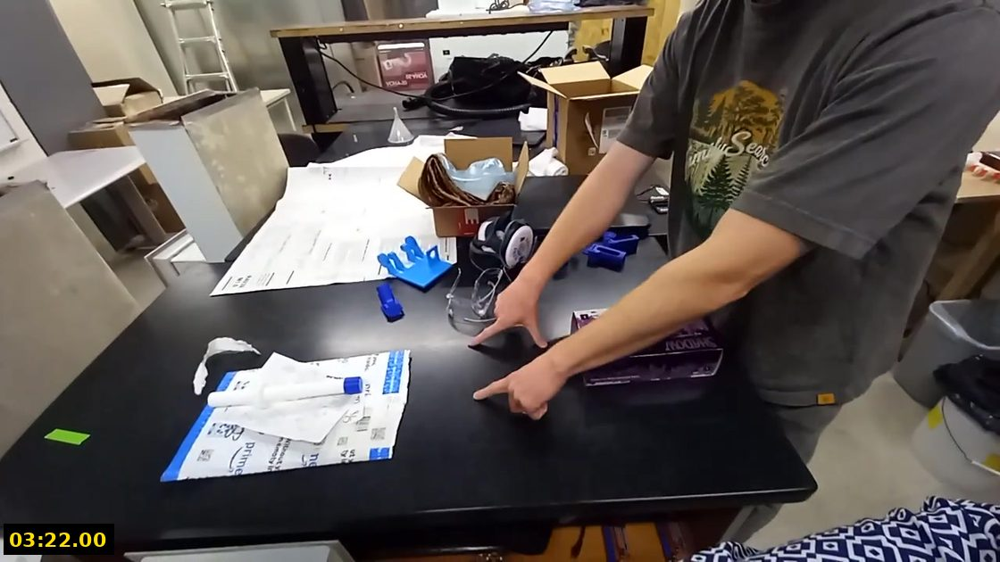

> **Sam [03:13]:** "So then, underneath that — separate — this is static. This is the carriage that goes along with the roller chain. This is… the scale is here, situated behind it."

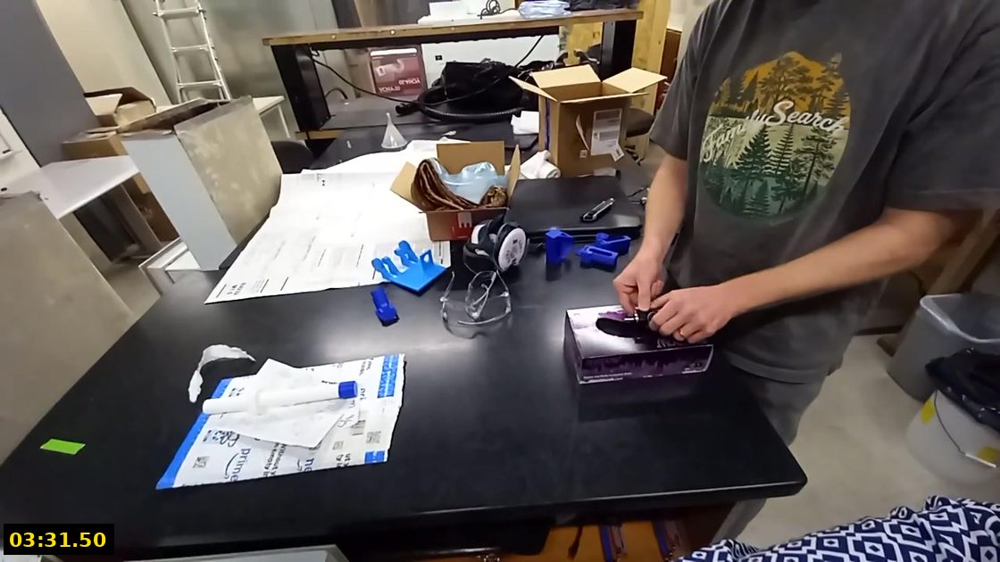

> **Sam [03:24]:** "That's where we have a little module that has — none of this is to scale, right? — but the stepper and the solenoid."

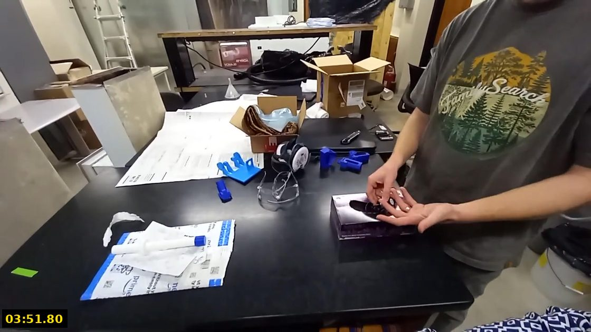

> **Sam [03:34]:** "So the idea is, if these can interface with that somehow, then we can move these carriages back and forth — cheap way — and then have one stepper and one solenoid just interface with the auger, do the thing, and then step away."

**Actionable:** "one stepper and one solenoid" for the whole machine is the central cost and
complexity claim. It also fixes the balance at one location, which means the **dose always lands
in the same place** — good for containment and for a catch tray.

---

### 6. The base plate gets a cutout so the station sits flush — [03:55]–[04:12]

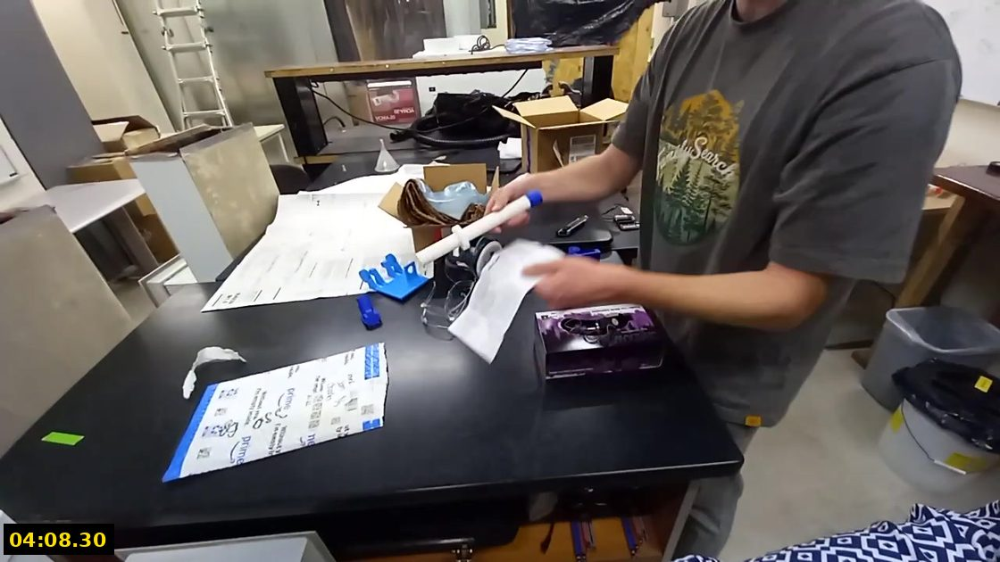

> **Sterling [03:53]:** "So is the thought there, like, would you be taking this plus the stepper and maybe doing an insertion and retraction of it?"
> **Sam [04:03]:** "Yeah — so this would all be on the underside. So this would have like a cutout or something, so this sits flush with this. So this fits underneath."

**Actionable:** the cutout is a hole through a structural plate that is also the chain
attachment. Its size is set by the station's envelope, and it competes directly with the base
plate's stiffness. Dimension the cutout before the plate.

---

### 7. Kinematic couplings at four corners — [04:16]–[04:45]

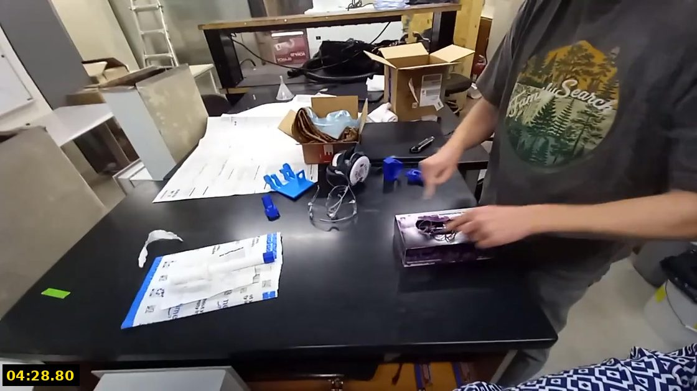

> **Sam [04:20]:** "So then this would be almost free-floating — but then it would have those cone-connector things I was telling you about. So it has four, one of those in each of these corners."

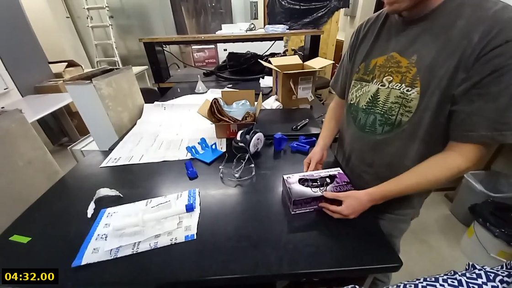

> **Sterling [04:29]:** "Kinematic coupling."
> **Sam [04:32]:** "Yeah — I like that, that makes sense."

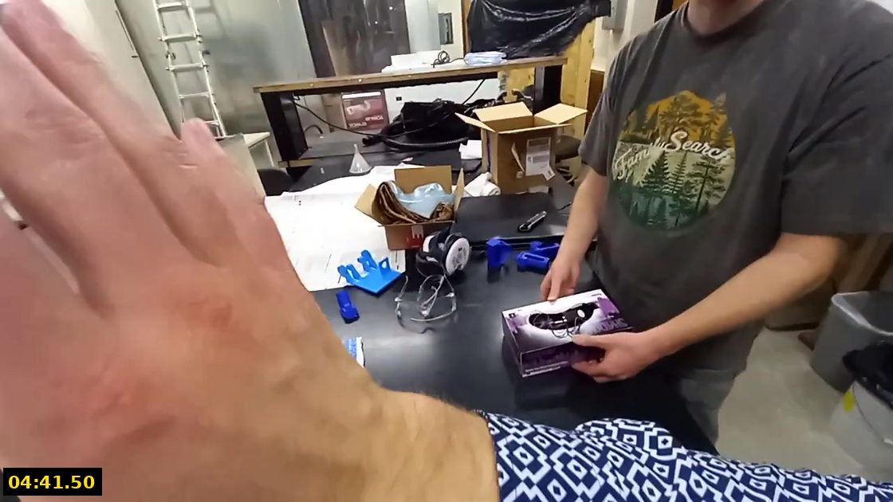

> **Sam [04:36]:** "I learned about it from another open-source project — Science Jubilee is one, tool changing, you know?"

**Actionable:** prior art to copy directly. Note **four** cones is one more than a true
kinematic coupling needs (3 balls / 3 vees is exactly constrained); four is over-constrained and
will fight itself unless one pair is relieved. Worth resolving before printing. Independently,
kinematic couplings were the recommended docking primitive in the
[rotation-agnostic cap review](https://github.com/vertical-cloud-lab/powder-doser/issues/128#issuecomment-30649395316) — same
part solving a second problem.

---

### 8. A linear actuator from below does the tilt — [04:45]–[05:35]

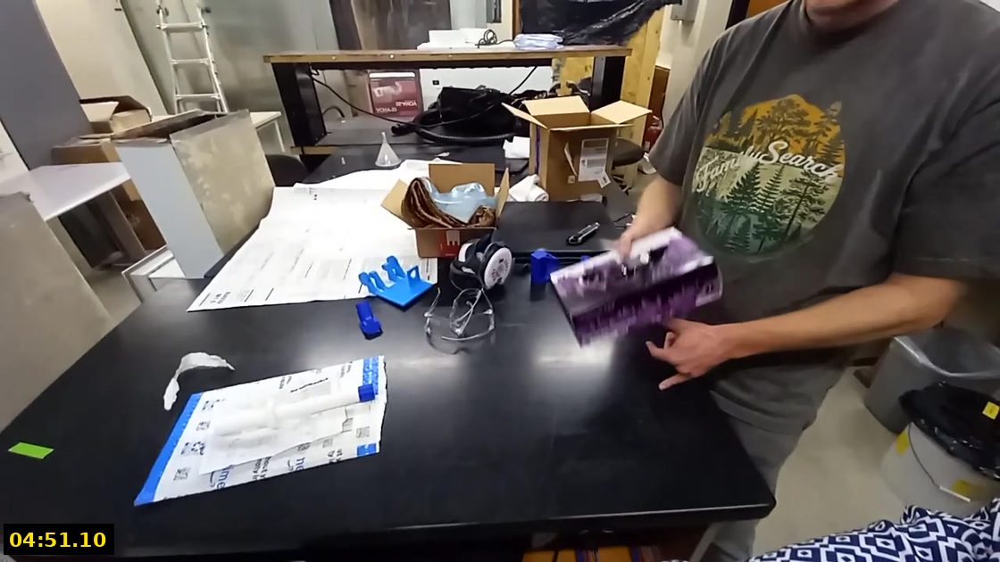

> **Sam [04:45]:** "…a kinematic coupling. So then, below that, we have a linear actuator. So this can move up and down. And this has something like just a pin as well, so it's just free-floating there."

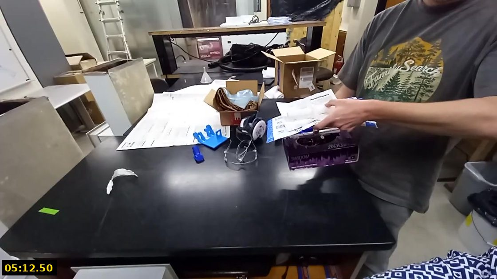

> **Sam [05:04]:** "So the idea being that, as this carriage moves over here, this linear actuator pushes this up — interfaces with the mounting plate…"

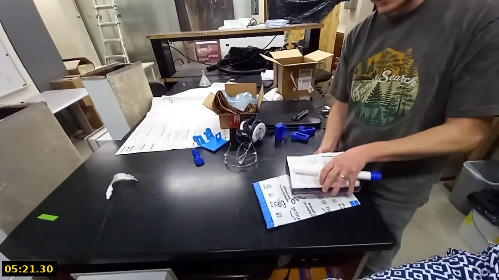

> **Sam [05:19]:** "…and then through a hole in this, and it pushes this up, and they move together — on the tilt."

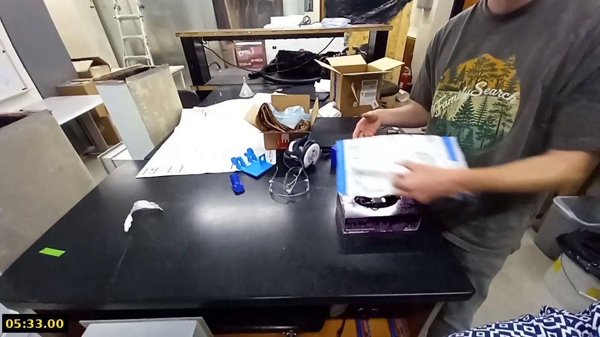

> **Sam [05:25]:** "And then when it's done, the linear actuator can pull back a little bit, and it releases, pushes back underneath, and then this moves on to the next one."

**Actionable:** one actuator stroke does three jobs — couple, engage drives, tilt. That is
elegant and it is also the riskiest part of the design, because the three jobs want different
strokes and different forces. Budget them separately (see §22).

---

### 9. Chain drive: big stepper or planetary gearbox — [05:35]–[05:55]

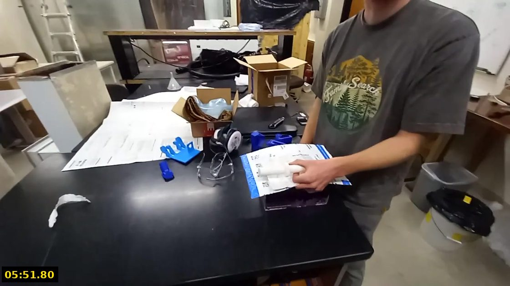

> **Sterling [05:34]:** "So, linear actuator from below gives you the tilt, which can fully disengage from the carriage — allowing for rotation with some massive stepper or planetary gearbox, something like that, going around."

**Actionable:** this is where the UofU NEMA 34 (`34HS59-6004D-E1000`) from the issue title
lands — the chain drive, not the auger. Sizing, driver, and supply notes are in the
[hardware pricing comment](https://github.com/vertical-cloud-lab/powder-doser/issues/128#issuecomment-30650307841).

---

### 10. Open question: how do the stepper and solenoid engage? — [05:55]–[06:20]

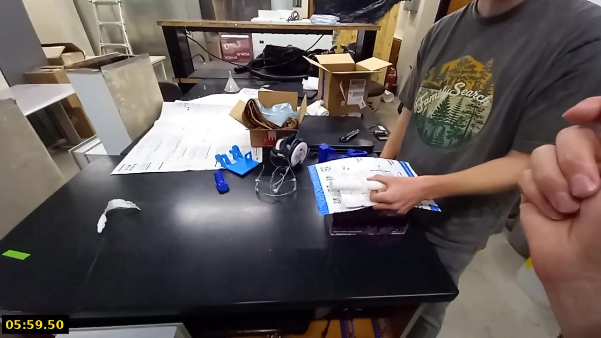

> **Sterling [05:54]:** "And then I think what I'm still not quite clear on is how the servo driving the rotation — or sorry, the stepper motor driving the rotation — and the solenoid engage and disengage."

This question is asked at [05:54], deflected into the scissors interlude, re-asked at [08:47],
and finally answered at [09:15]. It is the load-bearing unknown of the whole pitch.

---

### 11. Interlude: the paper prototype — [06:20]–[07:15]

Sam goes looking for scissors so he can cut the paper base plate. Not a design point, but two
lines worth keeping, because they explain why the rest of the video is clearer than the first
half:

> **Sterling [06:24]:** "The number of times I've looked for scissors in a lab context is ridiculously high."
> **Sam [06:34]:** "Yes — I just need to buy like five scissors."
> **Sterling [06:47]:** "You should have been more prepared for my impromptu…" *(laughter)* "This is my conversation with Will[?] yesterday as well: 'and then how does it work?' 'Okay, so the glovebox moves this way, and then the random piece of paper moves this way.'"

**Actionable (process, not mechanism):** everything after this point uses a *cut* paper model
with a real cutout, and the explanation gets materially sharper. Cheap physical mockups earn
their keep here — as does buying scissors.

---

### 12. The carriage seats, but stays free in Z — [07:19]–[07:35]

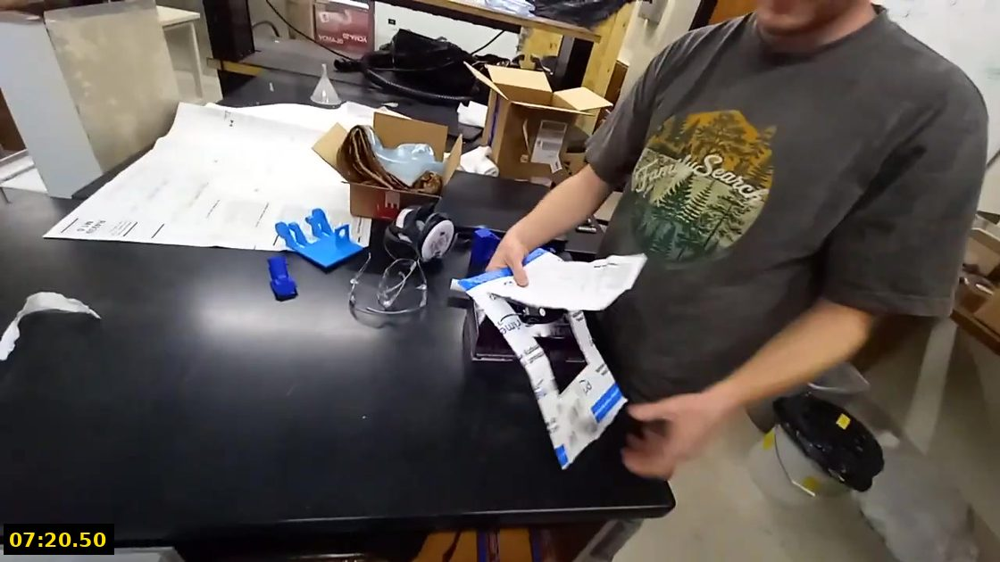

> **Sam [07:19]:** "This is the carriage, and it fits like this, and this can move as it likes."
> **Sterling [07:26]:** "And this can't go beneath? Is that right? So it sits here, but then it can freely move up and down like that."

**Actionable:** the mounting plate must be free upward (so the actuator can lift it) but
restrained downward (so it rests when disengaged). That asymmetric constraint is a real feature
to design — a lip, a shoulder, or the clips themselves.

---

### 13. One carriage per auger — N identical modules — [07:35]–[07:50]

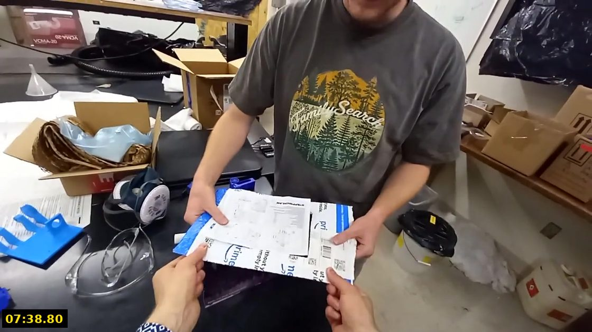

> **Sterling [07:33]:** "And there's one of these per auger, is that right?"
> **Sam [07:40]:** "Yes. The auger sits on here."
> **Sterling [07:42]:** "Okay, so this is like one repeatable unit right now."
> **Sam [07:46]:** "Yes — this is N modules, with this."

---

### 14. No electronics at all; the hinge is the only mechanism — [07:48]–[08:10]

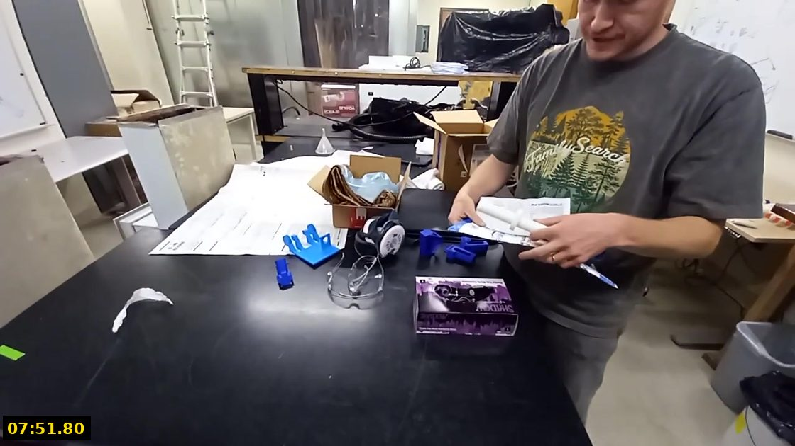

> **Sterling [07:48]:** "And no electronics at all?"
> **Sam [07:49]:** "No electronics at all. The only mechanism here is that hinge joint. That's it."

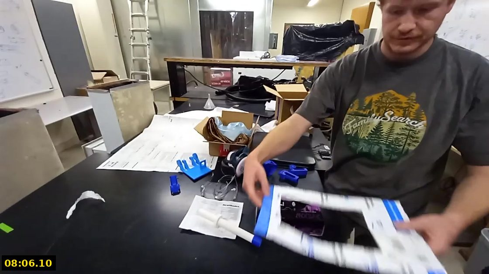

> **Sam [07:56]:** "And then this is the part that connects to the roller chain. This has like pins here, pins here — something that connects to the roller chain."

**Actionable:** "pins here, pins here" is the chain-attachment interface and it is the one place
where printed plastic would sit in the chain's load path. Prefer bolting the printed carrier to
a steel **attachment link** (A-1/K-1 lug) rather than replacing a link with a printed part.

---

### 15. Approach clearance: close but not touching — [08:17]–[08:45]

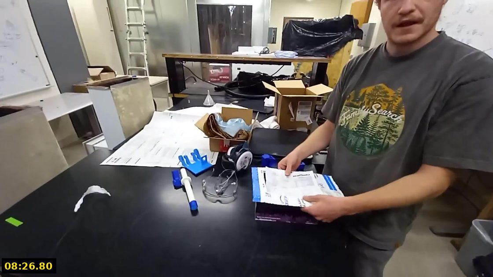

> **Sam [08:17]:** "And then how this interfaces is: as this moves over, it's pretty close to this, but not touching. The bottom part."

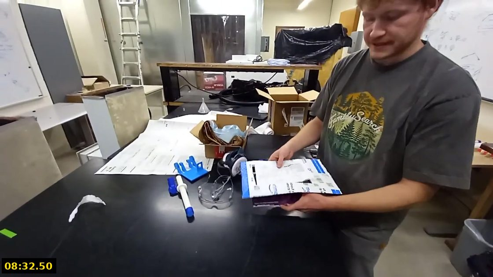

> **Sam [08:28]:** "And so then the linear actuator moves up a little bit, and then we have the kinematic couplings, and connect it with this. So these connect — and then the actuator, as it continues to push, because we have that pin there, that moves."

**Actionable:** there is a defined **fly-by gap** during indexing and a **capture gap** at the
station. Both need numbers. The fly-by gap has to absorb chain sag, chordal action, printed-part
tolerance, and any carriage swing.

---

### 16. The station carriage carries all the electronics — [09:03]–[09:35]

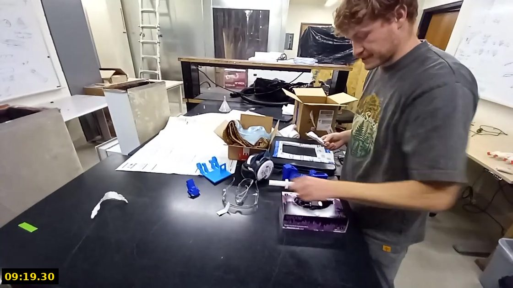

> **Sterling [08:56]:** "Oh — so I was picturing this only being the actuation for tilt. How is that also getting… maybe that's the part I'm still missing."
> **Sam [09:15]:** "So the thing the linear actuator — so we have kind of a *second* carriage, that has all this stuff. And so this would sit like this."

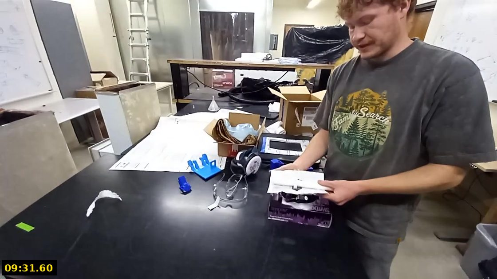

> **Sam [09:24]:** "And so as it comes over, it's almost engaging — and then as it pushes up a little bit, then it engages with the stepper motor there, and a solenoid at another hole, like right there."

**This is the answer to §10.** There are two carriages in the design and they are easy to
confuse: the **module carriage** (passive, on the chain) and the **station carriage** (active,
on the actuator, holding stepper + solenoid, floating on its own kinematic couplings).
Recommend naming them distinctly in the CAD from the start.

---

### 17. Retention: weight alone, or the compliant clips? — [09:36]–[10:10]

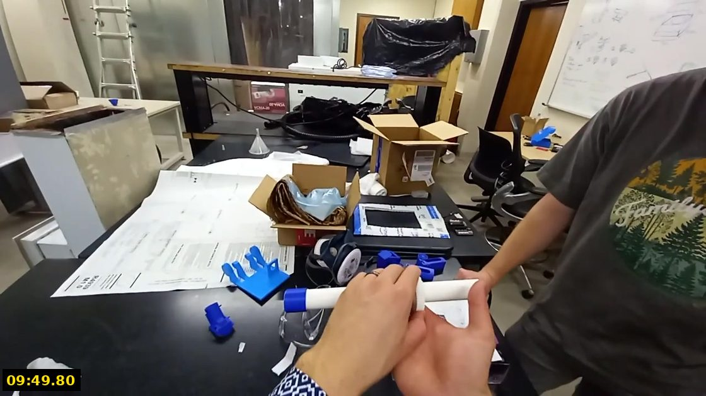

> **Sterling [09:36]:** "So then, with that engaging — is the idea that this would be held down only by the weight of itself?"

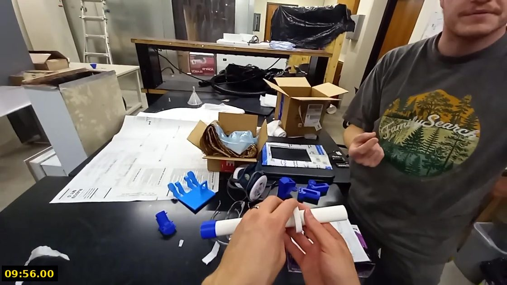

> **Sam [09:51]:** "I was going to have the same clips that I have on that one — the compliant clips."

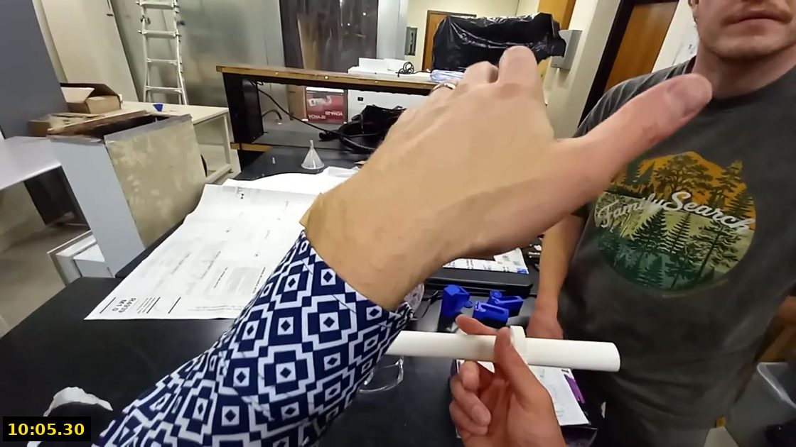

> **Sterling [09:57]:** "How would you get this into the clips without something constraining it from above?"

**Actionable:** the existing compliant clips are being reused for a *new* job — reacting the
upward coupling force, not just holding the cartridge. That is a different load case and it is
the question Sterling asks twice. It resurfaces at [12:13].

---

### 18. Operator workflow: fill, load, clip, walk away — [10:17]–[10:40]

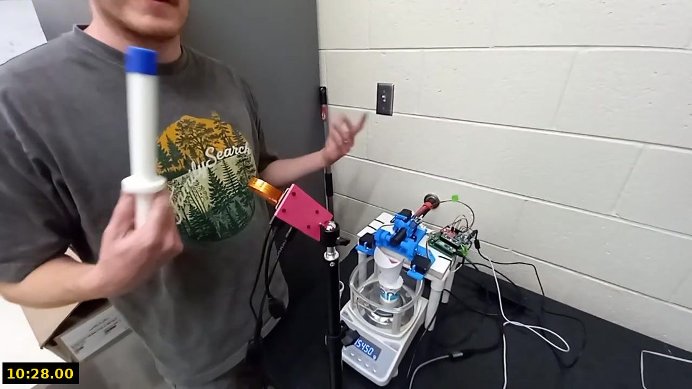

> **Sam [10:18]:** "So this is held by itself, right? These kinds of clips. So when you're first preparing the augers, you fill them up, you put them into the machine, you would lock them into this — this is on the mounting plate, on the carriage."

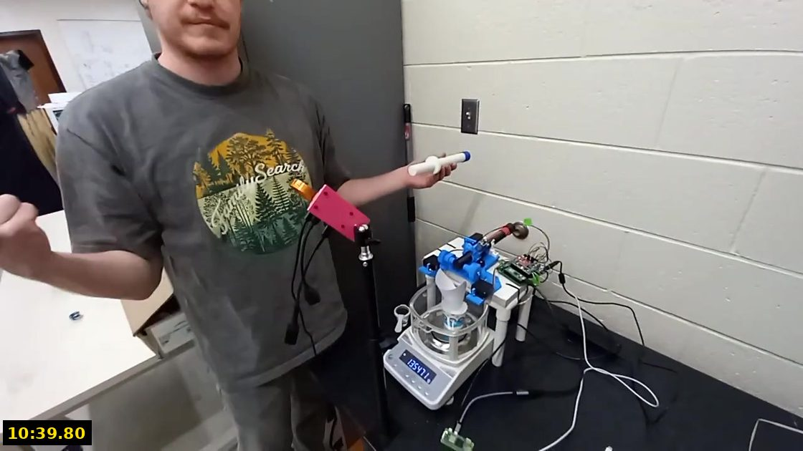

> **Sam [10:35]:** "These are all held in by these clips, the whole time, until the person takes them off."

**Actionable:** the human loads and unloads; the machine never does. This is what removes the
transfer arm from the design (see §24), and it means **cartridge insertion/removal ergonomics**
become a first-class requirement — including inside a glovebox, gloved.

---

### 19. The tap collar and lifting the solenoid — [10:40]–[11:07]

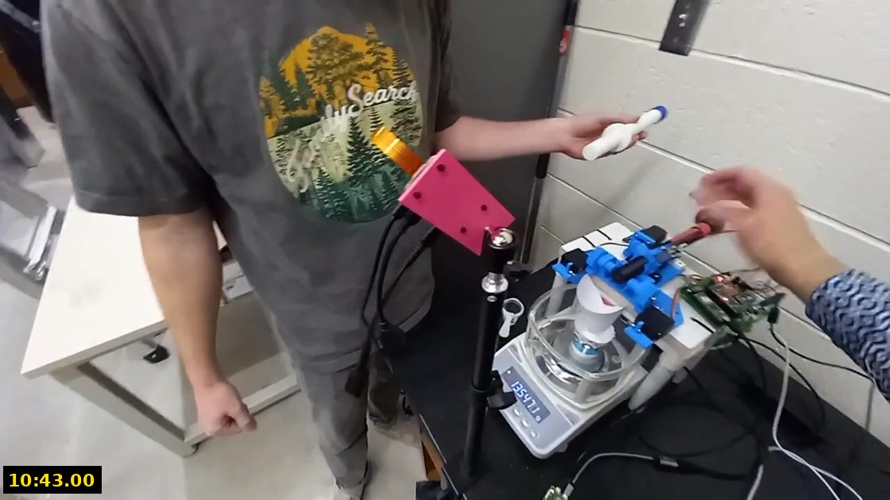

> **Sterling [10:40]:** "And right now this tap collar is fixed on there. Or would you be — okay, so lifting, you would be lifting the solenoid up to the point where you can tap on the side of the auger…"

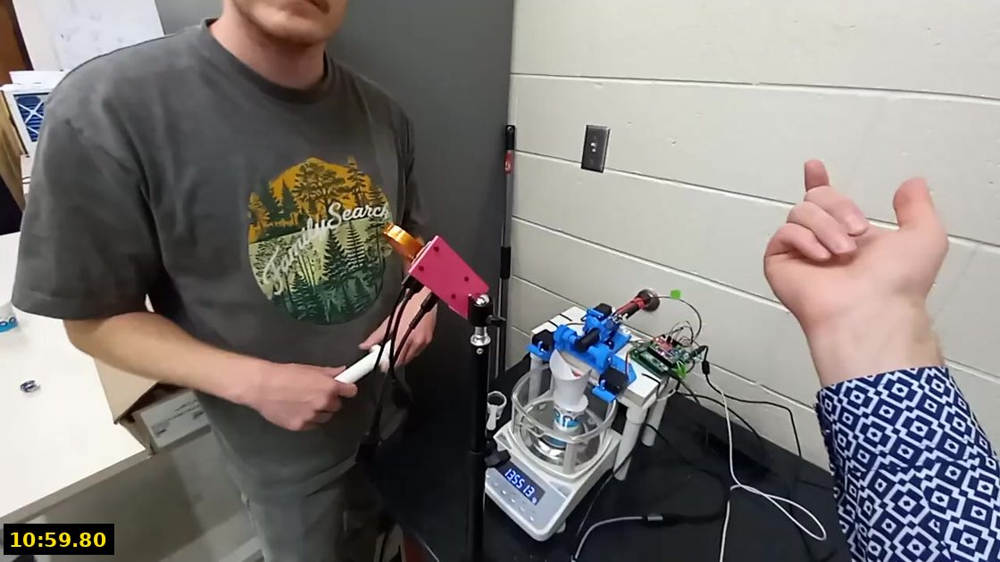

> **Sterling [11:01]:** "…and you would also be lifting the stepper motor, such that it engages with this."
> **Sam [11:07]:** "Right. So the solenoid would be here-ish, locked into that carriage. This carriage, with the linear actuator, would move up, engage with this, and make it move like that."

**This is the answer to §4.** Tapping survives — the solenoid rides the station carriage and
reaches the tap collar on the up-stroke. **Actionable:** the tap collar stays on the cartridge,
so the solenoid must strike a *moving-in-Z* target repeatably, and tap energy now depends on
actuator position. Given that tapping is the fine-dose actuator, tap repeatability across the
engaged position is a calibration risk worth measuring early.

---

### 20. Everything interfaces from underneath → orientation-agnostic — [11:07]–[11:45]

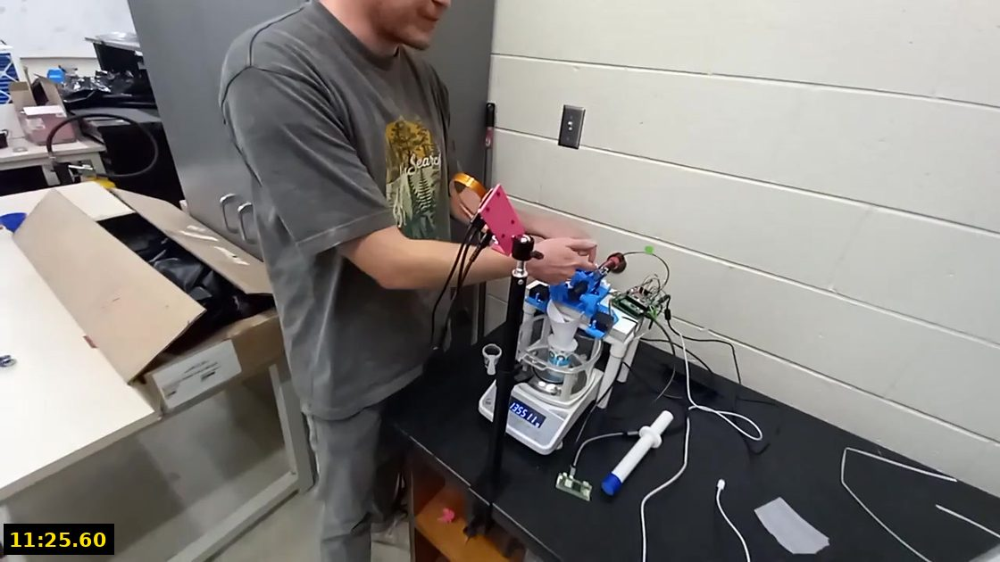

> **Sam [11:21]:** "And these would be underneath, because this — it doesn't matter what orientation. These would be underneath. And so as they come up, then you're close enough that the solenoid can hit, the stepper can move it together."

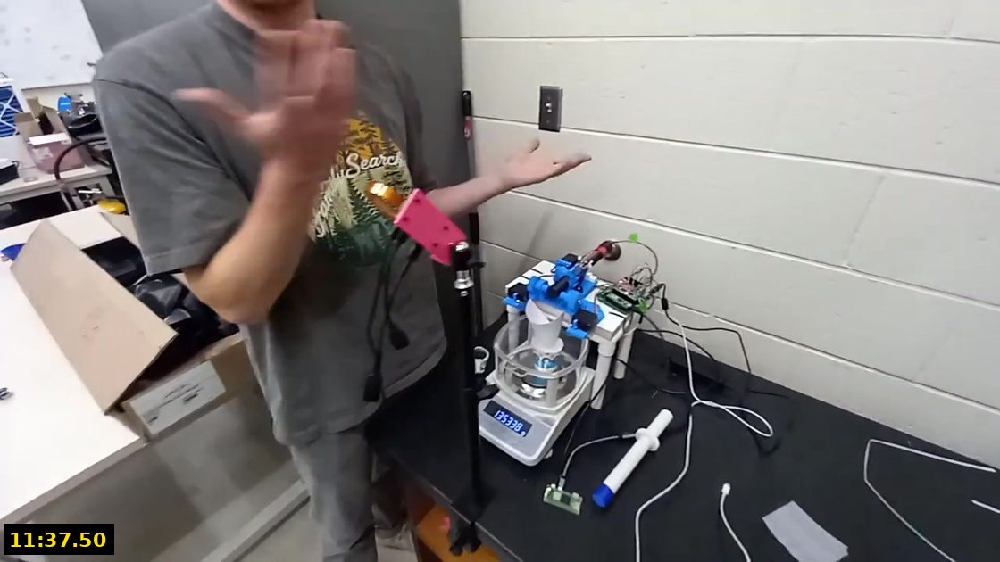

> **Sam [11:33]:** "And they're held just by those kinematic couplings and gravity. Maybe some light magnets or something as well. And then they move together, up and back — and then it disengages, and carries on."

**Actionable:** approaching from **underneath, on-axis** is what makes the interface
orientation-independent. This is the same conclusion the cap prior-art review reached — solve
orientation at the dock, not in the part. Note the retention stack is *gravity + couplings
(+ maybe magnets)*, i.e. **no positive latch**; any upward disturbance during dosing is reacted
only by weight and magnets.

---

### 21. Deleting the servos buys module pitch — [11:48]–[12:00]

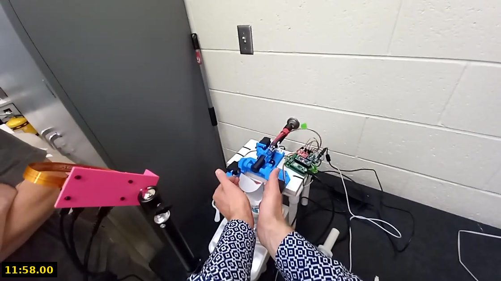

> **Sterling [11:48]:** "And so we don't have servos here anymore — that can probably allow us to decrease the width."
> **Sam [11:58]:** "Yeah."

**Actionable:** narrower modules → shorter chain for the same N, or more N in the same
footprint. This feeds directly into the chain-pitch / attachment-spacing decision, which is
currently the thing blocking the chain purchase.

---

### 22. The force nobody has budgeted yet — [12:00]–[13:05]

This is the most substantive critique in the video, and it comes from Sterling.

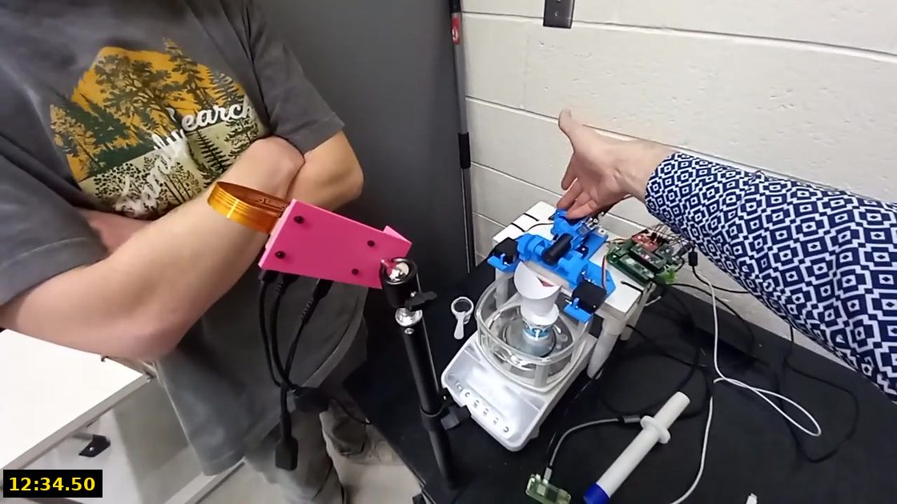

> **Sterling [12:13]:** "Basically, I'm not too worried about this coming out of the clips — but in pushing up to get enough of a… clear clearance minimum…"

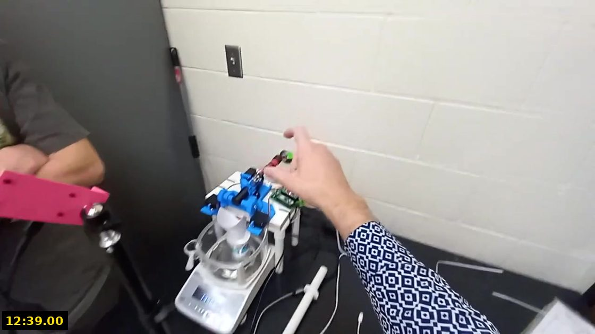

> **Sterling [12:34]:** "…getting the right distance between the two companion gears would require at least some force."

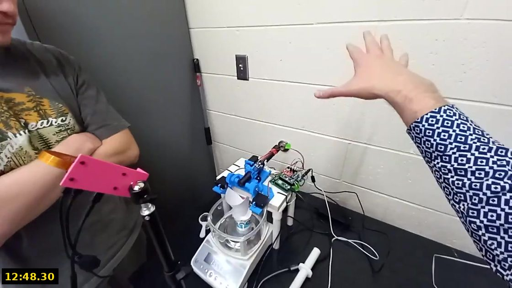

> **Sterling [12:41]:** "…is the roller chain, I guess, going to take that opposing force? Like, this is going to have to get lifted up against the clips. There's going to be some force that then gets carried by the roller chain."
> **Sam [13:04]:** "Yeah — the roller chain."

**Actionable, and the single biggest open engineering item.** The actuator has to push *up*
hard enough to (a) seat the kinematic couplings, (b) mesh the stepper coupling, and (c) hold
position against tapping impulses. Every newton of that is reacted by the chain, in the
direction chain is worst at carrying — **transverse to its articulation plane**. Nothing in the
design currently reacts it except the chain and the clips.

---

### 23. Wear strip / standoffs to react that force — [13:05]–[13:30]

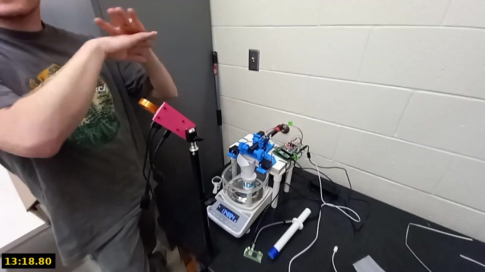

> **Sam [13:08]:** "You could also have it so that that specific section has more — the roller chain is up against, um, it's called a wear strip. Or something like that. So it's pushing against some other, like, standoffs that we have."
> **Sterling [13:17]:** "Okay."
> **Sam [13:23]:** "So it's not just […] roaming — it's fixed in something."
> **Sterling [13:29]:** "Yeah, I got you."

**Actionable and cheap.** A local **hold-down rail / wear strip over the chain at the dispense
station** closes the force loop locally so the coupling force never travels through the chain
tension path at all. UHMW-PE strip is a stock item. This should go in the CAD as a named part
now, not later — it is the fix for §22 and it is a $10 part.

---

### 24. Closing: why this is simpler — [13:30]–[14:18]

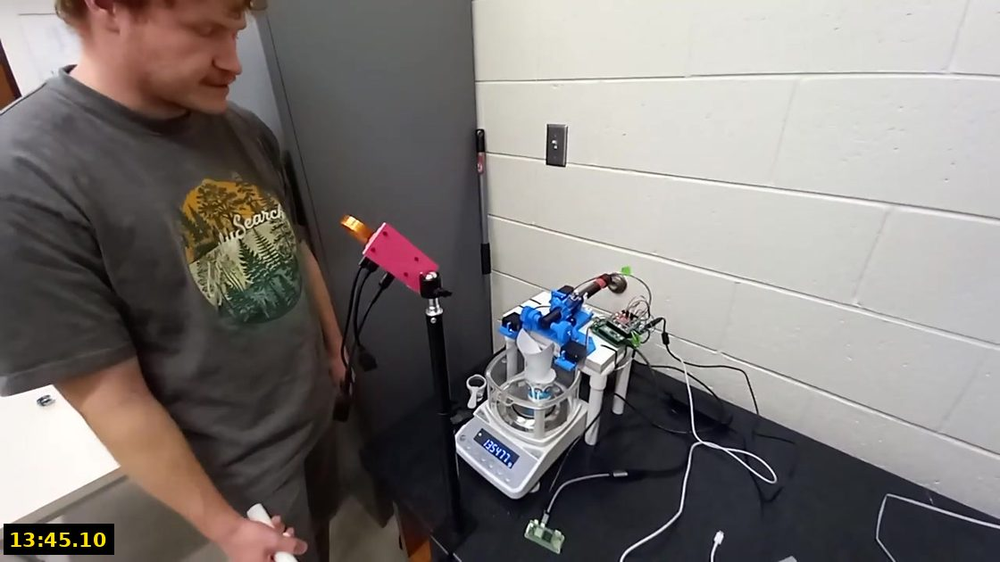

> **Sam [13:32]:** "I'll model it, I'll show it to you […]. I think it's the simplest way I've come up with so far to get it all — having the tilt separated from the electronics, basically."

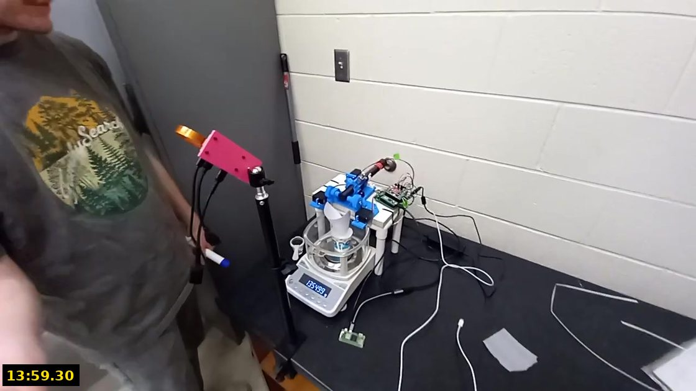

> **Sterling [13:56]:** "You don't have to have an arm that grabs something and moves it over, or something like that. It just stays where it is the whole time."

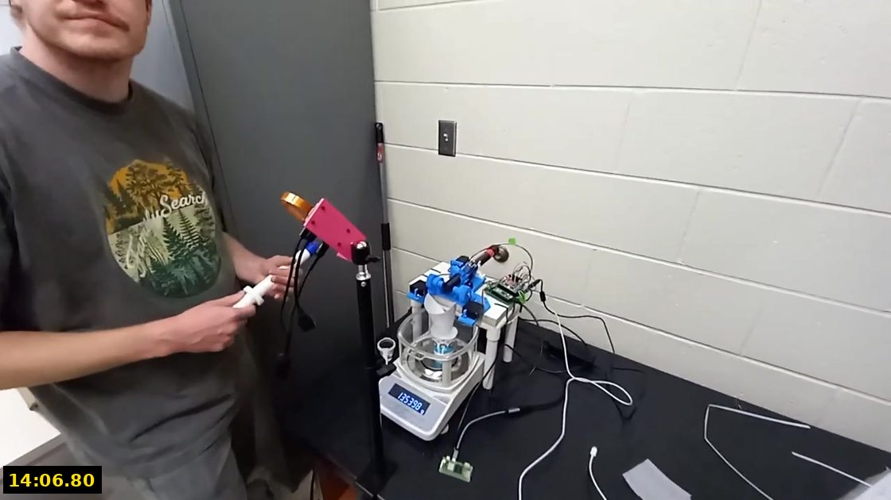

> **Sam [14:02]:** "Yeah, that's right. It really just becomes — there's no transfer of auger. It's just getting the auger into position."
> **Sterling [14:11]:** "Cool. I like that. Thanks for explaining that."

**This kills the clip-in/clip-out arm concept** discussed in the 2026-07-15 meeting and in the
[2026-07-31 approach comment](https://github.com/vertical-cloud-lab/powder-doser/issues/128#issuecomment-30649291547)
(the solenoid-and-gear single-link arm with a gripper). It is a scope reduction, not an addition.

---

## Consolidated action items

| # | Action | Source | Owner (stated) |
|---|---|---|---|
| 1 | Model the passive carriage (base plate + mounting plate + free pin hinge) in CAD and review | [13:32] | Sam |
| 2 | Name the two carriages distinctly in CAD ("module carriage" vs "station carriage") | §16 | — |
| 3 | Dimension the base-plate **cutout** and the chain **pin** attachment; prefer a steel attachment lug over a printed link | [04:03], [07:56] | — |
| 4 | Resolve **4 cones vs 3-ball kinematic coupling** (four is over-constrained) | [04:20] | — |
| 5 | Add a **wear strip / hold-down rail at the dispense station** as a named part | [13:08] | — |
| 6 | Budget the actuator force: seat couplings + mesh stepper + resist tap impulse; check the clips and chain react it | [12:13]–[13:04] | — |
| 7 | Specify the fly-by gap (indexing) and capture gap (docking) as numbers | [08:17] | — |
| 8 | Verify tap energy/repeatability with the solenoid on a lifted station carriage rather than fixed | [10:40]–[11:07] | — |
| 9 | Re-check module pitch now that per-module servos are deleted (narrower module) | [11:48] | — |
| 10 | Size the chain drive (the UofU NEMA 34 / planetary) for the loop | [05:34] | — |
| 11 | Buy scissors | [06:34] | Sam (self-assigned, sincerely) |

## Open questions

1. **How much force does the up-stroke need, and what reacts it?** (§22) — unresolved on video;
   the wear strip (§23) is a proposal, not yet a design.
2. **Loading into the clips with something constraining from above** ([09:57]) — Sterling asks
   twice; the answer given is the operator workflow (§18), which resolves *when* but not *how*
   the clip is engaged with a carriage in a chain loop.
3. **Is the hinge really free?** No detent, spring, or hard stop is specified. What holds tilt
   angle during transit, and what stops the mounting plate from rattling on the chain?
4. **Does anything positively latch the station carriage?** Retention is gravity + kinematic
   couplings + "maybe some light magnets" ([11:33]).
5. **Tilt angle range and where the powder points during transit** — not covered in this video;
   still the open question from [#116](https://github.com/vertical-cloud-lab/powder-doser/issues/116)-derived analysis.
6. **What does the dose land in, and does the balance stay fixed?** Implied fixed at [03:13];
   not stated explicitly.

## Comments on the video

**None.** `comment_count` was 0 and the comment fetch returned zero items on 2026-08-21.
Nothing to inlay. This section exists so the absence is recorded rather than assumed.

---

## Appendix A — corrected transcript

Reconciled from two independent automatic transcripts and corrected for intent. `[…]` marks
audio that is genuinely unclear; `[?]` marks a word I believe is right but cannot confirm.
Backchannel ("yeah", "mhm", "okay") is dropped except where it carries meaning. **S** = Sam
Charles, **B** = Sterling Baird.

> **Correction log — words the raw transcripts got wrong.** "augur" → **auger** (throughout);
> "end modules" → **N modules**; "sits like plus with this" → **sits flush with this**; "none of
> this is to scale" (YouTube) over "no assist to scale" (Whisper); "free pinned hinge" (YouTube)
> over "pages of free hinge" (Whisper); "hinge joint" (YouTube) over "things join" (Whisper);
> "isolating the tilt one way or another" (Whisper) over "isolating the tilt when we're in
> another one" (YouTube); "the algorithm" → **the augers**; "Eclipse" → **these kinds of clips**;
> "this is a matter of orientation" → **it doesn't matter what orientation**; "there's a movie,
> some light magnets" → **maybe some light magnets**; "This carriage is with a linear auction" →
> **this carriage, with the linear actuator**; "Science Jubilee was one tool changing" →
> **Science Jubilee is one — tool changing**. "Companion gears" [12:34] is retained because both
> transcripts independently produced it, but it may be a mishearing of a coupling/gear-pair term.

```text
[00:01] B: Cool. Okay — ready?
[00:05] S: Yeah.
[00:07] B: Just pretend like I don't have a camera strapped to my chest.
[00:09] S: Okay, so here's the idea. So, we were talking about isolating the tilt one way or
        another, and then we were thinking maybe it's still helpful to have the tilt. But I was
        thinking: the more that we can isolate, the better — and just, how can we make this as
        easy for ourselves as possible?
[00:27] B: So when you say "isolate the tilt," you mean like get rid of the tilt?
[00:30] S: Yeah — like we were talking about getting rid of the tilt, just holding it vertical or
        horizontal. But it might still be helpful to have the tilt anyway. So I've been thinking,
        how do we make this as easy for ourselves as possible?

--- The concept, built out of two sheets of paper ---

[00:47] S: So the idea hinges around — this is the base plate.
[00:53] S: And this is the mounting plate. And this is the equivalent of this: where this mounts
        is this piece. And these have a hinge — so these can just, like a free pinned hinge,
        just rotate like that.
[01:10] S: And then the base plate is connected to the roller chains. So this moves along, and
        this has a hinge on it, so these move along together. And then if you just push on this,
        then it can move. That's the idea. And so this would be here — that's basically that.
        So all the carriages that go along the roller chain would be this. Does that make sense?
[01:31] B: Just give me a moment to [digest] it. So — can we take this over here for a second?

--- Over at the live prototype ---

[01:41] B: And if you grab the base — uh, base plate…
[01:51] S: No, no — this is the mounting plate, and this is the base…
[01:55] B: …mounting plate.
[01:56] S/B: [unclear, non-technical — sounds like "blue steel"]
[01:58] S: So, the idea being: the auger is still mounted to something that can hinge separate
        from the base plate. This base plate is what's connected to the roller chains. So this
        base plate can move — is what's being pulled along — and the mounting plate here is just
        attached to it by a hinge.
[02:13] B: So you're saying multiple base plates, but they're not going to have these servos
        here, because the tilt's going to be handled—
[02:19] S: —a secret other way.
[02:21] B: A secret other way. Okay.
[02:25] S: So, just a free hinge. So, more 3D-printed parts — but not a big deal, because they're
        just cheap 3D-printed parts. No electronics, all that.
[02:36] B: And then, what about tapping?
[02:38] S: So, tapping — I'll let you… yeah. No electronics so far. Just this base plate.
[02:44] B: Okay, bring it back over.
[02:46] S: …which is basically like a carrier. But importantly it has that hinge, so you can [go]
        back and forth.
[02:57] S: So then — okay, put that aside for a second.
[03:00] B: A hinge, but no electronics to be able to actuate the hinge. You can move it with your
        hand or something, but nothing —
[03:07] S: — and it's not going to stay. It's just a free pin.
[03:11] B: Okay, sounds good.

--- The fixed station ---

[03:13] S: Okay, so then underneath that — separate — this is static. So this is the carriage
        that goes along with the roller chain. This is… the scale is here, situated behind it.
[03:24] S: That's where we have a little module that has — none of this is to scale, right? — but
        the stepper and the solenoid.
[03:34] S: So the idea is: if these can interface with that somehow, then we can move these
        carriages back and forth — cheap way — and then have one stepper and one solenoid just
        interface with the auger, do the thing, and then step away.
[03:53] B: So is the thought there, like, would you be taking this plus the stepper and maybe
        doing an insertion and retraction of it, or…?
[04:03] S: Yeah. So this would all be on the underside. So this would have like a cutout or
        something, so this sits flush with this. So this fits underneath.
[04:20] S: And so then this would be almost free-floating — but then it would have those, um,
        cone-connector things I was telling you about. So it has like four, one of those in each
        of these corners.
[04:29] B: Kinematic coupling.
[04:32] S: Yeah — okay, I will. Yeah, I like that. That makes sense.
[04:36] S: I learned about it from another open-source project. Science Jubilee is one —
        tool changing, you know?
[04:45] S: Yeah, okay — a kinematic coupling. So then, below that, we have a linear actuator.
        So this can move up and down. And this has something like just a pin as well, so it's
        just free-floating there. Just moves.
[04:57] S: And so then, maybe it has a little bit of some more kinematic couplings underneath, so
        it doesn't just [flop] all over the place. But it's like that.
[05:04] S: So the idea being that, as this carriage moves over here, this linear actuator pushes
        this up — interfaces with the mounting plate — and then through a hole in this, and it
        pushes this up, and they move together, on the tilt.
[05:25] S: And then when it's done, the linear actuator can pull back a little bit, and it
        releases, pushes back underneath, and then this moves on to the next one.
[05:34] B: Okay. So, linear actuator from below gives you the tilt, which can fully disengage
        from the carriage — allowing for rotation with some massive stepper or planetary
        gearbox, something like that, going around.
[05:54] B: And then I think what I'm still not quite clear on is how the servo driving the
        rotation — or sorry, the stepper motor driving the rotation — and the solenoid engage
        and disengage with the…
[06:14] S: Yeah. So this base plate would have a cutout. So it's like a—
[06:20] B: Okay, yeah, you're talking about the—
[06:22] S: Yeah, just a cutout.

--- Interlude: looking for scissors ---

[06:24] B: Sure. The number of times I've looked for scissors in a lab context is ridiculously
        high.
[06:34] S: Yes, yes, we do. You know, I just need to buy like five scissors.
[06:45] B: I'll just pause this real quick. […] You should have been more prepared for my
        impromptu. [laughter] This is my conversation with Will[?] yesterday as well. It's like,
        "and then how does it work?" "Okay, so the glovebox moves this way, and then the random
        piece of paper moves this way." Yeah. Okay.

--- Back to the (now cut) paper model ---

[07:19] S: So, this is the carriage, right? It sits like this. This can move as it likes.
[07:26] B: And this can't go beneath? Is that right? Okay, so it sits here, but then it can
        freely move up and down like that. Sounds good.
[07:33] B: And there's one of these — one of these per auger, is that right?
[07:40] S: Yes. The auger sits on here, and this can—
[07:42] B: Okay, so this is like one repeatable unit right now.
[07:46] S: Yes. This is N modules, with this.
[07:48] B: And no electronics at all?
[07:49] S: No electronics at all. Yeah. The only mechanism here is that hinge joint. That's it.
[07:56] S: And then it connects — and then this is the part that connects to the roller chain.
        This has like pins here, pins here, something that connects to the roller chain.
[08:07] S: And then, yeah, it's like this. All this together can move like that.
[08:17] S: And then so then how this interfaces is: as this moves over, it's pretty close — it's
        pretty close to this, but not touching. The bottom part.
[08:28] S: And so then the linear actuator moves up a little bit, and then we have the kinematic
        couplings — and connect it with this. So these connect, and then the actuator, as it
        continues to push, because we have that pin there, that moves.
[08:45] B: That part makes sense.
[08:46] S: Does that answer your question?
[08:47] B: That part makes sense, but the solenoid and the stepper motor for the auger — just
        like how they actually come together.
[08:56] B: Oh, so I was picturing this only being the actuation for tilt. How is that also
        getting… maybe that's the part I'm still missing. So like, I get a linear actuator being
        here to engage tilt.
[09:15] S: Yeah. So the thing the linear actuator — so we have kind of a second carriage, that
        has all this stuff. And so this would sit like this.
[09:24] S: And so as it comes over, it's almost engaging — and then as it pushes up a little bit,
        then it engages with the stepper motor there, and a solenoid at another hole, like right
        there.
[09:34] B: That makes sense. I think that does.

--- Retention and the operator workflow ---

[09:36] B: So then, with that engaging — is the idea that this would be held down only by the
        weight of itself?
[09:51] S: I was going to have the same clips that I have on that one — the compliant clips.
[09:57] B: How would those clips — how would you get this into the clips without something
        constraining it from above?
[10:07] S: Head over there.
[10:18] S: So that would be like — this is held by itself, right? These kinds of clips. So when
        you're first preparing the augers, you fill them up, you put them into the machine, you
        would lock them into this. This is on the mounting plate, on the carriage.
[10:34] B: I see, I see.
[10:35] S: So these are all held in by these clips, the whole time, until the person takes them
        off.
[10:40] B: And right now this tap collar is fixed on there. Or would you be — okay, so lifting,
        you would be lifting the solenoid up to the point where you can tap on the side of the
        auger, and you would also be lifting the stepper motor such that it engages with this.
[11:07] S: Right. So this solenoid would be here-ish, locked into that carriage. This carriage,
        with the linear actuator, would move up, would engage with this and make it move like
        that.
[11:19] B: Okay, makes sense, I think.
[11:21] S: And these would be underneath, because this — it doesn't matter what orientation.
        These would be underneath. And so as they come up, then you're close enough that the
        solenoid can hit, the stepper can move it together.
[11:33] S: And they're held just by those kinematic couplings and gravity. Maybe some light
        magnets or something as well. And then, yeah, they move together, up and back — and then
        it disengages, and carries on.

--- The force question ---

[11:48] B: Okay. And with the — so we don't have servos here anymore. That can probably allow us
        to decrease the width.
[11:58] S: Yeah.
[12:13] B: The — so, like, this being clipped in… I'm sure we could design it so that… well,
        basically, I'm not too worried about this coming out of the clips, but in pushing up to
        get enough of a clear[ance] — clearance minimum. Getting the right distance between the
        two companion gears would require at least some force. To keep it — is the roller chain,
        I guess, going to take that opposing force? Like, this is going to have to get lifted up
        against the clips. There's going to be some force that then gets carried by the…
[13:04] S: Yeah — the roller chain.
[13:08] S: You could also have it so that that specific section has more — the roller chain is up
        against, um, it's called a wear strip. Or something like that. So it's pushing against
        some other, like, standoffs that we have, or something like that.
[13:23] S: So it's not just […] roaming — it's fixed in something.
[13:29] B: Yeah, I got you. I think I get the idea.

--- Closing ---

[13:32] S: I'll model it, I'll show it to you […]. I think it's the simplest way I've come up
        with so far to get it all — having the tilt separated from the electronics, basically.
[13:53] B: Yeah. Cool.
[13:56] B: You don't have to have an arm that grabs something and moves it over, or something
        like that. It just stays where it is the whole time.
[14:02] S: Yeah, that's right. It really just becomes — there's no transfer of auger. It's just
        getting the auger into position.
[14:11] B: Cool. I like that. Thanks for explaining that.
```

---

## Appendix B — provenance and method

**How the video was obtained.** YouTube blocks the datacenter IPs used by GitHub Actions
runners, so the download was routed through the lab's Raspberry Pi over Tailscale (residential
IP), exactly as directed in [#128](https://github.com/vertical-cloud-lab/powder-doser/issues/128).
Steps, in order:

1. `tailscale status` confirmed the runner was already on the tailnet; the Pi was inspected
   read-only first (`uptime`, `df`, `free`, tool presence) before anything was written.
2. A self-contained `yt-dlp` zipapp was fetched to `~/claude-yt-128/` on the Pi — **no `sudo`,
   no system packages, no services touched.**
3. Metadata, captions (`en-orig`), and the comment section were fetched. The Pi has no `ffmpeg`,
   so video (format `136`, 720p AVC) and audio (format `140`, m4a) were downloaded as separate
   streams and merged/processed on the runner.
4. Everything was transferred runner-ward with `rsync --bwlimit=700` (~550 kB/s sustained,
   ~6 min) to stay within the Pi's residential upstream, per the repo's CLAUDE.md guidance.
5. **The Pi's working directory was deleted afterwards**; `df` confirmed the device returned to
   its pre-task 2.7 GB used / 25 GB free. No persistent change was made to the Pi.

**Transcript method.** Two independent automatic transcripts were produced and reconciled:

| Source | File | Notes |
|---|---|---|
| YouTube auto-captions (`en-orig`) | [`raw-youtube-captions.txt`](2026-08-18-multi-doser-prototype-pitch/raw-youtube-captions.txt) | Word-level timings recovered from the VTT `<c>` tags after de-rolling the scrolling cues; 2,431 words |
| `faster-whisper small.en` | [`raw-whisper-small-en.txt`](2026-08-18-multi-doser-prototype-pitch/raw-whisper-small-en.txt) | int8 CPU, beam 5, VAD on, domain-primed initial prompt; 202 segments |

Neither is authoritative. Where they disagreed, the reading consistent with the visible artefact
and with the repo's existing terminology was chosen, and every such call is listed in the
correction log at the top of Appendix A. Where both were garbled, the text is marked `[…]`
rather than guessed. Speaker attribution is **inferred** from content, not from diarization:
the channel description names Sam as the presenter, and the questioning/summarizing voice is
attributed to Sterling. Two or three short backchannel lines could be swapped.

**Screenshot method.** All 46 actionable moments in the transcript were located to word-level
precision, then a **three-frame burst** was extracted at each one (−0.50 s, +0.30 s, +1.10 s
relative to the spoken phrase) — 138 candidates total. Bursts were used because this is a
hand-held chest camera: the hand often lands on the referenced part a beat *after* the words, and
any single frame may be motion-blurred. Candidates were ranked by Laplacian-variance sharpness
and then reviewed visually in contact sheets; the frame where the hand is actually *on* the
referenced part won over the merely sharpest frame. The 47 selected frames were resized to
1120 px wide, JPEG q82, and stamped with their exact source timestamp (bottom-left, `mm:ss.ss`),
which is also encoded in the filename prefix. Total 4.3 MB.

**Reproducing.** `ffmpeg -ss <t> -i video.mp4 -frames:v 1 -q:v 2 out.jpg` against
`https://www.youtube.com/watch?v=IkjBxqa06u0` reproduces any frame; timestamps in filenames and
burned-in labels are exact source times, not re-encoded ones.

**Scope note.** This document is a record of what was said and shown, plus the actionable items
that follow from it. The "Actionable" paragraphs and the open-questions list are my analysis, not
statements made in the video — the block quotes are the video. No CAD, code, or hardware was
changed.
