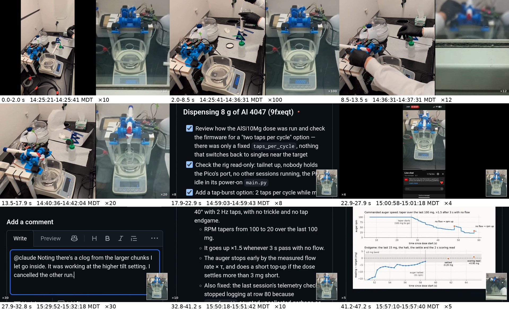
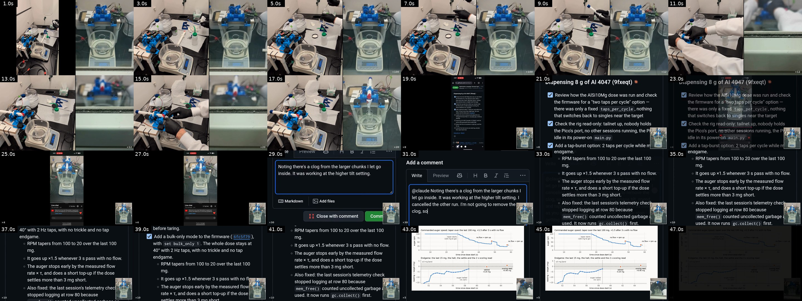

# Slide video: loading Al 4047, then Claude dosing it (2026-09-30)

[`al4047_claude_dose_slide.mp4`](al4047_claude_dose_slide.mp4): 47.2 s, 1920 × 1080, 30 fps,
H.264 (yuv420p, faststart), no audio. It is meant to fill a 16:9 PowerPoint slide
(Insert → Video → This Device, then size it to the whole slide).

- **Loading (0–17.9 s), two panels:** left, the fixed phone camera on the bench in a 1080
  square; right, the bench livestream at the same wall-clock moment, cropped to the doser
  and balance (the stream's burned-in clock is cropped off).
- **Dosing (17.9–47.2 s), one panel:** the phone's screen recording of the PR #166 thread.
  The whole phone is shown once, pillarboxed, then the view zooms to a 16:9 crop of it
  (1080 × 607.5 px of the recording, scaled 1.78× to fill the frame) so the text is
  readable. The livestream continues as a small inset in the bottom-right corner.
- **Overlay:** only the speed multiplier, small in a bottom corner. Each cut to a later
  time is a short crossfade.



## The story, beat by beat

| out (s) | wall clock, MDT (UTC −6) | speed | phone | livestream |
|---|---|---|---|---|
| 0.0–2.0 | 14:25:21–14:25:41 | ×10 | camera: whole bench, portrait, pillarboxed in the square | doser and empty cup |
| 2.0–8.5 | 14:25:41–14:36:31 | ×100 | camera: zooms into the square; the cartridge is filled with Al 4047 at the back of the bench | doser waiting |
| 8.5–13.5 | 14:36:31–14:37:31 | ×12 | camera: the cartridge is fitted to the doser | hands at the doser; the raised sash blocks the view |
| 13.5–17.9 | 14:40:36–14:42:04 | ×20 | camera: last checks at the balance; cartridge in place | the view clears on the loaded doser |
| 17.9–22.9 | 14:59:03–14:59:43 | ×8 | screen: the whole phone for 1.4 s, then zoom to Claude's checklist "Dispensing 8 g of Al 4047 (9fxeqt)" | inset: tube at 40°, the reading climbs 2.2 → 2.9 g |
| 22.9–27.9 | 15:00:58–15:01:18 | ×4 | screen: the whole phone, playing the same livestream (scrubbed back to the last pour) | inset: the dose has stopped at 3.49 g |
| 27.9–32.8 | 15:29:52–15:32:18 | ×30 | screen, zoomed: typing "@claude Noting there's a clog from the larger chunks…" | inset: the tap stage of the second pass |
| 32.8–41.2 | 15:50:18–15:51:42 | ×10 | screen, zoomed: Claude's plan, "Add a bulk-only mode to the firmware…" | inset: the top-up, 0 → 0.32 g at 40°, then the tilt back |
| 41.2–47.2 | 15:57:10–15:57:40 | ×5 | screen, zoomed: the dose trace in Claude's report | inset: the finished doser; fade out |

What the cuts skip, from [`data/opt/production-al4047-9fxeqt/`](https://github.com/vertical-cloud-lab/powder-doser/tree/claude/issue-164-20260922-1928/data/opt/production-al4047-9fxeqt)
on the PR #166 branch: the request was posted at 14:47:44; the first pass stopped at
3.4905 g at 15:00:25 on a firmware `MemoryError`; the second pass (15:21:42–15:35:28) added
4.1906 g before larger particles clogged the tube; the bulk-only top-up (15:50:16–15:51:40)
added 0.3199 g, for 8.0010 g in total. About 1.5 h of wall clock is in 47 s.

## Sources

| panel | video | segment starts used |
|---|---|---|
| phone camera | [QXSj0j1OqL8](https://youtu.be/QXSj0j1OqL8) "Atomizer charge prep (Sep 30): preparing an Al 4047 dose", 1080 × 1920 | [5:29](https://youtu.be/QXSj0j1OqL8?t=329), [5:49](https://youtu.be/QXSj0j1OqL8?t=349), [16:39](https://youtu.be/QXSj0j1OqL8?t=999), [20:44](https://youtu.be/QXSj0j1OqL8?t=1244) |
| phone screen | [dXRB7c6GeDw](https://youtu.be/dXRB7c6GeDw) "dosing Al 4047 with Claude; a stall and a clog", 1080 × 2424 | [0:01](https://youtu.be/dXRB7c6GeDw?t=1), [1:56](https://youtu.be/dXRB7c6GeDw?t=116), [30:50](https://youtu.be/dXRB7c6GeDw?t=1850), [51:16](https://youtu.be/dXRB7c6GeDw?t=3076), [58:08](https://youtu.be/dXRB7c6GeDw?t=3488) |
| livestream | [yOK01jYPknA](https://youtu.be/yOK01jYPknA) "powder doser stream picam-d1pr, 2026-09-30 UTC 19:00" (`@byu-vcl-hardware-streams`), 720 × 1280 | [1:24:16](https://youtu.be/yOK01jYPknA?t=5056), [1:24:36](https://youtu.be/yOK01jYPknA?t=5076), [1:35:26](https://youtu.be/yOK01jYPknA?t=5726), [1:39:31](https://youtu.be/yOK01jYPknA?t=5971), [1:57:58](https://youtu.be/yOK01jYPknA?t=7078), [1:59:53](https://youtu.be/yOK01jYPknA?t=7193), [2:28:47](https://youtu.be/yOK01jYPknA?t=8927), [2:49:13](https://youtu.be/yOK01jYPknA?t=10153), [2:56:05](https://youtu.be/yOK01jYPknA?t=10565) |

Only moments that show the bench, the PR thread or the livestream are taken from the screen
recording.

## How the sync works

Every source gets one offset to wall clock (`SOURCES[...]["t0"]` in the script), and each
segment plays the same wall-clock window in both sources.

- **Livestream:** the burned-in clock turns `14-30-00` exactly at t = 739.2 s of the
  fetched window (it turns at .2 s every second), so the stream is placed to a frame.
- **Phone camera:** cross-correlating frame-to-frame motion (4 fps, 90 × 160 px) of the
  phone video against the livestream from 14:14 to 14:54 gives one clear peak (r = 0.43;
  the best lag more than 5 s away scores 0.18): phone t = 0 is 14:19:51.55. Both cameras see
  the cartridge being fitted at the same instant.
- **Phone screen:** its status-bar clock turns 2:59 → 3:00 at t = 58.43 s, so t = 0 is
  14:59:01.57. This assumes the phone and the stream camera clocks agree, which is good
  to about a second (both are network-synced); at ×4–×30 that is under a frame or two.

## Rebuild

```bash
pip install yt-dlp numpy pillow    # plus ffmpeg on PATH
python make_slide_video.py download --proxy http://127.0.0.1:8118   # sources/ (gitignored)
python make_slide_video.py render                                    # the .mp4 and edl.json
python make_slide_video.py storyboard                                 # storyboard.jpg
python make_slide_video.py contact                                   # contact_sheet.jpg
```

YouTube refuses downloads from datacenter IPs, so in CI the sources were fetched through
the rig's Zero over an SSH SOCKS tunnel (`ssh -D 1080`, HTTP front `pproxy`), rate-capped.
Only the 1 h 47 min window of the 8 h broadcast is fetched (201 MB of 720p fragments, read
from the DASH `sidx` index). The edit is the `EDL` list at the top of
[`make_slide_video.py`](make_slide_video.py); change a window, speed or crop there and
re-render. For a screen segment, `y0` is the top row of the 16:9 crop in the recording
(`y1` pans to another row by the end), `intro`/`zoom_in` show the whole phone first and
zoom in, `whole=True` keeps the whole phone, and `pip` moves or drops the livestream inset
(`"br"`, `"bl"`, `"tr"`, `"tl"` or `None`). [`edl.json`](edl.json) records where each
segment lands in the output.

## Uploading to YouTube

`python make_slide_video.py upload` does a resumable upload of the rendered file as an
unlisted video (`--privacy` to change) and prints its URL. It needs a YouTube Data API
OAuth token for the channel in the `YOUTUBE_OAUTH_TOKEN_JSON` environment variable: the
"authorized user" JSON with `client_id`, `client_secret` and `refresh_token`. To make one:

1. In Google Cloud, create (or pick) a project, enable the **YouTube Data API v3**, and
   create an OAuth client of type **Desktop app**; download its `client_secret.json`.
   Add the uploading Google account as a test user on the OAuth consent screen.
2. On a laptop, with the channel's account in the browser:
   `pip install google-api-python-client google-auth-oauthlib` and
   `python make_slide_video.py auth client_secret.json`. It opens the consent page and
   prints the token JSON.
3. Store that JSON as the repository secret `YOUTUBE_OAUTH_TOKEN_JSON` and pass it to the
   Claude workflow's environment like the other secrets in `.github/workflows/claude.yml`.

Note that YouTube locks uploads from an API project that has not passed its compliance
audit to *private*; if the upload comes back private, switch it to unlisted in YouTube
Studio or request the audit for the project.

<details><summary>Contact sheet (every 2 s)</summary>



</details>
