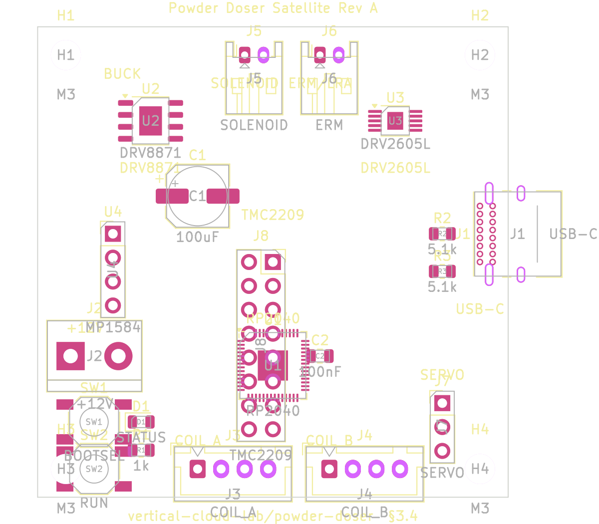
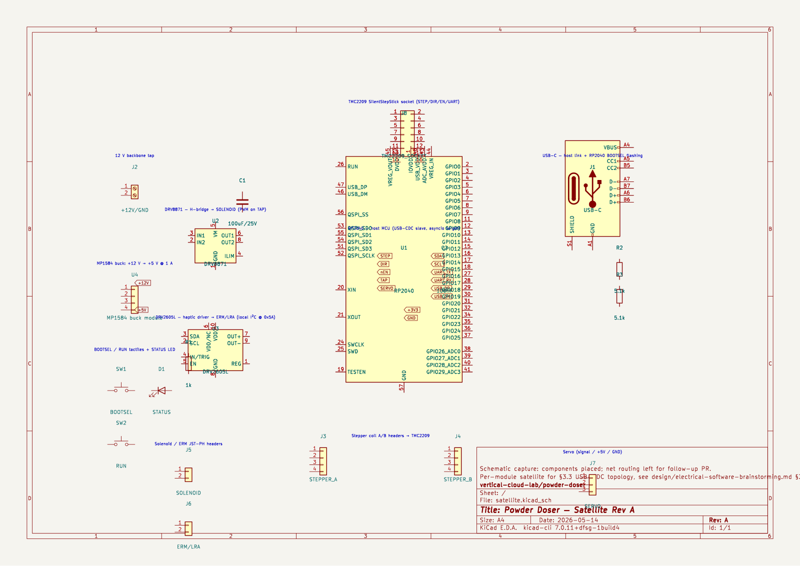

# Powder Doser — Satellite PCB Rev A (topology 3.3)

Per-module **USB-CDC satellite** board for the modular powder-doser
"design 2.2" architecture, implementing the §3.4 outline from
[`design/electrical-software-brainstorming.md`][bdoc]. Drives one
channel's auger stepper (via TMC2209), tap solenoid (via DRV8871),
vibration ERM/LRA (via DRV2605L), and angle servo, and exposes them
to the host Pi over USB-CDC serial. One board per channel.

This rev-A capture is the **schematic + placement outline** promised
in the brainstorming doc: every component from §3.4 is instantiated
in the schematic with the §3.4 net names, and every footprint is
placed inside the 50 × 50 mm board outline in the planned region.
**Net routing (copper traces) is intentionally left for a follow-up
PR** so the topology choice and connector inventory can be reviewed
first; once approved, routing the ~30 nets on a 2-layer board is a
straightforward bench job.

| File                              | What it is                                                    |
|-----------------------------------|---------------------------------------------------------------|
| `satellite.kicad_pro`             | KiCad 7 project file                                          |
| `satellite.kicad_sch`             | Schematic capture (RP2040 + drivers + connectors)             |
| `satellite.kicad_pcb`             | PCB board file (50×50 mm outline, footprints placed)          |
| `satellite_sch.svg` / `.png` / `.pdf` | Schematic renders for review in this PR                   |
| `satellite_pcb_top.svg` / `.png` / `.pdf` | PCB top-side render with title block                  |
| `satellite_pcb_top_only.svg` / `.png` | PCB top-side render, board only (cropped)                 |
| `generate.py`                     | Reproducible Python generator that emits the three KiCad files |

## Reviewing in a browser

The committed `.kicad_sch` and `.kicad_pcb` files can be viewed
without installing KiCad via [KiCanvas](https://kicanvas.org/) —
paste the GitHub blob URL of either file. For higher fidelity the
PNG/PDF/SVG renders alongside the source files are sufficient.

## Top-side preview



## Schematic preview



## Mapping back to §3.4

| §3.4 component                        | Reference | KiCad symbol                         | KiCad footprint                                         |
|---------------------------------------|-----------|--------------------------------------|---------------------------------------------------------|
| RP2040 host MCU                       | `U1`      | `MCU_RaspberryPi:RP2040`             | `Package_DFN_QFN:QFN-56-1EP_7x7mm_P0.4mm_EP3.2x3.2mm`   |
| DRV8871 H-bridge → solenoid           | `U2`      | `Driver_Motor:DRV8871DDA`            | `Package_SO:HSOP-8-1EP_3.9x4.9mm_P1.27mm_EP2.41x3.1mm`  |
| DRV2605L haptic driver → ERM/LRA      | `U3`      | `Driver_Haptic:DRV2605LDGS`          | `Package_SO:MSOP-10-1EP_3x3mm_P0.5mm_EP1.68x1.88mm`     |
| MP1584 buck (12 V → 5 V @ 1 A) module | `U4`      | `Connector_Generic:Conn_01x04`       | `Connector_PinHeader_2.54mm:PinHeader_1x04_P2.54mm_Vertical` |
| USB-C receptacle (host link + flash)  | `J1`      | `Connector:USB_C_Receptacle_USB2.0_14P` | `Connector_USB:USB_C_Receptacle_GCT_USB4085`         |
| 12 V backbone screw terminal          | `J2`      | `Connector:Screw_Terminal_01x02`     | `TerminalBlock:TerminalBlock_bornier-2_P5.08mm`         |
| Stepper coil-A header (2-pin pair)    | `J3`      | `Connector_Generic:Conn_01x04`       | `Connector_JST:JST_XH_B4B-XH-A_1x04_P2.50mm_Vertical`   |
| Stepper coil-B header (2-pin pair)    | `J4`      | `Connector_Generic:Conn_01x04`       | `Connector_JST:JST_XH_B4B-XH-A_1x04_P2.50mm_Vertical`   |
| Solenoid header (JST-PH 2-pin)        | `J5`      | `Connector_Generic:Conn_01x02`       | `Connector_JST:JST_PH_S2B-PH-K_1x02_P2.00mm_Horizontal` |
| ERM/LRA header (JST-PH 2-pin)         | `J6`      | `Connector_Generic:Conn_01x02`       | `Connector_JST:JST_PH_S2B-PH-K_1x02_P2.00mm_Horizontal` |
| Servo header (signal / +5 V / GND)    | `J7`      | `Connector_Generic:Conn_01x03`       | `Connector_PinHeader_2.54mm:PinHeader_1x03_P2.54mm_Vertical` |
| TMC2209 SilentStepStick socket (2×8)  | `J8`      | `Connector_Generic:Conn_02x08_Odd_Even` | `Connector_PinSocket_2.54mm:PinSocket_2x08_P2.54mm_Vertical` |
| BOOTSEL tactile (RP2040 flash)        | `SW1`     | `Switch:SW_Push`                     | `Button_Switch_SMD:SW_SPST_SKQG_WithoutStem`            |
| RUN tactile (RP2040 reset)            | `SW2`     | `Switch:SW_Push`                     | `Button_Switch_SMD:SW_SPST_SKQG_WithoutStem`            |
| Status LED (armed / running / fault)  | `D1`      | `Device:LED`                         | `LED_SMD:LED_0805_2012Metric`                           |
| LED current-limit resistor            | `R1`      | `Device:R`                           | `Resistor_SMD:R_0805_2012Metric`                        |
| USB-C CC1 / CC2 5.1 kΩ pulldowns      | `R2`,`R3` | `Device:R`                           | `Resistor_SMD:R_0805_2012Metric`                        |
| TMC2209 VM bulk cap (100 µF / 25 V)   | `C1`      | `Device:C`                           | `Capacitor_SMD:CP_Elec_6.3x7.7`                         |
| RP2040 decoupling cap (100 nF)        | `C2`      | `Device:C`                           | `Capacitor_SMD:C_0805_2012Metric`                       |
| M3 mounting hole (44 × 44 mm pattern) | `H1`–`H4` | —                                    | `MountingHole:MountingHole_3.2mm_M3`                    |

## Mapping back to §3.4 nets / RP2040 pins

The schematic `(global_label …)` entries placed near `U1` annotate
the §3.4 pin-assignment table verbatim:

| Net      | RP2040 pin | Goes to                                            |
|----------|------------|----------------------------------------------------|
| `STEP`   | GP2        | TMC2209 STEP (J8.5 on the SilentStepStick socket)  |
| `DIR`    | GP3        | TMC2209 DIR  (J8.6)                                |
| `nEN`    | GP4        | TMC2209 ~EN  (J8.4)                                |
| `TAP`    | GP5        | DRV8871 IN1 (IN2 tied to GND)                      |
| `SERVO`  | GP6        | J7 signal (50 Hz PWM, 1–2 ms pulse)                |
| `SDA`    | GP8        | DRV2605L SDA (with R\_pu = 4.7 kΩ to +3V3)         |
| `SCL`    | GP9        | DRV2605L SCL (with R\_pu = 4.7 kΩ to +3V3)         |
| `UART_TX`| GP12       | TMC2209 PDN\_UART (single-wire)                    |
| `UART_RX`| GP13       | spare                                              |
| `USB_DP` | USB\_DP    | J1 USB-C D+ pair                                   |
| `USB_DM` | USB\_DM    | J1 USB-C D- pair                                   |
| `+12V`   | —          | J2 (terminal), TMC2209 VM, DRV8871 VM, U4 VIN      |
| `+5V`    | —          | U4 VOUT, USB-C VBUS, J7 servo VCC                  |
| `+3V3`   | —          | RP2040 internal LDO, DRV2605L VDD                  |
| `GND`    | —          | every ground pin                                   |

## Why this PR doesn't include routed copper

Following the same doc-only-now-implementation-later precedent the
brainstorming doc set (and that `design/brainstorming.md` set in
PR #31), this PR commits the schematic capture and the placement
plan so the topology and connector inventory can be reviewed before
investing in routing. Once approved:

1. Open `satellite.kicad_pcb` in KiCad's pcbnew, run **Tools →
   Update PCB from Schematic** to pull in the netlist.
2. Run the autorouter or hand-route the ~30 nets on a 2-layer
   board (the placement was chosen so power flows west-to-east
   and signal traces stay short).
3. Re-export `satellite_pcb_top.{svg,png,pdf}` and add bottom-side
   renders.

## Reproducing the files

```bash
sudo apt-get install -y kicad kicad-symbols kicad-footprints librsvg2-bin
cd hardware/kicad/satellite-rev-a
python3 generate.py
# Re-export rendered artifacts:
kicad-cli sch export svg satellite.kicad_sch -o ./
mv -f satellite.svg satellite_sch.svg
rsvg-convert -w 1600 satellite_sch.svg -o satellite_sch.png
kicad-cli sch export pdf satellite.kicad_sch -o satellite_sch.pdf
kicad-cli pcb export svg --layers F.Cu,F.SilkS,F.Mask,F.Fab,Edge.Cuts \
    satellite.kicad_pcb -o satellite_pcb_top.svg
rsvg-convert -w 1600 satellite_pcb_top.svg -o satellite_pcb_top.png
kicad-cli pcb export pdf --layers F.Cu,F.SilkS,F.Mask,F.Fab,Edge.Cuts \
    satellite.kicad_pcb -o satellite_pcb_top.pdf
kicad-cli pcb export svg --layers F.Cu,F.SilkS,F.Mask,F.Fab,Edge.Cuts \
    --exclude-drawing-sheet --page-size-mode 2 \
    satellite.kicad_pcb -o satellite_pcb_top_only.svg
rsvg-convert -w 1200 satellite_pcb_top_only.svg -o satellite_pcb_top_only.png
```

`generate.py` is idempotent and emits stable s-expressions, so
re-running it produces a clean diff if any component value changes.

## Source-of-truth issue + brainstorm cross-references

- Concept and topology selection: [`design/electrical-software-brainstorming.md`][bdoc] §3.3 + §3.4
- Per-channel actuator block (DRV8871 + DRV2605L + stepper driver): issue #25
- Modular `N parallel channels` framing: issue #31
- Original problem statement: issue #44

[bdoc]: ../../../design/electrical-software-brainstorming.md
