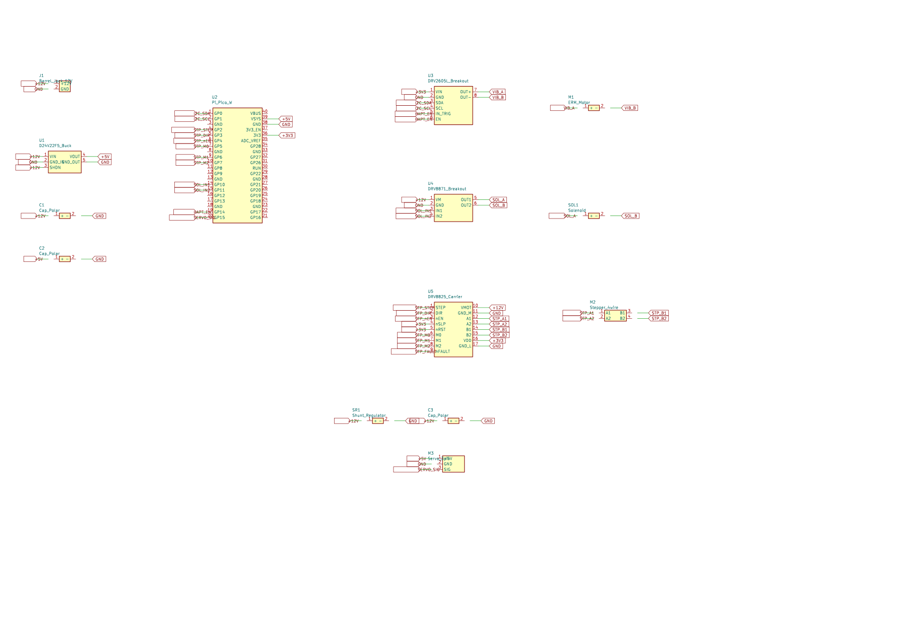

# Powder-doser test-module electronics

Single-microcontroller bench rig for **one** powder-doser module — enough
to characterise dispensing angle, tapping, vibrating, and auger rotation
in isolation before scaling to the 30-channel production target tracked
in [#1](https://github.com/vertical-cloud-lab/powder-doser/issues/1).

Resolves **[#50](https://github.com/vertical-cloud-lab/powder-doser/issues/50)**.
Parts are the same ones identified in
**[#25](https://github.com/vertical-cloud-lab/powder-doser/pull/25)** but
the host MCU is consolidated from a Raspberry Pi Zero 2 W (production)
to a single **Raspberry Pi Pico W (RP2040 + CYW43439)** so the whole bench
rig can be exercised over USB-serial (and, in a future revision,
wirelessly) without bringing up a Linux stack.

## Contents

```
hardware/test-module/
├── README.md                  (this file)
├── kicad/
│   ├── generate.py            # regenerates the .kicad_* files + renders
│   ├── test_module.kicad_pro
│   ├── test_module.kicad_sch
│   ├── test_module.kicad_sym  # project-local breakout symbols
│   ├── sym-lib-table
│   ├── test_module.svg
│   ├── test_module.pdf
│   └── test_module.png
└── firmware/
    ├── README.md
    ├── code.py                # CircuitPython main loop + driver classes
    └── config.py              # easily adjustable parameters
```

## Schematic



Open `kicad/test_module.kicad_pro` in KiCad 7.  The schematic is
authored as global-label-only connectivity — matching label names
(`+12V`, `GND`, `I2C_SDA`, `STP_STEP`, etc.) are electrically connected
across the sheet.  No wires are routed, which keeps the layout
trivially regeneratable from `generate.py`.

## Bill of materials (subset of PR #25)

Only the parts needed to drive one channel from a single Pico are
listed here.  The Pi Zero 2 W, Perma-Proto Bonnet, baseplate-tilt
linear actuator, and second DRV8871 from the full BOM are intentionally
omitted — the Pico replaces the Pi and stands in for the bonnet by
hosting all the wiring on a half-size breadboard.

| Ref | Part | PR #25 item | Qty | Notes |
|---|---|---|---|---|
| U2  | Raspberry Pi Pico W (RP2040 + CYW43439, 2 × 20 castellated header) | — *(new for bench rig)* | 1 | Pico WH (pre-soldered) or plain Pico also work — only GP0..GP15 are used, which are pinned identically across the family. |
| U1  | Pololu D24V22F5 5 V / 2.5 A buck regulator | 15 | 1 | 12 V → 5 V for the Pico W + servo + solenoid. |
| U3  | Adafruit DRV2605L haptic driver breakout (#2305) | 1 | 1 | I²C, drives the ERM. |
| M1  | 10 mm ERM coin motor (Adafruit #1201) | 2 | 1 | Or any LRA on `VIBRATION_LIBRARY = 6`. |
| U4  | Adafruit DRV8871 motor driver breakout (#3190) | 5 | 1 | Drives the solenoid. |
| SOL1| JF-0530B 5 V push-pull solenoid (Adafruit #412) | 4 | 1 | The tap actuator. |
| U5  | Pololu DRV8825 stepper driver carrier (#2133) | 11-alt | 1 | DRV8825 over Tic T500 for bench — the Pico W can generate STEP/DIR directly. |
| SR1 | Pololu #3776 33 V / 9 W shunt regulator | 18 | 1 | Across `+12V` / `GND` next to U5's `VMOT` to clamp stepper back-EMF — see notes below. |
| M2  | NEMA-11 11HS18-0674S bipolar stepper | 10 | 1 | Direct-coupled to the auger. |
| M3  | HD-1810MG metal-gear digital servo (#1142) | 16 | 1 | Dispensing-angle / wiper axis. |
| J1  | Mean Well GST60A12-P1J 12 V / 5 A barrel-jack PSU | 13 + 13a/13b | 1 | System power. |
| C1  | 100 µF / 25 V electrolytic, 12 V bulk | 14 | 1 | Required by Pololu on DRV8825 V_MOT. |
| C2  | 100 µF / 10 V electrolytic, 5 V bulk | 9 | 1 | Tames the servo + solenoid transients on the 5 V rail. |
| C3  | 100 µF / 25 V electrolytic, second bulk | 14 | 1 | Sits directly on the DRV8825's V_MOT screw terminals. |
| —   | Half-size breadboard, jumper wires, 0.1" headers | 9 | — | Bench wiring substrate (replaces item 6 bonnet for tests). |

### Why the shunt regulator (SR1) is on the bench rig

PR #25 calls out the Pololu #3776 33 V / 9 W shunt regulator as item 18
for the production multi-channel system.  The single-channel bench rig
keeps it for three reasons:

1. **Back-EMF clamping.**  When the auger decelerates or is back-driven
   (e.g. clogged powder pushes the stepper backwards), the motor pumps
   energy back into the `VMOT` rail.  With only the 100 µF bulk cap
   (C3) and a wall-wart that can't sink current, the rail voltage can
   transient well above 12 V — the DRV8825's absolute max is 45 V, so a
   single mistimed stop can kill the driver.  The shunt regulator
   begins conducting at ~33 V and dumps the excess into its on-board
   power resistor, holding the rail safely below the DRV8825's limit.
2. **Identical-to-production wiring.**  Keeping SR1 on the bench means
   step-rate / acceleration profiles found here transfer directly to
   the 30-channel system without re-tuning for a different transient
   envelope.
3. **Cheap insurance.**  At ~$7 it costs less than one DRV8825
   replacement.

It mounts as a single 2-pin part across `+12V` / `GND`, electrically
in parallel with C3, as close to U5's `VMOT` screw terminals as the
breadboard allows.  See SR1 in the schematic.

Total ≈ **$45 + $19 (PSU) + $13 (stepper) + ~$10 (breadboard / jumpers)**
on top of whatever Pico W is on the bench.

## Pin / net table

These nets are the contract between
[`kicad/generate.py`](kicad/generate.py) and
[`firmware/config.py`](firmware/config.py); the firmware constants
`PIN_*` mirror the right-hand column.

| Net | DRV / actuator pin | Pico W pin | Notes |
|---|---|---|---|
| `+12V`       | J1.+ , U1.VIN , U4.VM , U5.VMOT , SR1.+ , C1.+ , C3.+ | —     | 12 V from the wall brick; SR1 shunt regulator clamps back-EMF. |
| `+5V`        | U1.VOUT , U2.VSYS , M3.+5V , C2.+              | —     | Buck output; powers Pico W + servo. |
| `+3V3`       | U2.3V3 , U3.VIN , U5.VDD , U5.nSLP , U5.nRST   | —     | Pico W on-board LDO; logic + DRV2605L. |
| `GND`        | (all, incl. SR1.-) | —     | Common ground (DRV8825 VMOT and VDD grounds tied at the carrier). |
| `I2C_SDA`    | U3.SDA            | GP0   | I2C0 SDA to DRV2605L. |
| `I2C_SCL`    | U3.SCL            | GP1   | I2C0 SCL to DRV2605L. |
| `STP_STEP`   | U5.STEP           | GP2   | DRV8825 step pulse. |
| `STP_DIR`    | U5.DIR            | GP3   | DRV8825 direction. |
| `STP_nEN`    | U5.nEN            | GP4   | Active-low enable; high to disable. |
| `STP_M0`     | U5.M0             | GP5   | DRV8825 microstep select. |
| `STP_M1`     | U5.M1             | GP6   | "                            " |
| `STP_M2`     | U5.M2             | GP7   | "                            " |
| `SOL_IN1`    | U4.IN1            | GP10  | DRV8871 IN1 — PWM, drives the solenoid forward. |
| `SOL_IN2`    | U4.IN2            | GP11  | DRV8871 IN2 — held low. |
| `HAPT_EN`    | U3.EN , U3.IN_TRIG| GP14  | Hard-mute / wake for DRV2605L. |
| `SERVO_SIG`  | M3.SIG            | GP15  | 50 Hz PWM to the hobby servo. |
| `STP_A1/A2`  | U5.A1/A2 ↔ M2.A1/A2 | —   | Stepper coil A. |
| `STP_B1/B2`  | U5.B1/B2 ↔ M2.B1/B2 | —   | Stepper coil B. |
| `VIB_A/B`    | U3.OUT± ↔ M1.±    | —     | ERM coin motor leads. |
| `SOL_A/B`    | U4.OUT1/OUT2 ↔ SOL1.± | — | Solenoid coil. |
| `STP_FAULT`  | U5.nFAULT         | (n/c) | Optional — wire to a free GPIO if you want fault detection. |

## Assembly / wiring instructions

Build order, top to bottom:

1. **Adjust the DRV8825 current-limit pot** (U5) *before* installing it.
   With the carrier on a bench supply at the same 12 V you'll use later,
   measure `V_REF` between the pot wiper and `GND` while the motor is
   disconnected and turn the pot until `V_REF ≈ I_motor × 2 × R_sense`.
   For the 11HS18-0674S (0.67 A/phase) on the Pololu #2133 (R_sense =
   0.1 Ω): `V_REF ≈ 0.13 V`.  Skipping this step *will* cook the motor
   the first time you press `d`.

2. **Power rails**. Plug the Mean Well 12 V brick (item 13) into the
   barrel-jack pigtail (item 13b) and land the two leads on the
   breadboard rails labelled `+12V` and `GND`.  Add C1 (100 µF/25 V)
   across them.  Wire `+12V → U1.VIN` and `GND → U1.GND_IN` on the
   D24V22F5 buck.  The buck's `VOUT` feeds the second pair of
   breadboard rails labelled `+5V` (and `GND`).  Add C2 (100 µF/10 V)
   across the `+5V` rail.

3. **MCU power.** Run `+5V → Pico W VSYS (pin 39)` and `GND → Pico W GND
   (any of pins 3/8/13/18/23/28/33/38)`.  Leave `VBUS` open.  Tap the
   Pico W's `3V3` (pin 36) for a `+3V3` rail.

4. **I²C (DRV2605L).** Wire:
   * `Pico W GP0 (pin 1) → U3 SDA`
   * `Pico W GP1 (pin 2) → U3 SCL`
   * `U3 VIN → +3V3`, `U3 GND → GND`
   * `Pico W GP14 (pin 19) → U3 EN` *(short to `U3 IN_TRIG` if you ever
     drive the breakout in external-trigger mode)*
   * `U3 OUT+ → ERM red lead`, `U3 OUT- → ERM black lead`.

5. **Solenoid (DRV8871).** Wire:
   * `U4 VM → +12V`, `U4 GND → GND`
   * `Pico W GP10 (pin 14) → U4 IN1`
   * `Pico W GP11 (pin 15) → U4 IN2`
   * `U4 OUT1 → solenoid +`, `U4 OUT2 → solenoid -`.

6. **Stepper (DRV8825 + shunt regulator).** Wire:
   * `U5 VMOT → +12V`, `U5 GND_M → GND` (motor-side ground).
     Add C3 (100 µF/25 V) directly across these two terminals; Pololu
     specifically calls this out and the bench rig will brown out the
     +12V rail without it.
   * **Mount SR1 (Pololu #3776 shunt regulator) in parallel with C3**,
     `+` to `+12V` and `-` to `GND`, as close to `VMOT` as possible.
     Its on-board power resistor handles the back-EMF clamp described
     in the BOM section.
   * `U5 VDD → +3V3`, `U5 GND_L → GND` (logic-side ground).
   * Tie both `U5 nSLP` and `U5 nRST` to `+3V3` (they ship pulled low
     on the carrier; without this the driver stays asleep).
   * `Pico W GP2 → STEP`, `GP3 → DIR`, `GP4 → nEN`, `GP5 → M0`,
     `GP6 → M1`, `GP7 → M2`.
   * `U5 A1/A2 → stepper coil A`, `U5 B1/B2 → stepper coil B`.
     For the 11HS18-0674S: black/green = coil A, red/blue = coil B
     (verify with a multimeter — adjacent leads with low resistance
     belong to the same coil).

7. **Dispense-angle servo.**
   * `M3 +5V → +5V`, `M3 GND → GND`
   * `Pico W GP15 (pin 20) → M3 SIG`.
     The firmware ramps every angle command at
     `SERVO_SPEED_DEG_PER_S` deg/s so the servo never slams to the new
     setpoint.

8. **Sanity check before powering.** With the brick **unplugged**:
   * Confirm no continuity between `+12V` and `GND`, or between `+5V`
     and `GND`.
   * Confirm the DRV8825 current-limit pot is at the value you set in
     step 1.
   * Confirm `nSLP` and `nRST` on U5 are tied high.
   * Confirm SR1's `+` is on `+12V` and `-` is on `GND` (it is a
     polarised part and reversing it kills the regulator instantly).

9. **First power-on.** Plug the Pico W into USB *first* (so the firmware
   starts with the rails de-energised), then plug in the 12 V brick.
   Open the USB-serial port — you should see the rig print its state
   and a `[rig] ready` line.  Run `s` to dump the configuration, then
   exercise one channel at a time:
   * `a 0` then `a 180` — servo sweeps end-to-end.
   * `t` — solenoid clicks `TAP_COUNT` times.
   * `v` — ERM buzzes for `VIBRATION_DURATION_S` seconds.
   * `r 90` — auger rotates 90 °.

## Reproducing the schematic files

The KiCad project + symbol library are emitted by
[`kicad/generate.py`](kicad/generate.py).  Re-run it after editing the
script (or after changing `PLACEMENTS` to add / move a component):

```sh
sudo apt-get install -y kicad kicad-symbols librsvg2-bin   # one-time
cd hardware/test-module/kicad
python3 generate.py                                        # rewrites files
```

The script will:

1. Regenerate `test_module.kicad_sym`, `test_module.kicad_sch`,
   `test_module.kicad_pro`, and `sym-lib-table`.
2. Call `kicad-cli sch export svg ...` and `... pdf ...` to refresh
   the rendered previews.
3. Rasterise the SVG to `test_module.png` via `rsvg-convert` if it's
   on `PATH`.

The headless export is the same path KiCad-CI uses, so the artefacts
match what you would get from opening the project in KiCad GUI and
hitting *File → Export → Schematic*.

## Why a Pico W instead of the Pi Zero 2 W from PR #25?

The production system in #25 needs Linux for I²C device trees, USB
control of the Tic T500, networking, and the eventual 30-channel
multiplexer.  The bench rig has none of those requirements — it just
needs to wiggle four GPIO pins reliably with adjustable timing.
Folding the controller into a $6 microcontroller:

* eliminates the Pi Zero 2 W + microSD + USB power brick + bonnet
  (≈ $38 of system-shared cost in #25);
* drops the boot-time-pull-up gotcha on the stepper `~ENABLE` line
  that #25 calls out (the Pico W's GPIOs are in input mode at reset,
  so the DRV8825's on-board pull-down keeps it disabled until the
  firmware drives `STP_nEN`);
* keeps the test loop "edit `config.py`, save, see new behaviour"
  thanks to CircuitPython's auto-reload — much faster iteration than
  redeploying a `systemd` service on the Pi;
* leaves the CYW43439 radio available for a future "trigger a dispense
  from the lab laptop over Wi-Fi" mode without a hardware change.

When the system grows past one channel the wiring is identical — just
move the same four nets onto the production Pi Zero 2 W + Perma-Proto
Bonnet from #25 and re-use the same DRV2605L / DRV8871 / DRV8825 /
shunt regulator / servo parts.
