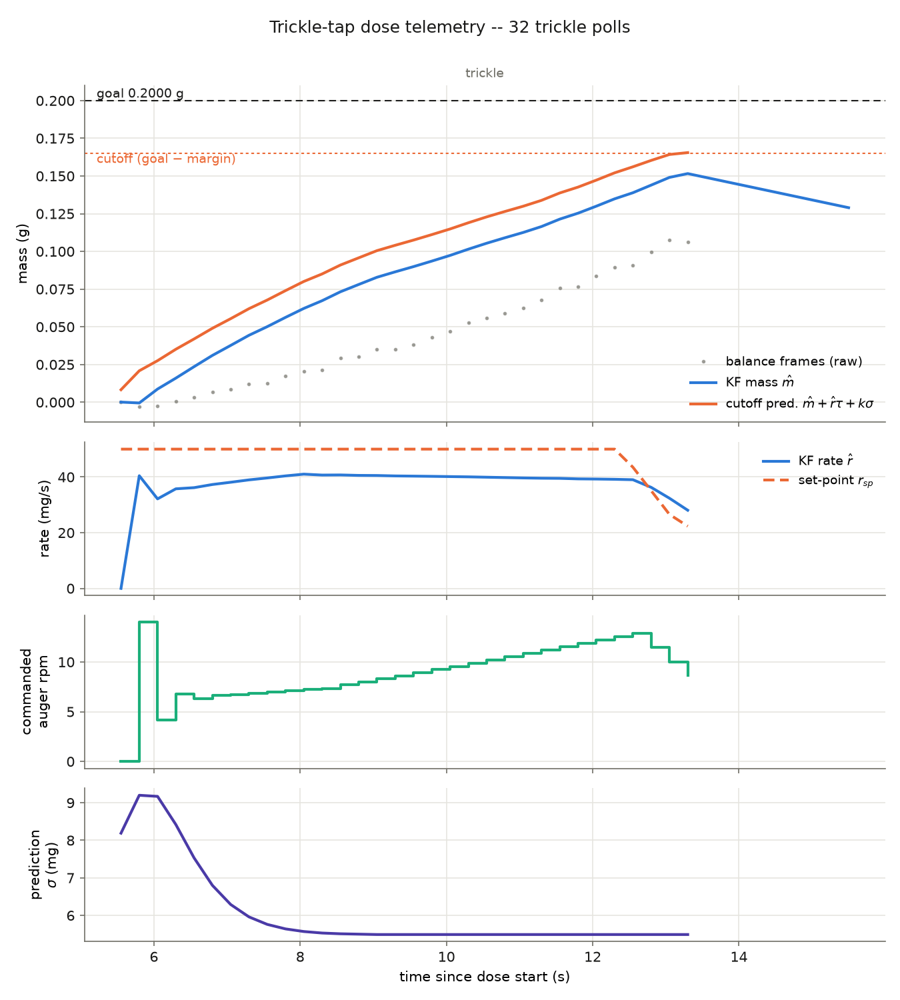

# Manual trickle-tap runner (KF + rate-PI on the Pico)

Run the PR #124 twin's **trickle-tap controller** — the 3-state Kalman
filter, the rate-PI loop, the predictive cutoff `m̂ + r̂τ + kσ ≥ goal − margin`,
and the tap endgame — **on the real rig**, interactively, and watch it work.
Until now this controller only existed in simulation
([`optimization/benchmarks/bangbang.py`](../../../../optimization/benchmarks),
re-derived in [`optimization/trim/trim_methods.py`](../../../../optimization/trim));
every real dose so far used `main_three_phase.py`'s fixed increments.  This
folder is the §4 port from [`docs/trim-bench-plan.md`](../../../../docs/trim-bench-plan.md),
packaged so one person with the rig can run doses by hand.

**This folder is self-contained** — every file the Pico needs is here, because
the firmware set was previously scattered across three branches:

| file | role | source of truth |
|---|---|---|
| `main_trickle.py` | **run this** — rig bring-up + REPL | new (PR #154) |
| `trickle_params.py` | **edit this** — every knob, goal mass and tilt first | new (PR #154) |
| `trickle_controller.py` | the ported dose controller + telemetry | new (PR #154) |
| `trickle_kf.py` | the Kalman filter, pure Python (no numpy on a Pico) | new (PR #154) |
| `main_three_phase.py` | drivers (stepper/tap/servo/scale) + read machinery, reused by subclassing | byte-identical copy of `claude/issue-116-blockh-recovered` @ `81bbe75` |
| `scale.py`, `balance_filter.py` | A&D protocol + bracketed-read / shock-rejection layer | same |
| `config.py`, `tic.py` | pins, serial formats, Tic T500 protocol | byte-identical copy of the PR #100 branch (`copilot/integrate-scale-feedback-loop`) |
| `test_scale_contact.py` | first thing to run if the scale won't answer | same |
| `plot_trickle.py` | laptop-side: telemetry CSV → inspection figure | new (PR #154) |
| `sim/test_trickle_tap.py` | CPython tests, no hardware needed | new (PR #154) |
| `example_run.csv/.png` | a simulated dose + its figure, so you know what to expect | new (PR #154) |

> **If your Pico already carries a locally tuned `config.py`** (baud, pins,
> servo range), keep yours: upload everything *except* `config.py`.  The copy
> here is the repo's canonical rig config, including the 19200 8N1
> AutoTrickler balance preset confirmed 2026-07-07.

## Quick start

1. Open **this folder** in VS Code with the
   [MicroPico](https://marketplace.visualstudio.com/items?itemName=paulober.pico-w-go)
   extension, connect the Pico W over USB, and **"Upload project to Pico"**.
   (Uploading is additive — it does not delete the battery firmware already
   on the Pico, and the copied files here are byte-identical to what those
   runs used.)
2. Open `main_trickle.py` → **"Run current file on Pico"**.
3. In the Pico terminal:

```
g              # dose GOAL_MASS_G (default 0.200 g) with trickle-tap
g 0.5          # dose 0.5 g
set tilt 15    # trickle at 15 plate degrees from now on
set goal 0.1   # bare g now doses 0.1 g
s              # show every parameter and the rig state
log            # print the last dose's telemetry CSV
!              # EMERGENCY STOP (de-energise everything)
```

To make it the power-on program, additionally upload `main_trickle.py`
renamed as `main.py`.  Keep a hand near `!` (or the power switch) for the
first doses — this controller has **never run on hardware** (bench-plan §4
asks for five supervised smoke doses before any campaign use).

## Changing parameters

Three ways, most to least persistent:

- **Edit `trickle_params.py`** (goal mass and trickle tilt are the first two
  values), save, right-click → "Upload file to Pico", then Ctrl+D (soft
  reset) and re-run.  Survives power cycles.
- **`set <key> <value>`** at the REPL — every lowercase form of a
  `trickle_params` name works (`set trickle_tilt_deg 15`,
  `set cutoff_margin_g 0.025`, `set bulk_enabled 0`…).  Shorthands:
  `goal`, `tilt`, `tol`.  Lost on reset.
- **`g <grams>`** overrides the goal for one dose.

Parameters worth knowing on day one: `trickle_tilt_deg` (the tilt ask),
`goal_mass_g`, `bulk_enabled` (set 0 to watch a pure trickle from rest),
`cutoff_margin_g` / `k_sigma` (how early the trickle halts),
`tau_bal_s` (the balance-lag belief — the study's most sensitive number;
bench-plan test A1 measures it), and `trickle_kp` / `trickle_ki`.

## What a dose looks like

Stages (each skipped automatically if already inside its threshold):

1. **bulk** — velocity mode at `BULK_RPM` until
   `TRICKLE_START_REMAINING_G` (+ anticipation) remain.  Targets below
   ~0.35 g skip straight to the trickle.
2. **trickle** — the PI loop, printing one line per poll (~4 Hz): KF mass,
   rate vs set-point, commanded rpm, the cutoff prediction, sigma.
3. **tap** — single solenoid taps with settled bracketed reads, auger
   nudges when the lip runs dry, until within `TOLERANCE_G`.

Expect the trickle to hand over **35–65 mg short by design** (the fixed
35 mg margin plus the k·σ term) and the taps to close the rest; that is the
deployed twin's behaviour, priced in the trim study.

## Inspecting a run

Every dose buffers one telemetry row per trickle poll (plus the bulk/tap
mass staircase) and writes `/trickle_log_NNN.csv` on the Pico.  Get it to
your laptop either by downloading the file with MicroPico, or by typing
`log` and pasting the terminal output into a file.  Then:

```
python3 plot_trickle.py trickle_log_000.csv                 # full dose
python3 plot_trickle.py trickle_log_000.csv --trickle-only  # zoom the PI
```

(needs `pip install matplotlib`).  The figure below is the included
**simulated** `example_run.csv` — a 0.2 g dose against the virtual plant,
zoomed to the trickle: PI ramp-up, the rate holding its set-point, the taper,
and the cutoff prediction reaching the halt line.



Columns: `t_s, phase, z_g` (raw balance), `fresh`, `m_g, r_gps, sigma_g`
(KF state), `ff_gpr` (learned feed factor), `r_sp_gps, err_gps, integ,
rpm_cmd` (the PI), `pred_g, cutoff_g` (the halt rule), `clamp_hits`
(how often the r ≥ 0 projection fired — nonzero means the σ margin was
miscalibrated in that stretch, a number the study asks to watch).

## Testing without the rig

```
python3 sim/test_trickle_tap.py
```

Nine CPython checks: the pure-Python KF against the trim study's numpy
filter on a shared 400-step trace (agreement to ~1e-15; skipped without
numpy), two closed-loop doses on a virtual plant, the within-tolerance
no-actuation interlock, stall → tap handover, telemetry shape, a
balance-lag-mismatch smoke test, and live parameter changes.

## Faithfulness notes (what differs from the twin, and why)

- **KF seed covariance.** The twin seeds `P = diag(0.05)`; from a settled
  bracketed read that makes the cutoff's k·σ term ≈ 0.22 g on the first
  polls — bigger than the whole trim headroom — so a from-rest trickle
  would halt on poll 1 having dispensed nothing.  (The twin never sees
  this because its trim always starts exactly 0.30 g out.)  The port seeds
  P from the bracket's measured sigma (≥ 1 mg floor); analysis in
  `TrickleKF.seed`'s docstring.
- **Measured dt.** The loop period on hardware is the commanded sleep plus
  serial latency, so the KF model is rebuilt from the measured interval
  each poll instead of assuming a fixed dt.  With a constant dt it is
  bit-identical to the twin (that is what the cross-check test drives).
- **Fixed margin.** The twin's ff-adaptive margin term is dropped, matching
  the trim study (the Edison review confirmed it fires in 0 of 360 doses).
- **Tap budgets** follow the twin's `tap_finish` (20 nudges / 120 cycles),
  not the three-phase phase-3 defaults (10 / 150), because the trickle
  hands over deeper than the three-phase fine→tap threshold.

## Safety / etiquette

- The rig may be mid-campaign (battery runs launch detached and go for
  hours).  **Check nothing is running before taking the bench.**
- First doses: salt, small targets (50–200 mg), hand near `!`.
- The tare is verified, not trusted (a refused tare becomes a subtracted
  baseline, loudly) — but still start with an empty cup; the balance has
  also not been calibrated since the fume-hood move (bench-plan §1).
- If the scale answers nothing: run `test_scale_contact.py` first — it
  scans both known serial presets and prints a verdict.
