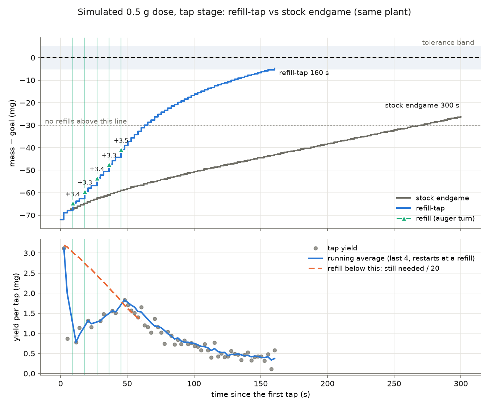

# Refill-tap endgame (`main_trickle_refill.py`)

> **On PR #166 since 2026-10-09:** this runner ships in the same
> `/trickle_tap` build as `main_trickle.py` and is an opt-in
> production endgame: `scripts/dose.py --endgame refill` (and
> `opt_dose_capture.py --endgame refill --mode production`) boot it,
> push every refill knob, and record the RESULT's `refill` section
> ([campaign-setup §5.9](../../../../docs/optimization/campaign-setup.md#59-production-doses-with-the-refill-tap-endgame)).
> Campaign doses never run it.  Its `s` listing now starts with
> "trickle parameters", the line the executor waits for.

An alternate form of `main_trickle.py` whose tap stage keeps a running
average of the yield of each tap. When that yield is far below what is
still needed to reach the tolerance band, it turns the auger a set amount
between taps to refill the tip, and keeps doing so until the taps yield
enough again. Bulk, the KF + rate-PI trickle, the REPL, telemetry and
`trickle_params.py` are all unchanged: `main_trickle` is imported, not
copied.

## Why: what the rig logs say about the stock endgame

These numbers come from the 63 logged doses in PR #166's `data/opt/` (salt
campaign and validation, AlSi10Mg, Al 4047): 52 doses reached the tap stage,
2695 taps in all.

- The tap stage is most of the dose: a median 76 % of dose time and 90 s,
  with a p90 of 359 s. The median dose needed 29 taps, 20 doses took 60 or
  more, and 4 hit the 120-cycle budget 17-320 mg short.
- Tap yield decays as the tip drains. Mean yield by taps since the auger
  last moved:

  | taps since the auger moved | 1 | 2 | 3 | 4-5 | 6-10 | 11-20 | 21-40 | 41+ |
  |---|---:|---:|---:|---:|---:|---:|---:|---:|
  | mean yield (mg) | 2.76 | 2.15 | 1.65 | 1.47 | 1.18 | 0.92 | 0.63 | 0.49 |

- The stock refill rule hardly ever fires. It nudges the auger 5° only
  after 3 taps in a row under 0.2 mg, and only 12 % of taps fall under that
  line. Over the 2695 taps it fired 26 times. When it did fire, it barely
  refilled anything: the 3 taps after a nudge averaged 0.39 mg, against
  -0.19 mg for the 3 taps before it.

So a typical slow dose sits at 50 mg to go while tapping 0.5 mg at a time.
That rate never looks like a stall, but it means 100 more taps.

## The rule

After every tap (`refill_tap.py`, knobs in `refill_params.py`):

```
avg  = mean yield of the last REFILL_AVG_TAPS taps since the last refill
need = goal - TOLERANCE_G - mass               # still to go to reach the band
if avg * REFILL_TAPS_TO_GO < need:             # "far below": > N taps to go
    turn the auger REFILL_DEG (at REFILL_RPM), settle REFILL_SETTLE_MS,
    read (what the refill itself delivered is measured), restart the average
```

The average restarts after each refill, so it describes the tip as it is
now. With `REFILL_MIN_TAPS = 2`, the next decision waits for 2 taps of
evidence. That means the auger turns between taps until the taps yield
enough, then stops turning. A refill is held back when:

| guard | knob | why |
|---|---|---|
| fewer than N taps since the last refill | `REFILL_MIN_TAPS` (2) | one empty tap is not evidence; never two refills back to back |
| less than this still needed to reach the band | `REFILL_MIN_TO_GO_G` (25 mg) | a rotation can drop a slug, so the last stretch is the stock endgame (single taps, 5° dry-lip nudges), unchanged |
| room to the band's upper edge is no more than the largest refill delivery seen this dose | automatic | if the worst refill so far happened again, it would overshoot |
| budget spent | `REFILL_MAX` (20) | bounds the auger travel |

On #166's build the overshoot guard (`OVERSHOOT_ABORT_G`) also checks
every refill. Every stock budget (`TAP_MAX_CYCLES`, `TAP_MAX_NUDGES`, the
dose timeout) still applies. Set `refill_enabled 0` (or `refill_deg 0`) to get the
stock endgame step for step. The sim test checks this equivalence, so an
A/B comparison is one `set` away on the same build.

## Running it

1. **Upload `refill_params.py`, `refill_tap.py` and
   `main_trickle_refill.py`** into the Pico's `/trickle_tap` folder, next to
   the build already there (on PR #166 they are part of the build's upload
   list, [README](README.md)).
2. Open `main_trickle_refill.py` and choose "Run current file on Pico".
3. At the REPL:

   | command | does |
   |---|---|
   | `g` / `g 0.5` | dose with the refill-tap endgame |
   | `set refill_deg 15` | change any `refill_*` knob live (`s` lists them) |
   | `set refill_enabled 0` | the stock endgame on the same build (A/B) |
   | `refills` | last dose: every tap yield, every refill and what it delivered |
   | `log` | telemetry CSV; refills are rows with phase `refill` |
   | `!` | emergency stop |

   Each tap prints the decision (these lines are from a sim run; the rig
   prints the same ones):

   ```
   [phase 3 tap] cycle 3: mass 0.4548 / 0.5000 g (0.0452 g to go, +0.0004 g this cycle), elapsed 11.6 s
   [phase 3 tap]   yield avg 0.43 mg over 1 tap(s); 40.2 mg needed -> gathering taps
   [phase 3 tap] cycle 4: mass 0.4554 / 0.5000 g (0.0446 g to go, +0.0006 g this cycle), elapsed 14.1 s
   [phase 3 tap]   yield avg 0.50 mg over 2 tap(s); 39.6 mg needed -> REFILL
   [phase 3 tap] refill 2/20: tap yield 0.50 mg is far below the 39.6 mg needed; auger 10.0 deg @ 20 rpm
   [phase 3 tap] refill 2: mass 0.4593 / 0.5000 g (0.0407 g to go, +0.0039 g from the refill), elapsed 18.2 s
   ```

   The reason a refill is held back is printed as well: `yield ok`,
   `gathering taps`, `too close`, `worst refill ... would overshoot`, or
   `budget spent`.

4. To plot a dose, save the `log` output (or download `/trickle_log_NNN.csv`)
   and run:

   ```
   python3 plot_refill_tap.py refill.csv --goal 0.5 [--compare stock.csv]
   ```

   The plot has two panels. The first shows distance to the goal, with the
   refills marked and the mass each one delivered. The second shows each
   tap's yield against the running average and against the refill trigger
   (still needed / `REFILL_TAPS_TO_GO`). If you changed a knob with `set`,
   pass the value you ran with (`--taps-to-go`, `--avg-taps`,
   `--min-to-go`, `--tol`).

The RESULT line (on #166's build) gets a `refill` section (count, auger
degrees, mass delivered by the refills, per-refill events, the knobs as
executed), and its `fw` is tagged `+refill-tap/2026-10-06`. #166's dose
executor boots this runner only for `--endgame refill`, which it accepts
only for production doses; a campaign dose that finds it running swaps
`main_trickle.py` back in. So doses from this runner can't silently end
up in a campaign.

## Suggested first session (salt, 0.5 g)

1. **Supervised smoke doses**, 3 or more at the defaults, with a hand near
   `!`. After each, run `refills` and look at what each refill delivered.
   The refill response on this rig has never been measured. Block H's 45°
   steps at 22.5° tilt delivered 6-76 mg, and 10° at the tap tilt should be
   far less, but that is not known.
2. **Tune from what `refills` shows:**
   - If refills deliver under about 5 mg each and the taps after them
     yield more, lower `refill_min_to_go_g` to 0.015. This floor is where
     the remaining time goes (see the figure below).
   - If the taps after a refill don't improve, raise `refill_deg` to 15-20.
   - If a refill drops more than about 15 mg, raise `refill_min_to_go_g`
     or lower `refill_deg`.
3. **A/B blocks**: alternate `set refill_enabled 1` and `0` in ABBA order
   at the same goal, tilt and hopper fill, 8 or more doses per arm. Compare
   the tap-stage time (`t_tap_s` in RESULT) and the final error.

## Simulated example (not a prediction)

`sim/make_refill_example.py` runs the same 0.5 g dose twice on one
`TipPlant` from `sim/test_refill_tap.py`. That plant's tap yield decays like
the rig logs, but its refill response is an assumption: each 10° turn
delivers about 3.4 mg directly and recharges the tip. The figure shows the
mechanics of the rule, not rig performance:



The five refills (aqua) take the dose from 72 mg short to 30 mg short in
about 60 s. Above the dotted line no refills are allowed, and the stock
taper covers the last 25 mg in about 100 s. That is why `refill_min_to_go_g` is the knob to tune once the
real refill deliveries are known. The stock endgame on the same plant runs
out its 120-cycle budget 26 mg short.

Tests: `python3 sim/test_refill_tap.py` runs 10 tests. They cover:
step-for-step equivalence when disabled, the floor, the evidence gap
between refills, the budget, the worst-refill guard on a plant that drops
a 30 mg slug on every turn, full-dose wiring, RESULT tagging, telemetry
rows, REPL routing, and a 30-start seeded A/B. They pass against this
branch's controller and PR #166's.
