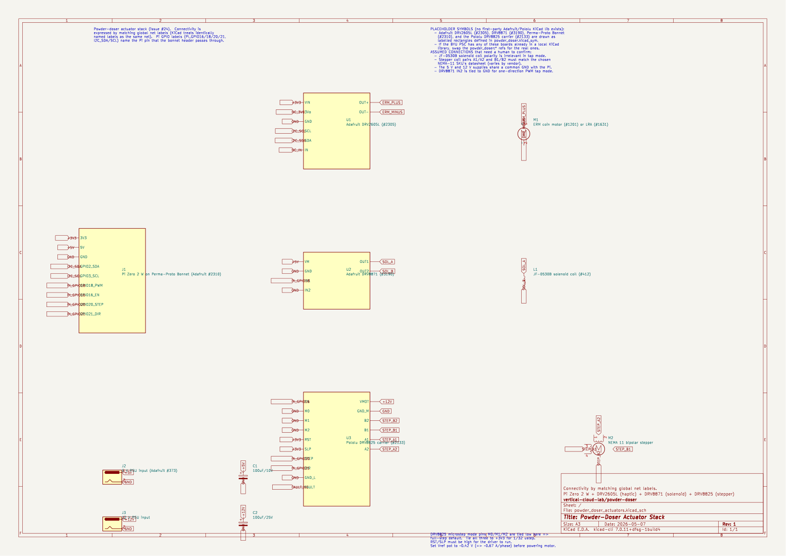

# Auger drive, vibration motor, and solenoid — parts identification

Resolves [#24](https://github.com/vertical-cloud-lab/powder-doser/issues/24).
Companion to the Archimedes auger CAD proposed in PR
[#16](https://github.com/vertical-cloud-lab/powder-doser/pull/16) (housing
≈ 20 mm OD × 100 mm tall). Once PR #16 lands, the auger CAD will live at
[`cad/auger/`](https://github.com/vertical-cloud-lab/powder-doser/tree/main/cad/auger).

## Goals (from #24)

* Small enough to mount on / next to the 20 mm OD auger housing.
* A **drive motor** to **rotate the auger** itself (this is what
  actually meters the powder); preferably **direct-coupled to the
  auger shaft**, with belt drive as a fallback.
* A **vibration motor** to free bridged powder, mounted on the
  **stationary auger housing or hopper wall** (not on the rotating
  auger itself — wires can't follow a rotating shaft without a
  slip ring, which we want to avoid). Ideally with **variable
  frequency and amplitude**.
* A **solenoid** mounted **externally** (e.g. as a tap that strikes the
  housing) to dislodge stuck powder.
* All driven from a **Raspberry Pi Zero 2 W** (3.3 V GPIO, limited drive
  current), so a small **driver / breakout board** is needed for each
  actuator.

## Rotating vs stationary parts (no slip ring needed)

To make the wire-routing constraints explicit:

* **Stationary** (mounted to the frame / housing): the Pi Zero 2 W,
  the Perma-Proto Bonnet, all three driver breakouts (DRV2605L,
  DRV8871, DRV8825), the power supply / supplies, the vibration
  motor (epoxied to the housing or hopper wall), the solenoid (on
  a printed bracket beside the housing), and the **stepper motor
  body** (bolted to a bracket co-axial with the auger).
* **Rotating**: only the **auger shaft itself**. The shaft is
  driven by the stepper through a **flexible shaft coupler**
  (item 12) which sits *outside* the powder-side housing.
* **Wires never cross a rotating boundary.** All four motor leads
  on the stepper, the two leads on the vibration motor, and the
  two leads on the solenoid land on stationary boards, so no slip
  ring is needed. The flex coupler is the only mechanical link
  between the rotating and stationary domains.

## TL;DR — recommended bill of materials

> **Vendor design files** (mechanical CAD, PCB sources, drill guides) for the
> parts below are mirrored under [`vendor-files/`](vendor-files/) where the
> upstream license permits, with manual-download links for the rest.

| # | Part | Qty | Approx. price (USD) | Source / link |
|---|------|-----|---------------------|---------------|
| 1 | Adafruit DRV2605L Haptic Motor Controller breakout (I²C) | 1 | $7.95 | [adafruit.com/product/2305](https://www.adafruit.com/product/2305) |
| 2 | Vibrating Mini Motor Disc — ERM coin, 10 mm × 2.7 mm, 3 V | 1 | $1.95 | [adafruit.com/product/1201](https://www.adafruit.com/product/1201) |
| 3 | Linear Resonant Actuator (LRA) — ~10 mm coin, ~175–235 Hz (optional alternative to #2; Adafruit's old #1631 LRA is **discontinued**, so source a comparable LRA from Precision Microdrives, Vybronics, or Digi-Key if you want to A/B against the ERM) | 0–1 | ~$5 | [precisionmicrodrives.com LRAs](https://www.precisionmicrodrives.com/lra-linear-resonant-actuator-vibration-motors) |
| 4 | JF-0530B 5 V mini push–pull solenoid (~9.6 × 19 × 22 mm, ~4.5 mm stroke) | 1 | $7.50 | [adafruit.com/product/412](https://www.adafruit.com/product/412) |
| 5 | Adafruit DRV8871 DC Motor Driver Breakout — 3.6 A peak, built-in flyback clamps + current limit, screw terminals, takes PWM logic in directly | 1 | $7.50 | [adafruit.com/product/3190](https://www.adafruit.com/product/3190) |
| 6 | Adafruit Perma-Proto Bonnet Mini Kit for Pi — Pi-HAT-shaped solder substrate that the two breakouts and the Pi Zero 2 W's 2×20 header mate to | 1 | $4.95 | [adafruit.com/product/2310](https://www.adafruit.com/product/2310) |
| 7 | 5 V / ≥2 A external supply *(only needed if you do **not** use the consolidated single-supply variant — see "Power supply" below; if you use the buck converter (item 15) you can omit this and item 8)* | 1\* | — | any 5 V barrel-jack PSU |
| 8 | 2.1 mm barrel-jack breakout for the 5 V supply input on the Bonnet *(omit when using the consolidated single-supply variant)* | 1\* | $0.95 | [adafruit.com/product/373](https://www.adafruit.com/product/373) |
| 9 | 0.1" headers, jumper wires, 100 µF / 10 V bulk cap (across the DRV8871 motor supply) | — | — | any |
| 10 | NEMA 11 bipolar stepper motor — 28 mm faceplate, 5 mm shaft, 0.67 A/phase, 10 N·cm holding (StepperOnline 11HS18-0674S) | 1 | $13–15 | [omc-stepperonline.com 11HS18-0674S](https://www.omc-stepperonline.com/nema-11-bipolar-1-8deg-10ncm-14-16oz-in-0-67a-28x28x45mm-4-wires-11hs18-0674s) |
| 11 | **Pololu Tic T500** USB / TTL serial / I²C / analog / RC stepper-motor controller — pre-soldered carrier with on-board MP6500 driver, 4.5–35 V `VIN`, ~1.5 A/phase (≤2.5 A with airflow), high-level "go to position N" commands so the host MCU does **not** generate step pulses; built-in safe-state `~EN` handling sidesteps the boot-time-pull-up gotcha called out by the Edison review | 1 | $32.95 | [pololu.com/product/3135](https://www.pololu.com/product/3135) |
| 11-alt | Pololu DRV8825 stepper-driver carrier — cheaper bare step/dir carrier; on-board current-limit pot, 1/32 microstepping, accepts 3.3 V STEP/DIR/EN logic from the Pi (use this if you want to save ~$17/channel and don't mind generating step pulses on the Pi) | 1 (in place of item 11) | $15.95 | [pololu.com/product/2133](https://www.pololu.com/product/2133) |
| 12 | 5 mm ↔ 5 mm flexible shaft coupler (or 5 mm ↔ auger shaft diameter) for direct-drive to the auger | 1 | $3–6 | any (Amazon / McMaster) |
| 13 | **12 V / ≥3 A external supply** — sized to power the stepper *and* (via item 15) the 5 V rail in the consolidated single-supply variant | 1 | $24.95 | [adafruit.com/product/352](https://www.adafruit.com/product/352) (12 V / 5 A) |
| 14 | 100 µF / 25 V electrolytic across the stepper driver's `VMOT` / `GND` (Pololu specifically calls this out as required for the DRV8825; the Tic T500 also benefits from a local bulk cap on its `VIN`) | 1 | <$0.50 | any |
| 15 | **Pololu D24V22F5** 5 V / 2.5 A step-down (buck) regulator — 12 V → 5 V, lets a single 12 V supply power the Pi *and* the DRV8871 solenoid rail, eliminating the second wall-wart and item 8 | 1 | $18.95 | [pololu.com/product/2858](https://www.pololu.com/product/2858) |
| 16 | **Auger-tilt servo** — Adafruit "Standard Size - High Torque - Metal Gear" digital servo (HD-1810MG, ~3 kg·cm, ±1° repeatability, 5 V PWM input) for the wiper-style angular-positioning add-on described under "Auger drive motor → Auger-tilt / wiper-style angular positioning" below | 0–1 *(optional add-on)* | $22.50 | [adafruit.com/product/1142](https://www.adafruit.com/product/1142) |
| 16-alt | Cheaper micro-servo alternative for the tilt axis — Adafruit Micro Servo (SG-92R, ~2.5 kg·cm, plastic gears, ~3° repeatability — fine for ±15° wipers if the auger assembly is light) | 0–1 *(in place of item 16)* | $5.95 | [adafruit.com/product/169](https://www.adafruit.com/product/169) |
| 17 | M2/M3 servo-horn → auger-tilt-bracket hardware (printed bracket lives in the auger CAD from PR #16; this row covers the screws + the metal servo horn that ships with item 16) | 0–1 *(only with item 16/16-alt)* | <$2 | bench-stock / hardware store |
| 18 | **Pololu 33 V / 9 W shunt regulator** — clamps stepper back-EMF transients on the 12 V `VMOT` rail so a wall-wart-powered system can't push the DRV8825 carrier past its 45 V abs max during deceleration / back-driving (33 V trip point sits comfortably above 12 V nominal so it draws no current normally) | 1 | $14.95 | [pololu.com/product/3776](https://www.pololu.com/product/3776) |

Total for the full actuator stack (items 1, 2, 4, 5, 6, 10, 11, 12, 14, 18)
with the **default Tic T500** driver: **≈ $98/channel** plus
**≈ $63 system-shared** (12 V wall-wart, D24V22F5 buck, Pi Zero 2 W)
→ **≈ $161** for a single-channel v1.0 build.

Add **item 16 (auger-tilt servo, $22.50)** if you want the optional
wiper-style angular-positioning feature — bringing the v1.0 single-channel
total to **≈ $184** (Tic) or **≈ $167** (DRV8825-alt). The cheaper
micro-servo (item 16-alt, $5.95) drops those numbers to **≈ $167** /
**≈ $150**.

Substitute the cheaper bare DRV8825 carrier (item 11-alt, $15.95) for
the Tic T500 (item 11, $32.95) and the per-channel cost drops by
~$17 to **≈ $81/channel** (≈ $144 total for v1.0). The trade-off is
that you generate the step pulses on the Pi yourself instead of
sending high-level "go to position N" commands over USB; see the
"Driver" subsection below.

The **two-PSU fallback** (drop item 15; add items 7 and 8) lands in
the same ballpark (~$148) but uses **two wall plugs** instead of one.

Prices above are pulled directly from each vendor's product page (USD,
single-unit price; Pololu has volume breaks at qty 5/25/100 if you're
batching the N-channel ring from PR #35).

\* Items 7 and 8 are only used in the *dual-supply* variant. If
you use the recommended single-supply variant (12 V wall-wart +
item 15 buck converter), set their quantity to zero.

Everything in this list is a **pre-packaged board with screw terminals
or 0.1" headers** — no transistor / diode / gate-resistor sizing
needed. You solder the two breakouts and the Pi's 2×20 header onto
the Perma-Proto Bonnet, screw the motor and solenoid leads into the
DRV2605L and DRV8871 terminals respectively, and you're done.

## What to order first (grouped by vendor)

> **Operating-mode note (per maintainer feedback).** The system dispenses
> **one powder at a time** into the scale (so we can attribute mass to
> a single channel). This means the **12 V wall-wart only ever has to
> source one stepper's worth of `VMOT` current at a time**, not all
> N channels in parallel — so the Edison review's "12 V/3 A is too
> small for 12 channels holding" concern does **not** apply to the
> normal operating mode, as long as the firmware deasserts `~EN` on the
> idle channels (the DRV8825 / Tic both coast at near-zero `VMOT`
> draw with `~EN` deasserted). Keeping every idle channel coasted is
> the recommended firmware default for the N-channel ring (PR #35);
> only one driver is ever enabled at any moment.

The BOM above is sourced from only **four vendors** for v1.0 of one
single-channel module (PR #35). Order quantities below are
**per channel** — multiply by `N` once the ring-frame replicates the
module (e.g., the §2.2 N=12 layout in `design/brainstorming.md`),
except for the Pi Zero 2 W and the wall-wart, which are **shared
across all channels**. Prices and shipping are USD and approximate as
of 2026-Q2; reconfirm at checkout.

### 1. Adafruit ([adafruit.com](https://www.adafruit.com/)) — single cart, ~$30 + ship per channel (+$22.50 if adding the optional tilt servo) + ~$62 system-shared (wall-wart + Pi + heat sink + microSD + Pi PSU)

| BOM # | Part | Qty / channel | Unit price | Product page |
|---|---|---|---|---|
| 1 | DRV2605L Haptic Motor Controller breakout | 1 | $7.95 | [#2305](https://www.adafruit.com/product/2305) |
| 2 | Vibrating Mini Motor Disc (ERM coin) | 1 | $1.95 | [#1201](https://www.adafruit.com/product/1201) |
| 4 | JF-0530B 5 V mini push–pull solenoid (**function:** the tap actuator — driven by item 5 to knock powder loose from the housing wall) | 1 | $7.50 | [#412](https://www.adafruit.com/product/412) |
| 5 | DRV8871 DC Motor Driver Breakout (**function:** H-bridge that drives the **solenoid** coil at item 4 — *not* the stepper) | 1 | $7.50 | [#3190](https://www.adafruit.com/product/3190) |
| 6 | Perma-Proto Bonnet Mini Kit for Pi | 1 | $4.95 | [#2310](https://www.adafruit.com/product/2310) |
| 13 | 12 V / 5 A barrel-jack wall-wart | **1 per system** (not per channel) | $24.95 | [#352](https://www.adafruit.com/product/352) |
| — | Raspberry Pi Zero 2 W (if not already on hand) | **1 per system** | $19.05 | [#5291](https://www.adafruit.com/product/5291) |
| — | Mini aluminum heat sink for Pi Zero 2 W (slim 13×13×3 mm, with thermal adhesive — ships peel-and-stick, fits under the Bonnet) | **1 per system** | $0.95 | [#3084](https://www.adafruit.com/product/3084) |
| — | 16 GB microSD card (Class 10, with adapter — for Raspbian/Pi OS) | **1 per system** | $9.95 | [#2693](https://www.adafruit.com/product/2693) |
| — | 5 V / 2.4 A USB power supply with micro-USB cable (for the Pi) | **1 per system** | $7.50 | [#1995](https://www.adafruit.com/product/1995) |
| 16 | **Auger-tilt servo** (Standard size, High-Torque, Metal Gear, digital — for the optional wiper-style angular-positioning add-on; ~±1° repeatability, 5 V PWM input from a Pi hardware-PWM GPIO) | 0–1 per channel *(optional)* | $22.50 | [#1142](https://www.adafruit.com/product/1142) |
| 16-alt | Cheaper micro-servo alternative (SG-92R, plastic gears, ~±3°) | 0–1 *(in place of #1142)* | $5.95 | [#169](https://www.adafruit.com/product/169) |

### 2. Pololu ([pololu.com](https://www.pololu.com/)) — single cart, ~$67 + ship per channel (default Tic T500 + shunt regulator), or ~$50 + ship if you swap to the DRV8825 carrier

| BOM # | Part | Qty / channel | Unit price | Product page |
|---|---|---|---|---|
| 11 | **Tic T500** USB / serial / I²C stepper-motor controller (**default** — high-level USB control, no Pi-side step-pulse generation, on-board safe-state `~EN`) | 1 | $32.95 | [#3135](https://www.pololu.com/product/3135) |
| 11-alt | DRV8825 stepper-driver carrier (cheaper bare step/dir alternative; saves ~$17/channel if you're OK driving STEP/DIR from the Pi) | 1 (in place of item 11) | $15.95 | [#2133](https://www.pololu.com/product/2133) |
| 15 | D24V22F5 5 V / 2.5 A buck regulator (**function:** steps the system 12 V rail down to 5 V to power the Pi *and* the DRV8871/solenoid in the single-supply variant — eliminates the second wall-wart and item 8) | 1 | $18.95 | [#2858](https://www.pololu.com/product/2858) |
| 18 | **33 V / 9 W shunt regulator** (**function:** clamps stepper back-EMF transients on the 12 V `VMOT` rail so the wall-wart-powered system can't push the DRV8825 carrier past its 45 V abs max during deceleration / back-driving) | 1 | $14.95 | [#3776](https://www.pololu.com/product/3776) |

### 3. StepperOnline — ~$15 per channel

| BOM # | Part | Qty / channel | Unit price | Source |
|---|---|---|---|---|
| 10 | NEMA 11 bipolar stepper, 28 mm faceplate, 5 mm shaft, 0.67 A/phase, 10 N·cm holding (StepperOnline 11HS18-0674S) | 1 | ~$13–15 | [omc-stepperonline.com 11HS18-0674S](https://www.omc-stepperonline.com/nema-11-bipolar-1-8deg-10ncm-14-16oz-in-0-67a-28x28x45mm-4-wires-11hs18-0674s) |

> The previously-listed [SparkFun ROB-10848](https://www.sparkfun.com/products/10848)
> turned out to be a NEMA **17** part rated only 0.35 A / 22.5 N·cm
> — both wrong frame size and noticeably under-rated for the auger
> torque budget — so it has been dropped. Use the StepperOnline
> NEMA 11 above. Reconfirm price at checkout.

### 4. StepperOnline / Amazon / McMaster (commodity hardware) — ~$2–5 per channel

| BOM # | Part | Qty / channel | Unit price | Notes |
|---|---|---|---|---|
| 12 | 5 mm ↔ 5 mm aluminum flexible shaft coupler, 18×25 mm (StepperOnline ST-FC01) | 1 | $1.09 | Order from StepperOnline alongside item 10 to consolidate shipping: [omc-stepperonline.com ST-FC01](https://www.omc-stepperonline.com/5mm-5mm-flexible-shaft-coupling-18x25mm-cnc-stepper-motor-shaft-coupler-st-fc01). If the auger from PR #16 ends up using a non-5 mm shaft, swap the bore on the auger side to match (StepperOnline stocks every common bore combo on the same product family). |
| 14 | 100 µF / 25 V electrolytic cap | 1 | <$0.50 | Required by Pololu across DRV8825 `VMOT`/`GND`; also recommended on the Tic T500's `VIN`. |
| 9 | 100 µF / 10 V cap, 0.1" pin headers, jumper wires | as needed | bench-stock | You almost certainly have these. |

### Items to **skip** for the single-supply variant

Items **7** (5 V PSU) and **8** ([Adafruit #373](https://www.adafruit.com/product/373) barrel-jack breakout) are only used in the dual-supply fallback. Don't order them unless you specifically need the two-PSU layout.

### PSC / on-hand check before ordering

The published BYU PSC inventory was spot-checked against the parts above
([psc.byu.edu/available%20for%20purchase](https://psc.byu.edu/available%20for%20purchase),
plus the ECE ELC inventory at [capstone.byu.edu/computing-resources](https://capstone.byu.edu/computing-resources)
and the ECE shop info at [eceshop.byu.edu/information-and-resources](https://eceshop.byu.edu/information-and-resources)).
What's likely already on-campus and worth checking before ordering:

* **Raspberry Pi Zero 2 W** — ECE ELC (416 CB) stocks Raspberry Pis for purchase; confirm the Zero 2 W variant with current ELC staff (contact info on [capstone.byu.edu/computing-resources](https://capstone.byu.edu/computing-resources)) before checkout.
* **Generic stepper-motor driver** — the BYU PSC inventory lists a "Stepper Motor Driver" at ~$10. Brand/model is **not** specified, so confirm whether they stock a Pololu Tic T500 (item 11) or just a bare DRV8825/A4988-class step-and-direction carrier (item 11-alt) before counting on it.
* **Consumables**: 100 µF caps (items 9, 14), 0.1" headers, jumper wires, microSD card, USB power supply, micro-USB cable, and the Pi heat sink (#3084) are the kinds of items the prototyping lab typically stocks for ~free; check before adding to the cart.
* **Wall-wart (item 13)** and the **DRV2605L / ERM disc / JF-0530B / DRV8871 / Bonnet** actuator-side parts (items 1, 2, 4, 5, 6) are **not** on the published PSC list and should come from Adafruit directly.
* **Tic T500 specifically**: not in the published PSC inventory — order from Pololu unless staff confirms otherwise.

### Suggested first-buy: one channel (v1.0 of PR #35)

For the v1.0 single-channel prototype, **place all four carts above
once with `qty = 1` per item** (default Tic T500 driver) — total
**≈ $160 + shipping** for the electronics, including the Pi Zero 2 W,
the 12 V wall-wart, the Pi heat sink, the microSD card, and the
Pi USB power supply. Substitute the DRV8825 carrier (item 11-alt) for
the Tic T500 to bring it down to **≈ $143**.

Add the **optional auger-tilt servo (item 16, $22.50)** if you want
the wiper-style angular-positioning feature — bringing the total to
**≈ $183** (Tic) / **≈ $166** (DRV8825-alt), or **≈ $166** /
**≈ $149** with the cheaper micro-servo (item 16-alt, $5.95).

Multiply
Adafruit/Pololu/StepperOnline line items (but **not** the
wall-wart, the buck, the Pi, the heat sink, the microSD, or the
Pi PSU) by `N` once you're ready to fan out to the N-channel
ring.

## Power supply

The actuators want two distinct rails:

* **12 V / ≥1 A** for the stepper, into the Tic T500's `VIN` (or
  the DRV8825 carrier's `VMOT` if you went with item 11-alt).
* **5 V / ≥1.5 A** for the solenoid coil (peak ~1.1 A inrush)
  *and* the Pi Zero 2 W (~0.7 A under WiFi load), with a common
  ground tied to the stepper supply's GND.

There are two wiring options; **the single-supply variant is
recommended** because it eliminates one wall-wart and one
barrel-jack breakout:

### Recommended: single 12 V supply + on-board buck (item 13 + item 15)

* Use a single **12 V / 3 A barrel-jack wall-wart** (item 13,
  e.g. [Adafruit #352](https://www.adafruit.com/product/352)
  rated 12 V / 5 A so it stays cool at our ~1 A continuous draw).
* Solder a **Pololu D24V22F5** 12 V → 5 V / 2.5 A step-down
  (item 15, [Pololu #2858](https://www.pololu.com/product/2858))
  onto the bonnet next to the DRV8825. It's a pre-built carrier
  with `VIN`, `GND`, and `VOUT` pads on a 0.1" pitch — no
  inductor or feedback-divider sizing needed.
* Wire `VIN/GND` of the buck to the same 12 V net that feeds the
  DRV8825's `VMOT`. Wire `VOUT` to the DRV8871's `VM` and to the
  Pi Zero 2 W's 5 V rail (header pin 2 or 4) on the bonnet. All
  GNDs are already common via the bonnet's ground rail.
* Item 7 (separate 5 V PSU) and item 8 (second barrel-jack
  breakout) become unnecessary — the wall-plug count drops from
  **two to one**.
* Why the D24V22F5 specifically: it's the cheapest Pololu buck
  carrier that comfortably handles the Pi's startup transient
  plus the JF-0530B's ~1.1 A inrush in the same 5 V rail (2.5 A
  continuous, ~3 A peak). The D24V10F5 (1 A continuous) is too
  small once the solenoid is firing while the Pi is busy on WiFi.
* **Pololu shunt regulator across the 12 V rail to clamp stepper
  back-EMF (item 18 — required, not optional).** When the stepper
  decelerates (or is back-driven by powder binding in the auger),
  it dumps energy back into `VMOT`. With a wall-wart supply
  (which can't sink current), that energy bumps the 12 V rail
  upward as a transient spike — enough, in worst cases, to push
  past the DRV8825 carrier's 45 V absolute max. A
  [Pololu shunt regulator](https://www.pololu.com/category/249/shunt-regulators)
  wired in parallel with the 12 V rail clamps these spikes by
  shunting the excess to a built-in power resistor. For our
  12 V system the **33 V / 9 W variant
  ([Pololu #3776](https://www.pololu.com/product/3776), $14.95)**
  is the right choice — well above the 12 V operating point so it
  draws no current normally, and well under the 45 V `VMOT`
  abs max so it activates before the driver is at risk. Add it to
  the Pololu cart by default; bench-tested couplings without an
  axial load might not strictly need it, but the cost is small
  enough that the safety margin is worth carrying on every build.

### Alternative: two separate wall-warts (items 7, 8, 13)

Keep this option if you already have a 5 V supply on the bench
and don't want to buy a buck converter. In that case wire the
5 V PSU through item 8 to the DRV8871's `VM` (and to a Pi USB
power input), and the 12 V PSU through a screw-terminal pad to
the DRV8825's `VMOT`. Tie all grounds together at the bonnet.
This is also the configuration drawn in the KiCad schematic
([`kicad/`](kicad/)).

## Auger drive motor

### Recommended: NEMA 11 bipolar stepper, direct-coupled to the auger shaft (items 10, 11, 12)

Powder dosing is fundamentally an **angle-counting** problem — one
revolution of the auger displaces a known volume of powder, so a
**stepper** (open-loop position control by counting steps) is the
natural fit. A NEMA 11 bipolar stepper is the smallest standard
frame size and lines up well with the 20 mm OD housing footprint:

* **28 mm × 28 mm faceplate**, ~30–45 mm body length, 5 mm output
  shaft.
* ~0.67 A/phase, ~12 N·cm holding torque — comfortably above what
  a small Archimedes auger metering loose powder needs.
* 200 full steps/rev (1.8°), down to 6400 microsteps/rev with the
  DRV8825 at 1/32 microstepping → sub-degree dose resolution.
* Direct-drive — the auger shaft from `cad/auger/` is sized for a
  5 mm coupler bore, so the stepper output shaft mates to it
  through a **flexible shaft coupler** (item 12). No belt, no
  pulleys, no alignment tooling.

### Driver: Pololu Tic T500 (item 11, **default** — USB / serial / I²C)

Per maintainer feedback, the **[Pololu Tic T500](https://www.pololu.com/product/3135)**
($32.95) is the **default recommended driver** for the auger
stepper. The Tic accepts high-level commands (target position /
target velocity) over USB, TTL serial, I²C, analog voltage
(potentiometer), quadrature encoder, or hobby RC, and generates the
step/dir waveform itself — so a Pi Zero 2 W or Pico W just sends
"go to position N" over USB and the Tic handles acceleration,
deceleration, microstepping, and current limiting. It also has an
**on-board safe-state `~EN`** behaviour, which sidesteps the
boot-time pull-up issue called out by the Edison review for the bare
DRV8825.

Spec highlights:

* **`VIN`: 4.5 V – 35 V** — comfortably handles our 12 V rail.
* **~1.5 A/phase** continuous without a heat sink (≤2.5 A with
  airflow) — well above the 0.67 A/phase that the NEMA 11
  (item 10) needs.
* On-board MP6500 driver, current limit set in software (no `Vref`
  pot to dial in by hand).
* Configured once via the free [Pololu Tic Control Center
  GUI](https://www.pololu.com/docs/0J71/3) over USB; the same USB
  cable then becomes the runtime control link to the host.
* Safe-state `~ENABLE` on power-up — no risk of the coils
  energizing while the host MCU's GPIOs are still hi-Z during boot.

Wire-up:

* `VIN` / `GND` ← **12 V external PSU** (item 13), with the
  100 µF / 25 V cap (item 14) right at those pins.
* Stepper coils → the Tic's `A1, A2, B1, B2` screw terminals (or
  pre-soldered headers, depending on the variant you order).
* Host link → either a USB cable from the Pi Zero 2 W's micro-USB
  OTG port, or `SCL`/`SDA` for I²C, or `TX`/`RX` for TTL serial.
  No `STEP` / `DIR` pulses on the host — the Tic generates them
  internally from high-level position/velocity commands.
* Common GND between the 12 V PSU, the Tic's logic GND, and the Pi.

The Tic is a **standalone board with its own USB / screw-terminal
IO**, so unlike the DRV8825 carrier it doesn't sit on the
Perma-Proto Bonnet. It mounts to the chassis next to the bonnet,
sharing the 12 V rail and a common ground with everything else.

The schematic in `hardware/kicad/` still draws the bare DRV8825
carrier (item 11-alt) because it's the cheaper baseline and easier
to capture as a single-page placeholder symbol; the net labels
(`STEP`, `DIR`, `~EN`, `VMOT`) are unused when the Tic is the
driver, since the Tic talks to the host over USB / I²C / serial
instead.

### Driver alternative: Pololu DRV8825 stepper-driver carrier (item 11-alt)

The bare **DRV8825 carrier** ($15.95) is the cheaper, lower-level
alternative — pick this if you'd rather save ~$17/channel and don't
mind generating the step pulses on the Pi yourself. It's also the
driver drawn in the KiCad schematic.

It provides:

* Two integrated H-bridges with built-in flyback handling (no
  external diodes).
* On-board **current-limit potentiometer** — set once with a
  multimeter (or by reading `Vref`) to ~0.67 A/phase to match the
  motor; no current-sense resistor sizing needed.
* 1/1, 1/2, 1/4, 1/8, 1/16, 1/32 microstepping selected by three
  mode pins (tie to 3.3 V or GND through the Bonnet).
* 3.3 V-tolerant `STEP` / `DIR` / `~ENABLE` logic inputs that the
  Pi's GPIOs drive directly.
* Screw-terminal-friendly 0.1" pin rows for both the motor coils
  (`A1/A2/B1/B2`) and motor supply (`VMOT/GND`).

Wire-up:

* `VMOT` / `GND` ← **12 V external PSU** (item 13), with the
  100 µF / 25 V cap (item 14) right at those pins. *Do not* power
  the DRV8825 from the 5 V rail or the solenoid PSU — the stepper
  needs the higher voltage to commutate quickly.
* `A1, A2` ← stepper coil A; `B1, B2` ← stepper coil B (check
  motor datasheet for pairs).
* `STEP` ← Pi **GPIO20**, `DIR` ← Pi **GPIO21**, `~ENABLE` ← Pi
  **GPIO16** (active-low; pull high to coast the motor between
  doses to save power and heat). Add a **10 kΩ pull-up from
  `~ENABLE` to `+3V3`** so the driver coasts safely while the Pi's
  GPIOs are hi-Z during boot (per Edison review).
* `RESET` and `SLEEP` tied together and pulled high (otherwise the
  driver stays asleep).
* Common GND between the 12 V PSU, the DRV8825 logic GND, and the
  Pi.

### Auger-tilt / wiper-style angular positioning (optional add-on)

A second motion axis — **tilting** the whole auger assembly through
a repeatable arc, windshield-wiper style — lets one channel
deposit at multiple target positions on the scale (e.g. sweeping
across a row of crucibles, or aiming the dispense nozzle at a
specific spot in a well). Because dosing is **angle-counted on the
auger spin axis** (Tic T500 + NEMA 11, above), the tilt axis only
needs **absolute, repeatable position control over a limited arc**
(typically ±30°-±90°). That's almost exactly what a **hobby servo**
does, and it's much cheaper / smaller than a second stepper for
this duty cycle.

**Recommended — digital metal-gear servo (item 16, default).**
The [Adafruit Standard High-Torque Metal-Gear digital servo
(HD-1810MG, #1142, $22.50)](https://www.adafruit.com/product/1142)
hits the right point in the trade-space:

* **Digital control loop + metal gears** → ~±1° repeatability
  across the full ~180° travel (analog plastic-gear servos drift
  2–3° between commanded positions, which we can see at the
  scale).
* **5 V logic-level PWM input** — drive directly from a Pi GPIO
  (the Pi has hardware PWM on GPIO12 / GPIO18; either is fine,
  and GPIO13/19 are spares) using the stock `pigpio` or
  `gpiozero.AngularServo` libraries. No extra driver IC needed.
* **5 V power** — shares the same buck-derived 5 V rail as the
  Pi and the DRV8871. Steady-state draw is ~5–15 mA at idle and
  150–250 mA while slewing; peak stall is ~600–800 mA but a
  wiper sweep never stalls. The Pololu D24V22F5 buck (item 15,
  2.5 A continuous / 3 A peak) has plenty of headroom alongside
  the Pi (~0.7 A) and a brief solenoid tap (~1.1 A peak), since
  the tilt and the tap don't fire simultaneously.
* ~3 kg·cm holding torque with metal output spline — comfortably
  above the auger-assembly tilt load (a NEMA 11 + 5 mm coupler +
  short auger weighs <100 g; the moment arm from the tilt pivot
  is short).

**Cheaper alternative — micro servo (item 16-alt).** If the auger
assembly is light enough and the required arc is <30°, the
[Adafruit Micro Servo (SG-92R, #169, $5.95)](https://www.adafruit.com/product/169)
will work, at the cost of plastic gears and ~3° repeatability.
Same PWM-from-Pi wiring; same 5 V rail.

**Mechanical mount.** Print a single-axis pivot bracket sized for
the standard 40.4×19.8 mm "standard size" servo body (item 16) or
the 23×12.2 mm micro-servo body (item 16-alt). The bracket lives
with the auger housing CAD (PR #16); two M2 screws fix the servo
horn to a 3D-printed cradle that carries the stepper + auger
sub-assembly, and the servo body bolts to the chassis. Item 17
covers those screws + the metal servo horn that ships in the
#1142 accessory bag.

**Why not a second NEMA 11 + Tic T500 on the tilt axis?**
Doable, and reuses the same driver topology as the auger spin —
but it adds ~$48/channel (motor + Tic), needs a limit switch for
homing (steppers are open-loop position from power-on), and
brings the per-channel cost back above the "<$200" envelope.
The single-axis tilt arc never needs sub-degree precision (it's
positioning a dispense aim, not metering mass), so the servo
hits the goal with far less hardware.

**Software stub (Pi-side, `gpiozero`).** Using GPIO12 (hardware
PWM channel 0) for the tilt servo:

```python
from gpiozero import AngularServo
from time import sleep

tilt = AngularServo(
    12,
    min_angle=-45,
    max_angle=+45,
    min_pulse_width=0.5e-3,   # 500 µs
    max_pulse_width=2.5e-3,   # 2500 µs
)

# Sweep three repeatable wiper positions for a 3-target dispense:
for angle in (-30, 0, +30):
    tilt.angle = angle
    sleep(0.4)            # let the servo settle (~150°/s typical)
    # ... drive the auger Tic to dose mass at this position ...
```

Calibrate the per-target angles **once** by jogging the servo
under software control while watching the dispense point on the
scale, then store the calibrated angles in the channel's config
file. Because the servo is absolute-position (PWM duty → angle),
no homing routine is needed at power-on — it goes straight to the
first commanded angle.

### Belt-drive alternative

If mechanical layout forces the motor off-axis (e.g. to clear the
hopper or fit a smaller envelope around the housing), substitute
the flexible coupler (item 12) for a small **GT2 timing-belt
pulley pair + closed-loop belt** (e.g. 16T pulleys, 110–158 mm
belt). 1:1 ratio keeps the dose calibration identical to direct
drive; a 2:1 reduction (16T → 32T on the auger) doubles torque
and halves max RPM if needed. **Direct-drive is preferred per the
issue review** — the specific reasons for that preference haven't
been spelled out yet, so this section captures both options and
defers the final choice to the reviewer.

### Why not a brushed DC gearmotor (e.g. N20) with an encoder?

Workable, but it adds an encoder + closed-loop control just to
recover the absolute-position guarantee a stepper gives you for
free. For a metered-dose application the stepper is simpler,
cheaper at this scale, and the DRV8825 carrier keeps the wiring
just as "solder-on" as the DRV8871.


### Why not just a bare ERM on a GPIO + transistor?

A bare **Eccentric Rotating Mass** (ERM) coin motor coupled to a MOSFET
driven by Pi PWM lets you change the **drive duty cycle**, but in an ERM
**rotation speed and eccentric force are coupled** — you can't pick a
frequency and amplitude independently, and the response is non-linear
near startup. That makes "vary frequency and amplitude" from the issue
hard to deliver well with the simplest possible circuit.

### Recommended: ERM (or LRA) + DRV2605L haptic driver

The TI **DRV2605L** is a tiny I²C haptic driver designed exactly for
small ERMs and LRAs. It gives us the closest match to the issue's
"vary frequency and amplitude" goal with a single $8 breakout:

* **Amplitude control** — open-loop or closed-loop drive from
  silent up to full scale, set per-effect or via real-time playback
  (PWM / analog / I²C).
* **Frequency control** —
  * For an **LRA** (item 3), the chip auto-tracks the actuator's
    resonance and you can sweep ±a few Hz around it, plus build
    arbitrary on/off pulse trains at any rate up to several hundred Hz
    via the real-time playback / waveform-sequencer registers.
  * For an **ERM** (item 2), absolute spin frequency is still tied to
    duty, but the chip's 123-effect ROM and waveform sequencer let
    you pulse / chirp / ramp the motor to produce a wide range of
    perceived buzz frequencies and intensities — far more tunable
    than raw PWM.
* **No high-side switching, no flyback diode, no current-sense
  resistor** to design — all on-chip.

Pick **one** vibrating actuator:

* **Item 2 (ERM coin, 10 mm × 2.7 mm)** — cheapest, smallest,
  glue-on; good default. Spin frequency ~150–200 Hz at 3 V.
* **Item 3 (LRA, 10 mm × 3.4 mm)** — same footprint, slightly
  taller, but gives true independent amplitude control at a
  well-defined resonant frequency (~175 Hz). Recommended if we
  actually want to characterize the powder response vs. drive
  parameters in the paper.

Both fit comfortably on the flat outer wall of the 20 mm auger
housing or on the hopper (e.g. epoxied or held by a printed clip
on the housing exterior). They must **not** be attached to the
rotating auger itself — the leads can't follow a spinning shaft
without a slip ring, and a slip ring is exactly what we want to
avoid.

### Wiring (Pi Zero 2 W ↔ DRV2605L ↔ motor)

```
   Pi Zero 2 W              DRV2605L breakout         Vibration motor
   ────────────              ─────────────────         ───────────────
   3V3   (pin 1)  ────────►  VIN                       (motor +) ─┐
   GND   (pin 6)  ────────►  GND                                  ├─ to OUT+/OUT-
   SDA1  (pin 3)  ◄────────  SDA                       (motor −) ─┘
   SCL1  (pin 5)  ◄────────  SCL
                              IN  ── (optional ext. PWM, leave open for I²C mode)
```

Default I²C address: `0x5A`. Software:
[`adafruit-circuitpython-drv2605`](https://docs.circuitpython.org/projects/drv2605/en/latest/)
runs on the Pi Zero 2 W via Blinka; `i2cdetect -y 1` should show the
chip after enabling I²C with `raspi-config`.

## Solenoid (external tap)

### Recommended: JF-0530B 5 V push–pull solenoid (item 4)

* Body **~9.6 × 19 × 22 mm**, 4.5 mm stroke, 5 V coil (~1.1 A
  inrush, ~150 mA hold during a short pulse).
* "Push–pull" = built-in return spring; energising drives the
  plunger, releasing returns it. Perfect for short tap pulses
  against the auger housing.
* Mounts **externally** (per the issue) on a small printed bracket
  alongside the auger; the plunger taps the housing wall at a
  configurable position.

### Driver: Adafruit DRV8871 DC motor driver breakout (item 5)

The Pi Zero 2 W's 3.3 V GPIO can sink/source only ~16 mA per pin and
must never drive an inductive load directly. Rather than designing a
discrete MOSFET + flyback + gate-resistor circuit, we use the
**Adafruit DRV8871** breakout — a pre-packaged board built around
TI's DRV8871 H-bridge that already includes:

* Internal high- and low-side flyback clamps (no external diode
  needed).
* Adjustable internal current limiting (set by a single resistor on
  the board — Adafruit ships it pre-populated for ~2.7 A peak,
  comfortably above the JF-0530B's ~1.1 A inrush).
* Two logic inputs (`IN1`, `IN2`) that accept the Pi's 3.3 V GPIO
  directly and can be PWM'd.
* Screw terminals for both the motor supply (`VM`, 6.5 – 48 V — for
  our 5 V coil we'll feed 5 V here) and the load (`OUT1`, `OUT2`
  → solenoid coil).

Functionally the DRV8871 is a full H-bridge. The solenoid coil is
wired across both outputs (`OUT1` and `OUT2`) — both half-bridges are
always involved. We don't need to reverse current through the coil, so
we operate the bridge in **single-direction PWM mode**: tie `IN2` low
and PWM `IN1` from the Pi. This drives one half-bridge high (PWM) and
the other low, which gates current through the coil for the duration
of each pulse; the chip's internal flyback diodes clamp the coil at
turn-off, so no external diode is required at any tap rate we care
about (5–20 Hz, 20–80 ms pulses).

* Use **GPIO18** (hardware PWM) on the Pi for `IN1` so pulse width is
  jitter-free; control with `pigpio` / `gpiozero`'s
  `PWMOutputDevice`. Tie `IN2` to Pi GND.
* Feed the DRV8871's `VM` from the **5 V rail** and tie its `GND`
  to the common bonnet ground:
  * **Single-supply variant (recommended):** `VM` connects to the
    `+5V` net produced by the D24V22F5 buck (item 15), the same
    rail that powers the Pi. Because the buck is sized for 2.5 A
    continuous / ~3 A peak (vs. the Pi's ~0.7 A and the JF-0530B's
    ~1.1 A inrush), and because the 100 µF bulk cap (item 9) sits
    right next to the DRV8871's `VM` / `GND` pins to absorb the
    inrush locally, the Pi's 5 V rail stays within spec during a
    tap. If you ever observe the Pi browning out (e.g. a
    higher-current solenoid is substituted), fall back to the
    two-PSU variant below.
  * **Two-PSU variant:** wire `VM` from the **separate 5 V supply**
    (item 7) via the barrel-jack breakout (item 8) so coil current
    can't sag the Pi's 5 V rail at all. Same 100 µF bulk cap
    across `VM` / `GND`.
* Either way, tie the 5 V return to Pi ground — single common GND.

### Why not a relay HAT?

A mechanical-relay Pi HAT (e.g. Waveshare RPi Relay Board) is
similarly "just solder and go", but its 10–20 ms switching latency
and finite contact life make it a poor fit for pulsed taps; the
DRV8871 is silent, has no moving parts, and supports any PWM rate.

## Electrical schematic

The full electrical schematic is a real KiCad 7 project under
[`kicad/`](kicad/). Open it with `kicad
hardware/kicad/powder_doser_actuators.kicad_pro`, or browse the
rendered exports:

* [`kicad/powder_doser_actuators.pdf`](kicad/powder_doser_actuators.pdf) — printable PDF.
* [`kicad/powder_doser_actuators.svg`](kicad/powder_doser_actuators.svg) — vector SVG.
* PNG render embedded below.



Connectivity is expressed by **matching global net labels** (KiCad
treats identically-named labels as the same net) rather than drawn
wires; see [`kicad/README.md`](kicad/README.md) for the symbol
inventory, the labels-vs-wires rationale, and — importantly — the
explicit list of **placeholder symbols** (the four breakout boards,
for which no first-party Adafruit / Pololu KiCad library currently
exists) and **assumed connections** that need a human to confirm
before fabrication.

## Build order

1. Solder the Pi Zero 2 W's 2×20 header onto the **Perma-Proto
   Bonnet** (item 6) and seat the Pi on it.
2. Solder the **DRV2605L** breakout (item 1) onto the Bonnet's
   prototyping area; jumper its `VIN/GND/SDA/SCL` pads to the
   matching Pi pads broken out by the Bonnet. Wire `OUT+`/`OUT-`
   to the ERM/LRA leads.
3. Solder the **DRV8871** breakout (item 5) onto the Bonnet; jumper
   `IN1` to the Pi's GPIO18 pad, `IN2` to GND. Wire `OUT1`/`OUT2`
   to the solenoid coil leads (polarity doesn't matter for a single
   coil).
4. **Wire up the stepper driver** — pick the variant matching the
   driver you ordered:
   * **Default (Tic T500, item 11):** mount the Tic on the chassis
     near the Bonnet (it's a standalone board, not soldered onto
     the Perma-Proto). Bring 12 V into its `VIN`/`GND` screw
     terminals (with the 100 µF / 25 V cap right at the pins);
     wire the four stepper coil leads into `A1/A2/B1/B2`. Connect
     the Tic to the Pi via a **USB cable** (Pi micro-USB OTG →
     Tic micro-USB) — no GPIO pulses needed. Configure once over
     USB with the Pololu Tic Control Center (set current limit to
     ~0.67 A/phase, pick microstep mode, enable safe-state
     `~ENABLE`). Skip the per-Pi-GPIO wiring below.
   * **Alternative (DRV8825 carrier, item 11-alt):** solder the
     **DRV8825 carrier** onto the Bonnet using its included 0.1"
     pin headers. Jumper `STEP`→GPIO20, `DIR`→GPIO21,
     `~ENABLE`→GPIO16; tie `RESET` and `SLEEP` together to `3V3`.
     Add a **10 kΩ pull-up from `~ENABLE` to `+3V3`** so the
     driver coasts safely while the Pi's GPIOs are hi-Z during
     boot. Pick a microstep mode by tying `M0/M1/M2` to `3V3` or
     `GND` (start with all-low = full step, switch to all-high =
     1/32 once calibration is dialed in). Wire `A1/A2` and `B1/B2`
     to the stepper coils.
5. **Power-supply wiring — pick one of the two variants in the
   "Power supply" section above:**
   * **Recommended (single-supply):** solder the **Pololu D24V22F5
     buck converter** (item 15) onto the Bonnet next to the
     stepper-driver feed. Bring the **12 V PSU** (item 13) in on a
     screw-terminal pad pair; jumper `+` to both the stepper
     driver's `VIN`/`VMOT` (Tic T500 or DRV8825 carrier
     respectively), the buck's `VIN`, and the 100 µF / 25 V cap's
     `+`, and `−` to the stepper driver's `GND`, the buck's `GND`,
     the cap's `−`, and a Pi GND pad. Jumper the buck's `VOUT` to
     the DRV8871's `VM`, the 100 µF / 10 V cap's `+`, and the Pi's
     5 V rail (header pin 2 or 4 on the bonnet). The buck shares
     the bonnet's common ground from the previous jumper, so its
     `GND` pin needs no separate wire. Wire the DRV8871's `GND`
     and the 100 µF / 10 V cap's `−` to that same ground rail.
     Items 7 and 8 are not used in this variant.
   * **Alternative (two PSUs):** solder the **barrel-jack
     breakout** (item 8) onto the Bonnet for the 5 V supply
     (item 7); jumper its `+` to the DRV8871's `VM` and the
     100 µF / 10 V cap's `+`, and `−` to the DRV8871's `GND`,
     the cap's `−`, and a Pi GND pad. Then bring the **12 V PSU**
     (item 13) in on a second screw-terminal pad pair; jumper
     `+` to the stepper driver's `VIN`/`VMOT` and the
     100 µF / 25 V cap's `+`, and `−` to the stepper driver's
     `GND`, the cap's `−`, and the same Pi GND pad.

   **If you went with the DRV8825 carrier (item 11-alt), set its
   current-limit pot to ~Vref = 0.42 V (≈0.67 A/phase) before
   powering the motor for the first time** — this is the only
   "tuning" step in that variant. The Tic T500 sets its current
   limit in software via the Pololu GUI, so no pot adjustment is
   needed there.
6. Couple the stepper output shaft to the auger shaft with the
   flexible coupler (item 12). The coupler is the *only*
   mechanical link between the rotating auger shaft and the
   stationary stepper body — no wires cross this boundary.

That's the entire assembly — no transistor, diode, or resistor
sizing.

## Software stub

A minimal Python sketch on the Pi (for reference; not part of this
PR's scope):

```python
import time
import board, busio
import adafruit_drv2605
from gpiozero import PWMOutputDevice, DigitalOutputDevice

# --- vibration motor (DRV2605L over I²C) ---
i2c = busio.I2C(board.SCL, board.SDA)
drv = adafruit_drv2605.DRV2605(i2c)
drv.sequence[0] = adafruit_drv2605.Effect(47)   # "buzz 1, 100%"
drv.play(); time.sleep(0.5); drv.stop()

# --- solenoid tap (DRV8871, IN1 on GPIO18, IN2 tied low) ---
tap = PWMOutputDevice(18, frequency=10)  # 10 Hz tap train
tap.value = 0.3                          # 30% duty → ~30 ms ON / 70 ms OFF
time.sleep(1.0)
tap.off()

# --- auger drive (NEMA 11 + DRV8825: STEP/DIR/~EN on GPIO20/21/16) ---
step  = DigitalOutputDevice(20)
dir_  = DigitalOutputDevice(21)
en_n  = DigitalOutputDevice(16, active_high=False, initial_value=True)   # ~EN is active-low: initial_value=True asserts (drives pin LOW) → driver enabled
dir_.on()                              # forward
STEPS_PER_REV = 200                    # full-step mode; ×microstep factor otherwise
for _ in range(STEPS_PER_REV):         # one revolution of the auger
    step.on();  time.sleep(0.001)
    step.off(); time.sleep(0.001)
en_n.off()                             # deassert ~EN (pin HIGH) → coast/disable to save power & heat
```

## Notes / open questions

* If we end up wanting **independent control of both spin frequency
  and amplitude** on the vibration side (rather than the
  ERM-with-tricks approach above), the next step up is a small
  brushed DC motor (e.g. an N20 6 mm coreless) with a custom
  3D-printed eccentric mass, driven by a DRV8833 H-bridge. That's
  bulkier than item 2/3 and is only worth doing if the
  ERM/LRA + DRV2605L combo is not expressive enough.
* Final mounting locations (vibration motor on the housing wall vs.
  on the hopper; solenoid tap point; stepper bracket and coupler
  alignment) should be revisited once the auger housing CAD from
  #16 is finalised.
* Auger shaft bore in `cad/auger/` should be confirmed at 5 mm to
  match the NEMA 11 output shaft (item 10) and the flexible coupler
  (item 12); if it's a different diameter, swap to a 5 mm ↔ Xmm
  coupler rather than re-picking the motor.
