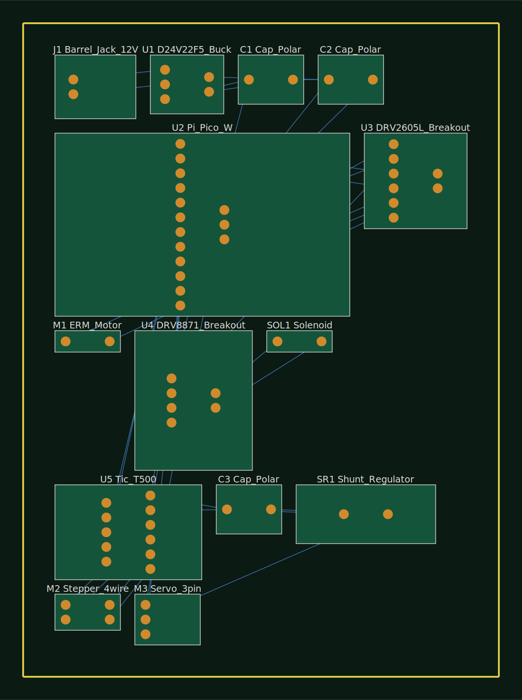
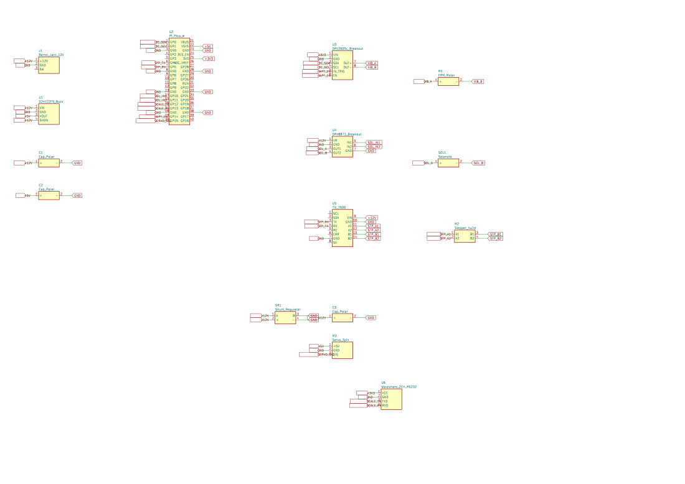

# Generated KiCad starter board for Quilter / DeepPCB

_Hands-on build note (not an Edison output). Implements the Rank-1
recommendation from note [`20`](20-topology-to-starter-board-for-powder-doser.md):
turn this repo's existing control-board **schematic** (the
`hardware/test-module/kicad/` project from PR
[#61](https://github.com/vertical-cloud-lab/powder-doser/pull/61) — 14 parts,
20 nets, but **no footprints / no `.kicad_pcb` / no outline**) into an actual
**router-ready starter board** that can be uploaded to the autonomous-layout
vendors from notes [`16`](16-quilter-ai-pcb-layout.md) (Quilter) and
[`17`](17-deeppcb-ai-pcb-routing.md) (DeepPCB). Answers @sgbaird's request on
PR [#76](https://github.com/vertical-cloud-lab/powder-doser/pull/76#issuecomment-4654482011)
("try to make an actual starter board that we could upload to quilter or
DeepPCB")._

> **Update (real component packages).** Following @sgbaird's follow-up on
> PR [#76](https://github.com/vertical-cloud-lab/powder-doser/pull/76#issuecomment-4654591085)
> ("I committed a bunch of files related to the components already … run
> again, full"), the build no longer uses generic header *proxies*: each
> component's **body outline, courtyard, and 3-D model** are now taken from
> the real vendor design files committed under
> [`hardware/vendor-files/`](https://github.com/vertical-cloud-lab/powder-doser/tree/copilot/identify-vibration-motor-solenoid-parts/hardware/vendor-files)
> (PR [#25](https://github.com/vertical-cloud-lab/powder-doser/pull/25)).
> The netlist (66 pads / 20 nets) is unchanged; only the geometry is now real.



## What this is

Notes `16`/`17` established the missing-middle problem: Quilter and DeepPCB
only do **placement + routing**, and both *require a fully-defined starter
board as input* — a `.kicad_pcb` whose footprints already carry assigned pads,
a netlist, and a board outline (Edge.Cuts). The bench-rig schematic on PR #61
has the complete topology but stops at the schematic; note `20`'s audit found
the footprints, board file, outline, and placement all missing.

[`starter_board/build_starter_board.py`](starter_board/build_starter_board.py)
closes that gap. It is fully **headless and self-contained** — it depends only
on the pure-Python [`kiutils`](https://pypi.org/project/kiutils/) package (no
KiCad install, no GUI, no network, no logins), so it runs in the GitHub/Copilot
sandbox and in CI — and emits, under
[`starter_board/`](starter_board/):

| File | What it is |
| --- | --- |
| [`test_module_starter.kicad_pcb`](starter_board/test_module_starter.kicad_pcb) | The starter board: 14 footprints, 66 pads (59 net-assigned), real component body outlines (F.Fab) + courtyards (F.CrtYd), 4 vendor 3-D models, and a compact ~82 × 113 mm Edge.Cuts outline. **This is the file you upload.** |
| [`test_module_starter.kicad_sch`](starter_board/test_module_starter.kicad_sch) | The matching **schematic** (14 symbols, 20 nets, 59 connected pins) — DeepPCB / Quilter ask for this alongside the board. Built from the *same* `NETLIST` / `PINOUTS`, so its netlist is identical to the board's; connectivity is global-label-only (no wires beyond short label stubs), verified pin-by-pin with `kicad-cli`'s netlist exporter. |
| [`test_module_starter.kicad_pro`](starter_board/test_module_starter.kicad_pro) | Project / DRC rules: `Default` (0.25 mm track / 0.2 mm clearance) and a wider `Power` net class (0.6 mm track / 0.3 mm clearance) assigned to `+12V`, `+5V`, `+3V3`, `GND`. Registers the schematic root sheet so the `.kicad_pcb` / `.kicad_sch` / `.kicad_pro` open together as one project. |
| [`test_module_starter.svg`](starter_board/test_module_starter.svg) / `.png` | Board preview — bodies, pads, ratsnest, outline (rendered by `kicad-cli` when present, otherwise by the script's built-in dependency-free SVG fallback). |
| [`test_module_starter_schematic.svg`](starter_board/test_module_starter_schematic.svg) / `.png` | Schematic preview (rendered by `kicad-cli` when present). |
| [`starter_board_summary.json`](starter_board/starter_board_summary.json) | Machine-readable BOM + net summary, including each part's real `body_mm`, vendor 3-D `model` path, and `source` provenance, plus the `unplaced_variant` filenames/outline. |

### Two variants: pre-placed vs. unplaced (auto-place test)

The generator emits **two** upload trios from the same netlist so the autonomous
tools can be tested on *placement* as well as *routing*, and so their placement
can be compared against this generator's:

| Variant | Files | Components | Use |
| --- | --- | --- | --- |
| **Placed** (default) | `test_module_starter.kicad_pcb` / `.kicad_sch` / `.kicad_pro` | Compact-packed **inside** the ~82 × 113 mm outline | Upload to test **routing** of a board this generator already placed. |
| **Unplaced** | `test_module_unplaced.kicad_pcb` / `.kicad_sch` / `.kicad_pro` | Same parts/nets, staged **outside** an identical empty outline | Upload to test the tool's **auto-placement** (then routing); compare its placement against the placed variant. |

The two `.kicad_sch` files are byte-identical (the schematic doesn't encode board
placement); only the `.kicad_pcb` differs — the unplaced board has the same empty
Edge.Cuts target rectangle with every footprint shifted one board-width + 12 mm
to its right, so the board area is empty and the router must place the parts.



## How it was built (note `20` Rank 1)

1. **Netlist provenance.** The `NETLIST` and `PINOUTS` tables in the script are
   transcribed verbatim from the `PLACEMENTS` / `SYMBOL_PINS` structures in PR
   #61's `hardware/test-module/kicad/generate.py` (commit `147e505`), so the
   component set, pin names, and net connectivity match the schematic exactly.
   Keeping them inline makes the build reproducible on *this* branch without
   needing the PR #61 hardware tree present.
2. **Real component packages (from the committed vendor files).** Each schematic
   pin still becomes one through-hole **0.1″ pad** (so the 20-net ratsnest is
   preserved exactly), but the body **outline, courtyard, and 3-D model** now
   come from the real vendor design files committed under
   `hardware/vendor-files/` (PR #25), via the `PACKAGES` table:
   - **Adafruit breakouts** (DRV2605L #2305 → 17.78 × 16.51 mm, DRV8871 #3190 →
     20.32 × 24.13 mm): outline read from the vendor **Eagle `.brd`** (layer 20 /
     Dimension); their `.step` is attached as the footprint 3-D model.
   - **Pololu carriers** (D24V22F5 #2858, Tic T500 #3135, shunt regulator #3776):
     published 0.1″-grid PCB size, cross-checked against the vendor **STEP**
     envelope; the `.step` (where a loose file exists) is attached.
   - **Off-board actuators** (NEMA-11 stepper, servo #1142, solenoid #412, ERM
     #1201): they live *off* the board, so they appear only as their on-board
     **connector** (header auto-sized to the pins); the actuator body / STEP is
     recorded in the BOM `source` for reference, not drawn as a board courtyard.
   - **Raspberry Pi Pico W** (PR #61's MCU, not in the PR #25 vendor set):
     standard 51 × 21 mm / 2×20 0.1″ outline.

   3-D model paths point at `hardware/vendor-files/…` so they resolve once PR #25
   merges; KiCad simply omits a missing model and the `.kicad_pcb` stays
   self-contained.
3. **Net assignment.** A board net table is built and every connected pad is
   tagged with its net, so the board carries the full 20-net ratsnest.
4. **Floorplan + outline.** The schematic-sheet anchor coordinates are reused
   (scaled ×1.0 so the now-real, larger bodies don't collide) as a rough,
   non-overlapping starting placement; a `_assert_no_overlap()` courtyard check
   guarantees the result stays DRC-clean, and an Edge.Cuts rectangle is drawn
   around all component courtyards + 5 mm. Absolute placement is unimportant —
   Quilter/DeepPCB re-place everything.
5. **Schematic companion.** From the same `NETLIST` / `PINOUTS`, the script also
   emits `test_module_starter.kicad_sch`: each part becomes a labelled rectangle
   symbol with one pin per physical pin (numbered exactly like the board pads),
   and each connected pin gets a global net label on a short stub wire.
   KiCad treats matching global labels as one net, so the 20-net topology is
   reproduced with no drawn nets to route. `validate_schematic_netlist()` then
   round-trips it through `kicad-cli` to prove the connectivity (see below).
   This answers @lbwinters' request on PR
   [#76](https://github.com/vertical-cloud-lab/powder-doser/pull/76#issuecomment-4663888863)
   for the `.kicad_sch` needed to run a Quilter / DeepPCB test.

## Verification

The **netlist topology is unchanged** from the earlier proxy build that was
loaded in KiCad 7.0.11 (`pcbnew` / `WriteDRCReport`): same 14 footprints, 66
pads, 59 net-assigned pads, and 20 nets, so the 39 `unconnected_items`
(= the ratsnest to be routed, the *intended* unrouted starter state) carry over.

This real-component revision is verified structurally, headlessly, with
`kiutils` plus the builder's own geometry guard:

- **14 footprints / 66 pads / 59 net-assigned / 20 nets** — re-parsed from the
  written `.kicad_pcb` (identical to the KiCad-checked proxy version).
- **No courtyard overlaps** — `_assert_no_overlap()` checks every pair of real
  F.CrtYd extents before writing the board and raises if any two collide, so the
  compact placement stays clearance-clean.
- **4 vendor 3-D models attached** (DRV2605L, DRV8871, D24V22F5, shunt regulator),
  **84 F.Fab** body-outline + **56 F.CrtYd** courtyard segments emitted.

**Compact placement (issue [#94](https://github.com/vertical-cloud-lab/powder-doser/issues/94)).**
The first DeepPCB run flagged the board as *"still very spaced out"*: the earlier
build reused the schematic-sheet anchor coordinates as the board floorplan, which
left 14 small breakouts strewn across a **279 × 199 mm** board (routers keep that
excess area). The board now ignores those coordinates and **compact-packs** the
real component bodies into a near-square grid (`_pack_positions()` — left-to-right
rows wrapping at a `sqrt(total-area)`-derived width, `PLACE_GAP = 1.5 mm` between
courtyards), shrinking the outline to **~82 × 113 mm** (≈6× less area) while
`_assert_no_overlap()` keeps it DRC-clean. The schematic-sheet layout is
unchanged (its spacing doesn't affect connectivity or routing).

**File-format version (KiCad 7+).** The board is written with the **KiCad 7.0
`.kicad_pcb` format version `20221018`** (board and every embedded footprint),
matching the schematic's KiCad 7 `20230121` version. This addresses the Quilter
upload error reported on PR
[#76](https://github.com/vertical-cloud-lab/powder-doser/pull/76#issuecomment-4665359897)
— *"Version 20211014 not supported. Quilter supports KiCAD versions 7.0 and
newer"* — which came from `kiutils`' default `create_new` stamp of the KiCad 6
version `20211014`. The builder now overrides it via `KICAD7_PCB_VERSION` so the
upload trio is accepted.

The **schematic** (`test_module_starter.kicad_sch`) is verified the way KiCad's
own connectivity engine sees it: the build exports its netlist with
`kicad-cli sch export netlist` and asserts every one of the **59 connected pins
lands on its intended net across all 20 named nets**, with no stray
`unconnected-(…)` entries (`validate_schematic_netlist()`; runs automatically
when `kicad-cli` is on `PATH`, skipped gracefully otherwise). Because both the
board and the schematic are emitted from the same `NETLIST` / `PINOUTS` tables —
pins numbered identically (left column then right) and placed on the same 0.1″
pitch — the schematic netlist matches the board's pad nets exactly. UUIDs are
derived with a stable `sha256` hash, so re-running is byte-for-byte reproducible.

A KiCad GUI/`kicad-cli` DRC pass is still recommended before routing (it
couldn't be run in this headless sandbox), but the board opens as a
fully-netted, outlined, unrouted board — the precise hand-off artifact Quilter
and DeepPCB ask for.

## Uploading it

DeepPCB and Quilter ask for the full KiCad project — board **and** schematic —
so upload the trio together: `test_module_starter.kicad_pcb` +
`test_module_starter.kicad_sch` + `test_module_starter.kicad_pro`.

- **Quilter** (note `16`, manual / web-UI only): open
  [app.quilter.ai](https://app.quilter.ai), start a new project from the trio
  (`.kicad_pcb` + `.kicad_sch` + `.kicad_pro`), and let it place + route. No
  API, so this step is human-in-the-loop.
- **DeepPCB** (note `17`, scriptable API): the `.kicad_pcb` is the upload
  payload for `POST /boards` (with the `.kicad_sch` / `.kicad_pro` for a
  complete project); the provisioned `DEEPPCB_API_KEY`
  ([`deeppcb_api_ping.py`](deeppcb_api_ping.py)) authenticates from this
  sandbox, but a real route is **credit-metered** (free tier = 1 board /
  ~30 min), so the actual `POST /boards` + `PATCH /boards/{id}/confirm` calls
  are left for a deliberate, budgeted run rather than every CI commit.

## Honest limitations

- **Real bodies, simplified pad geometry.** Body **outlines, courtyards, and
  3-D models** are now the real vendor parts (sourced from the PR #25
  `hardware/vendor-files/` Eagle `.brd` outlines + STEP envelopes + spec
  sheets), and pad *counts/nets* are correct — but each part's pads are still a
  generic 0.1″ two-column header inside the real body, not the part's exact pad
  pattern. Before fabrication, swap each for its full KiCad footprint (e.g.
  `Module:RPi_Pico_SMD_TH`, the Adafruit/Pololu/SnapEDA libraries, or footprints
  derived from the committed vendor `.brd`/STEP). The router output is therefore
  a **layout study**, not a manufacturing release.
- **3-D models resolve after PR #25 merges.** The `model` paths point into
  `hardware/vendor-files/` (PR #25); until that branch lands they won't render,
  which is harmless (KiCad just skips a missing model).
- **Mixed-signal partitioning still wants a human pass.** The note `20`
  caveat stands: keeping SR1's back-EMF clamp tight to C3 / the Tic T500 VIN,
  and separating the 12 V motor return from logic ground, are constraints an
  autonomous placer won't prioritize without explicit grouping — worth a review
  pass after Quilter/DeepPCB returns candidates.

## Reproducing

```bash
pip install kiutils            # pure-Python; cairosvg optional for the PNG
python paper/background/starter_board/build_starter_board.py
```

`kicad-cli` (KiCad ≥ 7) is optional; when it is absent the script falls back to
a built-in, dependency-free SVG renderer (bodies, pads, ratsnest, outline), and
`cairosvg` (if installed) converts that to PNG. The `.kicad_pcb`, `.kicad_pro`,
and summary are produced regardless.
