# Powder-doser paper review meeting — annotated feedback log

**Meeting:** 2026-09-01, 14:41–16:13 local · **Recording:** <https://youtu.be/vZWPl0S0c_g>
(unlisted, 1920×1080, 5522 s) · **Present:** Sam Charles, Sterling Baird

Every actionable point raised in the meeting is listed below in the order it was
raised, with the corrected quote, the screen the speaker was actually looking at,
and the resulting action. The consolidated, prioritised version of these actions
is in **[REVISION-SPEC.md](REVISION-SPEC.md)** — that is the document to review
and edit. This file is the evidence behind it.

---

## Provenance and method

| | |
|---|---|
| Video | `vZWPl0S0c_g`, uploaded 2026-09-01 by BYU Vertical Cloud Lab, unlisted, description links to PR #97 |
| Duration | 5522 s (1 h 32 m 02 s), 1920×1080, 16 fps |
| Spoken record | `sources/teams_transcript.vtt` (Teams, 1152 cues) and `sources/tactiq_transcript.txt` |
| Written record | `sources/sam_charles_raw_notes.txt` (Sam's own notes, requested separately) |
| Corrected transcript | **[TRANSCRIPT-corrected.md](TRANSCRIPT-corrected.md)**, including the glossary of speech-to-text errors |
| Screenshots | 222 frames at 128 moments, `screenshots/` |

**Timeline alignment.** The Teams VTT ends at `01:32:01` against a 5522 s video,
so VTT time and video time are the same clock, and both equal wall clock minus
14:41:18. That is independently confirmed twice inside the recording: the
`@claude` comment that became **PR #149** (jargon audit) was posted at 14:42
local, matching the jargon discussion at `00:01:20`; and the comment that became
**PR #150** (test-protocol table) was posted at 15:00 local, matching Sterling
saying "it's like test protocols" at `00:18:56`. Every timestamp below is a valid
`?t=` offset into the recording.

**Two things asked for that do not exist.**

1. **There are no comments on the video to inlay.** `comment_count` is `0` and the
   fetched `comments` array is empty (`sources/video_metadata.json`). The video is
   unlisted with 0 views at fetch time. There is nothing to interleave — the
   deliverable is genuinely empty rather than skipped.
2. **There are no captions on the video.** Both `subtitles` and
   `automatic_captions` are empty, so the transcript here is built from the Teams
   VTT rather than from YouTube.

**Screenshot method.** Frames are cut with `ffmpeg` at the transcript timestamp
and cropped to `(0,0)–(1390,1010)`, which is the shared-screen region. The webcam
tiles on the right are deliberately excluded, so no participant's face is
committed to the repository. Where a remark depends on *where the cursor was* at
that instant, three frames were taken 6 s apart and all three are shown — the
cursor is visible in the crop. Reproduce with `tools/extract_frames.py` and
`tools/shots.tsv`.

**A caveat that affects roughly six minutes of this log.** From `00:29` to
`00:36` Sterling reads the test-protocol table aloud from *his own* screen while
Sam is still sharing the candidate-figure comment. The screenshots in that window
therefore show the candidate figures, not the table being described. This is
noted inline rather than papered over.

---

## Contents

- [A. Framing: jargon, audience, and what the paper is about](#a-framing)
- [B. The figures already in the manuscript](#b-existing-figures)
- [C. Metadata that was never captured](#c-metadata)
- [D. Candidate figure A2 — feed factor](#d-a2)
- [E. Candidate figure F1 — the operating map](#e-f1)
- [F. Candidate figures E1/E2 — the closed-loop result](#f-e1e2)
- [G. Candidate figure C2 — mass-vs-time](#g-c2)
- [H. The test-protocol table](#h-protocols)
- [I. New figures and analyses requested](#i-new-figures)
- [J. The dose-rate EDA, panel by panel](#j-eda)
- [K. Two hard defects found during the meeting](#k-defects)
- [L. New bench work: protocols H and I](#l-new-bench)
- [M. Scope boundaries and the U of U target](#m-scope)
- [N. Process, tone, and timeline](#n-process)
- [O. Sam's written notes, reconciled against the recording](#o-sam-notes)

---

## A. Framing: jargon, audience, and what the paper is about

### F01 — Jargon is the top-line problem, for experts too `00:01:20`

> "Lots of jargon. And we're trying to be as open source as possible, so when it
> reads like this it becomes inaccessible. Even I found that. … It's not that
> people in this industry don't know the jargon, it's that we all struggle
> through it every time. We're not fluent in it; we figure it out."
>
> "The simpler we make it isn't just for people with no experience in this field
> — it's also simpler for the people who have a lot of experience. So let's make
> it better for everybody."

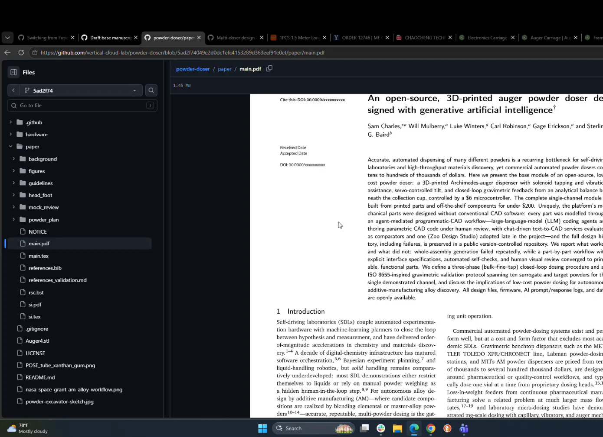

**Screen:** `main.pdf` open at the title and abstract in the github.dev viewer.

**Action:** Reduce jargon throughout, in the *Better Poster* spirit. This is the
same request that produced **PR #149**, and #149's findings document is the
work-list — it is already written and does not need redoing. Note that the
justification given here is broader than #149 assumed: the target reader is not
only the newcomer but the busy expert.

### F02 — The paper is about the doser, not about the powders `00:27:52`

> Sam: "It's helpful for me to remind myself that we're looking for graphs that
> **showcase the powder doser, not the powders.**"

Restated more forcefully at `01:07:12`:

> "I'm pretty confident on this: let's not have this kind of totality graph with
> **powder type as a major axis.** We're not talking about the powder type; we're
> going to talk about the powder doser."

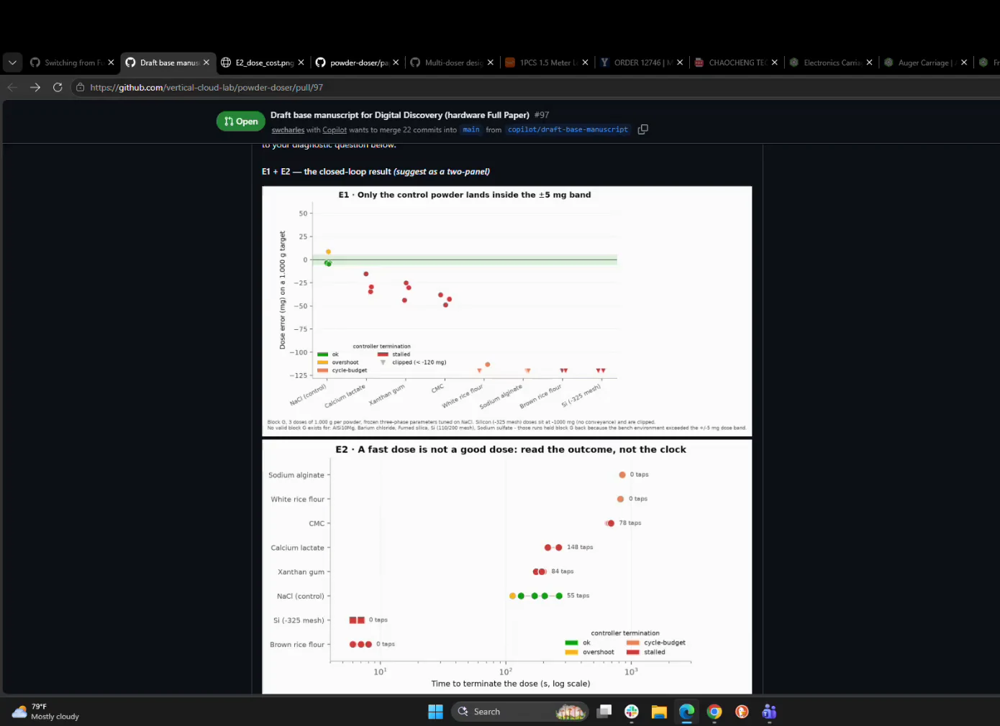

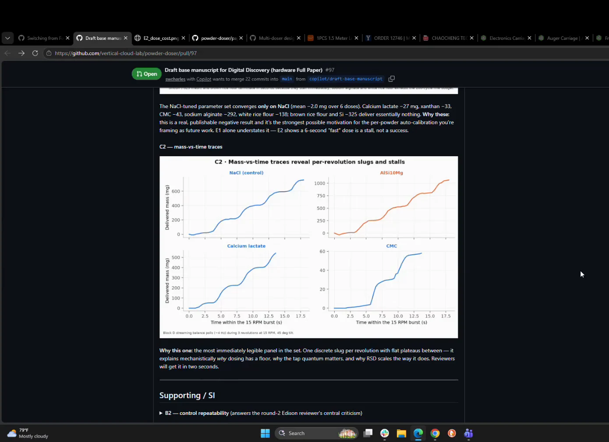

**Action:** This is the single organising principle for the figure set. Any panel
whose primary axis is "which powder" needs a reason to exist. The powders are the
*stimulus*; the instrument's response is the *result*.

---

## B. The figures already in the manuscript

> **Figure numbering.** In the current `main.pdf` the figures are: **Fig. 1**
> platform overview, **Fig. 2** design specifics, **Fig. 3** generative-AI CAD
> outcomes, **Fig. 4** dispensing characterisation (the synthetic one), **Fig. 5**
> future work, **Fig. S1** nozzles. Earlier PR comments called the synthetic
> figure "Fig. 3"; that numbering is stale. Below, LaTeX labels are given
> alongside the numbers so there is no ambiguity.

### F03 — Delete the design timeline, Fig. 1(e) `00:03:34`

> Sam: "Why do we have the timeline in it? We don't need that."
>
> Sterling: "That's OK, we can take that out. I think I mentioned the timeline at
> one point, just as a passing comment. What would probably be more useful is
> **number of things as a function of time**, not a single pipeline timeline."

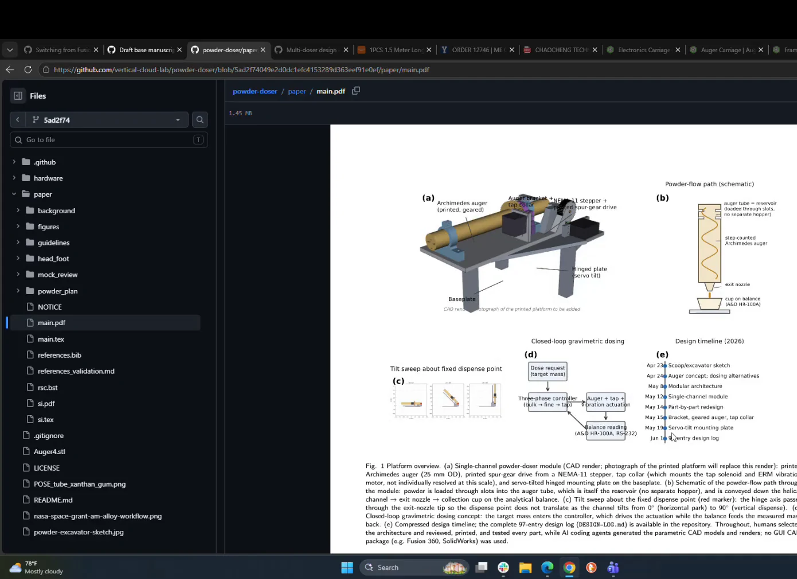

**Screen:** Fig. 1 (`fgr:overview`). Panel (e) "Design timeline (2026)" is the
dated vertical list on the right. The cursor sits in panel (a) near the
"Baseplate" call-out as he speaks.

**Action:** Remove panel (e) from Fig. 1. Do **not** replace it with nothing —
see F04.

### F04 — Replace it with a rate-over-time plot, in the SI `00:04:16`

> "If we're talking about the generative-CAD piece, maybe it's OK — we can throw
> whatever we want into supplementary information. … Generative-AI usage as a
> function of time. I think it's cool that we have that data and we should use
> it. I run it for a couple of projects — usually a few thousand dollars per
> project if you were to charge at API rates."

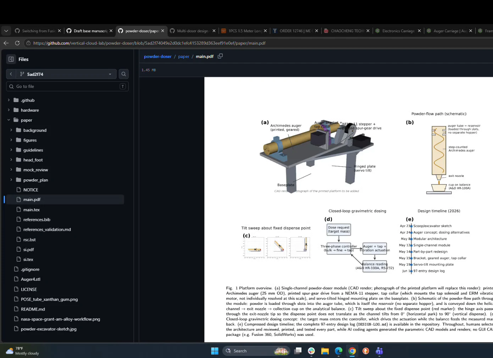

**Action:** Build an SI panel showing generative-AI usage *as a quantity per unit
time* (design-log entries, PR/agent sessions, or token/cost equivalent per week)
rather than a milestone timeline. The 97-entry design log already carries dates.
The dollar-equivalent figure is Sterling's own datum from other projects — it is
context, not something to assert about this project without measuring it.

### F05 — Fig. 1(c) needs a coordinate frame `00:05:00`

> "Like showing how it looks at 45 degrees — people know what 45 degrees is. But
> what might be helpful is to **put a coordinate frame on the jar**, something
> like that, so people know what axes we're talking about."

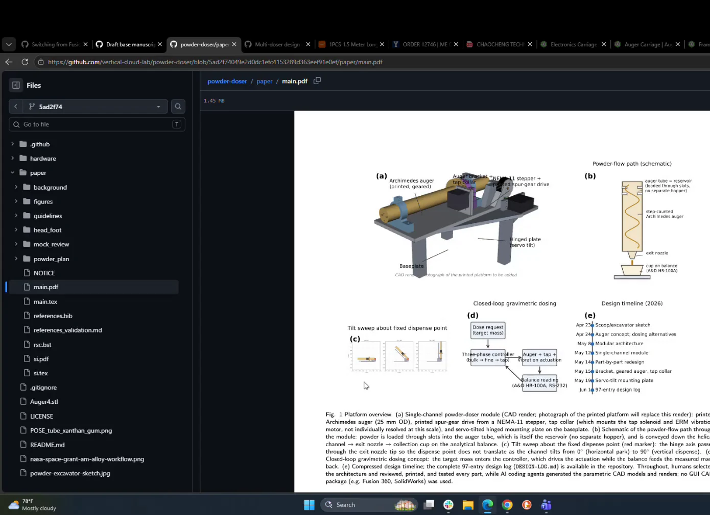

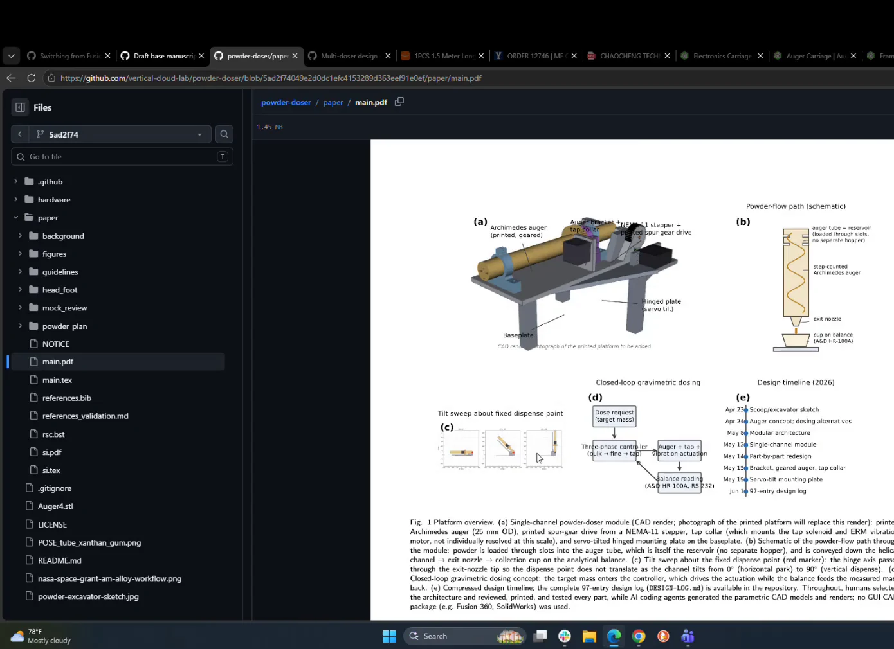

**Screen:** Fig. 1, cursor moving through the caption at "(c) Tilt sweep about
the fixed dispense point".

**Action:** Add an explicit coordinate frame / axis triad to the tilt-sweep panel
so "0°" and "90°" are unambiguous, and so the tilt axis is identifiable. Note
that "the jar" here means the auger tube — the tilt is of the auger, and the
reader currently has to infer the rotation axis from three small thumbnails.

### F06 — Fig. 2(a) is good; Fig. 2(b) is not `00:05:20`

> "A cross-section is good. But this one isn't super helpful — were we trying to
> talk about the tap collar? The generative-AI part of the tap collar? I'm not
> sure."

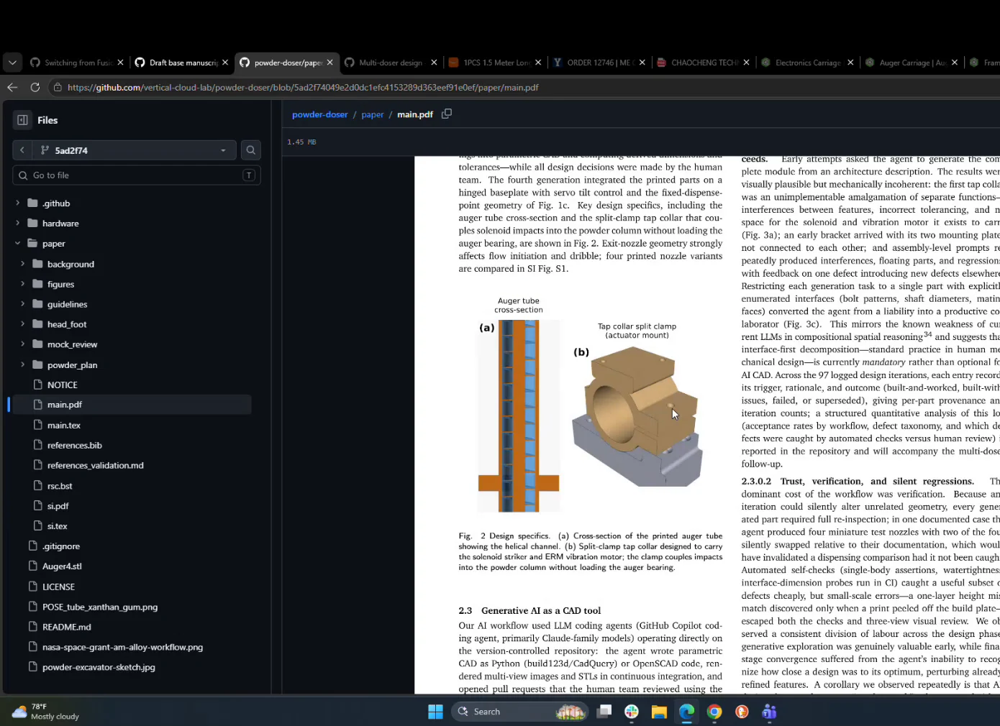
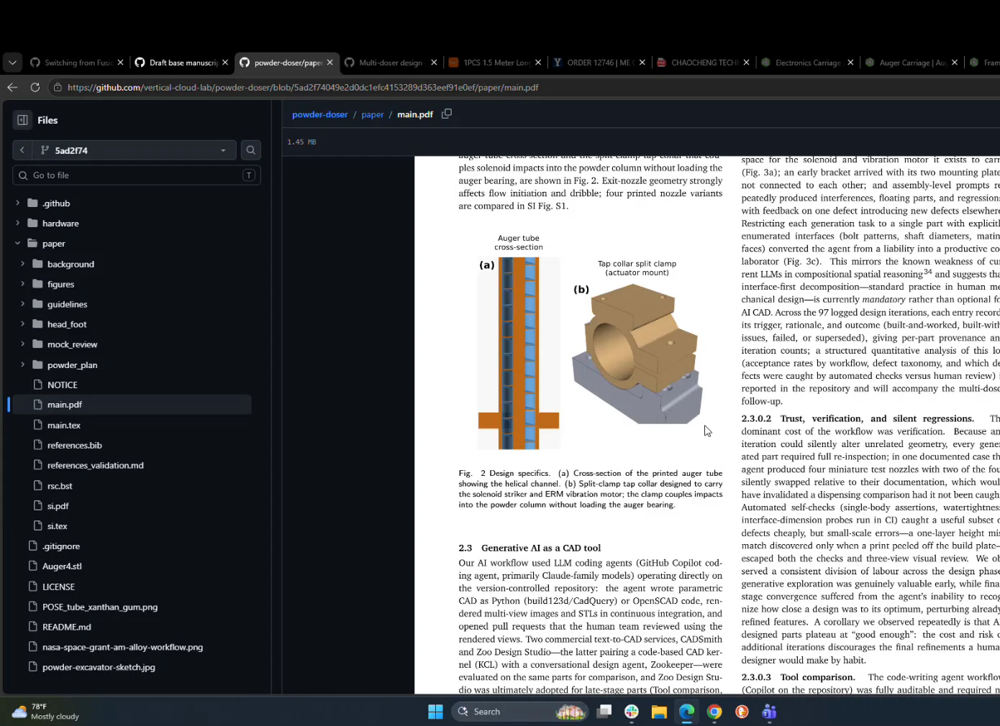
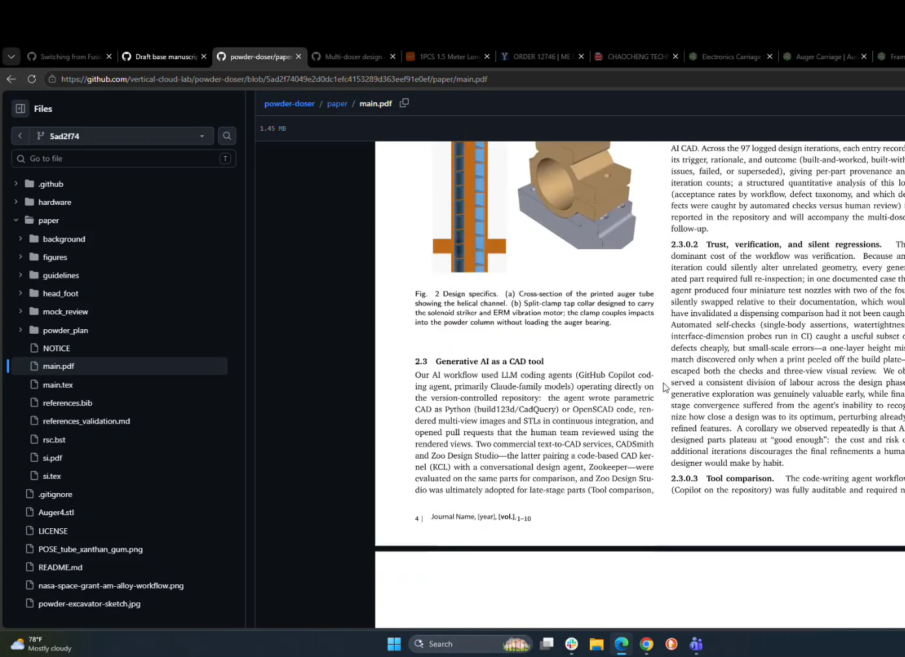

**Screen:** Fig. 2 (`fgr:design`) — (a) auger-tube cross-section, (b) split-clamp
tap collar. The cursor hovers between the two panels, on the tap collar.

**Action:** Keep 2(a). Either give 2(b) a stated purpose in the caption and the
body — is it a *design* result or a *generative-AI* result? — or move it into
Fig. 3 (generative-AI outcomes) where the tap-collar story already lives, or drop
it. Sterling's confusion is that the panel is doing two jobs and signalling
neither.

### F07 — Fig. 4 is fake data and everyone knows it `00:05:47`

> Sam: "And then this is fake data."
> Sterling: "Which is awesome. I guess we hadn't pinged it yet to put in real
> data. So this is still from back before we had it."

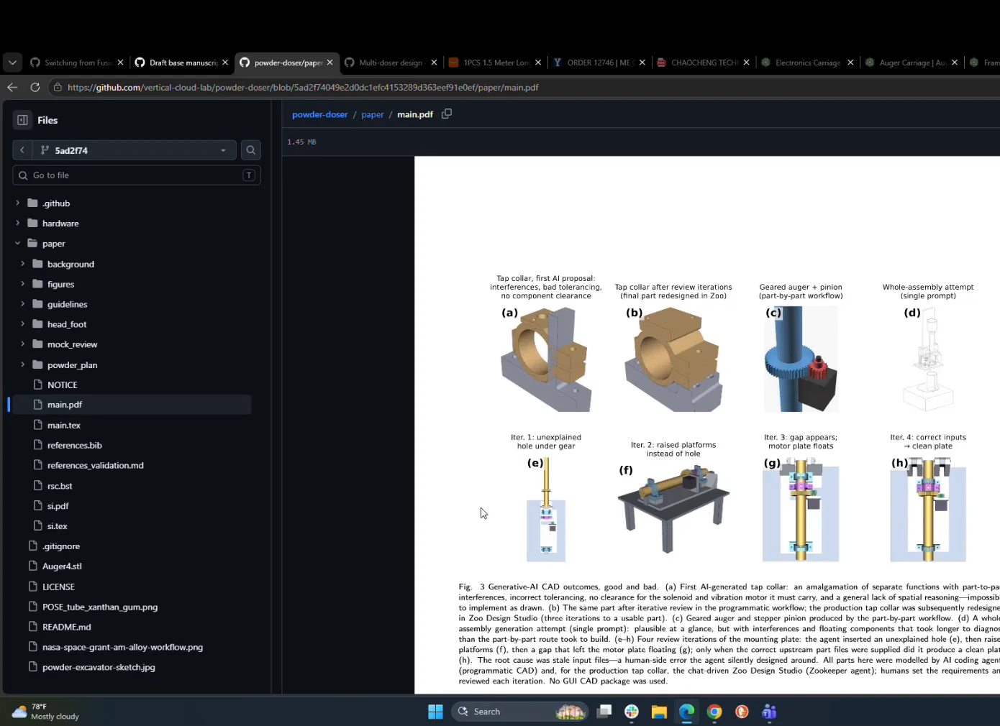
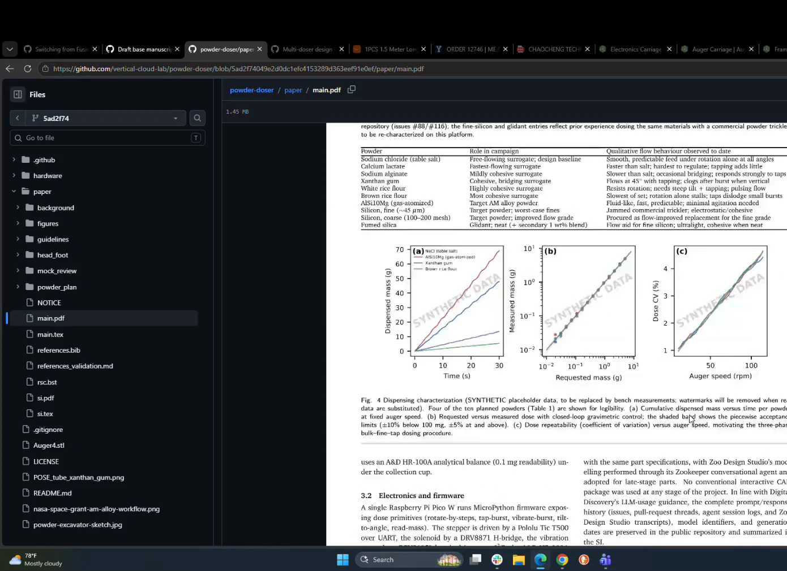
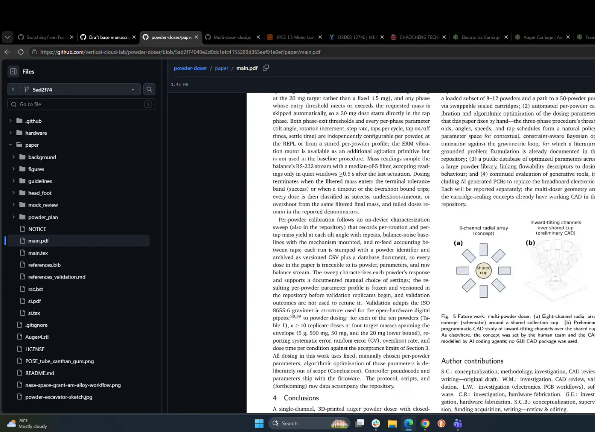

**Screen:** Table 1 (planned ten-powder set) above, and Fig. 4
(`fgr:dispense`) below with its diagonal `SYNTHETIC DATA` watermarks on all three
panels.

**Action:** Replace Fig. 4 entirely with real round-1 data and delete the
watermark machinery. The replacement panel set is specified in
[REVISION-SPEC.md](REVISION-SPEC.md); it is **not** the same three panels, because
panel (b) (parity across 20 mg – 5 g) and panel (c) (CV vs speed) cannot be built
from round-1 data — every closed-loop dose was at a 1 g target, n = 3. That gap
is exactly what protocols H and I (F111–F113) are meant to close.

### F08 — Table 1 is still forward-looking and no longer matches what ran `00:06:20`

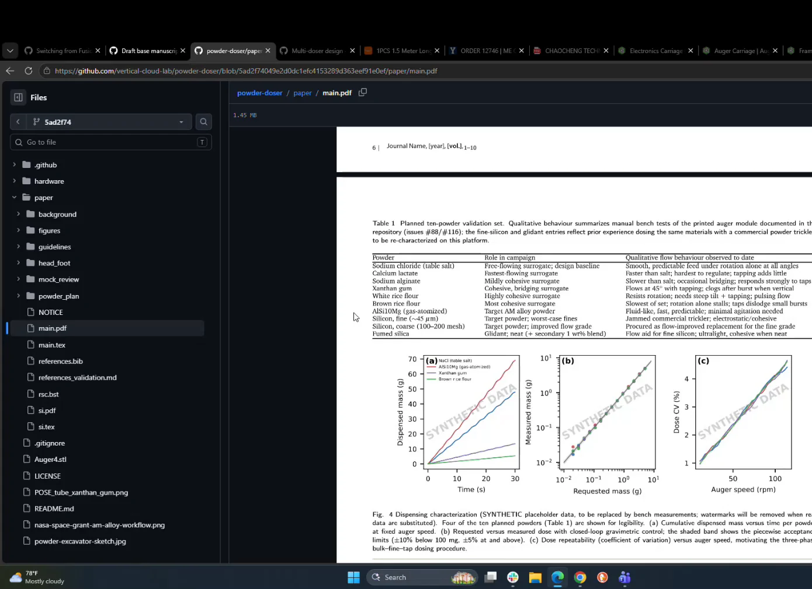

**Screen:** Table 1, captioned "Planned ten-powder validation set", with a
"Qualitative flow behaviour observed to date" column.

**Action:** Round 1 ran **13** powders, not the 10 planned: it added CMC, sodium
sulfate and barium chloride, and it did **not** run the fine-Si + 1 wt % fumed-silica
blend the text promises. Rewrite Table 1 from a plan into a record, and either run
the blend study or remove the claim.

---

## C. Metadata that was never captured

### F09 — "I don't even know what metrics we're using" `00:07:12`

> Sam: "It's been super handy to just say 'Claude, run this and record this data'
> — but even when I thought I was doing a good job of following up and knowing
> what it was recording, now that I'm trying to write a paper and thinking about
> what graphs would be helpful, **I don't even know what metrics we're using.
> What did we even collect?**"
>
> Sterling: "At some point we were saying: what data needs to be collected for the
> placeholder figures? … At some point there may have been a disconnect. It became
> 'collect the data' rather than 'make sure you're collecting the data *for that
> paper*', and showing lots of the data getting added inline so we can spot-check
> it as it goes."

**Action:** This is a process finding, and it has two concrete outputs: the
test-protocol table (F25/F26, delivered as PR #150) and a data-dictionary entry in
the SI defining every recorded column. It is also the reason F19/F20 below exist.

### F19 / F20 — Fill level and repeats were never recorded `00:14:26`, `00:15:07`

> Sterling: "What was the fill level when this was collected? I also don't know if
> repeats were run on this. It seems like maybe not — it's not an identical repeat
> of the 45-degree tilts."
>
> Sam: "I think it's going to be hard to measure. I didn't really control for that
> myself. It was up to pretty close to the top, but not totally at the top. And
> some of them didn't have enough powder, so they were like half. So it varies
> throughout."
>
> Sterling: "Did you weigh the [augers] before and after?"
> Sam: "No, I didn't. Once I was done it was like — that would be a good idea."

**Action, two parts.**
- *Retrospective:* fill level for round 1 is not recoverable. Say so in the
  caption of every cross-powder panel — fill level was uncontrolled, varied
  between roughly half-full and near-full, and is a known contributor to
  between-powder spread. Do not attempt to reconstruct it.
- *Prospective:* from round 2 onward, **weigh the loaded auger before and after
  each run**. That single measurement gives fill level, total conveyed mass, and
  a check on collected-vs-conveyed mass (which is currently an unquantified
  under-collection sitting under every feed-factor number).

### F118 / F119 — Record where the bench was `01:21:55`, `01:22:35`

> Sterling: "It might be worth trying to differentiate — and this could just be in
> supplementary information — **when it was in the fume hood, when it was in the
> lab, and when the box went over it.**"
>
> Sam: "We might be able to get that from the live streams. The box was only a few
> seconds. … All of the food-safe powders were in the lab, and all of the
> non-food-safe were in the fume hood."

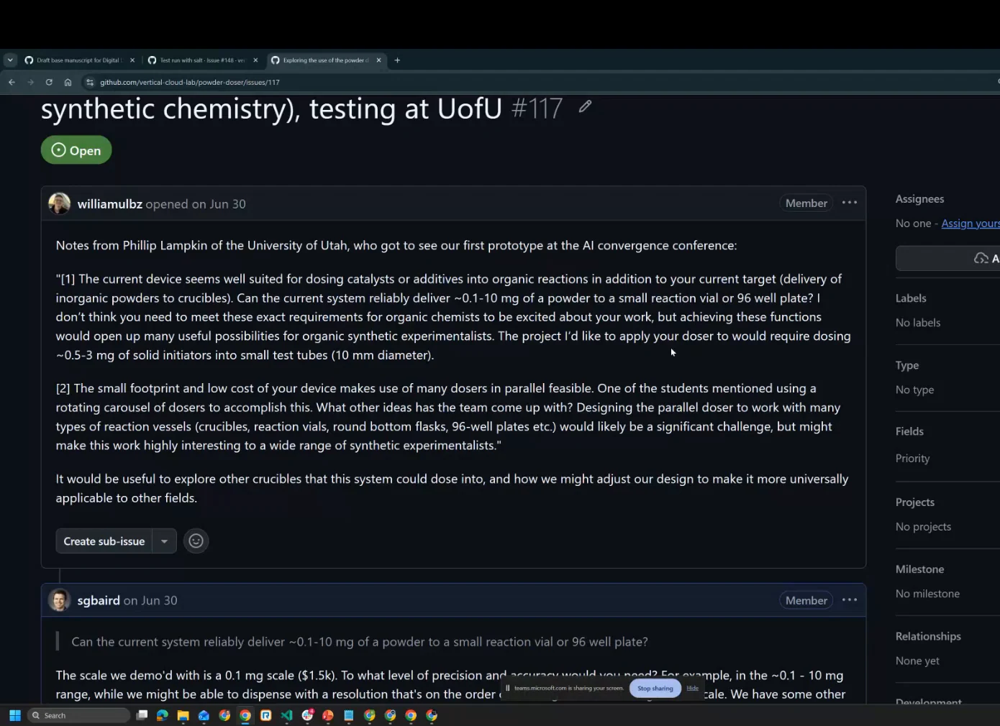

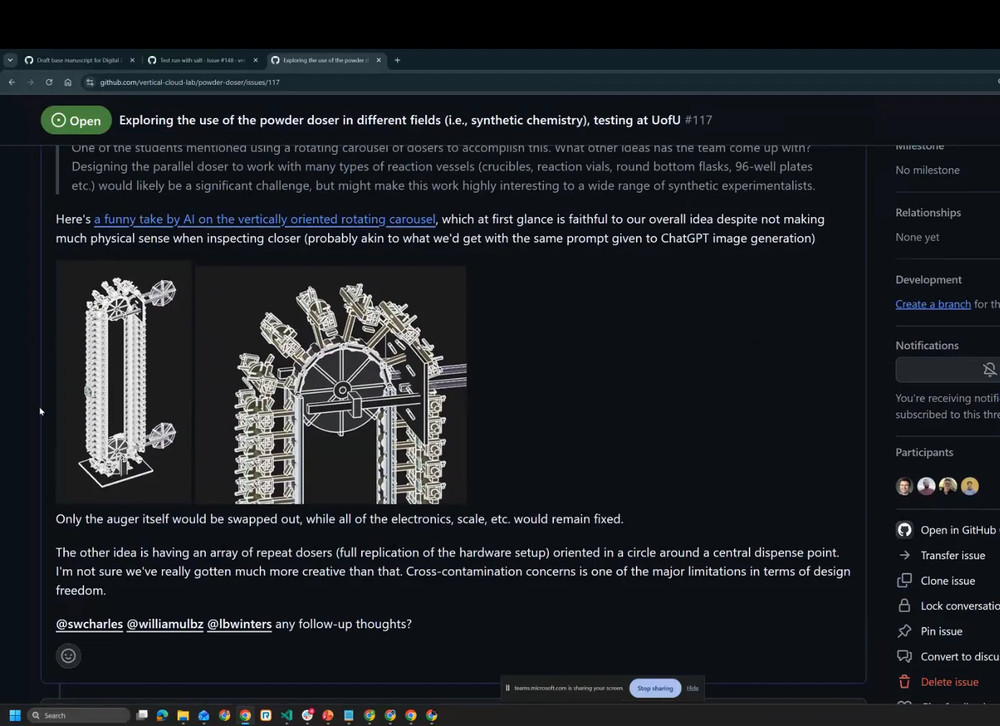

**Action:** Add a location column to the run inventory: lab bench, fume hood, or
fume hood + enclosure. Sam's rule ("food-safe in the lab, non-food-safe in the
fume hood") makes this reconstructable for round 1 without new work. This matters
because it is **confounded with the powder class** — every research-relevant
powder was measured in the noisier environment, so any comparison between the two
classes carries an environment term. That has to be stated, not buried.

---

## D. Candidate figure A2 — feed factor across 13 powders

### F14 / F15 — Keep A2, and keep the colour split `00:12:35`

> "I think this one, **A2**, has good information in it that we can display
> graphically. I think the use of colour to split the food-safe surrogate versus
> the research-relevant ones is good — **we want to keep a visual separation
> between the different types.**"

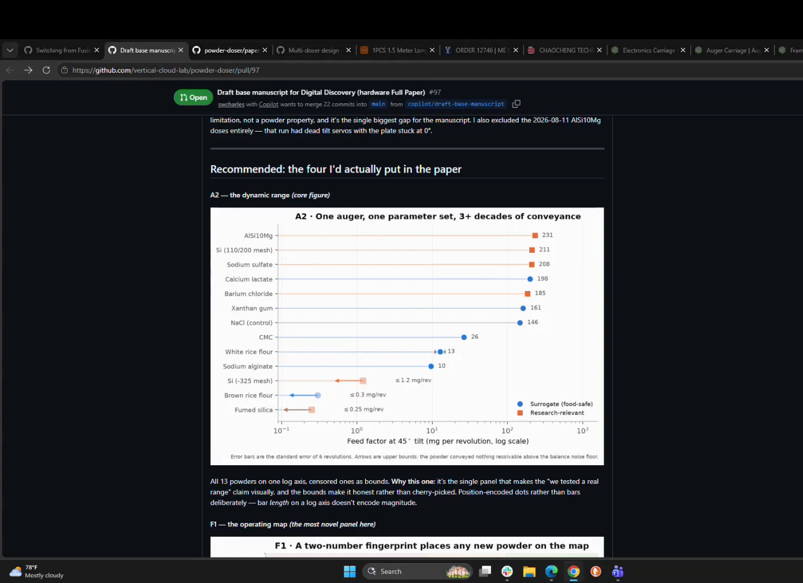
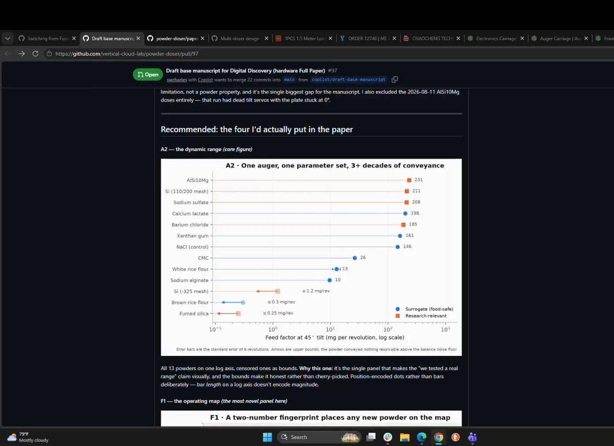

**Action:** A2 survives into the paper. Retain the surrogate / research-relevant
encoding.

### F11 / F12 / F16 — Do not plot the three powders that conveyed nothing `00:09:45`, `00:13:00`

> Sam: "I'm pretty sure it's saying nothing was dispensed. I get it, but that's
> not really a helpful way to say that. **Don't put it on the graph** — just make
> a note, or show it as hatched. Like a hatched bar."
> Sterling: "Yes — strike through the text."
>
> Sterling: "We shouldn't be plotting any data for the silicon −325 mesh, the brown
> rice flour, the fumed silica. We can optionally keep them on the graph, but just
> as a strike-through."

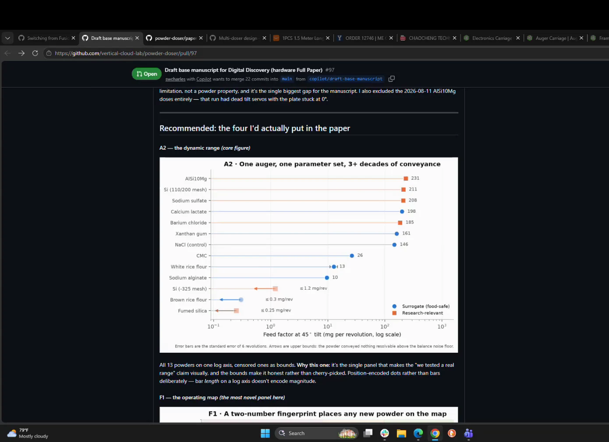

**Screen:** A2, showing all 13 powders on a log axis. The three at issue are the
bottom three rows, currently drawn as left-pointing arrows at `≤ 1.2`, `≤ 0.3` and
`≤ 0.25 mg/rev`.

**Action:** Stop drawing arrow markers at a numeric position for Si (−325 mesh),
brown rice flour and fumed silica. Instead list them as struck-through row labels
in a "did not convey" band with no plotted value, and explain in the caption.
The current upper-bound arrows read as measurements, which is the objection.

**Note on why this is a change of position, not a contradiction.** The upper-bound
arrows were originally chosen precisely to avoid plotting `0.25 mg/rev` as if it
were a measurement. Sterling and Sam are saying the arrows still read as data.
Struck-through labels satisfy both concerns: nothing is plotted, and nothing is
silently dropped.

### F13 — The headline number `00:11:00`

> "We can go from 10 mg per revolution for sodium alginate all the way up to 230.
> I actually didn't realise the AlSi10Mg would be the highest-flowing of
> everything. But it's not that different from xanthan gum."

**On-screen values:** AlSi10Mg 231, Si (110/200) 211, sodium sulfate 208, calcium
lactate 198, barium chloride 185, xanthan gum 161, NaCl 146, CMC 26, white rice
flour 13, sodium alginate 10 mg/rev; three censored below.

**⚠️ Action:** **Every one of these numbers is currently wrong by a factor of 3.**
See F106 — they are per *stepper* revolution, not per auger revolution. The true
per-auger-revolution figures are 3× larger. Do not put A2 in the paper until the
dataset is rescaled.

### F17 — Captions belong in the caption, not baked into the image `00:13:25`

> "I think we really do need to clarify in the caption — it was putting the
> caption as embedded text in the figure. **Every figure.** No matter how many
> times: keep it out of the figure image."

**Action:** Strip the explanatory footer text baked into every candidate PNG (e.g.
A2's "Error bars are the standard error of 6 revolutions…") and move it into the
LaTeX caption. This is a standing rule for the figure pipeline, not a one-off fix
— it recurs in every candidate figure and in the EDA panels.

### F18 — Captions must name what was *not* controlled `00:13:55`

> "Having in there clarifications about other factors that affect things — like
> the fill level — that weren't controlled for here. But the raw data is
> available."

**Action:** Every cross-powder caption states (i) fill level was not controlled,
(ii) particle shape and size were not measured, (iii) where the raw data lives.

### F21 / F22 — Say why the extremes behave the way they do `00:15:53`, `00:16:15`

> "These ones were really hard to get anything out of. … Also this fumed silica is
> weird. Just don't touch it, it's not going to work. This one probably has
> something to do with it being really jagged."
>
> "Frankly, the AlSi10Mg probably flows so well in part because they are particles
> for laser powder-bed fusion, which requires very high sphericity — very
> spherical, uniform size distribution. You have to, to use them in metal 3D
> printing. … We could have some commentary about this."

**Action:** Add a short mechanistic paragraph: gas-atomised AlSi10Mg is spherical
and narrowly distributed *because* LPBF requires it, which is why it is the best
conveyor in the set; milled Si (−325 mesh) is angular and fine, which is why it is
among the worst despite a comparable true density. Frame these as two distinct
failure modes — cohesion-vs-driving-force for Si (−325), aeration for fumed silica
— rather than one "censored" bucket. Support with SEM (F39).

---

## E. Candidate figure F1 — the operating map

### F23 / F24 / F27 — Like the idea, cannot read the axes `00:17:17`

> Sam: "This one looks helpful if I really look at it. There's probably a better
> way to do it. Oh — is this the lateral scatter? … That's what I mean: **I don't
> even know what we're talking about here.** But I like having that distinction.
> I like the way it's set up. And revolution RSD — this 'percent, block C'."
>
> Sterling: "RSD might mean something else. That's the thing, right? It produces so
> much content that it feels like 'oh, we've been using this terminology for the
> last three weeks' — and I probably should have read it more closely, but I don't
> know what you're talking about."

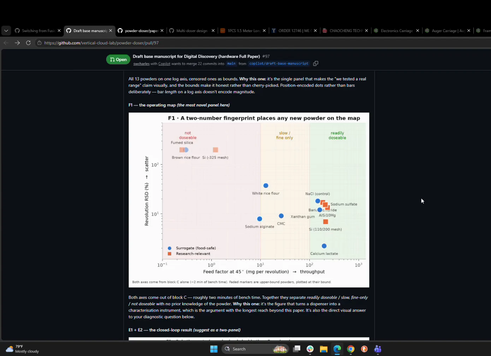

**Screen:** F1, with y-axis "Revolution RSD (%) → scatter" and x-axis "Feed factor
at 45° (mg per revolution) → throughput", and three shaded regions labelled *not
doseable* / *slow, fine only* / *readily doseable*.

**Action:** Keep F1 — it is the most novel panel. Fix its language:
- Replace **RSD** with a plain-language axis label. Sterling, a co-author, guessed
  it meant "root mean squared deviation" (`00:09:14`); it means *relative standard
  deviation*. If the term is kept it must be spelled out at first use in both the
  caption and the body.
- Replace **feed factor** with plain wording or define it on first use.
- Remove **"block C"** from the axis; say what condition it means (one auger
  revolution at 45°, 30 rpm) or point to the protocol table.

### F10 — The RSD moment itself `00:09:10`

> Sam: "And revolution **RSD** — do you know what that stands for?"
> Sterling: "Root mean squared… root squared deviation?"

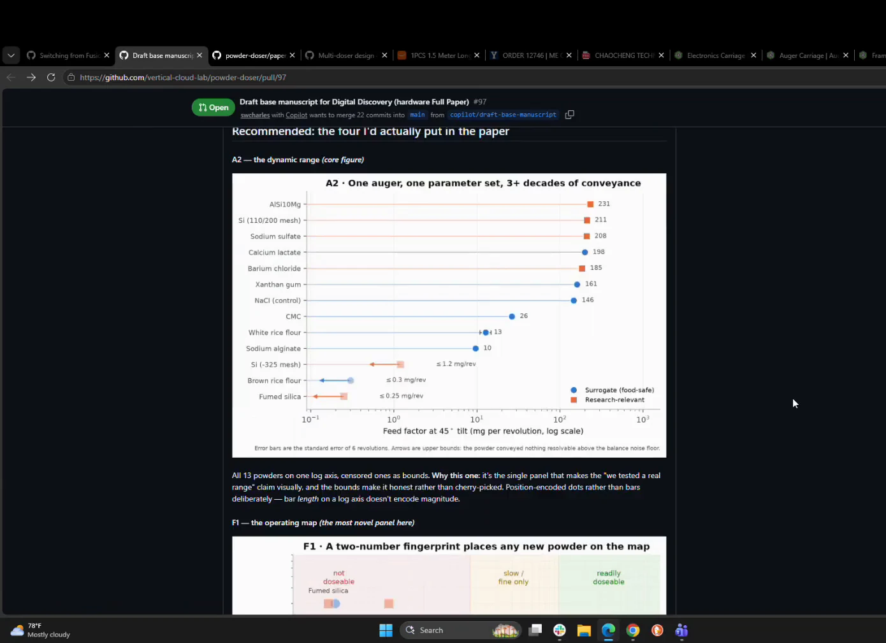

**Action:** Treat this exchange as the acceptance test for the jargon pass in
PR #149: if a co-author cannot recover a term from the figure, the figure fails.

---

## F. Candidate figures E1 / E2 — the closed-loop result

### F28 / F29 — Keep the idea; frame the failure as a controls problem `00:20:00`

> Sam: "This one I like. … I like the idea of: this is what we were shooting for,
> this is the error, based on the same test for all the powders. And that is
> somewhat of a control problem now."
>
> Sterling: "Right. We'll just point to it: **we used a simple method; in future
> work we're going to do the calibration properly.**"

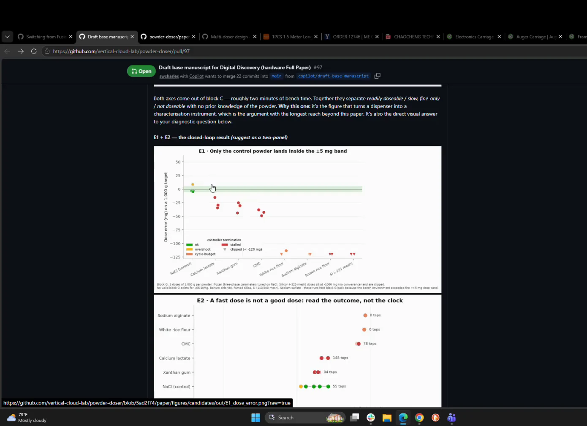

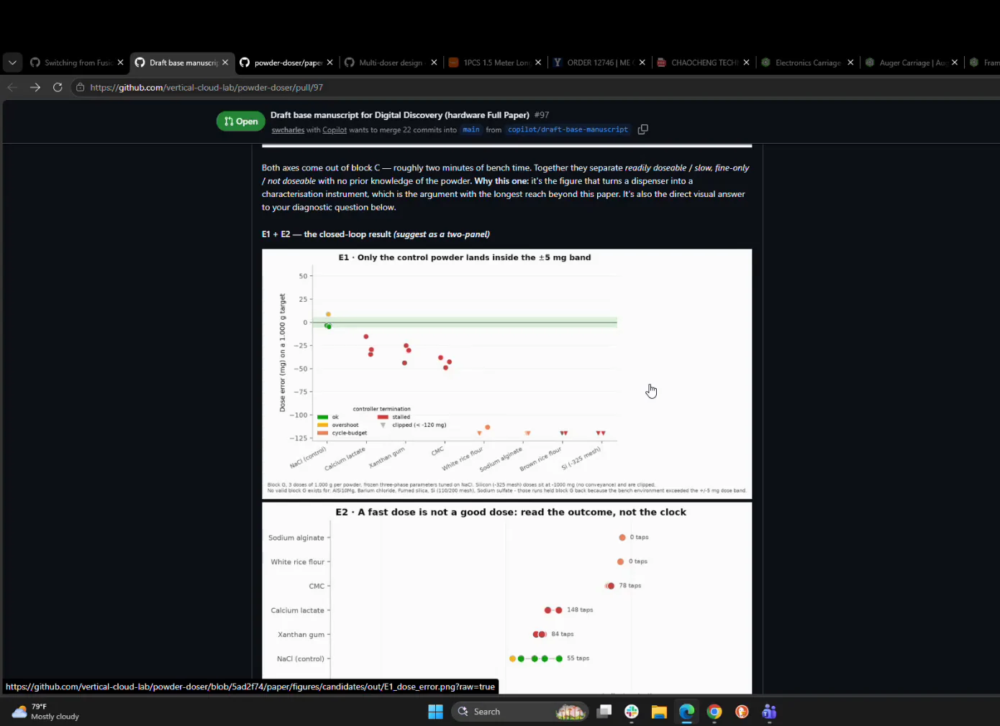
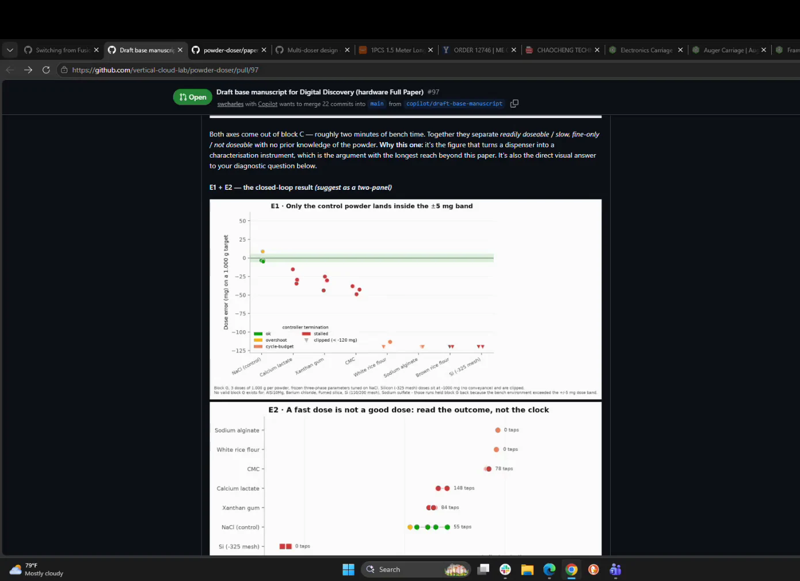

**Action:** Keep the closed-loop result and present it honestly as the performance
of a deliberately simple, NaCl-tuned heuristic — with per-powder auto-calibration
named as future work (Will's thread). Do not present it as a limit of the
hardware.

### F30 / F31 — Remove the jitter `00:20:52`

> "These are not any kind of range, so these should all just be aligned perfectly.
> That's a specific type of plot: it's **jitter** … useful when you have a lot of
> data points and you want to show a distribution without doing a violin plot and
> without a bunch of overlapping points. **We do not need jitter for three
> points.**"

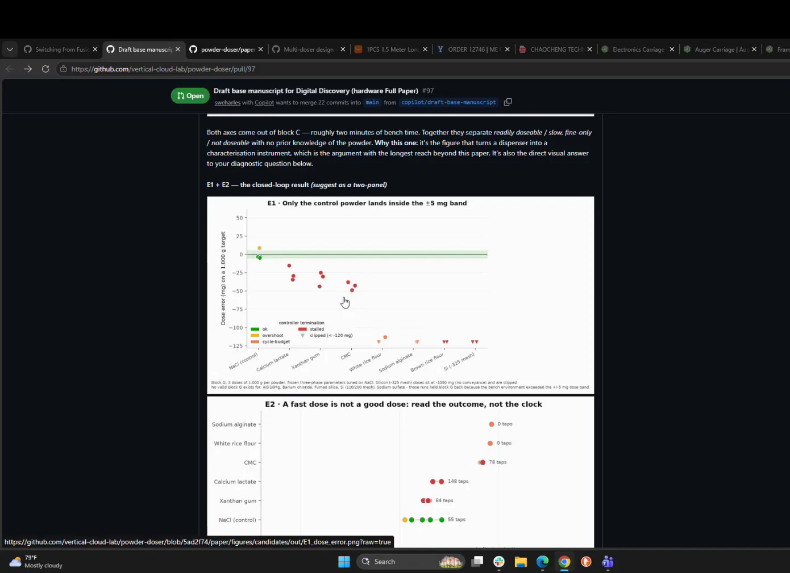

**Action:** Set jitter to zero in E1 and any other panel with n = 3. Align
replicates on the category position. If overlap hides points, use small open
markers or a slight vertical offset with a stated meaning — not random horizontal
noise that a reader will mistake for an x-value.

### F32 / F35 / F36 — "Time to terminate the dose" is ambiguous `00:21:34`, `00:23:09`

> Sam: "I'm not really sure what it's trying to say. 'Time to terminate the dose.'
> As far as I know, that's: it stopped the dose, and then the time for it to stop
> dispensing anything. And I'm not sure what the taps are."
>
> Sam: "I like: when I stopped it, how much time did it take to stop? Maybe that's
> a helpful metric — but is that what it's talking about? I don't know."
>
> Sterling: "This is just how long it took to get there. We're trying to do 1 gram."

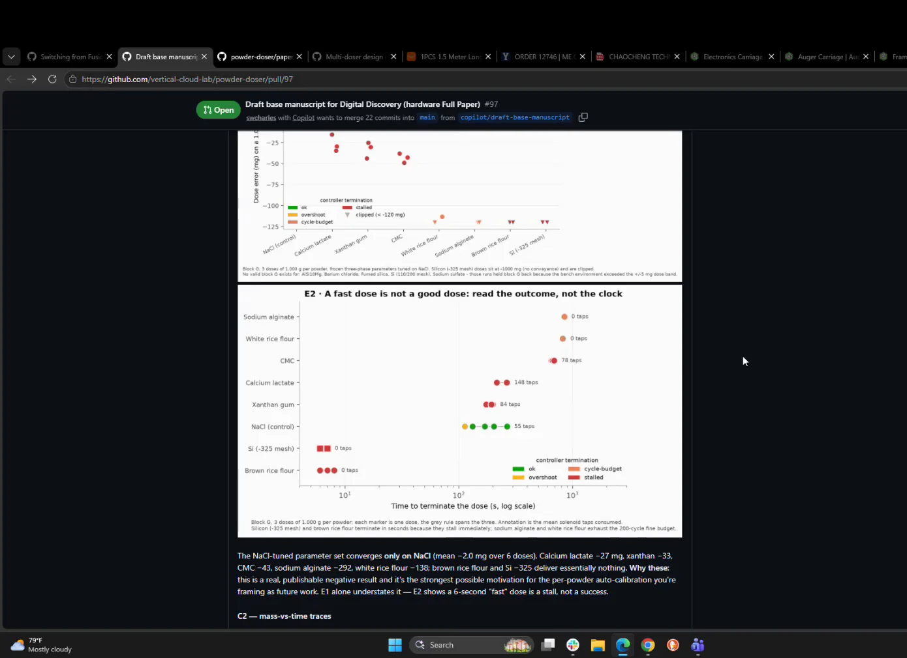

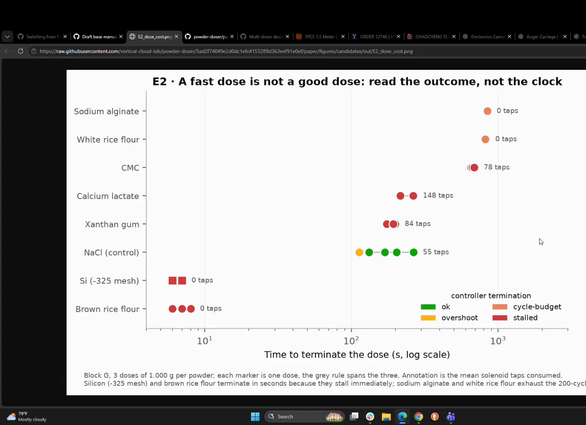

**Action:** Rename the axis to something unambiguous — **"time to reach the dose
target (or give up)"** — because two co-authors read it two different ways, and
one of those readings (dribble time after shutoff) is a *different quantity the
paper does not measure*. Also define the four termination states in the caption:
`ok`, `overshoot`, `cycle-budget`, `stalled`.

### F33 / F34 — Same censoring rule applies to E2 `00:22:24`, `00:22:30`

> Sam: "So, brown rice flour — these ones again didn't do anything. Why are they
> on here?"
> Sterling: "It's technically measured data, but it's noise. And displaying it this
> way isn't helpful."

**Screen:** E2 zoomed to the raw PNG. Annotations read "0 taps" (sodium alginate,
white rice flour, Si −325, brown rice flour), "78 taps" (CMC), "148 taps" (calcium
lactate), "84 taps" (xanthan gum), "55 taps" (NaCl).

**Action:** Apply F11/F16 consistently: powders that delivered nothing get a
struck-through label, not a plotted point at 5 s that looks like a fast dose.

### F37 / F40 / F41 / F42 / F43 — Explain the stalls `00:24:22`–`00:27:15`

> Sterling: "It was CMC, which obviously took a while to get there and it
> **stalled** — which I assume means there came a point where it stopped dispensing
> anything. I'm not sure why it would do that. And then the question becomes: well,
> what was the target, and how close did it get?"
>
> Sam: "I think it's back to the three-phase thing — it can't go back to earlier
> phases. Once it gets to the tap phase it's just going to keep tapping, with that
> little pocket in the front. It just keeps tapping."
>
> Sterling: "CMC here had 148 taps and still didn't get there."

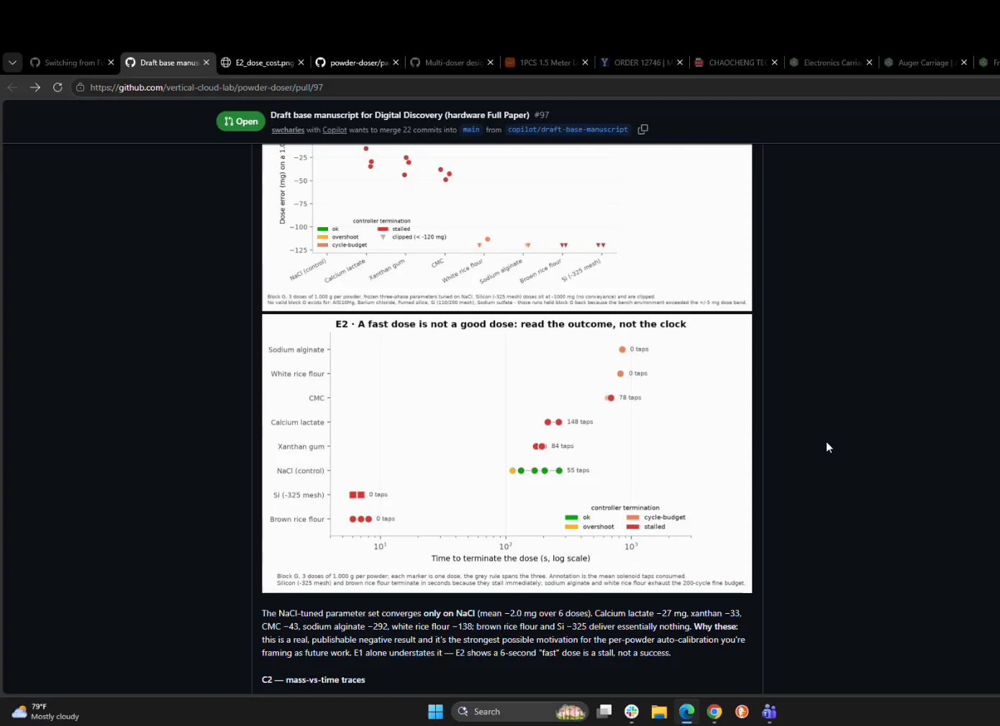
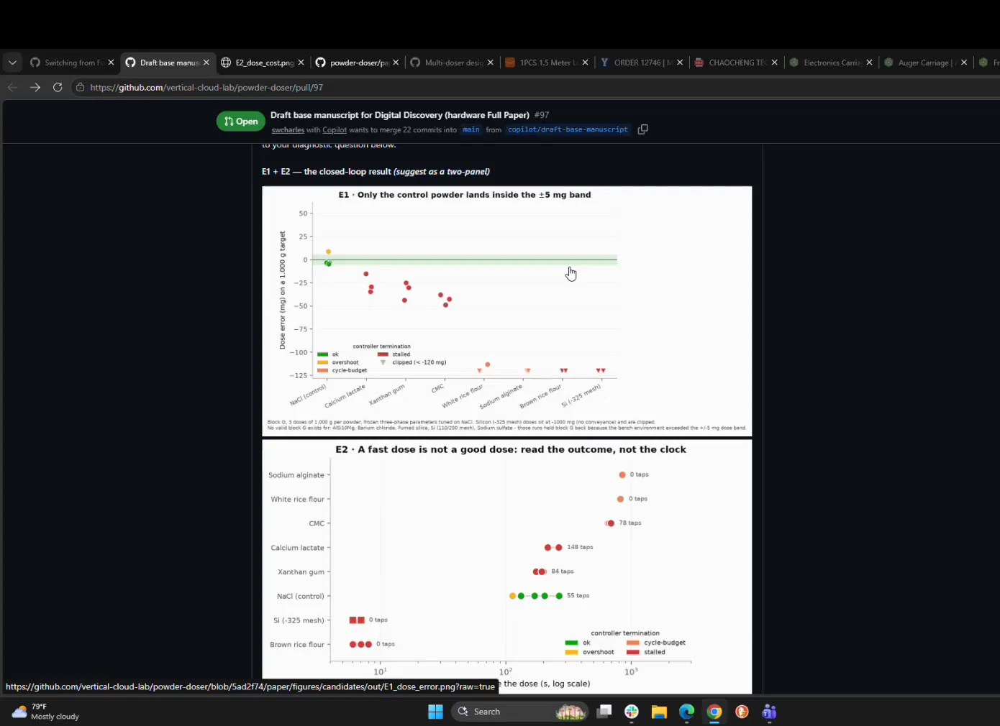

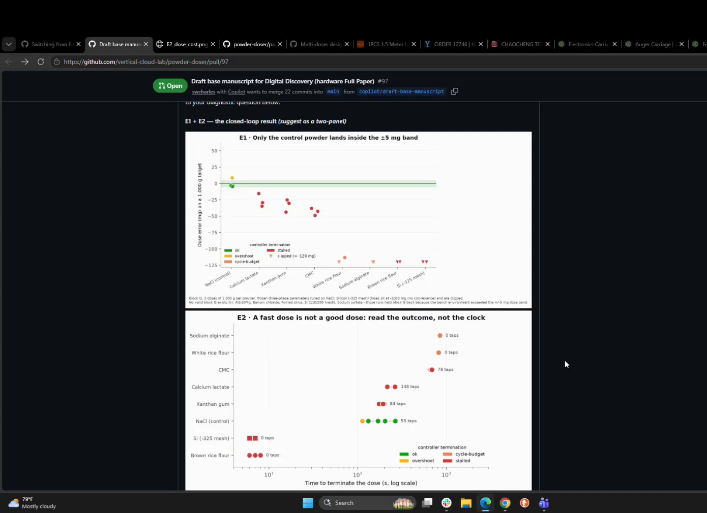

**Action:** State the mechanism in the text: the three-phase controller is
monotonic — bulk → fine → tap, with **no path back to an earlier phase** — so once
the tap phase begins and the auger flight nearest the exit is empty, tapping alone
cannot refill it, and the dose stalls regardless of how many taps are spent. This
is a controller-architecture limitation, and it is the sharpest possible motivation
for the auto-calibration work. It is also directly fixable (allow re-entry to the
fine phase), which should be named as future work.

### F44 — Readers will ask three questions `00:27:30`

> "If we take this heuristic, people want to know the performance of it. … **People
> will read this paper and they want to know: can you dose it? How fast? Can you be
> accurate?**"

**Action:** Those three questions are the acceptance criteria for the whole
dispensing-results section. Every panel should be answering one of them.

### F38 — The five things a reader must be able to see `00:24:10`

> "Maybe there's a way we can represent, either all in one or separately, this idea
> of: here was the **unique powder type**, and whether it's food-safe or
> research-relevant; here are the ones that **flowed fast**; here's the **accuracy
> when we tried to be accurate** with this powder, under the three-phase procedure;
> and the **total time it takes to get to that point**, which is basically a
> function of the dose rate; and **what didn't flow well, and why it didn't flow
> well.**"

**Action:** This is the specification for the main dispensing figure. It is
reproduced verbatim in Sam's written notes too (see [section O](#o-sam-notes)),
which is the strongest signal in the whole meeting that it matters.

### F39 — Add SEM images `00:25:19`

> "We have some SEM images of the powders — throw those in. Some characterisation
> data on some of this."

**Action:** Locate the SEM images and add a powder-characterisation panel (SI, or
main text if it supports F21/F22). This partially closes the "we have zero
independent characterisation of these powders" gap — though SEM gives morphology,
not bulk density, so the graduated-cylinder measurement remains the cheapest
quantitative addition.

---

## G. Candidate figure C2 — mass vs time

### F46 / F47 / F48 — Keep C2 `00:28:30`

> Sam: "This is really helpful. It's cool to see: OK, it's an auger, it's spinning,
> and it falls out, and it falls out. And this is how you can see how the powder is
> coming."
> Sterling: "It's never really continuous. Even the most continuous one is still
> not. … I like that one. **I like C2.**"

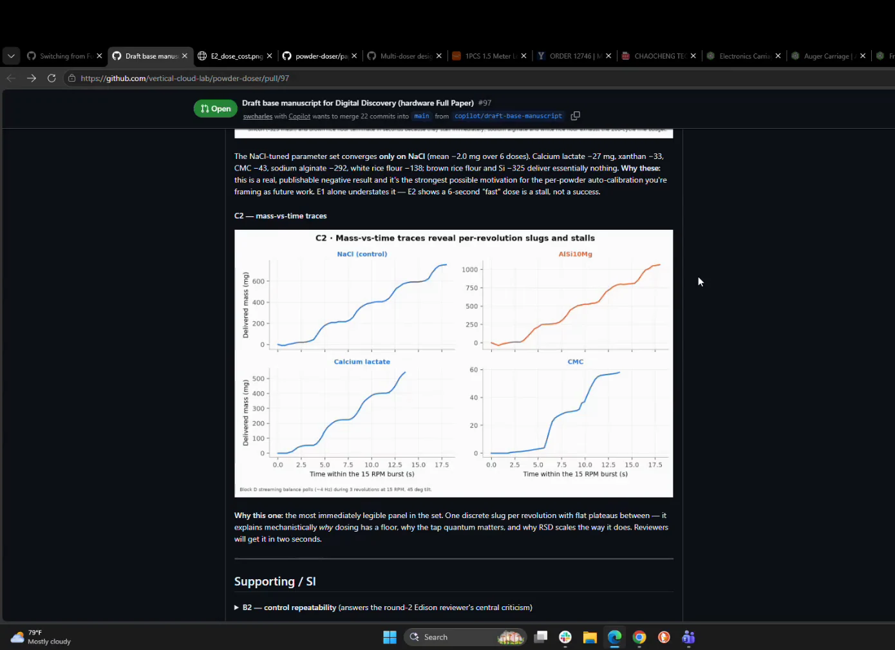

**Action:** C2 goes in, unreservedly. It is also the panel that most directly
answers "how does this thing actually behave", and it is what makes the staircase
/ one-slug-per-revolution mechanism legible without any statistics. Sam's written
notes independently list "mass v time is good (showing in real time how it
dispenses)".

---

## H. The test-protocol table

> **Screen caveat:** for F49–F57 the shared screen still shows the candidate-figure
> comment while Sterling reads the protocol table from his own machine. The
> screenshots are included for completeness and timestamp accuracy, but they do not
> show the table.

### F25 / F26 — "Block" → "test protocol", and make a table `00:18:02`, `00:18:56`

> Sam: "I'm not sure where all the blocks are. It's just the tests that I had. …
> So the block is a different test, and obviously I know in my head what each of
> them is. I wrote them. But that would be a good table to have."
> Sterling: "Exactly. … They're better — it's like **test protocols**."

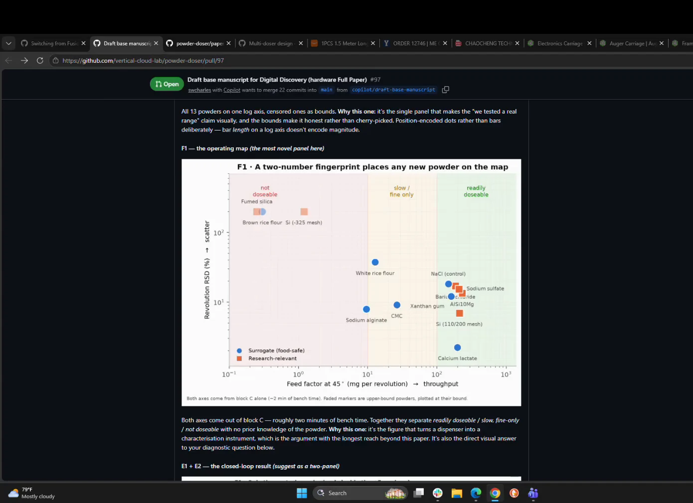

**Status: already delivered as PR #150.** The `@claude` comment was typed at
15:00 local, ~9 s after this exchange.

### F51 / F52 / F57 — "Trial" is undefined, and error bars beat a spread statistic `00:31:15`, `00:31:31`

> "The revolution-to-revolution spread seems to be what it's trying to capture
> there. **I'd rather just see error bars.** Or actually the individual data
> points, maybe."
>
> "Looks like 18 trials for this one. Again, we really need to figure out **what a
> trial means.**"

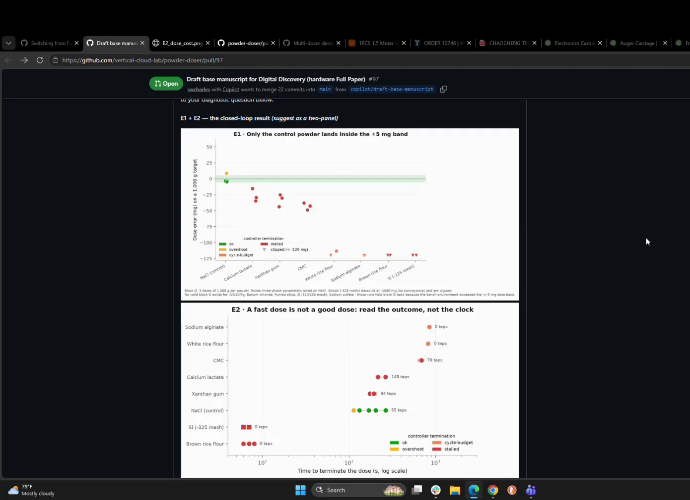

**Action:** Define "trial" explicitly in the protocol table (for protocol C, 18 =
6 revolutions × 3 tilts, i.e. the revolution is the trial, not the run). Prefer
plotted individual points with error bars over a derived spread statistic wherever
n is small.

### F50 — Protocol B's replicate structure is genuinely unclear `00:29:55`

> Sam: "If you're holding for 15 seconds at a time but you're not doing anything
> between them — is that one?"
> Sterling: "It says three trials, I guess because it's 0/45/90. … It might be that
> it goes back to its normal position and then back up to 45. Good question —
> that's something to figure out about the test."

**Action:** Read `powder_battery.py` and state definitively whether protocol B's
three trials are three tilts (one hold each) or three repeats, and whether the
stage returns to 0° between holds. Neither author could answer from memory.

### F55 — Protocol F has never produced a record `00:34:00`

> Sterling: "[Protocol F] Obviously, nothing. I still want to get that back on at
> some point."
> Sam: "Priorities. We have priorities right now."

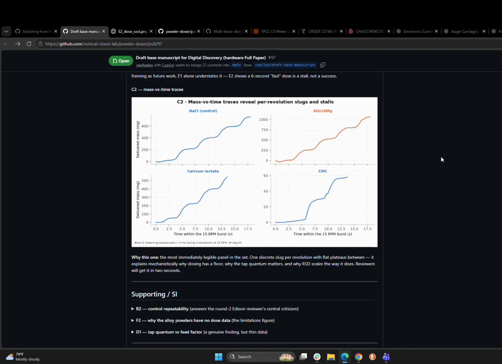

**Action:** Vibration assistance is advertised in the abstract and the platform
overview but has **never been measured** — the DRV2605L reports `EIO` on all 11
runs that requested it. Either fix the driver before round 2, or remove
"vibration assistance" from the abstract and overview and describe the ERM motor
as fitted-but-not-characterised. Do not leave the claim standing unmeasured. This
was flagged in PR #150 and remains a manuscript decision, not a table decision.

### F60 — Move the protocol table into the main text `00:37:01`

> "Move that table onto the main thing."

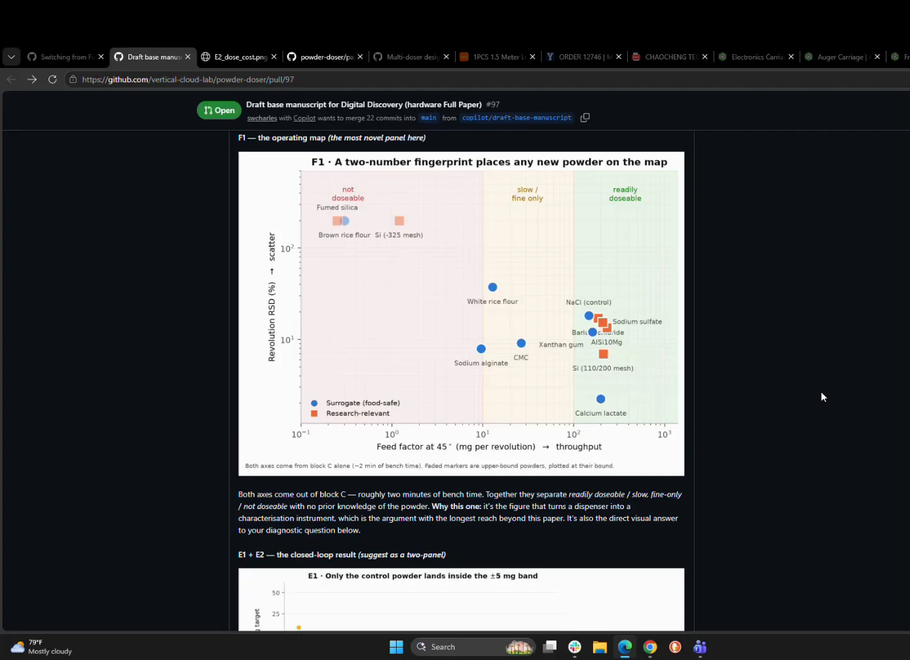

**Action:** PR #150 currently places the test-protocol table in the SI as Table S2.
Promote it to the main text. Sam's written notes say the same thing:
*"supplemental includes table of test — move to main"*.

---

## I. New figures and analyses requested

### F58 / F59 — **New figure:** dose error vs time to dose `00:35:55`

> "Wait, hold up. … **a scatter plot of dose error versus time to dose.**"
>
> "Do we have that already? … No, that doesn't have time to dose. So basically this
> plot, but with time to dose. And instead of an axis for the powders, we'd have
> unique symbols — some way to differentiate within the chart itself. So this would
> be **dose error versus time to dose, and that would only pull from G.**"

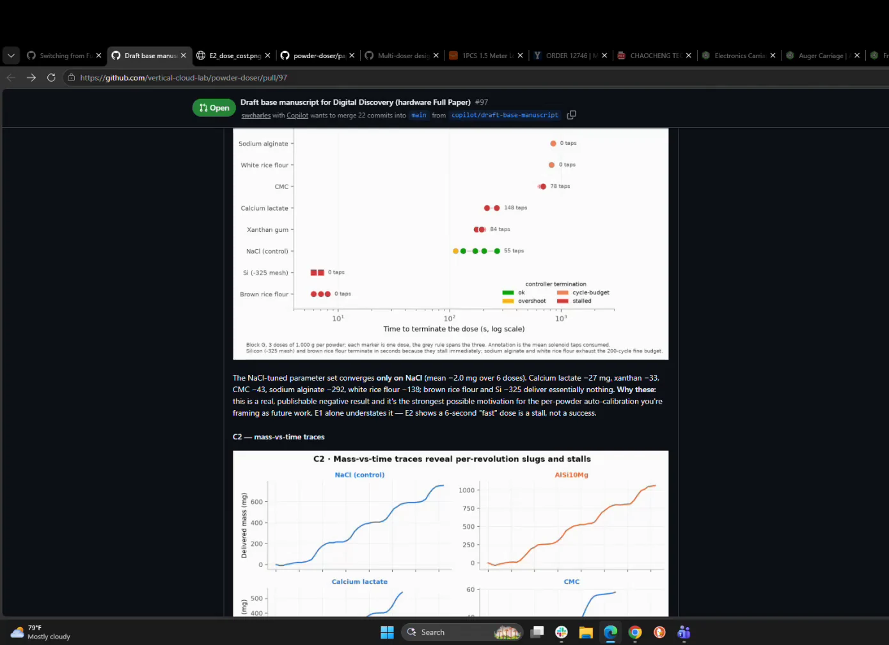

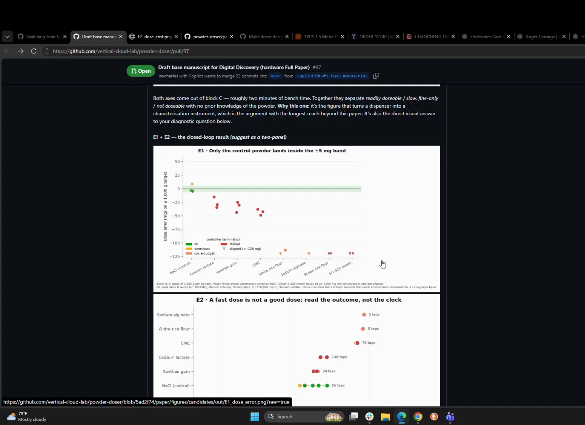

**Action:** Build it. Dose error (mg or %) on one axis, time to dose (s, log) on
the other, one marker per dose, powder encoded by **symbol and colour rather than
by an axis** — which is the concrete expression of F02. Source: protocol G only.
This is the single most specific new-figure request in the meeting, and Sam's
written notes list it under "What we still need".

### F61 / F62 / F67 / F68 — Isolate tilt, speed and tapping `00:37:19`, `00:41:07`

> "We kind of want to capture the effect of each, isolated. We've got **tilt, speed
> and tapping** — isolate the effects of those."
>
> "Do we have something like: one tap for this powder typically gives this much, and
> here's the spread?"
>
> "Things that feed at approximately the same rate with revolutions can have a
> dramatically different **tap response**."

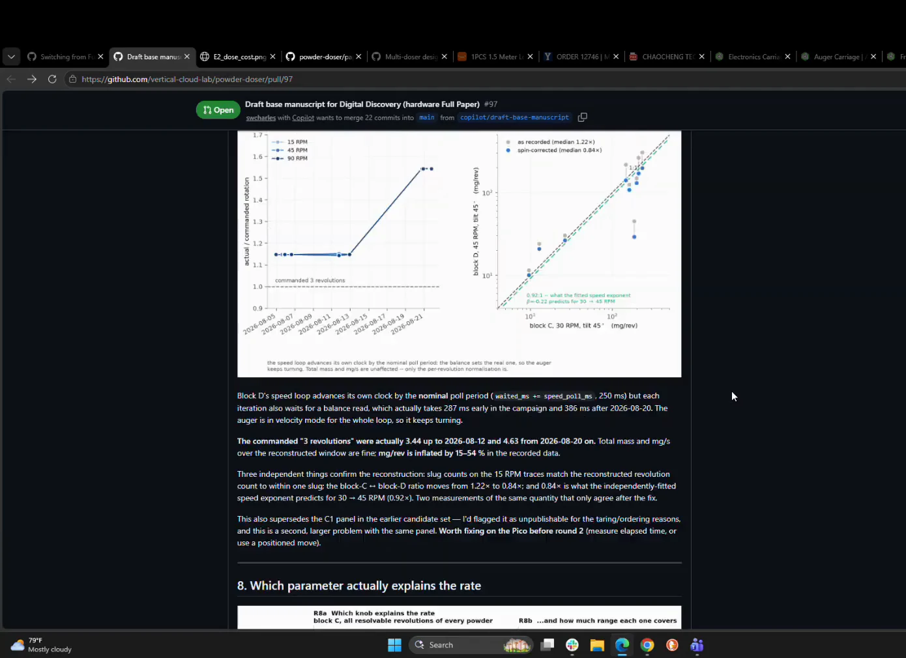
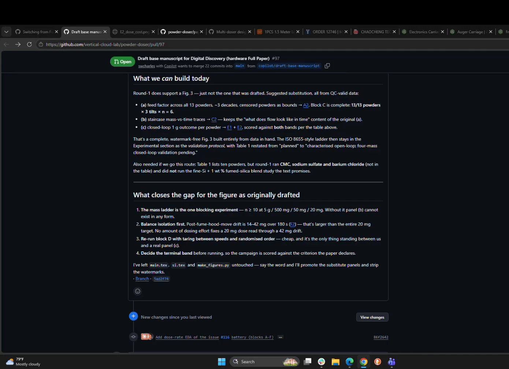
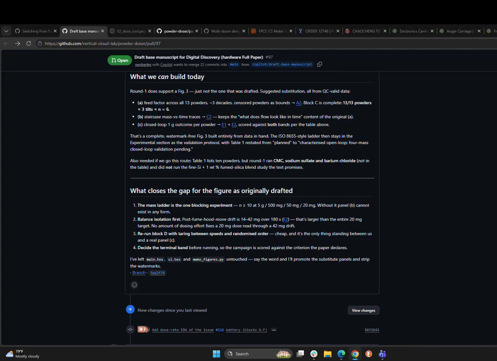

**Action:** One figure (or a three-panel figure) that isolates each actuation
knob. The tap-vs-feed-factor finding — powders with near-identical feed factors
having ~10× different tap quanta — is a genuine result and is the reason the tap
panel earns its place. Sam's notes: *"include the tap vs feed rate (G2?) — same
feed rate can mean different tap response"*.

### F63 / F64 — Only one target mass was ever tested `00:38:15`

> "Oh yeah, that's right. **We only did it for one mass.** … I figured if we talked
> about that one, doing it for a couple of different target masses. Like 20
> milligrams, 1 gram, 5 grams."

**Action:** This is the gap that makes Fig. 4(b) (the parity plot) unbuildable
from round 1. Resolved by protocols H/I — see F111–F113, where the mass ladder is
revised down to 50 / 200 / 1000 mg for noise-floor reasons.

### F66 — Non-flowing powders are a *design* finding, not a powder finding `00:40:19`

> "For the ones that didn't dispense, it's a question of: maybe we need to look at
> the auger geometry. Because if we had an empty cylinder, we'd expect some powder
> to flow if we tilt it at 90 degrees and spin it and tap it. So **that one becomes
> more of a design thing.**"

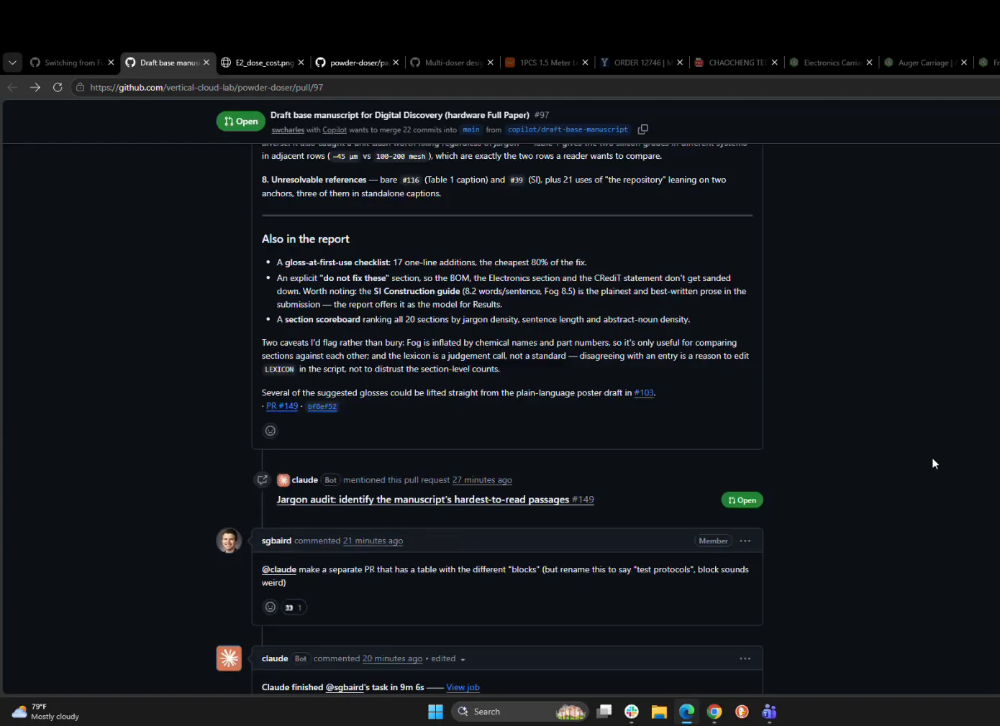
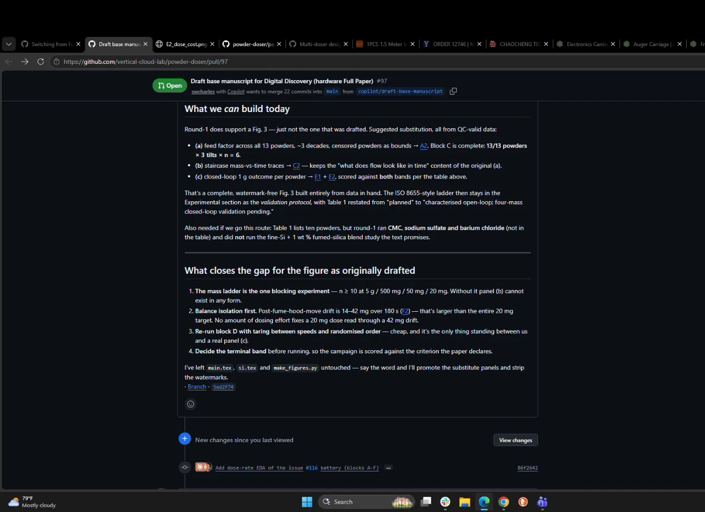
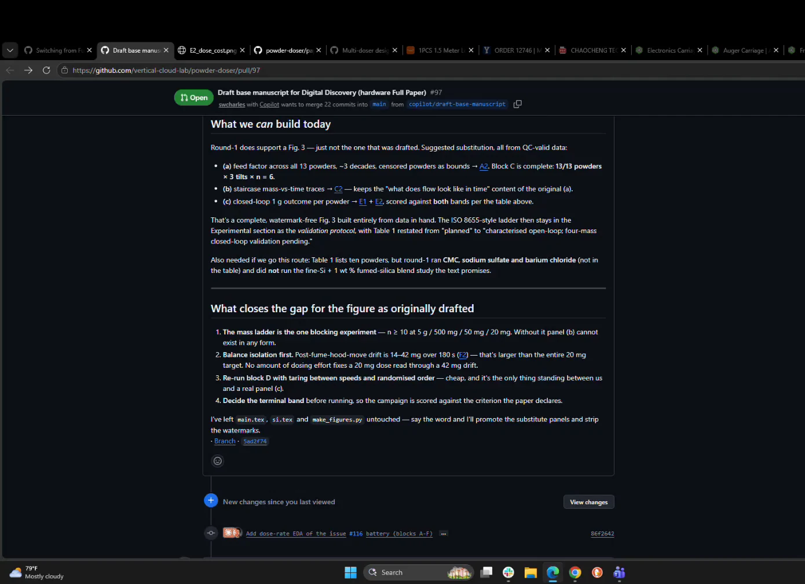

**Action:** Frame the three non-conveying powders as an **auger-geometry
limitation of this design** rather than a property of those powders — a wider
cavity, larger pitch or taller flight would move the boundary. Sam's notes agree:
*"note that for the ones that didn't dispense, it's probably a design thing"*.
This is consistent with F02 (the paper is about the doser) and it converts an
apparent negative into a stated design envelope plus a concrete next iteration.

### F88 / F89 — **Future work:** the doser as a powder-characterisation instrument `00:59:00`

> "Some of this could factor into Will's work with the optimisation. Maybe we have
> ways of describing powders that can help us learn more about their
> characteristics. That's what I was asking before — whether there was a Reynolds
> number for powders, and it said no."
>
> "The fact that you could change the speed of the auger and maybe be able to tell
> whether or not it's a cohesive powder — that's kind of cool. We could make note of
> that in the paper, going into future work: **this data can also tell us things
> about the powder.** For example, by changing the revolution speed we're able to
> distinguish between cohesive and non-cohesive powders."

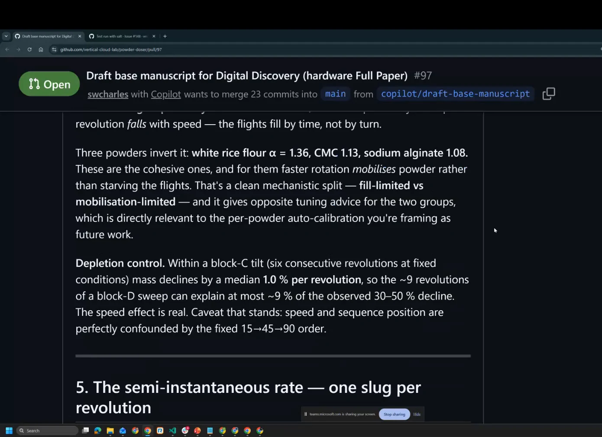
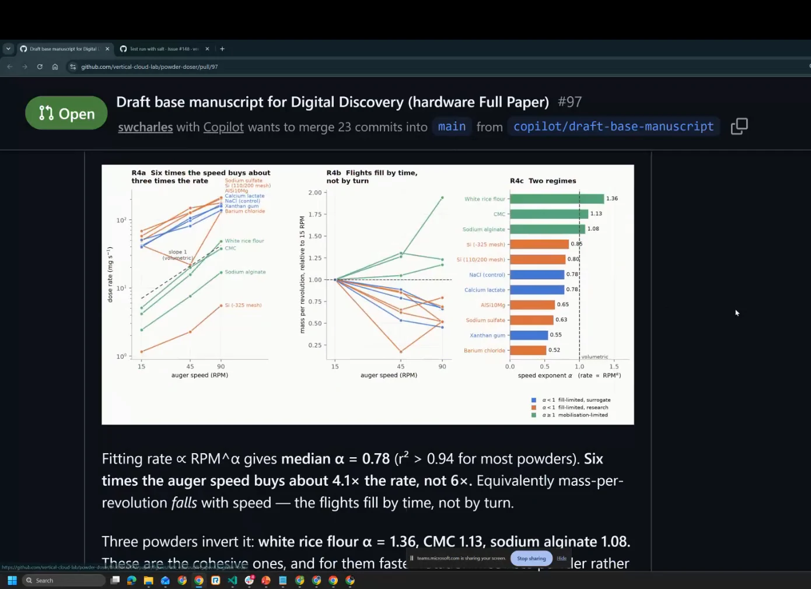
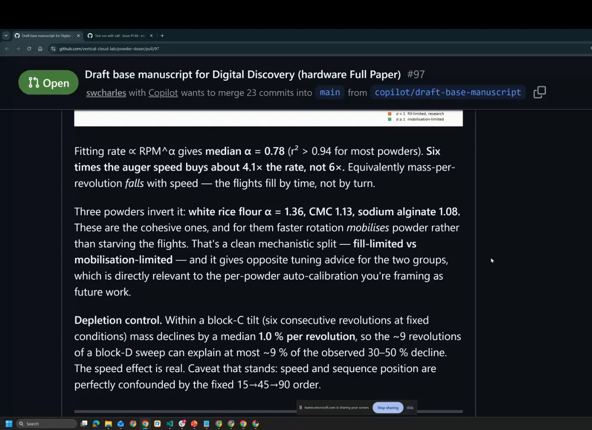

**Action:** Add a future-work paragraph on using the dosing battery itself as a
cheap powder-characterisation instrument, anchored on the fill-limited /
mobilisation-limited split from the speed sweep. Two honesty constraints: the
speed-sweep data currently rests on n = 1 per speed with a documented over-rotation
defect (F103/F104), and there is no independent powder characterisation to validate
against. Present it as a hypothesis with a named validation experiment, not as a
demonstrated capability.

---

## J. The dose-rate EDA, panel by panel

Screen sharing changes hands at `00:43:10`; from here Sterling drives.

### F70 / F71 / F72 — The coverage table, and the one real hole in the dataset `00:44:10`, `00:45:25`

> "19 runs, 13 powders, 1200 measured trials. … 36 closed-loop doses."
>
> "This is just showing how many trials were run. So it's basically saying we got
> all the data, **except that we don't have G for salt, sodium sulfate, the silicon,
> fumed silica, barium chloride, or the AlSi10Mg.** … **If we were to go back and
> collect some more data, filling in these would be the completeness step for the
> manuscript.**"

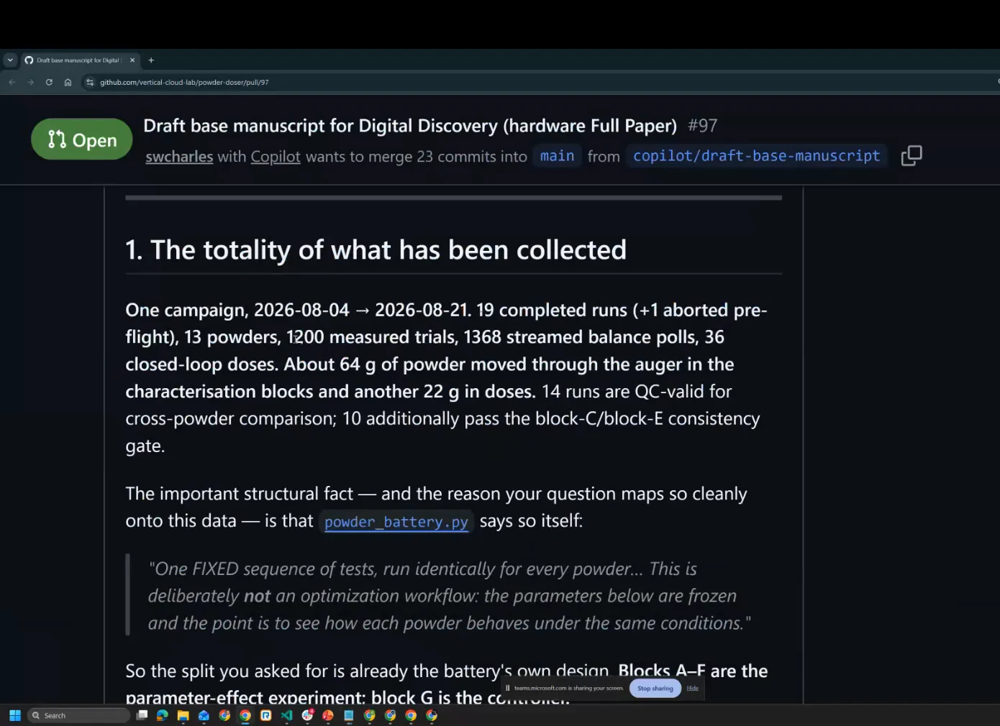
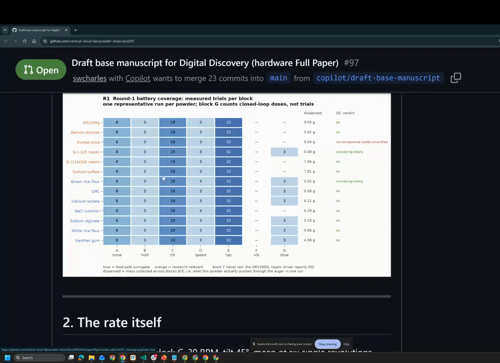
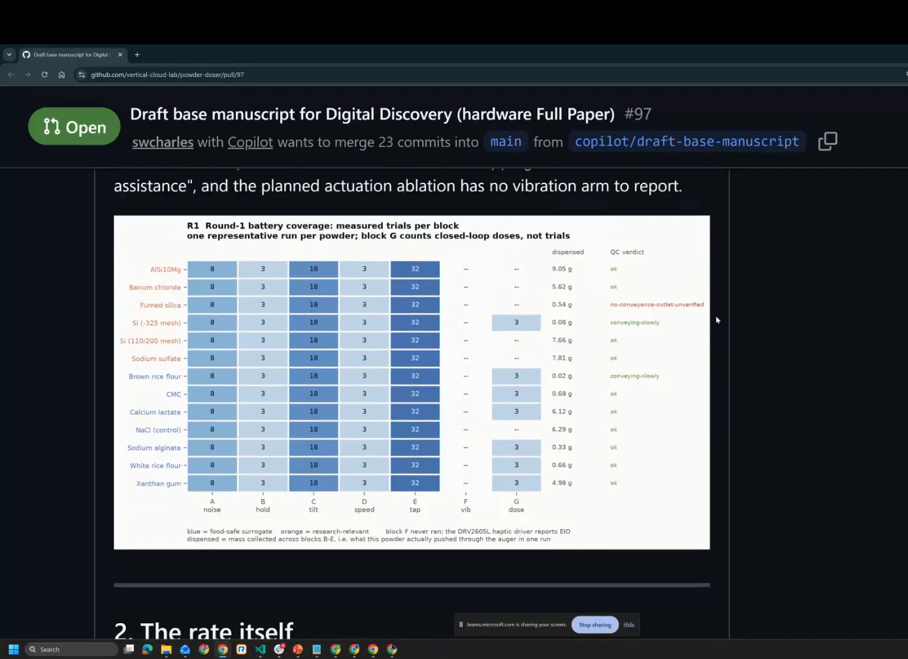

**Screen:** the R1 coverage matrix. Protocol G shows `3` for Si (−325), brown rice
flour, CMC, calcium lactate, sodium alginate, white rice flour and xanthan gum, and
`--` for AlSi10Mg, barium chloride, fumed silica, Si (110/200), sodium sulfate and
NaCl — exactly the six Sterling names. Protocol F is `--` for all 13.

**Action — highest-priority new bench work.** Re-run protocol G for those six
powders. Note the shape of the hole: **the six missing powders include five of the
six best conveyors and the entire research-relevant set except Si (−325).** The
closed-loop result currently characterises the powders that dose *badly* and omits
almost every one that doses *well*, which is precisely backwards for a paper about
a doser.

### F73 / F74 / F75 — Bench readiness `00:46:14`, `00:46:57`

> Sterling: "What do you think about redoing the three-phase dose test for the other
> ones?" … Sam: "We still have the augers that are filled."
>
> Sterling: "Do you know why [the scale] turned off? … It would be fine if Claude
> could send a ping and wake it up. Is it expected that the scale would turn off
> after some period of time?"
>
> Sam: "Yes, I can rerun those this week."

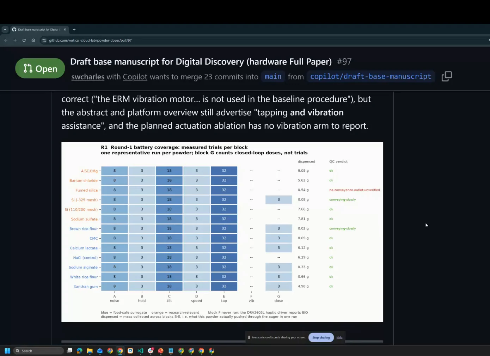

**Action:** (a) Determine whether the A&D HR-100A has an auto-off and disable it
or add a keep-alive ping; an unexplained mid-campaign balance shutdown is a data-
integrity risk. (b) Mark gaps in the streamed record explicitly rather than
letting them look like flat readings.

### F76 / F77 / F78 / F79 / F80 / F81 / F82 — The rate ladder and tilt `00:48:15`–`00:52:31`

> "**Dose rate spans three decades under one frozen parameter set.**"
>
> "In general, 90-degree tilt gives more dispensed mass. **How much of the flow is
> gravity, not the auger?** That's actually interesting."
>
> "**This shouldn't even be on there.** Fumed silica … is 2× faster? I think that's
> probably because it was measuring the noise floor on the scale and it happened to
> be greater than one."
>
> "Is there something that wouldn't work at 90 degrees that would work at another
> angle? **That's a story.**"
>
> "**Keeping in mind this is log scale** — it has a bigger effect in relative
> percent than it does in magnitude."


**Actions:**
- Keep the three-decades-under-one-parameter-set claim; it is the strongest
  single sentence available about the instrument. (Rescale first — F106.)
- Reframe the tilt panel around "how much of the delivery is gravity rather than
  the auger", which is the physically interesting question.
- **Remove derived ratios for censored powders.** A 2× "gravity assist" for fumed
  silica is a ratio of two noise-floor readings. Any derived quantity must inherit
  the censoring, not launder it into a finite number.
- Keep the Si (−325) result — conveys nothing at 0° and 45°, something at 90° —
  and state the flip-side question as an open one.
- Add a log-scale caution wherever relative and absolute effects diverge.

### F83 / F84 / F85 / F86 / F87 — The speed sweep and the two regimes `00:53:46`–`00:58:52`

> "Six times the speed buys about three times the rate. … Spinning it faster —
> that's not looking so good, but it's the most interesting thing in the data."
>
> "By time, not by turn. … So you're dispensing less mass per revolution at 90 RPM,
> but you're doing more revolutions in the same amount of time."
>
> "And it's calling those regimes: **fill-limited versus mobilisation-limited.**"


**Action:** Keep the fill-limited / mobilisation-limited framing — it is
mechanistic, it splits the powders into two physically sensible groups, and it
gives opposite tuning advice for each group. **But it cannot be published as it
stands**: n = 1 per speed, no taring between speeds, fixed 15→45→90 order (so
speed and sequence position are perfectly confounded), and the over-rotation
defect of F103. Re-run the speed sweep with randomised order and taring between
speeds before this claim goes in.

### F90 / F91 / F92 / F93 / F94 / F95 — One slug per revolution `01:00:23`–`01:03:29`

> "Block C, six consecutive revolutions at fixed conditions, mass declines by a
> median 1 % per revolution. Actually — basically this is the fill level."
>
> "Discharge locks to the revolution: median autocorrelation peak at 4 seconds.
> Pulsation is real at 15 RPM, but 45 and 90 RPM are under-sampled."
>
> "NaCl — not much accumulating until we've already done a full revolution. It's
> like leading edge versus trailing edge. … Is that just where it happened to be?"
>
> "You can't guarantee they'll start at the exact same place … So that gets tricky:
> **how do you reset an experiment? What's a reset?** But also, when you're actually
> dosing you're not going to reset every time."


**Actions:**
- Keep the one-slug-per-revolution result — it is the mechanism behind the dose
  floor, the tap quantum and the RSD scaling.
- Reframe "depletion control" as what it is: a **fill-level effect**, which ties
  back to the uncontrolled fill level of F19.
- Add the initial-phase / reset problem to limitations: dose outcome depends on
  where in the helix the powder happens to sit at the start, there is no defined
  reset, and in real dosing you would never reset anyway. This is honest and it is
  a good hook for future work.

### F96 / F97 — Cut the crest factor `01:04:54`, `01:05:55`

> "Crest factor — the ratio of a waveform's peak amplitude to its root-mean-square
> value … All right, some measure of spikiness. **I don't think we really need to
> hear about that.**"


**Action:** Drop crest factor. It also happens to be partly unmeasurable here —
the 45 and 90 rpm values are aliasing floors, not measurements — so cutting it
removes a jargon term *and* a claim that could not have been supported.

### F98 / F99 — Do not put every knob on one axis `01:06:20`

> "Maybe this goes to say: **let's not put everything on one axis.** Or at least
> not in this way. I get what it's saying … but it's confusing."


**Action:** Retire the combined "every actuation event on one axis" panel. Split
into the isolated-knob panels of F61.

### F100 / F101 / F102 — "Nothing flows on its own" is a real, keepable result `01:07:45`

> "Across every powder and every tilt, a 15-second static hold with no actuation
> produced no mass change. … Clean shut-off. One to 12 % of a revolution."
>
> "One thing we didn't do … what happens if we **pause** it? One revolution, pause,
> and go again — or pause it half a revolution. That would resolve what's happening
> inside the auger."
> Sam: "Transparent augers … would be awesome. Technically we do the resin prints."


**Action:** Promote this into the results. The manuscript currently *asserts*
clean shutoff; protocol B *measures* it. Add the pause-mid-revolution experiment
and the transparent (resin-printed) auger to future work.

### F109 / F110 — The variance decomposition `01:15:55`, `01:16:20`

> "Powder affects it a lot. Tilt angle has a high effect. Powder-and-tilt
> interaction, not as much. … **I wouldn't have split that up.** It'll show both —
> split up individually, and then also show cross-correlations."
>
> "This is reasonable — like, randomise the order."


**Action:** If the variance decomposition is kept, show main effects and
interactions together rather than as separate bars. And randomise run order in
round 2 — which is the same fix the speed sweep needs (F83).

---

## K. Two hard defects found during the meeting

### F103 / F104 / F105 — Block D over-rotates, and the factor changed mid-campaign `01:09:20`

> "A firmware defect the EDA turned up. Block D over-rotates by a factor that
> stepped mid-campaign. … When it commanded 3 revolutions, the actual was a little
> bit more than that … but then at some point it started really overdoing the
> rotation."


**Screen:** the speed loop advances its own clock by the *nominal* poll period
(250 ms) while each iteration actually waits for a balance read (287 ms early,
386 ms after 2026-08-20), and the auger stays in velocity mode throughout. The
commanded "3 revolutions" were actually 3.44 and later 4.63.

**Action:** Fix on the Pico before round 2 — measure elapsed time, or use a
positioned move. During the meeting Sterling began drafting a GitHub issue for
this (visible at `01:12`–`01:13`).

### F106 / F107 / F108 — ⚠️ The gear ratio is not 1:1, and the paper's stated ratio is also wrong `01:14:50`

> Sam: "One thing I keep forgetting to change: **it thinks that the stepper motor
> and the auger gear are the same ratio.** … It's really not. So I need to let it
> know that, and I can update the data. That'll affect everything that says
> revolution. **When I commanded three revolutions, that was one revolution.**"
>
> Sterling: "It could be inconsistent — sometimes it's accounting for that and other
> times it isn't."
>
> Sterling: "There were no changes in parts, right?" · Sam: "I don't think there were
> any parts swapped out."


**Verified against the repository — this is worse than it sounded in the room:**

| | Value | Source |
|---|---|---|
| Auger gear | 48 teeth | `cad/auger-geared/auger-core.scad`, `gear_teeth = 48` |
| Stepper pinion | 16 teeth | `cad/auger-geared/stepper-pinion.scad`, `pinion_teeth = 16` |
| **True reduction** | **3.0 : 1** | `stepper-pinion.scad` header: `Gear ratio (reduction) = Z_g / Z_p = 48 / 16 = 3.0 : 1` |
| Ratio stated in the paper | **2.25 : 1** | `paper/main.tex` §Mechanical design — **incorrect** |
| Ratio used by the firmware | **1 : 1** (implicitly) | `hardware/test-module/firmware/main.py`: `steps_per_rev = STEPPER_FULL_STEPS_REV * STEPPER_MICROSTEPS`, no gear term |

**Consequences.** A commanded "revolution" is one *stepper* revolution, i.e. one
third of an auger revolution — which matches Sam's "three revolutions was one
revolution" exactly. Therefore:

- Every **mg per revolution** figure in A2, F1, D1, R2, R3, R4, R6 and R8 is a
  mg-per-*stepper*-revolution figure. Per auger revolution, the true values are
  **3× larger**.
- Protocol C's "6 revolutions" at each tilt were **2 auger revolutions**.
- Protocol D's "3 revolutions" were 3.44 or 4.63 *stepper* revolutions — about
  **1.15 to 1.54 auger revolutions**. This compounds with F103.
- The one-slug-per-revolution autocorrelation result at 15 rpm (F91) needs
  re-checking: a 4.00 s period is one *stepper* revolution at a commanded 15 rpm;
  if the auger turns at 5 rpm, a slug per *auger* revolution would be 12 s. Either
  the slug is per stepper turn (which would need a mechanical explanation) or the
  period attribution is wrong. **This must be resolved before the claim is
  published**, because it is currently one of the headline mechanistic results.
- `main.tex` must be corrected from 2.25:1 to 3.0:1 regardless.

This is the highest-severity item to come out of the meeting and it is the one
thing that blocks nearly every quantitative figure.

---

## L. New bench work: protocols H and I

### F111 / F112 / F113 / F114 — A mass ladder at 50, 200 and 1000 mg `01:18:21`

> "If you were to go back and collect some more data — if we had an **H and an I**
> … like 50 milligrams, 200 milligrams, 1 gram. I don't know if we want to go up to
> 5 grams because we're going to have to be refilling it. I don't even know if we
> have 5 grams to dispense."
>
> "Which ones are we pretty limited on?" · Sam: "I think it's silicon 110/200."
>
> "So if we added an H and an I, where H is **50, 200 and 1000** milligrams. That
> feels OK for capturing different ranges."
>
> "It's in the fume hood for a lot of these, and there's maybe a **50-milligram
> noise threshold** on some of it, so it's a little safer to go a little higher."


**Action:** Add protocols **H** and **I** as a closed-loop mass ladder at 50 /
200 / 1000 mg. Notes:
- This supersedes the earlier plan of 5 g / 500 mg / 50 mg / 20 mg. 5 g is dropped
  (refill burden, and limited stock of Si 110/200); 20 mg is dropped because it
  sits below the post-fume-hood-move noise floor.
- The 50 mg point is deliberately close to the noise floor. Report the balance
  noise floor alongside it rather than pretending it is clean.
- The ladder plus the protocol-G backfill (F72) are the two bench jobs that gate
  submission. Sam committed to Thursday.

---

## M. Scope boundaries and the U of U target

### F115 / F116 / F117 — 0.1–10 mg is out of reach, and that is the answer `01:20:47`

> *(reading issue #117)* "'Can the current system reliably deliver 0.1 to 10
> milligrams of a powder to a small reaction vial or 96-well plate?' **No.**"
>
> "And I think we could probe that more. But first, I think we want more of Will's
> stuff in place before we spend a whole bunch of time on it. Second, we'd want
> really good **vibration isolation**. And third, probably **new auger dimensions**
> — because I think it'll be too hard to do until you change the dimensions."


**Screen:** issue #117, quoting Phillip Lampkin (University of Utah): 0.1–10 mg of
powder into a small reaction vial or 96-well plate, and 0.5–3 mg of solid
initiators into 10 mm test tubes. Sterling has "~0.1-10 mg" highlighted.

**Action:** State the operating envelope honestly and name the three things that
would extend it (per-powder calibration, vibration isolation, revised auger
dimensions). Do not claim the 0.1–10 mg range. This is a good, concrete
future-work paragraph and it connects the paper to a named external user need.

### F120 / F121 — Multi-doser weighing station (out of scope for this paper) `01:23:20`

> "Maybe it's useful to have a **weighing station** as well. Something that could
> push it up, check the weight, then dispense, then go back and check the weight
> again." · Sam: "I guess you just put a load cell on the end of it."


**Action:** Record in the multi-doser thread. Not a change to this manuscript.

---

## N. Process, tone, and timeline

### F65 — The analysis prose reads as condescending `00:39:19`

> *(reading)* "'No, you cannot compute the CV from n = 1.' Thank you. Well —
> condescending. It's often insulting. Were you trying to insult my intelligence?"


Restated at `00:54:30`:

> "If you think of Claude as a cynical robot that's kind of sarcastic and salty
> towards you and very lazy … it totally changes how you read things."

**Action:** A style constraint for all future AI-drafted analysis in this project:
state the limitation without the rhetorical flourish. "Only one measurement was
taken at each speed, so a coefficient of variation cannot be computed" says the
same thing without the sting. The statistics were correct; the register was not.

### F122 / F126 / F127 / F128 — How the work comes back `01:24:46`, `01:27:15`

> Sam: "This is a lot of graphs. Do you want to cut this down a bit? … I'm a little
> overwhelmed. We have a lot of graphs here and they require a lot of changes. So
> I'm wondering if I should just say **'make a list of, like, we want these eight
> figures — look at the data and give me these eight figures.'**"
>
> Sterling: "I'll take the transcript recording and have it try to summarise that.
> If you could also send me your notes, I can include that in the prompt. Then we'll
> review the prompt … We'll take the transcript, we'll take your notes, we'll have
> Claude merge that into a cohesive set of things. We'll double-check it. Then we'll
> just let it run."
>
> Sam: "Then we're just going to bring this into **Overleaf**, make any final edits,
> and here's the PDF — then we'll submit."


**This document and [REVISION-SPEC.md](REVISION-SPEC.md) are that merge step.**
The agreed sequence is: merge transcript + notes into a spec → humans review and
edit the spec → run it → new bench data folds in → Overleaf → submit. The spec is
deliberately *not* implemented yet.

### F123 / F124 / F125 — Timeline `01:25:05`, `01:26:40`

> "Ideally if we can get it back with revisions — more like **November** would be
> awesome." · Sam: "I think I can do these tests this week. … Thursday."
>
> "We're also going to put the **preprint** out there. … It's a natural question
> they'll be asking: 'well, if I want 50 milligrams, can I get it? And how long does
> it take? And how accurately did it get there?'"


**Action:** Target revisions back by November; preprint before or alongside
submission; the H/I mass ladder is worth doing *before* the preprint because it
pre-empts the most obvious reviewer question.

---

## O. Sam's written notes, reconciled against the recording

`sources/sam_charles_raw_notes.txt` was written independently of the meeting and
requested separately. Items that appear in **both** the notes and the recording are
the strongest signals in this whole exercise; items that appear **only** in the
notes were never discussed aloud and need a decision.

| Sam's note | In the recording? | Where |
|---|---|---|
| "Digital Discovery's parameters, etc.?" | No | **Open question — see below** |
| "more about what we learned about ai's limitations?" | No | **Open question — see below** |
| "less jargon — more easily understandable, more like easy posters" | Yes | F01 |
| "fewer acronyms" | Partly (RSD) | F10, F23 |
| "Dispense speed (grams/revolution)" | Yes | F13 |
| "What metric are we using to show how well it dispenses? speed? accuracy? (that's a control problem)" | Yes | F28 |
| "Results of each powder after 30 seconds of spinning… this is the E1 graph" | Yes | F28 |
| "time to terminate dose is good" | Yes | F36 |
| "mass v time is good (showing in real time how it dispenses)" | Yes | F46 (C2) |
| "Several of the graphs are confusing… largely because of jargon and acronyms" | Yes | F09, F23 |
| "platform overview is helpful, others are not" | Yes | F03, F06 |
| "add coordinate frame into picture?" | Yes | F05 |
| "cross section is helpful" | Yes | F06 |
| "design case studies are helpful" | Yes | `00:05:35` |
| "keep the timeline in it, or # of pings per time" | Yes | F03/F04 |
| "A2 — good information to display graphically" | Yes | F14 |
| "keep visual separation between food safe and research relevant" | Yes | F15 |
| "no data for the ones that really didn't dispense" | Yes | F11/F16 |
| "Caption clarifications about other factors, i.e. fill level, shape" | Yes | F17/F18 |
| "what was the fill level for all of these?" | Yes | F19 |
| "raw data available where?" | Yes | F18 |
| "F1: RSD? mess with it, clarify, like the idea" | Yes | F23 |
| "E1: used a simple method, in future work control problem will be solved" | Yes | F29 |
| "unique powder type / flowed fast / accurate under same procedure / time to dose point" | Yes | F38 |
| "what didn't flow well, why didn't it flow well" | Yes | F38, F66 |
| "SEM images to characterize" | Yes | F39 |
| "why did they stall???" | Yes | F40–F43 |
| "C2 is good" | Yes | F46 |
| "supplemental includes table of test — move to main" | Yes | F60 |
| "scatterplot of dose error vs time to dose" | Yes | F58 |
| "pull from G" | Yes | F59 |
| "include the tap vs feed rate (G2?) — same feed rate can mean different tap response" | Yes | F67/F68 |
| "RE-run G for the powders we're missing" | Yes | F72 |
| "powders that do work at 90 but not the others, and vice versa" | Yes | F81 |
| "50, 200, 1000 mg (Block H)" | Yes | F113 |
| "50 is about the noise ceiling" | Yes | F114 |
| "add into the data where everything was (food safe in lab, research relevant in fume hood)" | Yes | F118/F119 |
| "@the U they're trying to dispense 0.1–10 mg" | Yes | F115 |
| "This data can characterize the powders / changing revolution speed tells if cohesive" | Yes | F88 |
| "for the ones that didn't dispense, it's probably a design thing" | Yes | F66 |
| "we're trying to showcase the powder doser, not the powders" | Yes | F02 |
| "table showing tests we ran (blocks) clearly and succinctly?" | Yes | F25/F26 |

### The two notes that were never discussed aloud

These are the only substantive items with no counterpart in the recording, so they
need an explicit decision rather than being folded silently into the spec.

1. **"Digital Discovery's parameters, etc.?"** — most plausibly: do we actually
   meet the journal's requirements for a hardware Full Paper (length, structure,
   data-availability, LLM-usage declaration)? `paper/guidelines/` holds the
   committed author guidelines, so a compliance checklist is buildable. Flagged in
   the spec as an item needing confirmation of intent.
2. **"more about what we learned about ai's limitations?"** — a request to expand
   the generative-AI findings, which is currently the paper's *second* contribution
   but is thinner than the hardware half. This bears directly on the round-2 Edison
   reviewer (Schulz) asking for the AI-CAD workflow to be formalised with
   quantitative log analysis. Worth expanding, but it cuts against Sterling's
   push to shorten and simplify, so it needs a call.

---

## Cross-references to work already in flight

| Meeting item | Already covered by | Status |
|---|---|---|
| F01 jargon | **PR #149** (`paper/readability/JARGON-AUDIT.md`) | Written, not applied |
| F25/F26 protocol table | **PR #150** (SI Table S2) | Written; F60 asks to move it to main text |
| F55 protocol F never ran | PR #150 "Two things I'd flag" | Documented; manuscript text unchanged |
| F07 synthetic data | Round-2 Edison mock review, editor + all 3 reviewers | The shared top blocker |
| F38 performance figure | Edison R1 (Abolhasani): dose accuracy/repeatability | Same request from two directions |
| F39 SEM / characterisation | Edison R2 (Khinast): PSD, density, flowability table | Same request from two directions |
| F61 isolate knobs | Edison R2: actuation ablation | Same request; note F55 means there is no vibration arm |
| F88 powder fingerprinting | `paper/powder_plan/calibration_lit.answer.md` | Literature support already gathered |
