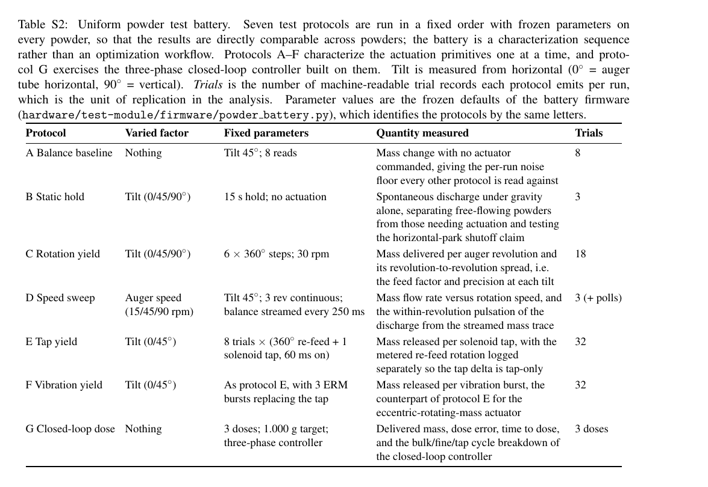

# Test protocols

The uniform powder test battery runs one frozen sequence of seven
**test protocols** on every powder, so results are directly comparable
across powders. It is a characterization sequence, not an optimization
workflow: the parameters are fixed and the point is to see how each
powder behaves under identical conditions.

Protocols A–F characterize the actuation primitives one at a time;
protocol G exercises the three-phase closed-loop controller built on
them. Tilt is measured from horizontal (0° = auger tube horizontal,
90° = vertical).

The firmware and the raw CSVs identify these by the same letters, in a
field named `block`; that field name is part of the serial protocol and
is unchanged. Only the prose and tables say *test protocol*.

## Specification

As typeset in the SI (Table S2):

Parameters are the frozen defaults of
`hardware/test-module/firmware/powder_battery.py` (`BATTERY_VERSION = 2`).
*Trials* is the number of machine-readable trial records each protocol
emits per run — the unit of replication in the analysis.

| Protocol | Varied factor | Fixed parameters | Quantity measured | Trials |
|---|---|---|---|---|
| **A** Balance baseline | Nothing | Tilt 45°; 8 reads | Mass change with no actuator commanded, giving the per-run noise floor every other protocol is read against | 8 |
| **B** Static hold | Tilt (0/45/90°) | 15 s hold; no actuation | Spontaneous discharge under gravity alone, separating free-flowing powders from those needing actuation and testing the horizontal-park shutoff claim | 3 |
| **C** Rotation yield | Tilt (0/45/90°) | 6 × 360° steps; 30 rpm | Mass delivered per auger revolution and its revolution-to-revolution spread, i.e. the feed factor and precision at each tilt | 18 |
| **D** Speed sweep | Auger speed (15/45/90 rpm) | Tilt 45°; 3 rev continuous; balance streamed every 250 ms | Mass flow rate versus rotation speed, and the within-revolution pulsation of the discharge from the streamed mass trace | 3 (+ polls) |
| **E** Tap yield | Tilt (0/45°) | 8 trials × (360° re-feed + 1 solenoid tap, 60 ms on) | Mass released per solenoid tap, with the metered re-feed rotation logged separately so the tap delta is tap-only | 32 |
| **F** Vibration yield | Tilt (0/45°) | As protocol E, with 3 ERM bursts replacing the tap | Mass released per vibration burst, the counterpart of protocol E for the eccentric-rotating-mass actuator | 32 |
| **G** Closed-loop dose | Nothing | 3 doses; 1.000 g target; three-phase controller | Delivered mass, dose error, time to dose, and the bulk/fine/tap cycle breakdown of the closed-loop controller | 3 doses |

## As-run coverage, round-1 campaign

Computed from the tidy CSVs in `../figures/candidates/data/` by
`make_protocol_table.py`, over the 19 runs of the round-1 campaign
(2026-08-04 to 2026-08-21, 13 powders). *Requested* counts runs whose
`blocks` string asked for the protocol; *records* counts the trial (or
dose) rows it actually produced.

| Protocol | Runs requesting | Runs producing records | Records |
|---|---|---|---|
| **A** Balance baseline | 19 | 19 | 152 |
| **B** Static hold | 19 | 19 | 57 |
| **C** Rotation yield | 19 | 19 | 342 |
| **D** Speed sweep | 19 | 19 | 57 |
| **E** Tap yield | 19 | 19 | 592 |
| **F** Vibration yield | 11 | 0 | 0 |
| **G** Closed-loop dose | 12 | 12 | 36 |

**Protocol F produced no records in any run.** 11 runs asked for it and
each got a skip record: the DRV2605L haptic driver reports `EIO`, so the
vibration actuator is uncharacterized across the whole campaign. The
Experimental section already states that the ERM motor is not used in the
baseline dosing procedure, but the abstract and platform overview still
advertise vibration assistance, and the planned actuation ablation has no
vibration arm to report.

Protocol E emits 32 records in a complete run (two tilts × 8 trials × two
records per trial: the metered re-feed rotation and the tap itself); one
truncated run contributed 16.
