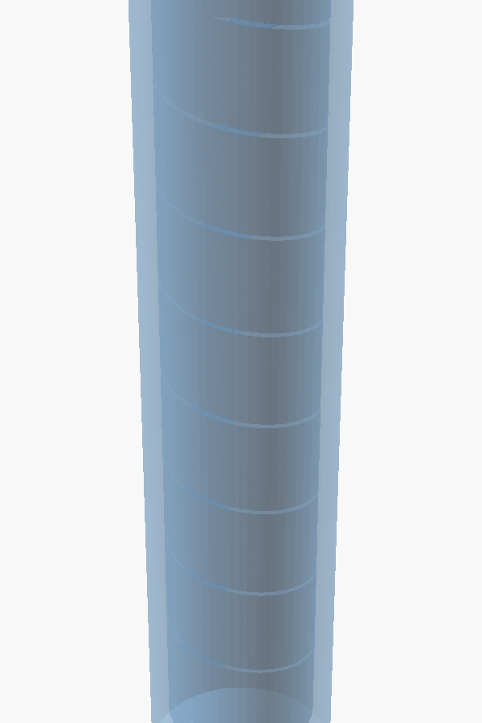
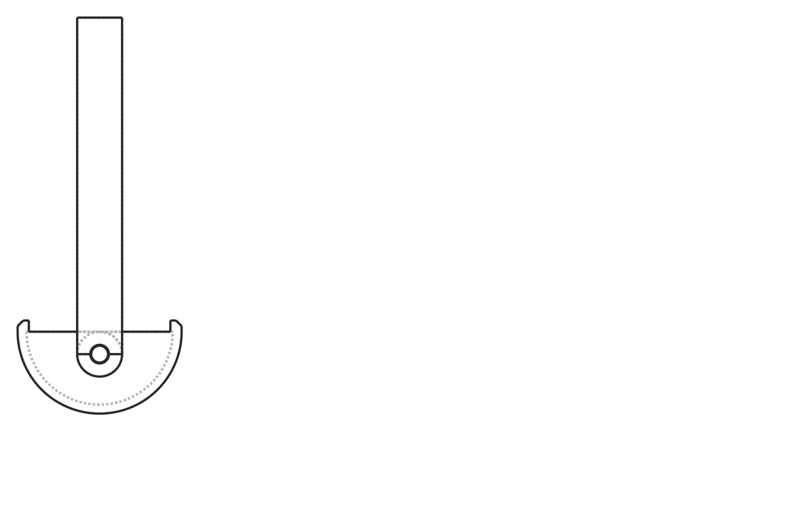
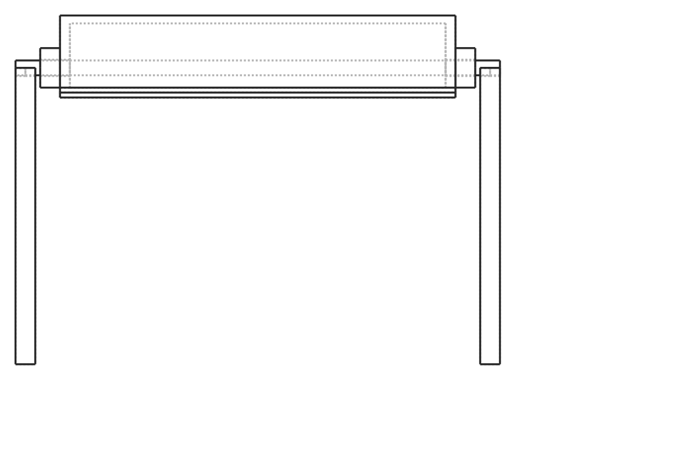
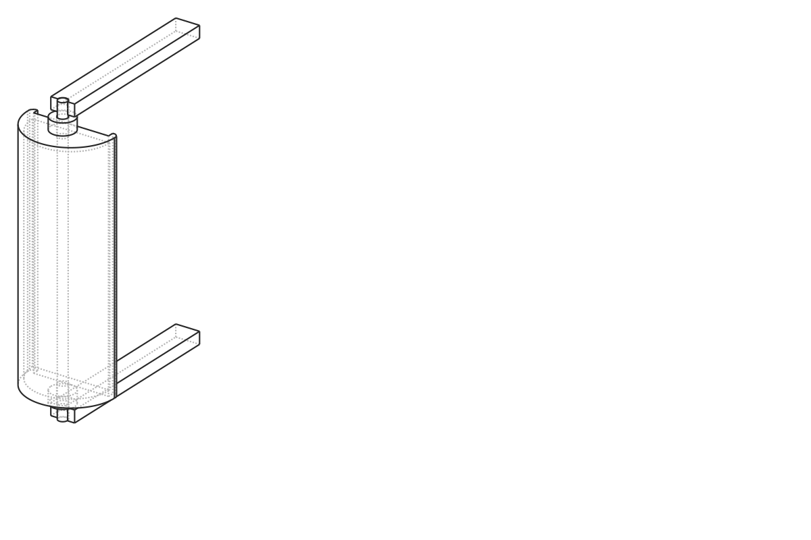
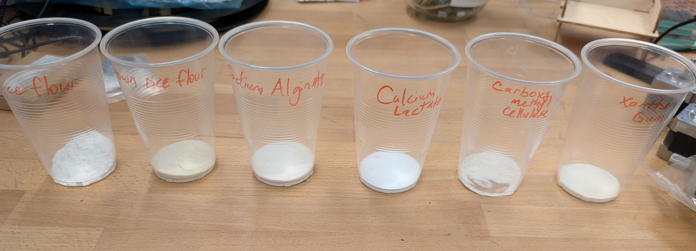
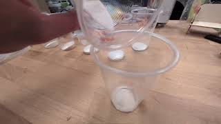
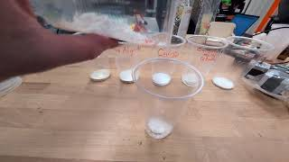
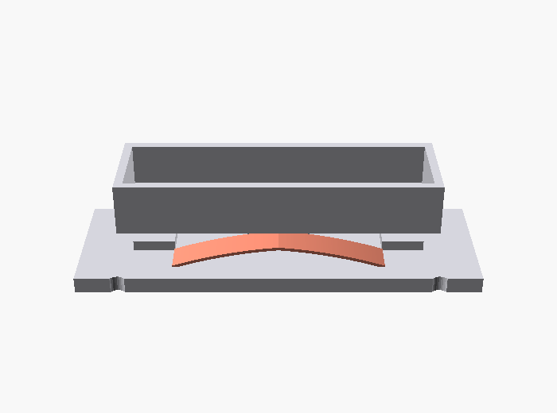
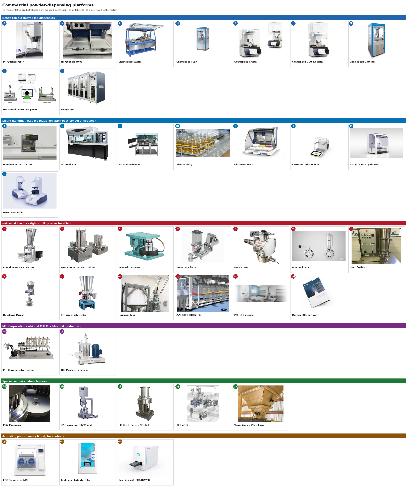
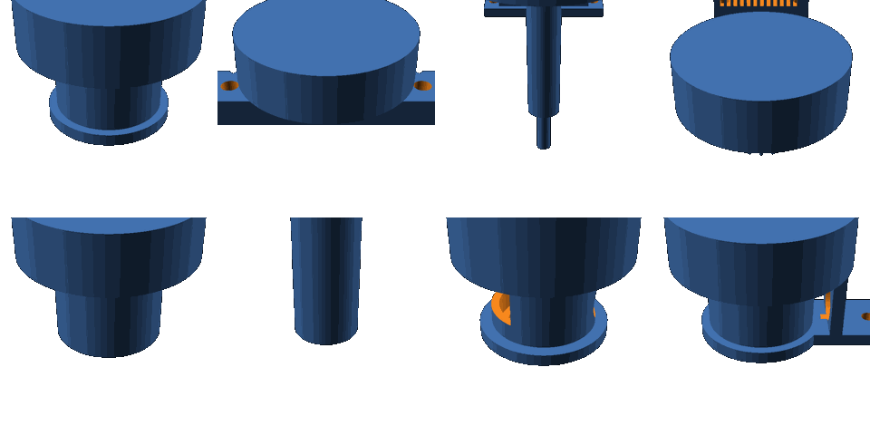

<!-- _class: title -->
<!-- _paginate: false -->

# Powder dispenser

Sterling Baird · Devora Najjar · Ron
*with Nasa's help on the Ultimaker print*

[▶ Project walkthrough on YouTube — *AI-designed powder dispenser, POSE 2026*](https://www.youtube.com/watch?v=0CAu-x3wXns)

[github.com/vertical-cloud-lab/powder-doser — PR #16](https://github.com/vertical-cloud-lab/powder-doser/pull/16)

---

<!-- _class: image-only -->

# Our final concept is a 3D-printed Archimedes auger.

  

  

---

<!-- _class: image-only -->

# First sketch: a side-pivoting trough that pours over its long edge.

*Pivot axis runs along the trough length L; the trough rolls sideways and pours over the full long edge.*

---

<!-- _class: image-only -->

# Revised: a cam ramp keeps the rim engaged through the full rotation.

*Rim stays in contact with the cam ramp throughout rotation; pours over the full long edge.*

---

<!-- _class: image-only -->

# Cam-driven scoop — side, iso, and top views.

  

  

  

---

<!-- _class: image-only -->

# We screened seven candidate powders by hand-feel.

*Rice flour · brown rice flour · sodium alginate · calcium lactate · carboxymethyl cellulose · xanthan gum.*

---

<!-- _class: image-only -->

# Hand-scooping established the dose target — and the failure modes.

[▶ Pouring xanthan gum — youtube.com/watch?v=VAltAawtkA4](https://www.youtube.com/watch?v=VAltAawtkA4)

---

<!-- _class: image-only -->

# Powder clung to scoop walls; one sample stayed put after dumping.

[▶ Pouring rice flour — youtube.com/watch?v=IMuK3LTAWLM](https://www.youtube.com/watch?v=IMuK3LTAWLM)

*Surface forces (electrostatic, van der Waals) dominate at this scale — Devora's call from issue #3.*

---

<!-- _class: image-only -->

# A bistable snap-through trough was one alternative we explored.

---

<!-- _class: image-only -->

# The bistable mechanism has two energy wells at ±1.9 mm.

*PR #5 — parametric OpenSCAD + FEA cross-check, peak snap **2.36 N**, 23 passing / 1 skipped.*

---

<!-- _class: image-only -->

# Commercial dispensers span lab balances to industrial feeders.

*Edison Scientific surveyed the landscape — no off-the-shelf unit hit our μg–mg, low-cost, open-source target.*

---

<!-- _class: image-only -->

# We considered eight concepts before converging on the auger.

*Sterling Baird · Devora Najjar · Ron · with Nasa's help on the Ultimaker print.*
