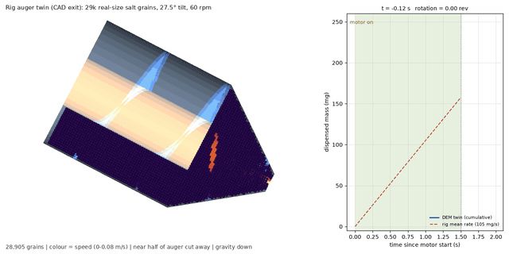
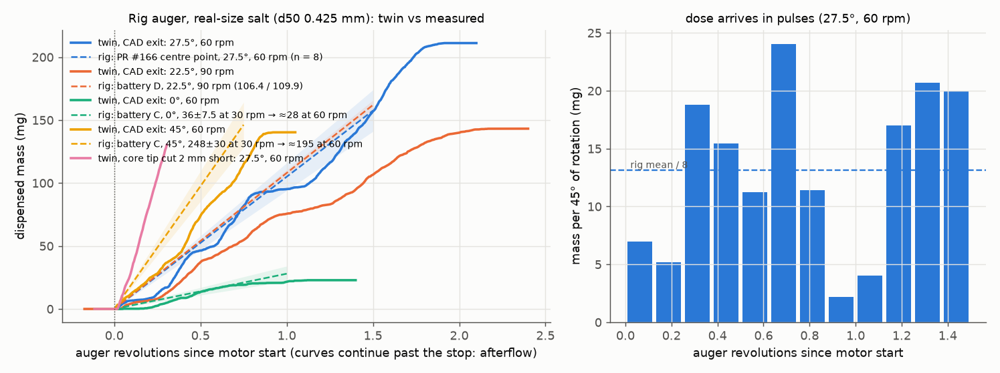
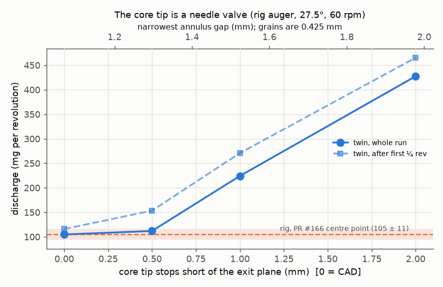
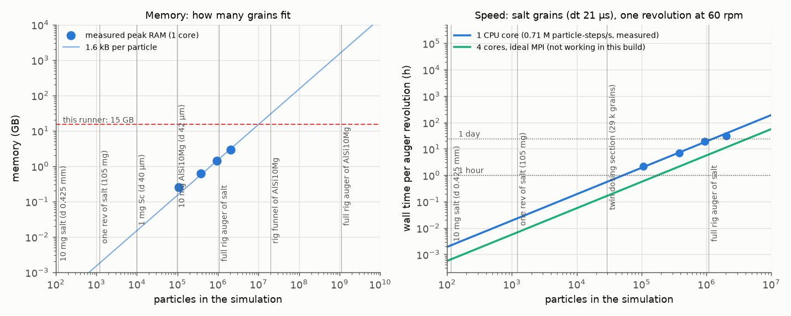
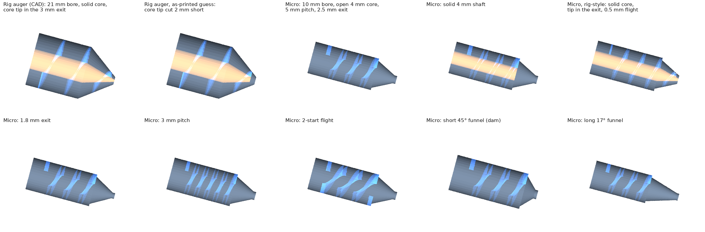
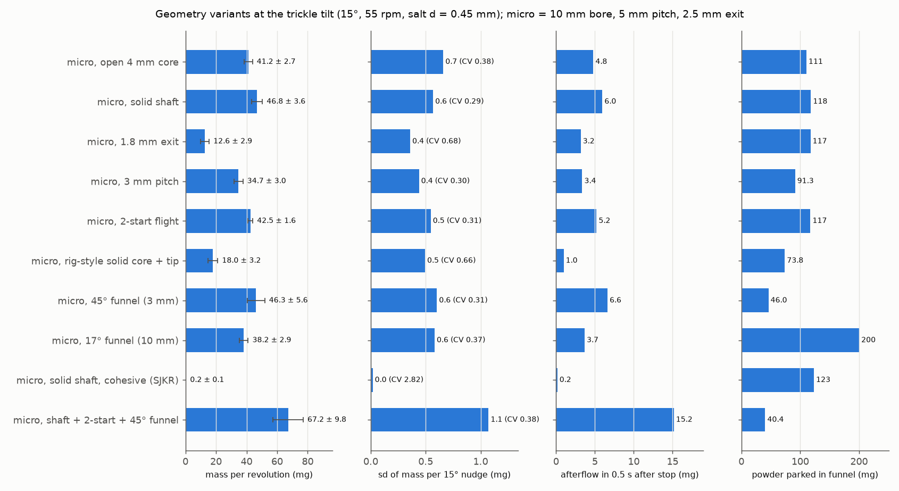
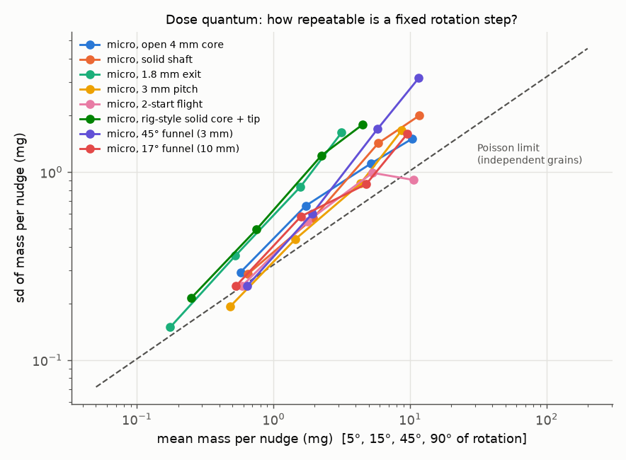

# DEM digital twin of the auger powder doser (issue #158)

Particle-level (discrete element method, DEM) simulations of the rig's
rotating-tube auger, using real-size salt grains, gravity and contact
mechanics. No coarse-graining is used. They were run to answer three
questions from #158:

1. **How closely can a twin represent the rig?** Compare against the
   measured salt yields from PRs #131 and #166 and the battery runs.
2. **How many particles can we simulate?** Is a whole auger (hundreds of
   thousands, or millions, of grains) feasible?
3. **Which internal auger dimensions matter for very small doses?** This
   covers the 0.1–10 mg doses in #117 and expensive powders such as Sc.

## Results at a glance



*Rig auger twin, CAD geometry, 29 k real-size salt grains, 27.5° tilt, 60 rpm. The near half of the rotating auger
is cut away: wall grey-blue, flight blue, solid core and its tip amber; grains are coloured by speed. Full-resolution
MP4: [`results/rig_t27p5_r60.mp4`](results/rig_t27p5_r60.mp4).*

* **Without any calibration, the twin lands on the rig's measured salt yield at the PR #166 centre point** (105 vs
  105 ± 11 mg/rev at 27.5°, 60 rpm). Across the 0–45° tilt range it stays within about 35 % of the measurements
  (22 / 71 / 105 / 153 mg/rev against ≈28 / 106–110 / 105 / ≈195), reproducing the 7× rise of yield with tilt.
  It uses the rig's real auger geometry (measured from `threaded-auger-final.stl`), real-size salt and textbook
  friction. The core tip that sits inside the 3 mm exit
  leaves a 1.07 mm annulus (about 2.5 grain diameters), so grains arch across it and break up again. That produces the
  pulsed, one-slug-per-revolution delivery seen on the rig.
* **The single most sensitive internal dimension is the core-tip / exit annulus.** Cutting the tip 2 mm short
  (a plausible print defect) multiplies the discharge about 4–5× (about 430–470 mg/s, near the Beverloo limit of
  an open 3 mm hole).
* **How many particles?** A completely full rig auger of real-size salt is about 1.1 M grains. That fits in about
  1.7 GB of RAM (measured up to 2.05 M grains on this runner), but costs about 19 h per revolution on one CPU core.
  The dosing section used here (29 k grains) costs about 30 min per revolution. Fine metal powders (AlSi10Mg, Si, Sc)
  are about 10⁹ particles per auger and need a GPU plus coarse-graining, or a dose-only domain.
* **For 0.1–10 mg doses (#117) and expensive powders (Sc):**
  * A 10 mm bore micro-auger cuts the per-revolution dose from about 105 to 13–47 mg.
  * It cuts the funnel inventory from about 1 g to 46–200 mg, and the afterflow from 37–54 to 1–7 mg.
  * The exit size (with a jamming cliff at about 4 grain diameters) and the funnel length are the strongest knobs.
  * With salt-sized grains (87 µg each) the scatter of a 5° nudge is already close to the Poisson
    grain-counting limit. For sub-mg doses the powder's grain size, not the auger, sets the floor.

## 1. How close is the twin to the rig?

Four operating points of the rig auger (CAD geometry, real-size salt, textbook friction values, **no calibration**)
were compared with salt measured on the rig, plus one geometry variant:

| case | tilt, rpm | exit | twin mg/rev (after first ¼ rev) | twin mg/rev (whole run) | rig mg/rev | afterflow (mg) | revs simulated |
|---|---|---|---|---|---|---|---|
| `rig_t27p5_r60` | 27.5°, 60 rpm | CAD exit (core tip in the hole) | **116** ± 20 | 105 | 105 ± 11 (PR #166 centre point, n = 8) | 54 | 1.50 |
| `rig_t22p5_r90` | 22.5°, 90 rpm | CAD exit (core tip in the hole) | **79** ± 14 | 71 | 106–110 (battery D, two days) | 37 | 1.50 |
| `rig_t00_r60` | 0°, 60 rpm | CAD exit (core tip in the hole) | **25** ± 10 | 22 | ≈28 (battery C: 36 ± 7.5 at 30 rpm, n = 12, scaled by rpm^-0.35) | 1 | 1.00 |
| `rig_t45_r60` | 45°, 60 rpm | CAD exit (core tip in the hole) | **174** | 153 | ≈195 (battery C: 248 ± 30 at 30 rpm, n = 12, scaled by rpm^-0.35) | 25 | 0.75 |
| `rig_t27p5_r60_seed2` | 27.5°, 60 rpm | CAD exit, repeat with a different random packing | **124** | 102 | 105 ± 11 | – | 1.00 |
| `rig_t27p5_r60_tip0p5` | 27.5°, 60 rpm | core tip cut 0.5 mm short | **153** | 112 | 105 ± 11 | – | 0.60 |
| `rig_t27p5_r60_tip1p0` | 27.5°, 60 rpm | core tip cut 1.0 mm short | **271** | 224 | 105 ± 11 | – | 0.60 |
| `rig_t27p5_r60_tip2` | 27.5°, 60 rpm | core tip cut 2 mm short | **465** | 427 | 105 ± 11 | – | 0.30 |

*Rig references at 0° and 45° are battery C measurements at 30 rpm, scaled to 60 rpm with the rig's own measured
law (flow ∝ rpm^0.65, i.e. mg/rev ∝ rpm^−0.35). "After first ¼ rev" drops the start-up transient; ± is the
standard error from quarter-turn blocks. The core-tip-offset cases were run for 0.3–0.6 rev, enough for their steady rate.
The repeat with a different random initial packing gives 102 vs 105 mg/rev for the whole-run mean, so the twin's
run-to-run scatter is small compared with its ±15–20 % within-run (pulse) scatter.*





Observations:

* **Throughput.** Whole-run means are 105 / 71 / 22 / 153 mg/rev at 27.5 / 22.5 / 0 / 45°, against
  105 ± 11 / 106–110 / ≈28 / ≈195 measured. The twin reproduces the strong tilt dependence and stays within
  about 35 % everywhere, with no fitted parameter. Most of the remaining (low) bias is the size of two known
  effects:
  * the rig's own fill-level effect: flow at 55° fell from 143 to 40 mg/s as a tube emptied;
  * the twin's statistical error over 1–1.5 revolutions: ±15–20 % per case.
* **Afterflow.** After the motor stops the twin keeps delivering 54 mg (27.5°, 60 rpm, 0.6 s window), 37 mg
  (22.5°, 90 rpm) and 1 mg (0°). The rig measured 81 ± 6.5 mg after a 60 rpm bulk halt at 40° (PR #166) and
  22–36 mg auger-only at 55° (PR #131).
* **Pulsed delivery.** The twin's discharge comes in slugs: in 50 ms windows it swings between about 13 and
  220 mg/s at 27.5°.
  * Grains arch across the 1.07 mm annulus between the core tip and the hole wall (about 2.5 grain diameters).
  * The spinning flight and tip then break the arch.
  * The rig shows the same pattern: one pulse per revolution, with 61–76 % of each revolution's mass in 3 of 8
    45° sectors.
* **The exit annulus is the throttle.** The tip-offset sweep below shows the curve directly: 105 / 112 / 224 / 427 mg/rev
  as the core tip stops 0 / 0.5 / 1.0 / 2.0 mm short of the exit plane. Flat for the first 0.5 mm, then 2× per extra
  half-millimetre. Cutting the core tip 2 mm short of the exit plane gives the funnel a plain
  3 mm hole. The twin then discharges **about 430–470 mg/s, 4–5× the rig**. That is near the Beverloo estimate of
  about 590 mg/s for a vertical 3 mm orifice. So the as-printed tip on the rig must sit close to the CAD position. It also
  makes this one dimension a natural **needle valve** for metering.

## 2. How many particles can we simulate?

`benchmark.py` packs the **entire** 250 mm auger bore (a parametric 21 mm × 250 mm tube with 23 flight turns and the
funnel) with real-size grains in a dense FCC packing, so every grain starts with 12 contacts (a
pessimistic case). It then times LIGGGHTS on one core of this runner (AMD EPYC 7763, 2 physical cores /
4 vCPUs, 15 GB RAM, no GPU):

| grain d (mm) | grains in the auger | M particle-steps/s (1 core) | s per step | peak RAM (GB) | kB per grain |
|---|---|---|---|---|---|
| 0.90 | 106,788 | 0.67 | 0.16 | 0.25 | 2.5 |
| 0.60 | 381,487 | 0.74 | 0.52 | 0.63 | 1.8 |
| 0.45 | 942,885 | 0.66 | 1.42 | 1.42 | 1.6 |
| 0.35 | 2,045,660 | 0.88 | 2.32 | 2.95 | 1.5 |



Real counts for the rig auger (79 mL; 1.39 mL of free funnel volume around the core tip):

| powder | one grain | 1 mg dose | 10 mg dose | funnel full | whole auger full |
|---|---|---|---|---|---|
| salt, d50 0.425 mm | 87 µg | 11 grains | 115 | 19 k | **1.1 M** (94 g) |
| AlSi10Mg, d50 42 µm | 0.10 µg | 9.7 k | 97 k | 18 M | **1.0 billion** (107 g) |
| Sc, d50 40 µm (assumed) | 0.10 µg | 10 k | 100 k | 21 M | **1.2 billion** |

What that means:

* **Memory is not the limit for salt.** A completely full rig auger of real-size salt (about 1.1 M grains)
  needs about 1.7 GB. This runner could hold about 8–9 M grains.
* **Time is the limit.** At about 0.75 M particle-steps/s per core and Δt about 21 µs, one auger
  revolution at 60 rpm is about 49 k steps.
  * The whole salt-filled auger therefore costs about **19 h per revolution on one core**, or about 5 h
    with ideal 4-core MPI. The Debian LIGGGHTS MPI build crashes on STL meshes, so that is a projection.
  * The dosing-relevant section (funnel plus 1.5–2 flights, 29 k grains) costs **about 30 min per
    revolution**, which is what the twin below uses.
  * A GPU engine (Chrono::GPU / DEM-Engine, as recommended in the earlier review) is the route to the
    whole auger.
* **Fine metal powders (AlSi10Mg, Si, Sc) are out of reach at real size.**
  * A whole auger holds about 10⁹ particles.
  * The Δt also shrinks about 10× with the grain size, so even the funnel alone (about 2 × 10⁷
    particles) is beyond any single machine.
  * Two options remain: simulate *just the dose* (a 1–10 mg dose is only 10⁴–10⁵ particles, which is
    tractable), or coarse-grain with cohesion rescaled to keep the Bond number.
  * Cohesion, not grain count, is the physics that matters there: Si −325 mesh (d50 about 25 µm) gave
    **0 mg/rev** on the rig, while −110/+200 mesh gave 302 mg/rev at 45°.

## 3. Internal geometry for 0.1–10 mg doses (#117) and expensive powders (Sc)

The rig auger delivers about 100 mg per revolution with about 1 g of salt parked in its funnel, which is far too coarse for
0.5–3 mg doses. So I swept a **10 mm bore "micro-auger" family** at the trickle tilt (15°, 55 rpm, real-size salt, d 0.45 mm),
changing one internal dimension at a time:



| micro-auger variant (15°, 55 rpm, salt d 0.45 mm) | mg/rev | 5° nudge mg (CV) | 15° nudge mg (CV) | empty 5° nudges | afterflow 0.5 s (mg) | funnel inventory (mg) |
|---|---|---|---|---|---|---|
| baseline: open 4 mm core, 1.2 mm flight, 5 mm pitch, 2.5 mm exit, 27° funnel | 41.2 ± 2.7 | 0.57 (0.51) | 1.72 (0.38) | 2 % | 4.8 | 111 |
| solid 4 mm shaft (closed core) | 46.8 ± 3.6 | 0.65 (0.44) | 1.95 (0.29) | 1 % | 6.0 | 118 |
| rig-style: solid core, tip in the exit, 0.5 mm flight | 18.0 ± 3.2 | 0.25 (0.86) | 0.75 (0.66) | 21 % | 1.0 | 74 |
| 1.8 mm exit | 12.6 ± 2.9 | 0.18 (0.85) | 0.53 (0.68) | 21 % | 3.2 | 117 |
| 3 mm pitch | 34.7 ± 3.0 | 0.48 (0.40) | 1.44 (0.30) | 0 % | 3.4 | 91 |
| 2-start flight (same 5 mm pitch, lead 10 mm) | 42.5 ± 1.6 | 0.59 (0.42) | 1.77 (0.31) | 0 % | 5.2 | 117 |
| short funnel, 45° half-angle (steep dam at 15° tilt) | 46.3 ± 5.6 | 0.64 (0.39) | 1.93 (0.31) | 0 % | 6.6 | 46 |
| long funnel, 17° half-angle (almost no dam) | 38.2 ± 2.9 | 0.53 (0.47) | 1.59 (0.37) | 0 % | 3.7 | 200 |
| solid shaft, cohesive grains (SJKR 20 kJ/m³) | 0.2 ± 0.1 | 0.00 (4.54) | 0.01 (2.82) | 99 % | 0.2 | 123 |
| combined: solid shaft + 2-start + short 45° funnel | 67.2 ± 9.8 | 0.93 (0.42) | 2.80 (0.38) | 0 % | 15.2 | 40 |





What the sweep says (salt-sized grains, one run each, so differences under about 2 standard errors are noise):

* **The exit is the strongest knob, and it has a cliff.**
  * Shrinking the hole from 2.5 to 1.8 mm cuts the yield 3.3× (41 → 13 mg/rev).
  * But it pushes the exit to about 4 grain diameters, where grains arch: 21 % of 5° nudges deliver nothing and
    the CV of a 15° nudge rises from 0.38 to 0.68.
  * The rig-style core tip in the exit behaves the same way (18 mg/rev, 21 % empty nudges), but it gives the
    smallest afterflow (1.0 mg vs 3–7 mg).
  * Rule of thumb: keep the narrowest exit dimension at about 6 or more grain diameters for smooth metering, and
    throttle with speed (or an adjustable, needle-valve-like core tip) rather than a near-jamming gap.
* **Funnel length trades dead inventory, not throughput.**
  * A short 45° funnel keeps the yield (46 ± 6 mg/rev) and parks only 46 mg in the cone.
  * A long 17° funnel parks 200 mg for 38 mg/rev.
  * Shortest funnel for Sc.
* **Open vs solid core: no measurable difference at 15°** (41 ± 3 vs 47 ± 4 mg/rev). The solid shaft is slightly
  smoother (CV of a 15° nudge 0.29 vs 0.38).
* **Finer flights help modestly.**
  * A 3 mm pitch gives 35 ± 3 mg/rev (−16 %) with lower afterflow (3.4 mg).
  * A 2-start flight keeps the yield (42.5 mg/rev) but splits each revolution into two smaller slugs. It has the
    smallest per-revolution scatter (± 1.6 mg) and the flattest dose-quantum curve at 90°.
* **Cohesion shuts everything down.** With an illustrative SJKR cohesion (20 kJ/m³, not calibrated) the same
  micro-auger delivers 0.2 mg/rev and 99 % of nudges are empty. That is the failure the rig shows for Si −325
  mesh, flours and alginate.
* **Combining the "best" features does not simply add up.** Solid shaft + 2-start + short 45° funnel gives
  67 ± 10 mg/rev with a 40 mg funnel inventory, but the afterflow triples (15 mg) because the short funnel lets the
  two-start flights feed the exit directly. Single-variable sweeps rank the dimensions; the trade-offs need a
  multi-objective optimisation (dose resolution vs afterflow vs inventory) over them. Each micro case costs about
  10 core-minutes, so a BO loop is cheap.
* **Afterflow drops by an order of magnitude** at micro scale: 1–7 mg in 0.5 s, vs 37–54 mg for the rig-auger twin
  at bulk settings and 47–126 mg measured.

**What this means for #117 (0.5–3 mg of initiator into 10 mm tubes).**
* A 5° nudge of a micro-auger carries about 0.2–0.7 mg.
* With salt-sized grains (87 µg each) its scatter already sits close to the Poisson limit for counting
  independent grains (dashed line).
* So for sub-mg doses the **grain size of the powder sets the floor**, not the auger. The open-loop Poisson scatter
  of a 0.5 mg dose is:
  * 42 % for 0.425 mm salt (6 grains)
  * 10 % for 200 µm crystals
  * 3.7 % for 100 µm crystals
  * 1.3 % for 50 µm crystals (organic density 1.3 g/cm³ assumed)
* Closed-loop dosing on the 0.1 mg balance can only correct to within the last nudge. A micro-auger plus a fine
  (≤100 µm), free-flowing powder is therefore what makes 0.5–3 mg realistic. The current 21 mm rig auger, at
  about 1.5 mg per 5° on average but delivered in slugs of about 2–24 mg per 45° in the twin, is not.

**What this means for Sc and other expensive powders.**
* The cost driver is the powder that has to sit in the auger before anything comes out. The rig needs its 83 mm
  flighted section well filled; flow fell from 143 to 40 mg/s as a tube emptied. That is about 8 pitches ×
  2.93 mL, or roughly 30–40 g of a metal powder, plus about 1 g parked in the funnel.
* A 10 mm micro-auger holds about 0.25 mL per pitch and 46–200 mg in its funnel, so the working inventory drops
  to about 1–2 g (roughly 20× less).
* The short 45° funnel halves the funnel inventory with no loss in throughput.
* Sc powders are fine (tens of µm) and cohesive, so the twin's salt results transfer only qualitatively.
  * The rig's Si −325 mesh gave 0 mg/rev while −110/+200 mesh flowed. Cohesion is the physics to add next
    (the `micro_cohesive` case is a first, uncalibrated look).
  * A 1 mg Sc dose is about 10⁴ particles. That is cheap to simulate at real size if the domain is just the exit
    and the last pocket.

## What is simulated

| Item | Value | Source |
|---|---|---|
| Engine | LIGGGHTS-PUBLIC 3.8 (Debian `liggghts`), serial; one case per core | the MPI build segfaults reading STL meshes on this runner |
| Contact law | Hertz–Mindlin with tangential history, EPSD2 rolling friction, no cohesion | standard for free-flowing salt; rolling friction stands in for the cubic grain shape |
| Salt grains | d50 0.425 mm, three sizes ±15 %, ρ 2165 kg/m³ | literature class values in `data/powder-properties/literature_powder_properties.csv` (branch `claude/issue-163-…`); no PSD has been measured |
| Friction | μ particle–particle 0.5, particle–PLA 0.4, rolling 0.3 (0.7 / 0.6 / 0.5 in the high-friction case) | uncalibrated, typical values for salt |
| Stiffness | E = 0.2 MPa, ν 0.3, e 0.5, Δt = 0.2 × Rayleigh time | softened, as is standard practice for DEM flows. Checked on a dump: mean overlap 0.35 % of d, 99 % of contacts below 1.2 % |
| Rig auger | measured by slicing `threaded-auger-final.stl` (branch `claude/issue-165-…`):<br>• 20.9 mm bore<br>• solid 7.96 mm core whose conical tip ends inside the exit (annular exit, r 0.43–1.5 mm, 7 mm²)<br>• 0.5 mm single-start right-handed flight at 10.4 mm pitch, continuing down the 37° half-angle, 12 mm funnel | `geometry.py` (parametric; the same generator builds every variant) |
| Simulated section | funnel plus the lowest 1.5 flight turns (3 turns, 15 mm, for the micro-augers); a feed zone above is kept topped up by insertion | the rig's 83 mm flighted section plus 166 mm reservoir is too long to simulate whole at real grain size (see the scaling section) |
| Tilt and rpm | gravity is tilted (tilt = plate angle = physical tube angle, outlet down); the mesh spins at auger rpm | firmware on the PR #166 branch: `PLATE_GEAR_RATIO`, `AUGER_GEAR_RATIO` |
| Protocol | settle with the exit plugged → unplug and spin for 0.75–1.5 rev → stop for 0.3–0.6 s (afterflow) | outflow is counted (and grains deleted) at a disk 1.5 mm below the exit |

## Files

| File | Purpose |
|---|---|
| [`geometry.py`](geometry.py) | parametric auger surface mesh: bore, flight(s), solid or open core, conical core tip, funnel, exit |
| [`run_case.py`](run_case.py) | builds one case (mesh, initial packing that avoids the flight, LIGGGHTS input), runs it, logs the outflow |
| [`benchmark.py`](benchmark.py) | packs the entire 250 mm auger with 0.1–2 M grains and times LIGGGHTS (throughput and memory) |
| [`analyze.py`](analyze.py) | dosing metrics: mg/rev, mass per 5/15/45/90° nudge (mean, sd, CV), afterflow, funnel hold-up |
| [`figures.py`](figures.py) | comparison, scaling and sweep plots |
| [`render_geometries.py`](render_geometries.py) | cut-away gallery of all simulated geometries |
| [`export_results.py`](export_results.py), [`report_tables.py`](report_tables.py) | copy small per-case outputs into `results/`; print the README tables |
| [`render.py`](render.py) | OVITO (Tachyon) cut-away movie: the near half of the rotating auger is clipped away (wall grey-blue, flight blue, solid core amber); grains are coloured by speed; a live dispensed-mass panel sits alongside |
| [`results/`](results/) | case configs, outflow time series, metrics, benchmark data, figures, movies |

Reproduce one case (about 10 min for a micro-auger, about 1–1.5 h for the rig section on one core):

```bash
sudo apt-get install -y liggghts ffmpeg mesa-vulkan-drivers
pip install numpy scipy matplotlib trimesh shapely ovito pillow
cd sim/dem
python run_case.py results/cases/rig_t27p5_r60/config.json --workdir /tmp/dem/rig_t27p5_r60
python analyze.py /tmp/dem/rig_t27p5_r60
python render.py --case /tmp/dem/rig_t27p5_r60 --out rig.mp4 --gif rig.gif
```

## Limitations

* **Uncalibrated contact parameters.** Friction, rolling friction and restitution are textbook values for salt, not
  fitted to this powder lot. No particle-size distribution has been measured for any powder on the rig, so the 0.425 mm
  class value is an assumption, and grain size relative to the exit gap matters a lot (below).
* **Spheres, not cubes.** EPSD2 rolling friction mimics the rotational resistance of cubic salt grains, but not their
  interlocking. Arching at narrow exits is probably *under*-estimated.
* **Short runs.** 1.25–1.5 revolutions per case (one core, about 30 min per revolution for the rig section).
  Per-revolution means carry a standard error of about 5–20 % (the rig cases are the noisier ones, because
  their discharge is pulsed).
  * The windowed nudge statistics come from continuous rotation, not start/stop nudges.
  * Start/stop behaviour is only probed through the afterflow window.
* **Section, not whole tube.** Only the funnel and the lowest 1.5–2 flights are simulated.
  * Insertion keeps a feed zone topped up, which stands in for a well-filled reservoir.
  * The rig's strong dependence on fill level (143 → 40 mg/s as a 55° tube emptied) is therefore not modelled.
  * Some feed-zone grains spill out of the open top of the meshed section. They never reach the outlet and are hidden in the movies.
* **No cohesion for salt, no humidity, no tribocharging, no tapper.** The micro "cohesive" case uses SJKR with an
  illustrative cohesion energy density only. Electrostatics would need DEM-Engine or LAMMPS (see the triboelectric review on this issue).
* **Softened stiffness** (E = 0.2 MPa) is standard for dense granular flow and the overlaps were checked. Impact-dominated
  details (bouncing in the free fall below the exit) are not resolved.
* **The CAD core tip** (Ø0.86 mm at the exit plane) cannot be printed as drawn with a 0.4 mm nozzle. The "as-printed"
  variant cuts it 2 mm short as a guess; measuring the printed exit would settle this.

## Next steps

1. **Measure the as-printed exit** (photograph or calliper the core tip and annulus) and the salt PSD (sieve or image).
   These are the two inputs the twin is most sensitive to.
2. **Calibrate** μ, μ_r and the fill level against the battery C angle sweep (36 / 161 / 248 mg/rev at 0 / 22.5 / 45°)
   with a small Bayesian-optimisation loop. Each evaluation is one micro-scale or 30 min rig-scale run. Then validate
   against the PR #166 rpm law (flow ∝ rpm^0.65) without refitting.
3. **Get a GPU** for whole-auger runs: DEM-Engine (Chrono) or Chrono::GPU from the earlier review. Then the 1.1 M-grain full
   tube (and fill-level effects) become an overnight job, not a week.
4. **For fine metal powders and Sc**, simulate only the dose region at real size (10⁴–10⁵ particles per mg-scale dose),
   or coarse-grain with Bond-number-preserving cohesion. Calibrate against AlSi10Mg (339±15 mg/rev at 45°, CV 4.5 %)
   and the Si −325 no-flow result.

## Engines tried on this runner

| Engine / tool | Outcome |
|---|---|
| **LIGGGHTS-PUBLIC 3.8** (Debian package) | Used for every case: Hertz–Mindlin, EPSD2 rolling friction, SJKR cohesion, rotating STL meshes, `massflow/mesh` outlet counting. **Its MPI build segfaults** in `InputMeshTri::meshtrifile` whenever it reads an STL with more than one rank (reproduced with three different meshes), so every case runs on one core and several run side by side. |
| LAMMPS 2024 (Debian; GRANULAR, KSPACE, `coul/*`) | Installed. It is not used for the auger because it has no rotating-STL granular walls. It is the open path for the triboelectric extension discussed on #158 (`pair_style hybrid/overlay granular … coul/long`). |
| OVITO 3.16 (pip) + Mesa lavapipe | Headless Tachyon rendering of the cut-away movies. OVITO needs a Vulkan instance even for Tachyon, hence `mesa-vulkan-drivers`. |
| Chrono::GPU, DEM-Engine, Isaac Sim / MATTERIX | Not runnable: no GPU on the runner. These are the route to whole-auger runs (about 1 M grains) and to fine powders. |
| Earlier numba DEM ([PR #176](https://github.com/vertical-cloud-lab/powder-doser/pull/176), `cad/text-to-cad/sim/`) | Prior work with coarser 0.8–1.0 mm spheres and analytic walls. It reported 184 / 283 / 287 mg/rev at 0 / 22.5 / 45°. This LIGGGHTS twin instead uses real-size grains and the measured CAD (including the core tip in the exit, which turns out to set the flow). |
