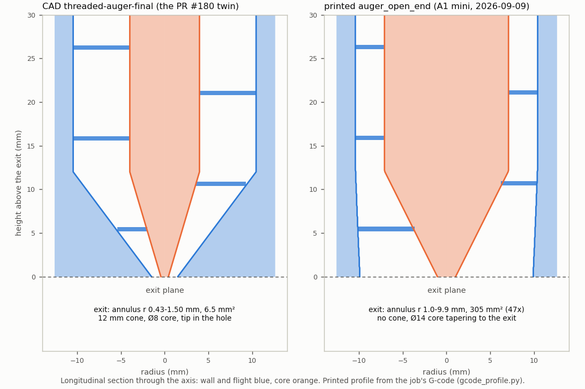
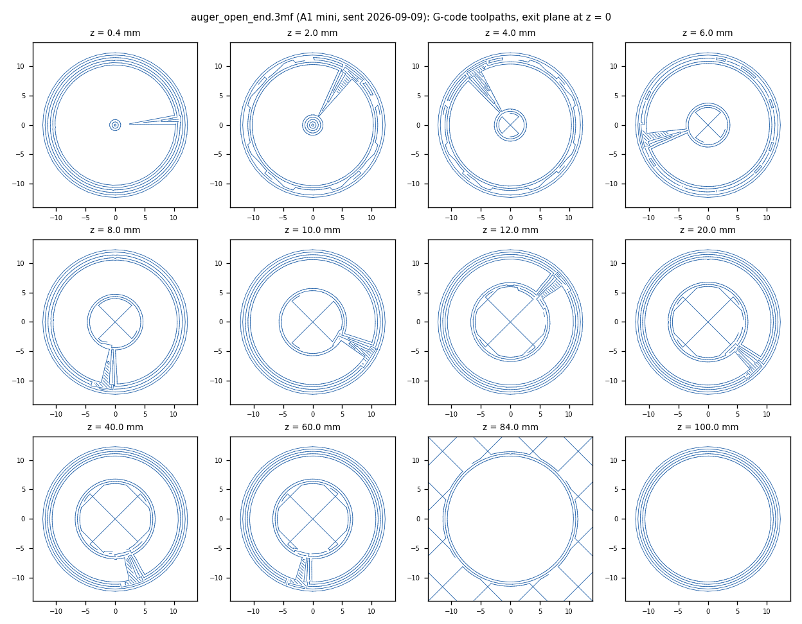

# As-printed auger geometry from the printers' job files

Bambu print jobs (`*.3mf` in a printer's `/cache`, or the `.gcode` next to it) contain
the sliced G-code and the plate thumbnail, but not the mesh. [`gcode_profile.py`](gcode_profile.py)
rebuilds an auger from its toolpaths. It reads every extruding `G1`, `G2` and `G3` move, groups
them by layer, finds the closed wall loops, and converts toolpath radii to surface radii (half a
0.42 mm line width). From that it reports:

* bore, core and outer radius per layer (`*_profile.csv`)
* flight pitch and handedness, and gear tooth count (`*_summary.json`)
* cross-section plots (`*_sections.png`)

Augers are printed exit-down, so print z = 0 is the exit plane, the same frame as `../geometry.py`.

```bash
python gcode_profile.py auger_open_end.3mf --out auger_open_end
python compare_profiles.py          # exit_cad_vs_printed.png
```

## How the job files were read

The printers are on the lab network, and the powder-doser Pi can reach them (PR #23).
From the runner, a stdlib-only Python script went over Tailscale SSH to the Pi and did the
following, read-only, with implicit FTPS on port 990 using the PR #23 `ImplicitFTP_TLS` fix:

* listed each printer's SD card
* streamed the auger job files back
* passed the access codes over the SSH session's stdin, so they were never written to disk or put
  on a command line

Nothing was uploaded or printed, and no MQTT commands were sent.

| Printer | Result |
|---|---|
| A1 mini | Read. The job cache goes back to June. The auger jobs are listed in [`auger_open_end_job.json`](auger_open_end_job.json). |
| H2D | Not read: FTPS answers `530 Login incorrect`, so the `H2D_ACCESS_CODE` secret is stale. The code changes when LAN mode is re-enabled or the printer is reset; it is shown on the printer's screen under the network / LAN-only settings. |

## `auger_open_end` (A1 mini, sent 2026-09-09)

This is the "more open ended auger" Will described on 2026-09-08 (PR #68): "an exaggerated
opening just to see how differently powders dispense", meant to reduce slugging.

| | printed `auger_open_end` | CAD `threaded-auger-final` (the twin's rig auger) |
|---|---|---|
| exit | **no cone**: the bore runs to the exit (Ø19.8 at the exit plane, Ø20.8 from 12 mm up) | 12 mm cone down to a Ø3 hole |
| exit area | annulus r 1.0–9.9 mm, **305 mm²** | annulus r 0.43–1.5 mm, 6.5 mm² |
| core | Ø14.1, conical over the last 12 mm (27° half-angle) to about Ø2 at the exit plane | Ø7.96, conical to Ø0.86 at the exit plane |
| flight | 0.50 mm thick, 10.42 mm pitch, right-handed, single start, runs to the exit plane | 0.5 mm, 10.4 mm, right-handed, single start |
| gear | 44 teeth (tip r 22.8 mm) at 79–88 mm | 44 teeth |
| length | 110 mm; flighted to 79 mm, plain Ø21 socket above the gear | 250 mm; flighted to 83 mm, plain reservoir above |
| print | Bambu PLA Basic, blue (#0086D6), 38.6 g including tree supports, 0.2 mm layers, 2 walls, 15 % infill | – |




